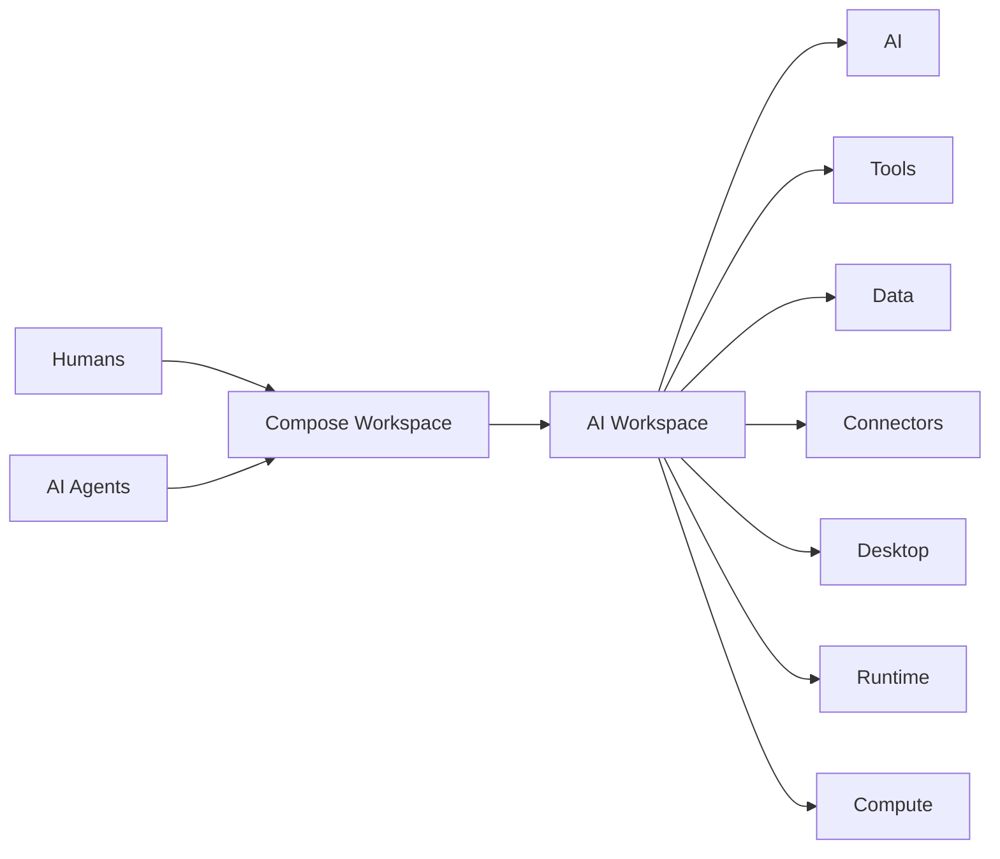
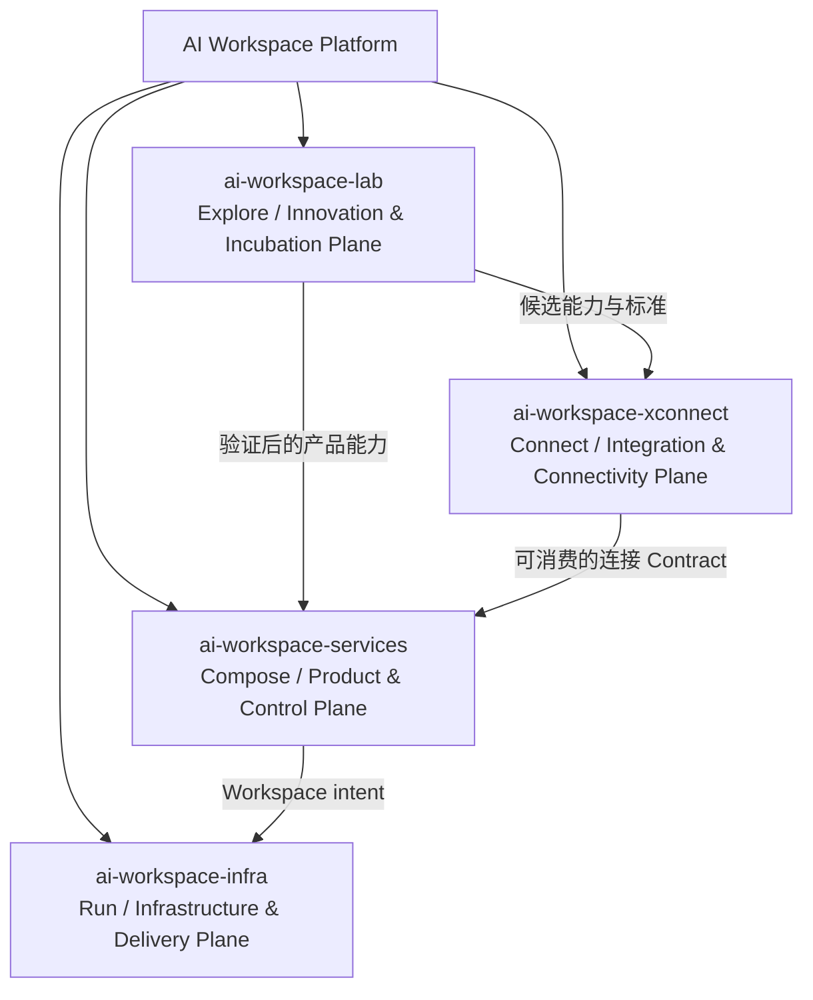
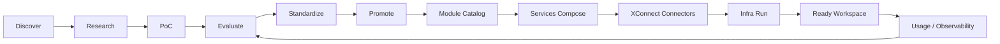
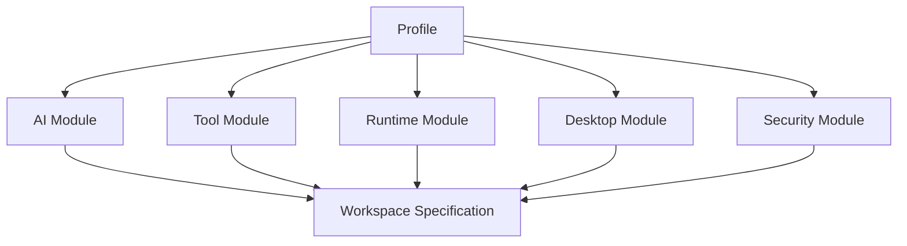
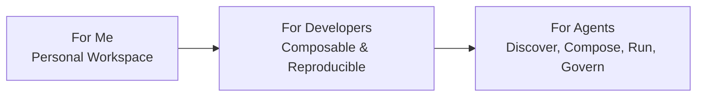
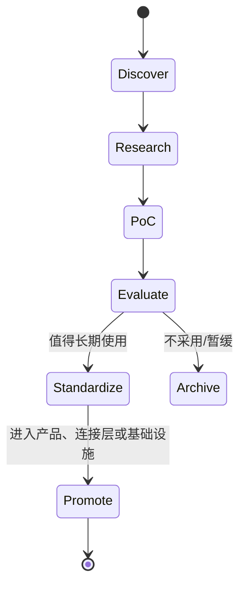
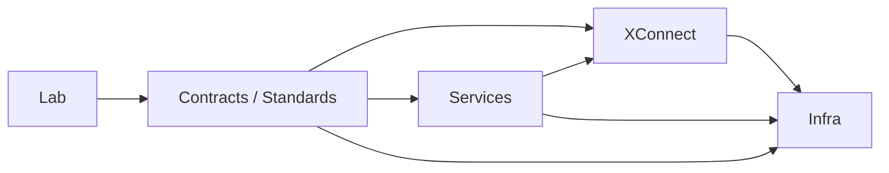

# AI Workspace 顶层架构与远景项目设计

> **Status**: Vision / Architecture Draft  
> **Scope**: 顶层架构、组织边界、声明式模型与路线图  
> **Non-goal**: 本文不定义实现代码、具体框架或单一供应商方案

## 1. Vision

**AI Workspace** 是面向 **Humans & AI Agents** 的 **Composable AI Workspace Platform**：像 Lego 一样自由组合 **AI、Tools、Data、Connectors、Desktop、Runtime、Compute**，在合适的环境中形成个人、开发者或 Agent 可直接使用的工作空间。



### Mission

- 降低获得可靠 AI 工作环境的门槛。
- 用稳定的声明式 Contract 隔离产品、连接能力与基础设施的变化。
- 让同一份 Workspace 意图可以在 Cloud、Local、Edge 等环境中运行。
- 同时服务个人用户、开发者与 AI Agents，并逐步提高自动化程度。

### Design Principles

1. **Composable**：能力以可组合 Module 提供，而不是绑定为一个不可拆分产品。
2. **Declarative**：描述“需要什么”，而非规定“如何安装”。
3. **Portable**：Workspace 与运行位置解耦，支持 Run Anywhere。
4. **Contract-first**：先定义能力、协议、权限和生命周期，再选择实现。
5. **Human and Agent friendly**：GUI、CLI、API 是同等重要的消费入口。
6. **Secure by default**：身份、权限、凭据、审计和隔离是基础能力。
7. **Observable and reversible**：变更可追踪、可评估、可回滚。
8. **Small core, extensible edges**：核心保持稳定，创新和集成在边缘演进。

## 2. 四个组织的长期边界



| Organization | 动词 | 应该做 | 不应该做 |
|---|---|---|---|
| `ai-workspace-lab` | **Explore** | 技术雷达、研究、Fork、PoC、评估、标准化、孵化 | 不成为 production dependency，不承诺长期稳定运营 |
| `ai-workspace-services` | **Compose** | 用户产品、控制面、Workspace 管理、Auth、Billing、Onboarding、API、SEO | 不直接管理主机，不把某个 Connector 或云厂商写死在产品核心 |
| `ai-workspace-xconnect` | **Connect** | AI/Tool/Data/Service Connector、协议、Contract、Adapter、Gateway | 不承担完整产品体验，不拥有底层主机生命周期 |
| `ai-workspace-infra` | **Run** | Cloud/Local/Edge 运行、交付、网络、计算、存储、可观测性 | 不理解 Billing、用户增长或产品业务语义 |

核心分工可概括为：**Lab 发现积木 → XConnect 标准化连接积木 → Infra 运行积木 → Services 组合成产品**。

## 3. 总体架构：Explore → Compose → Connect → Run

这里的四个动词代表职责流，而不是强制的线性部署顺序。生产 Workspace 通常由 Services 编排 XConnect 的能力，并请求 Infra 在目标环境运行。



## 4. Workspace Specification：核心声明式 Contract

**Workspace Specification** 是描述一个 Workspace 目标状态的长期 Contract。它应表达身份、能力、约束、权限与运行偏好；不直接暴露安装脚本、云厂商 API 或具体命令。

```yaml
workspace:
  identity: ...
  profile: ...
  compute: ...
  runtime: ...
  ai: ...
  connectors: ...
  tools: ...
  desktop: ...
  storage: ...
  security: ...
  observability: ...
```

概念字段模型：

| Domain | 需要表达的意图 |
|---|---|
| Identity | owner、workspace identity、成员与主体关系 |
| Profile | 选择一组经过验证的默认组合 |
| Compute | CPU/GPU、内存、架构、弹性与预算约束 |
| Runtime | 容器、VM、Sandbox、Agent runtime 等运行语义 |
| AI | Provider、模型、能力、路由、Fallback、配额 |
| Connectors | 连接目标、认证方式、权限范围、健康状态 |
| Tools | CLI、SDK、Browser、MCP tools、内置工具 |
| Desktop | 无桌面、IceWM、XFCE 或未来桌面环境 |
| Storage | 临时/持久、对象/文件/数据库、备份与保留策略 |
| Security | Secret、网络、隔离、策略、审计与信任边界 |
| Observability | 日志、指标、Tracing、成本、事件与告警 |

Contract 的长期要求：版本化、可校验、可扩展、可解释、可审计，并支持从“期望状态”映射到不同 Provider/Runtime 的实际状态。

## 5. 两级 Lego 模型：Module 与 Profile

### Module

**Module** 是最小可复用能力单元，例如一个 AI Provider、MCP Connector、CLI 工具、桌面环境、Runtime、Storage 或 Security Policy。Module 应包含能力描述、版本、依赖、输入配置、权限需求、兼容性、健康检查和升级/回滚语义。

### Profile

**Profile** 是经过验证的 Module 组合，面向明确场景提供安全默认值。Profile 不是不可修改的套餐，用户仍可替换或扩展其中的 Module。

| Reference Profile | 适用场景 | 典型组成 |
|---|---|---|
| **CLI Only** | 自动化、低资源、远程开发 | CLI tools + Runtime + API/SSH + Storage |
| **Tiny Desktop** | 轻量交互、低配置设备 | IceWM + Terminal + Browser/CLI + Runtime |
| **Standard Desktop** | 日常开发与多工具协作 | XFCE + Terminal + Browser + Editors + Runtime |



## 6. 三种消费方式与用户主体

| Interface | 主要主体 | 核心价值 |
|---|---|---|
| **GUI** | Human | 浏览、选择、配置、观察和管理 Workspace |
| **CLI** | Developer / Power User | 快速创建、连接、诊断、脚本化与本地开发 |
| **API** | AI Agent / Automation / Developer | 声明目标、申请能力、执行变更、读取状态 |

三者应共享同一套 Domain Model 与 Contract，避免 GUI、CLI、API 形成三套不一致产品。

## 7. 三阶段产品演进

1. **AI Workspace for Me**：先解决个人的可靠环境、常用 AI、工具连接、成本与迁移问题。
2. **AI Workspace for Developers**：提供可复现 Profile、Workspace Specification、CLI/API、团队协作与扩展机制。
3. **AI Workspace for Agents**：让 Agent 能发现能力、规划组合、申请权限、创建 Workspace、运行任务并持续优化。



## 8. Services 层：SaaS Product Shell 的借鉴

StartFast 调研得到的启发仅用于定义 **Product Shell**：Services 需要具备清晰的 Auth、Billing、Onboarding、Workspace 管理、API 与 SEO 能力，使底层复杂性变成可理解的产品体验。该思路不绑定 Next.js、Better Auth、Stripe 或任何具体技术。

Billing 的长期抽象为：

**Plan → Entitlement → Usage → Credit → Cost**

- **Plan**：面向用户的产品计划。
- **Entitlement**：计划授予哪些能力与限制。
- **Usage**：能力实际使用量。
- **Credit**：可消耗的额度或预付余额。
- **Cost**：对用户、团队或内部资源的成本归因。

Services 只定义商业与控制面语义；具体 Provider 计费、计算成本和连接成本通过 Contract 汇入，不侵入 Infra 或 XConnect 的内部实现。

## 9. Lab 生命周期



每一阶段都应有明确的证据：问题定义、风险、性能/成本、可维护性、安全影响、兼容性与退出条件。Lab 的产物可以 Promote 到 Services、XConnect 或 Infra，也可以 Archive；生产系统不应依赖 Lab 中未经 Promote 的项目。

## 10. XConnect：连接分类与边界

| 分类 | 连接对象 | 例子 |
|---|---|---|
| **AI Connector** | Model Provider、Agent Provider、AI Gateway | OpenAI-compatible、Anthropic、Gemini 等 |
| **Tool Connector** | MCP、CLI、SDK、Browser、Remote Tool | Git、Shell、Search、编辑器等 |
| **Data Connector** | 文件、数据库、对象存储、知识库 | Local FS、S3-like、SQL、Vector Store |
| **Service Connector** | 外部 SaaS、协作、身份、支付、业务 API | GitHub、Slack、Calendar、Billing Provider |

三层边界：

- **Contract**：描述能力、输入输出、认证、权限、错误、健康与生命周期。
- **Protocol**：规定交互方式，如 HTTP、OpenAI-compatible API、MCP、SSH 等。
- **Adapter**：把具体 Provider 的差异映射到统一 Contract，处理鉴权、重试、限流、观测与版本兼容。

XConnect 负责“如何连接外部世界”，Services 负责“产品如何使用连接能力”，Infra 负责“连接运行所需的网络与环境”。

## 11. Infra：Run Anywhere

Infra 的愿景是让 Workspace 在不同计算边界中以一致 Contract 运行：

| Boundary | 关注点 |
|---|---|
| **Cloud** | 弹性、托管服务、GPU、全球网络、成本与多租户 |
| **Local** | 私有数据、开发体验、离线能力、设备资源 |
| **Edge** | 低延迟、受限网络、本地自治、区域数据边界 |

Infra 可以提供 VM、Container、Desktop、Network、Storage、Observability 等运行基座，但不应理解 Plan、Entitlement 或用户增长。Services 不直接 shell exec Ansible；它应提交声明式 intent，由 Infra 的交付边界解释并执行。Infra 也不应把某一个 Cloud Provider 视为架构前提。

## 12. 架构治理

### 依赖方向



依赖应优先指向稳定的 Contract，而不是反向依赖具体仓库。跨组织变更需要版本、Owner、兼容窗口、迁移说明和回滚策略。

### 反模式

- Services 直接 shell exec Ansible、SSH 主机或拼装云厂商命令。
- Lab 中的 PoC 作为生产系统的隐式依赖。
- Infra 理解 Billing、营销、SEO 或产品套餐。
- XConnect 把某个 Provider 的私有字段泄漏为平台核心模型。
- GUI、CLI、API 各自维护一套 Workspace 状态。
- Profile 变成无法替换的“巨型发行版”。
- 为短期 Demo 牺牲身份、Secret、审计和隔离边界。

### 治理检查清单

- 是否能用一句话说明该能力属于 Explore、Compose、Connect 或 Run？
- 是否存在清晰的 Contract、Owner、版本和兼容性说明？
- 是否区分产品语义、连接语义和运行语义？
- 是否能在不更换用户意图的情况下替换 Provider 或运行环境？
- 是否具备最小权限、可观测性、成本归因和退出路径？

## 13. Roadmap

### 半年：AI Workspace for Me

- 固化四组织边界、术语表与顶层 Contract 草案。
- 建立 CLI Only、Tiny Desktop、Standard Desktop 三个 reference profiles。
- 梳理首批 AI、Tool、Data、Service connector 的能力矩阵。
- 建立个人 Workspace 的身份、配置、成本和观测心智模型。

### 1 年：AI Workspace for Developers

- Workspace Specification 进入可版本化、可验证、可迁移状态。
- GUI / CLI / API 共享统一的 Workspace domain model。
- 提供可复现 Workspace、Profile 扩展、团队协作与开发者文档。
- 建立 Lab Promote 流程，以及 XConnect/Infra 的兼容性与发布治理。

### 2–3 年：AI Workspace for Agents

- Agent 可发现 Module、理解 Entitlement、规划 Profile 并提交 Workspace intent。
- 建立审批、最小权限、Sandbox、审计、预算和自动回滚机制。
- 支持跨 Cloud/Local/Edge 的策略化调度与迁移。
- 形成开放生态：第三方可提供 Module、Connector、Profile 和验证报告。

## 14. North Star

> **用户只需表达“我想要什么样的 AI 工作空间”，AI Workspace 就能以安全、可解释、可迁移的方式，把合适的 AI、Tools、Data、Connectors、Desktop、Runtime 与 Compute 组合起来，并在合适的位置运行。**

长期衡量不应只看注册用户或部署数量，还应关注：从意图到 Ready Workspace 的时间、Profile/Module 复用率、跨环境迁移成功率、Connector 健康度、Agent 任务完成率、安全事件、成本透明度与用户持续使用率。

## 附录：术语速查

| Term | 含义 |
|---|---|
| Workspace | 面向一个主体、目标和运行环境的完整工作空间 |
| Module | 可复用的最小能力单元 |
| Profile | 经过验证的 Module 组合与默认策略 |
| Contract | 跨组织、跨实现的稳定能力约定 |
| Connector | 连接 AI、Tool、Data 或 Service 的能力 |
| Runtime | 承载工具、Agent 或桌面会话的执行语义 |
| Control Plane | 管理身份、配置、策略、状态和产品流程的平面 |
| Delivery Plane | 将声明式目标交付到实际基础设施的平面 |
