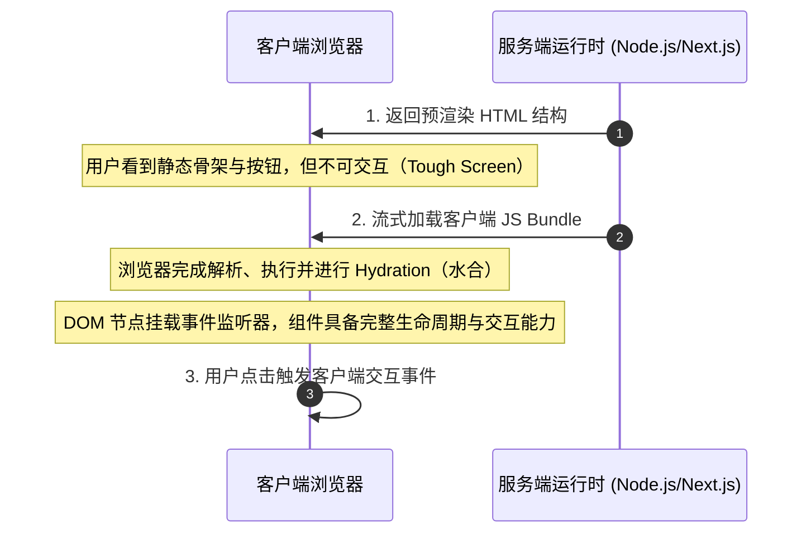

# 从刀耕火种到 AI 编程：当代码生成成本趋零，工程师的核心壁垒究竟是什么？

**——论工具跃迁下的认知重构、系统分层与架构判断力**

---

**作者信息**

- 作者：Haitao Pan
- 角色：平台工程师（Platform Engineer）
- 所在项目：XWorkmate · QMD · Open Platform
- 开源组织：ai-workspace-infra（https://github.com/ai-workspace-infra）
- 一句话自述：Bring AI into real work, not just chat——从系统边界到生产落地。

---


---

## 核心观点（Key Takeaways）

1. **边际成本转移律**：AI 编程大幅降低了将逻辑转化为代码的体力成本，但系统架构理解、业务目标定义与工程结果检验的认知壁垒非但没有消失，反而成为区分工程师段位的核心分水岭。
2. **拓扑先于语法**：在 AI 能够秒级生成接口、组件与单测的时代，掌握“代码在系统哪一层运行”远比“代码怎么写”更关键。缺乏全局拓扑地图的 AI 辅助，只会加速代码坏味道与架构混乱的蔓延。
3. **确定性工程闭环**：代码通过编译并不等于系统可靠。从环境二元性（Browser vs Node.js）、页面渲染时间线（CSR/SSR/Hydration）、数据归属权划分，到依赖锁（Lockfile）与调用链追踪，“我电脑能跑”与“生产可用”之间隔着一整套人对边界与契约的严密防线。
4. **终极人机协同范式**：人负责给出目标、划定边界、约定契约与确立验收标准；AI 负责充当高带宽执行器加速落地。以人的判断力为舵，以智能洪流为桨。

---

## 引言：文明跃迁的恒常拷问

人类曾经用双手翻土，后来学会借助水、风与牲畜的力量；马车让路变短，汽车重新定义了距离；手工生产走向流水线与工业自动化，让单个劳动者的产出得以撬动庞大精密的社会生产系统。信息时代，我们把人类知识、跨国协作与万亿交易搬进全球网络。

今天，大语言模型与自主 Agent 开始全面渗透写作、设计与软件工程。

每一次生产力的跃迁，都在将原本费力、机械的动作推向廉价与自动化，但也必然叩击出同一个时代问题：**当工具替我们完成越来越多的操作动作时，人类的核心责任究竟该安放在哪里？**

我们很难断言百年、千年甚至亿万年后人类会以怎样的物理或数字形态存在；如果那时人类文明仍在延续，我们今天熟悉的岗位、语言与终端设备或许早已湮没在演进史中。但至少在当下，AI 编程的爆发已经给全球开发者带来了一个无比明确的工程启示：

> **写出代码的成本正在断崖式下降，但理解系统、定义目标和检验结果的责任从来没有消失。**

---

## 一、宏观拓扑重构：先看清地图，工具才有位置

过去数十年，程序员的成长路径高度依赖“从底层语法到应用框架”的自底向上积累：从 JavaScript 作用域、Java 内存模型与类继承设计，到 Go 的 CSP 并发与通道机制。初学者往往耗费大量时间在语法细枝末节与 API 调用手册上。

如今，大模型可以在数秒内补全样板代码、生成 CRUD 接口与编写单元测试。机械代码的易得性，倒逼工程师必须建立自顶向下的**全局系统拓扑视角**。面对一段由 AI 生成的代码，首要问的绝不是“写法是否优雅”，而是：**这段代码属于系统的哪一层？**

```
┌─────────────────────────────────────────────────────────────┐
│ 1. 客户端交互层 (Browser / Mobile App)                      │
│    - 负责用户事件、DOM 状态、视觉呈现与即时响应              │
└──────────────────────────────┬──────────────────────────────┘
                               │ HTTP / WebSocket
┌──────────────────────────────▼──────────────────────────────┐
│ 2. 边缘与服务编排层 (Edge Gateway / BFF / Node.js)           │
│    - 负责认证鉴权、路由分发、协议转换、接口拼装与客户端适配  │
└──────────────────────────────┬──────────────────────────────┘
                               │ gRPC / Internal RPC
┌──────────────────────────────▼──────────────────────────────┐
│ 3. 核心领域业务层 (Java / Go Services)                      │
│    - 承载核心业务规则、状态机流转、并发计算与领域模型契约   │
└──────────────────────────────┬──────────────────────────────┘
                               │ SQL / Protocol
┌──────────────────────────────▼──────────────────────────────┐
│ 4. 真实持久化与数据保障层 (PostgreSQL / Distributed Storage) │
│    - 负责 ACID 事务完整性、约束、索引、冷热分离与行级权限    │
└─────────────────────────────────────────────────────────────┘
                               │
               [ 全链路可观测与运行交付环境 (Linux/K8s/CI) ]
```

* **浏览器**负责最终用户的交互与即时反馈；
* **Web 服务或 BFF（Backend for Frontend）**负责不同客户端形态的胶水层与请求编排；
* **Java、Go 等后端服务**承载深度的核心领域模型与严肃业务规则；
* **PostgreSQL** 以强一致事务、完整性约束与行级安全保存不可妥协的交易与关系数据；
* **运行基础设施**决定了这些组件如何被构建、安全隔离、部署交付与全链路观测。

**先看清这张系统地图，工具生成的所有代码才有安放的位置。** 如果心中没有这张地图，AI 生成的每一行代码都可能成为埋在系统里的隐性炸弹。

---

## 二、运行环境与时间线：解构代码的物理世界与生命周期

### 1. 运行环境的二元性：代码所能接触的世界

同一种编程语言，运行在不同的宿主环境中，所能触碰的物理边界截然不同。最典型的莫过于现代全栈体系中的 JavaScript：

* **浏览器环境**：拥有窗口对象、DOM 树、CSSOM 与丰富的用户输入事件；出于沙箱安全考虑，它绝无法直接访问本地文件系统或底层环境变量。
* **Node.js 服务端环境**：拥有文件系统读写（`fs`）、进程通信、操作系统环境变量（`process.env`）与持久化守护能力；但它完全不存在浏览器视口、DOM API 或 `window` 对象。

现代前端工程（如 Next.js、Nuxt）巧妙地将两者编排在同一个工程中。AI 可以毫无感知地将服务端鉴权代码与客户端组件拼进同一个目录。然而，代码编译通过并不等于它理解运行环境的职责划分。

当终端抛出经典的 `window is not defined` 时，许多开发者习惯于指令 AI“换个写法重试”，让 AI 加上无脑的 `typeof window !== 'undefined'` 规避报错。**但真正具备判断力的工程师明白：关键不是打补丁，而是立刻在头脑中判定该逻辑在物理上到底应当运行在客户端还是服务端。**

### 2. 页面不是静态切片，它拥有动态时间线

随着现代 Web 从纯客户端渲染（CSR）向服务端渲染（SSR）及服务端组件（React Server Components, RSC）演进，前端界面的生成被赋予了复杂的生命周期：



CSR、SSR、RSC 本质上是在**首屏速度、SEO 搜索可见性、客户端资源消耗与交互即时性**之间做工程取舍：
- 服务器刚刚返回 HTML 时，用户或许已经清晰地看见了输入框与确认按钮，但此时点击可能毫无反应；
- 只有当客户端 Bundle 完成网络传输、脚本解析，并在浏览器中走完 **Hydration（水合）** 阶段将事件监听器绑定到真实 DOM 之后，页面才真正具有灵魂。

让 AI 设计现代化页面架构时，工程师必须明确约束**服务端与客户端的职责分工**；一旦出现 Hydration 错位或按钮失灵，必须沿着 **HTML 结构 ➔ 脚本加载 ➔ Hydration 水合 ➔ 事件绑定** 逐层逆推排查，而不是任由 AI 在局部组件上进行无意义的试错循环。

---

## 三、数据归属与状态治理：防止 AI 放大“状态沼泽”

在现代应用开发中，数据流是决定软件可维护性的命脉。

在网络通信层，`fetch` 与 `Axios` 在基础 HTTP 报文层面几乎等效，但真正的工程选型取决于团队如何统筹规划全局拦截器、超时熔断、Token 自动无感刷新与统一错误模型。

更深层的工程陷阱发生在**状态管理（State Management）**中。很多开发者一接手需求，习惯性地让 AI 在 Redux、Zustand、Pinia 或 React Query 之间挑选工具，却忽略了首要的架构命题：**这笔数据在本质上到底属于谁？**

| 数据分类 | 典型场景 | 真实归属地 | 推荐治理方式 |
| :--- | :--- | :--- | :--- |
| **局部临时状态** | 模态弹窗开闭、Hover 浮层、折叠卡片 | 当前 UI 组件 | Component State |
| **视图定位状态** | 翻页索引、筛选条件、搜索关键词 | URL Query Params | 路由状态（可分享、回退友好） |
| **远端缓存状态** | 用户名、商品列表、权限字典 | 接口缓存映射 | React Query / SWR（缓存失效策略） |
| **核心事实源（SSOT）** | 订单支付状态、余额变动、交易日志 | 远端数据库 | PostgreSQL / 事务保障 |

如果工程师自身对数据的生命周期缺乏清晰判定，指令 AI 编写状态代码，AI 往往会图省事把所有生命周期异构的数据全部打包塞入同一个全局 Store。**这种做法在短期内看似快速跑通了原型，却在系统内埋下了难以追踪的数据竞态（Race Conditions）与非预期重新渲染，AI 只会以前所未有的速度扩大混乱。**

---

## 四、请求链路与防御契约：一次 API 调用的系统纵深

在微服务与分布式架构盛行的今天，一次极其平凡的 `GET /api/user` 背后，可能跨越了数十道软硬件边界：

```
[Browser] 
   └── (HTTPS / Cookies / CORS) ──► [API Gateway] 
                                        └── (Auth / Rate Limit) ──► [BFF (Node.js)] 
                                                                        └── (gRPC) ──► [Core Service (Java/Go)] 
                                                                                           └── (Connection Pool / SQL) ──► [PostgreSQL]
```

每一个网络跃点都承载着严格的契约与独特的失效模型：
1. **语言选型的工程约束**：Java 凭借成熟的成熟分层、强大的生态库与企业级垃圾回收，是构建长生命周期、高复杂度业务领域模型的中流砥柱；而 Go 凭借轻量 Goroutine 与超低内存占用，天然适合高并发网关、代理及高吞吐 I/O 密集型微服务。技术选型从不是非黑即白的技术崇拜，而是团队认知成本、维护周期与基础设施约束的平衡。
2. **数据的真实防线**：PostgreSQL 绝非仅仅是“找个地方存一下 JSON”。严密的表范式、ACID 事务隔离级别、复合索引策略与基于角色的行级安全机制（RLS），共同构筑了业务数据的防线。
3. **调用链追踪与错误隔离**：浏览器永远不应越过防御层直连数据库。当请求发生 504 Gateway Timeout 或 403 Forbidden 时，AI 无法凭空猜测机房网络波动或网关超时配置，唯有具备系统思维的工程师，能够沿着 **HTTP 状态码 ➔ 网关 Access 日志 ➔ 链路追踪 Trace ID ➔ 后端堆栈 ➔ 慢查询日志** 进行逐层取证。

---

## 五、技术栈演进与守成：理解生命周期中的兼容与代价

技术的变迁从未停止：

* 早期经典的 **LAMP 栈**（Linux、Apache、MySQL、PHP）开创了平民化 Web 的黄金时代；
* 随着企业级业务爆发，**Java（Spring）与 .NET（Enterprise）** 确立了工业级分层架构的标杆；
* 在当今时代，**Linux + 前端 JS/TS + Node.js + Go + PostgreSQL** 成为了许多一线工程团队推崇的务实技术底座。

但必须看清的是：**虽然具体框架与技术名一直在推陈出新，但“运行环境、入口路由、业务领域规则与可靠持久化”这四大职责的分界线从未发生改变。**

```
========================= 历史长河中的典型技术架构对比 =========================
【时代】          【入口/编排】          【业务实现】          【数据持久化】
 经典 LAMP:       Apache (mod_php)       PHP                   MySQL
 企业级浪潮:      IIS / Nginx            Java EE / .NET MVC    Oracle / MS SQL Server
 现代务实体系:    Next.js / BFF          Go / Java Microservice PostgreSQL + Extensions
================================================================================
```

与此同时，技术不会在一夜之间凭空消失。
JSP、Classic ASP、VB6、ASP.NET Web Forms 等曾承载了全球数以万计的金融与政企业务。今天的新业务虽然不再首选它们，但大量存量核心系统依旧稳定运转：
- [JSP 仍属于 Jakarta EE 规范体系](https://jakarta.ee/specifications/pages/4.0/jakarta-server-pages-spec-4.0.pdf)
- [Visual Basic 仍受现代 .NET 长期维护支持](https://learn.microsoft.com/en-us/dotnet/visual-basic/getting-started/strategy)
- [Web Forms 仍作为 .NET Framework 关键技术基石运行](https://learn.microsoft.com/en-us/dotnet/standard/choosing-core-framework-server)

面对遗留系统的重构与迁移，AI 可以在瞬间完成成千上万行语法转换，**但它绝无法替工程决策者承担跨系统数据迁移的脏数据风险、接口向下兼容的防御成本，以及旧技术栈停运带来的巨额业务停机风险。**

---

## 六、工程落地的最后一公里：供应链确定性与可复现构建

即便代码本身逻辑毫无瑕疵，也仅仅代表了软件工程的起点。从“开发者本地能跑”到“生产系统确定性可靠交付”，横亘着严苛的现代软件工程供应链：

```
代码意图 (package.json)
       │
       ▼ [包管理器解析与锁定]
确定性版本物料图谱 (pnpm-lock.yaml / package-lock.json)
       │
       ▼ [脱机下载与校验和验证]
构建与自动化验证流水线 (CI/CD Pipeline: Lint, Test, Bundle)
       │
       ▼ [容器打包与制品分发]
生产不可变基础设施运行环境 (Immutable Container Image / K8s)
```

1. **意图与锁定的辩证**：`package.json` 中的 `^` 或 `~` 表达的是宽泛的依赖意图，而真正保证跨机器构建完全一致的，是版本锁定文件（Lockfile）中的 SHA-512 哈希校验与完整依赖图谱；
2. **供应链安全与幻觉**：AI 可以信手拈来地建议我们安装各类三方包，甚至可能凭空捏造不存在的“幻觉包”（Hallucinated Packages）带来投毒风险。保证依赖来源可信、版本确定、无 CVE 漏洞隐患，是人类工程师不可让渡的工程底线；
3. **交付产物的可验证性**：脱离了自动化测试套件与可复现构建流水线的代码，永远无法被称为工业级产物。

---

## 七、架构师的六维罗盘：AI 时代不可替代的六项基本功

无论是处理现代 Web 的复杂渲染，还是编排分布式微服务，所有核心的工程问题，最终都收敛为 **架构师的六维决策罗盘**：

```
                    1. 空间维度 (Where)
                   代码在哪个物理节点运行？
                              │
  6. 验证维度 (Verify)        │         2. 时间维度 (When)
  结果如何通过证据检验？ ─── 决策罗盘 ─── 代码在生命周期的何时执行？
                              │
  5. 观测维度 (Observe)       │         3. 归属维度 (Who)
  失败如何被完整捕获溯源？     │         状态与数据的真正事实归谁所有？
                              │
                    4. 拓扑维度 (Path)
                   请求穿透了哪些契约层级？
```

1. **Where（空间）**：明确知道每一行逻辑在物理世界中运行在哪个宿主节点（Browser、Edge、BFF 还是后端内部服务）；
2. **When（时间）**：清晰把握逻辑执行的时机（构建时、首屏预渲染、Hydration 阶段还是用户交互触发）；
3. **Who（归属）**：毫不含糊地划定数据事实源（属于当前组件、URL、远端缓存还是底层关系数据库）；
4. **Path（路径）**：透彻理解一次请求自上而下经过的每层网络、网关、路由与服务拓扑；
5. **Observe（观测）**：在系统出现非预期行为时，能凭借监控指标、链路日志与错误码还原案发现场；
6. **Verify（验证）**：设计高置信度的自动化测试与验收标准，让交付结果经得起真实生产流量的拷问。

---


## 结语：以人的判断力为舵，驾驭智能的洪流

从刀耕火种时代用双手触碰泥土，到学会驯服水力与蒸汽；从工业革命流水线释放物理体力，到今天以生成式 AI 撬动智力劳动的边际效率，人类文明的每一次飞跃，本质上都在做同一件事：**将执行动作不断托管给更强悍的工具，将思考与判断不断推向更高的维度。**

我们无法准确预知遥远未来的终局形态，但软件工程在当下的演进路径已经昭然若揭：

**AI 编程从来不是工程师职业的终结者，而是倒逼我们告别机械劳作的催化剂。在工具无所不能的时代，软件系统最稀缺的资源不再是码砖的速度，而是架构的边界感、权衡的清醒度，以及对生产确定性的敬畏心。**

> **先理解边界与取舍，再让 AI 把想法带到现实。**

---

### 讨论与互动（Join the Discussion）

在你的日常团队开发中，是否经历过 AI 盲目堆砌代码导致架构劣化或 Hydration 翻车的案例？当你把越来越多的编码任务交给 AI 时，你和团队又是如何建立起工程验收防线的？欢迎在评论区或开发者社群分享你的实战经验与深度观察。
