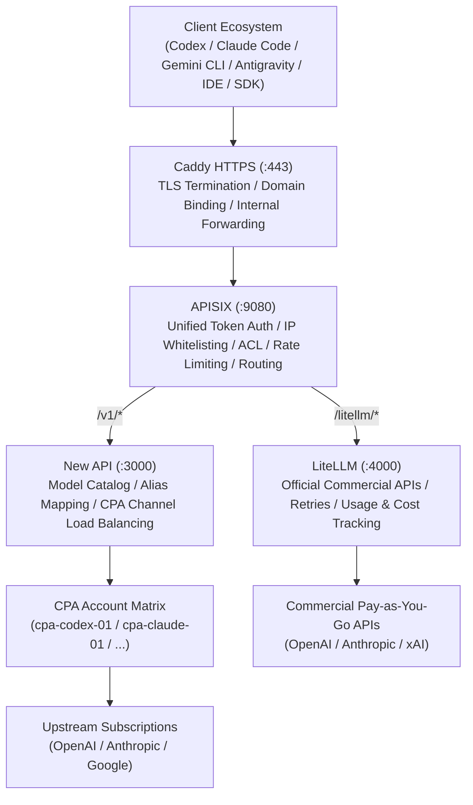

# No More Multi-Account Switching: Building Your Personal All-in-One AI Aggregator Gateway (Part 2)

> **Editor's Note**: Well-designed AI infrastructure should function like utility electricity—invisible, dependable, and accessible via a single URL and a single token to invoke any foundation model. As the second installment in the "All-in-One AI Aggregator Gateway" guide, this article examines the end-to-end traffic flow, core route mapping, and the decoupled client-to-upstream authentication contract.


---

## 1. Global Topology and End-to-End Traffic Flow

When designing a resilient gateway for personal developers and collaborative teams, network isolation and protocol consistency are foundational. We established three mandatory architectural principles:
1. **Unified External Ingress**: Expose exclusively standard HTTPS on port 443 via a single internal domain: `https://ai-internal.onwalk.net`.
2. **Zero Internal Public Exposure**: Beyond Caddy listening on the network boundary, all backend services (APISIX, New API, LiteLLM, and all CPA instances) are bound strictly to the loopback interface (`127.0.0.1`).
3. **Dual-Tier Processing Division**: Caddy focuses exclusively on TLS termination, certificate renewal, and reverse proxy forwarding, while APISIX manages client authentication, IP whitelisting, rate limiting, and intelligent upstream dispatching.



### Complete Request Lifecycle

1. **Client Dispatches Request**: A client (e.g., an engineer running an OpenAI Python script or the Claude Code terminal CLI) sends an HTTP request to `https://ai-internal.onwalk.net`.
2. **Edge TLS Termination (Caddy)**: Caddy intercepts the incoming HTTPS connection, validates TLS handshakes, and terminates encryption, proxying plaintext HTTP traffic directly to local loopback port `127.0.0.1:9080` (APISIX).
3. **Gateway Security Barrier (APISIX)**:
   * Restores the client's actual remote IP address and evaluates it against configured IP whitelists;
   * Extracts the client credential and enforces Consumer authentication and dynamic rate limits;
   * Upon successful authentication, APISIX strips the client-facing gateway key from headers and dynamically injects a secure, pre-shared internal New API service token.
4. **Model Scheduling Layer (New API / LiteLLM)**:
   * Requests targeting `/v1/*` flow to New API, which matches requested model identifiers against healthy CPA channel instances;
   * Requests targeting `/litellm/*` have their path prefix stripped and pass directly to LiteLLM for official commercial provider execution;
5. **Protocol Adaptation and Execution (CPA)**: The target CPA daemon verifies the internal channel key, reads the OAuth refresh token persisted in its isolated directory, constructs authentic upstream requests to AI provider endpoints, and streams the inference response back downstream.

---

## 2. Unified Route and Path Planning

To preserve ecosystem interoperability, the gateway provides comprehensive protocol backward-compatibility for standard OpenAI and Anthropic SDKs:

| External Path | Target Upstream Service | Functional Protocol Semantics |
| :--- | :--- | :--- |
| `/v1/chat/completions` | New API (`:3000`) | Standard OpenAI Chat Completions interface, compatible with SDKs, WebUIs, Agents, and IDE plugins. |
| `/v1/responses` | New API (`:3000`) | Native OpenAI Codex Responses endpoint, specifically supporting modern coding CLI tools. |
| `/v1/messages` | New API (`:3000`) | Native Anthropic Claude Messages endpoint, enabling direct consumption by Claude Code and the Anthropic SDK. |
| `/v1/models` | New API (`:3000`) | Unified model catalog endpoint, returning a consolidated dynamic inventory of active models. |
| `/litellm/*` | LiteLLM (`:4000`) | Dedicated conduit for official commercial APIs, stripped of the `/litellm/` prefix by APISIX before delivery. |
| `/official/v1/chat/completions` | AI Plugin / LiteLLM | Reserved route for direct commercial provider execution, enabling comparative latency and quality benchmarks. |

---

## 3. Decoupled Dual-Layer Authentication: The "Single Token" Contract

A frequent anti-pattern in home-grown aggregator gateways is leaking internal architectural complexity to client configurations. Many designs force clients to send multiple headers—such as a custom `X-Gateway-Key` combined with downstream bearer credentials. This breaks third-party tools (like proprietary IDE plugins) that only support entering a single API token.

To solve this, we implemented a **unidirectional authentication decoupling contract**:

```text
Client Request (Presents AI_GATEWAY_CLIENT_KEY)
  │  Accepted formats:
  │  - Authorization: Bearer <key>
  │  - x-api-key: <key>
  │  - apikey: <key>
  ▼
Caddy (Terminates TLS, preserves all request headers)
  ▼
APISIX (key-auth plugin intercepts and validates)
  │  1. Verifies validity of client gateway token and tenant quotas;
  │  2. Strips all client-supplied gateway token headers;
  │  3. Dynamically injects internal token: Authorization: Bearer <NEW_API_INTERNAL_TOKEN>
  ▼
New API (Validates internal token, resolves model routing)
  ▼
CPA Instance (Validates channel key, reads isolated local OAuth credentials)
```

With this contract in place, rotating downstream tokens, refactoring New API, or modifying CPA channel configurations has zero impact on client machines. **Engineers use a single gateway token across all their development tools.**

---

## 4. Client Real-IP Restoration and Zero-Trust Network Defense

In multi-tier reverse proxy architectures, naive forwarding causes backend services to observe all client connections as originating from `127.0.0.1`, breaking IP-based rate limiting and auditing.

### 1. Binding the OpenResty Real-IP Trust Chain
Within APISIX's declarative configuration, we instruct OpenResty to trust forward headers exclusively from the local Caddy reverse proxy:

```yaml
# apisix.yaml snippet
apisix:
  proxy_protocol: false
  real_ip_header: "X-Forwarded-For"
  real_ip_from:
    - "127.0.0.1"
```

This ensures that any spoofed `X-Forwarded-For` headers sent by external attackers are safely sanitized and rewritten by Caddy, allowing APISIX to accurately evaluate the real physical origin IP.

### 2. Network Port Isolation and Management Protection
* **Zero Public Listening Ports**: PostgreSQL, New API, LiteLLM, and all CPA instances listen exclusively on loopback interfaces, eliminating external attack surfaces at the OS layer;
* **Administrative Interface Shielding**: Web dashboards and administrative APIs for New API and APISIX are protected by mandatory key authentication and restricted source IP whitelists, preventing exposure to public internet scanners.

---

## 5. Summary

A clear traffic topology and a decoupled authentication contract provide the structural backbone of a reliable AI aggregator gateway. By pairing Caddy's lightweight TLS termination with APISIX's multi-protocol dispatching and header rewriting, we create a secure, frictionless calling conduit for all developer tools.

In the next part, we tackle account security and credential management:
**"No More Multi-Account Switching: Building Your Personal All-in-One AI Aggregator Gateway (Part 3) — Credentials: CPA Account Matrix & Vault Injection"**.

---

## 6. Multi-Platform Distribution Suite (X / LinkedIn / Newsletter)

### 1. X (Twitter) Thread

**Tweet 1 (Hook)**:
Great AI infrastructure should feel like wall power: plug in, and it just works. One URL, one API key, zero client gymnastics.

Here is Part 2 of building an all-in-one AI Aggregator Gateway: Dual-layer routing & auth decoupling 🧵👇

**Tweet 2 (The Dual-Tier Flow)**:
Why run Caddy + APISIX together?
- **Caddy (:443)**: Handles automated TLS lifecycle, HTTP/2 termination, and clean reverse proxying.
- **APISIX (:9080)**: Enforces IP whitelists, client rate limits, and path-based upstream routing.
- All backend nodes (PostgreSQL, New API, LiteLLM, CPA) listen strictly on `127.0.0.1`.

**Tweet 3 (The Single-Token Decoupling Contract)**:
Never push downstream auth complexity to developers!
APISIX validates the client's `AI_GATEWAY_CLIENT_KEY`, strips the header, and injects an internal New API token upstream.
Third-party IDE extensions (Cursor, VS Code) connect instantly without requiring multi-header hacks.

**Tweet 4 (Real-IP Defense)**:
When proxying behind Caddy, naive backends see every request as `127.0.0.1`.
Using OpenResty's `set_real_ip_from 127.0.0.1`, APISIX sanitizes and trusts forward headers exclusively from Caddy, preserving real origin IPs for rate limiting.

Next: How we isolate multi-account OAuth sessions to prevent cascading bans!
Retweet & Follow to stay tuned 🚀 #AIGateway #APISIX #SystemDesign #DevOps

---

### 2. LinkedIn Architecture Note

**Hook**: How do you design an AI API Gateway that exposes dozens of foundation models while requiring only a single API token from developers?

In Part 2 of our AI Aggregator Gateway series, we break down the traffic routing and zero-trust security perimeter:

1. **Dual-Tier Topology**: Decoupling TLS termination (Caddy) from policy enforcement (Apache APISIX Standalone) allows independent operational tuning.
2. **Transparent Authentication Decoupling**: Rather than requiring developers to supply multiple custom headers, APISIX validates the client token, strips it, and dynamically injects an internal service token toward downstream channels.
3. **Loopback-Only Defense**: By binding all upstream databases, model routers, and OAuth adapters strictly to `127.0.0.1`, we eliminate perimeter attack vectors.

Read the complete engineering breakdown with full Mermaid diagrams in the post below!

#APIArchitecture #CloudInfrastructure #APISIX #AIEngineering #DevOps #CyberSecurity

---

### 3. Engineering Newsletter Digest

**Subject**: Architecture Deep Dive: Building a Dual-Tier AI Traffic Hub with Single-Token Decoupling

**Summary**:
Managing foundation model access across personal accounts and commercial APIs requires careful architectural boundaries. This issue covers:
- Why layering Caddy in front of APISIX Standalone simplifies TLS and network boundaries.
- How to implement header rewriting in OpenResty/APISIX so third-party IDE plugins only need a single API key.
- Restoring genuine client IPs via proxy trust chains to ensure local rate limiting remains effective.
