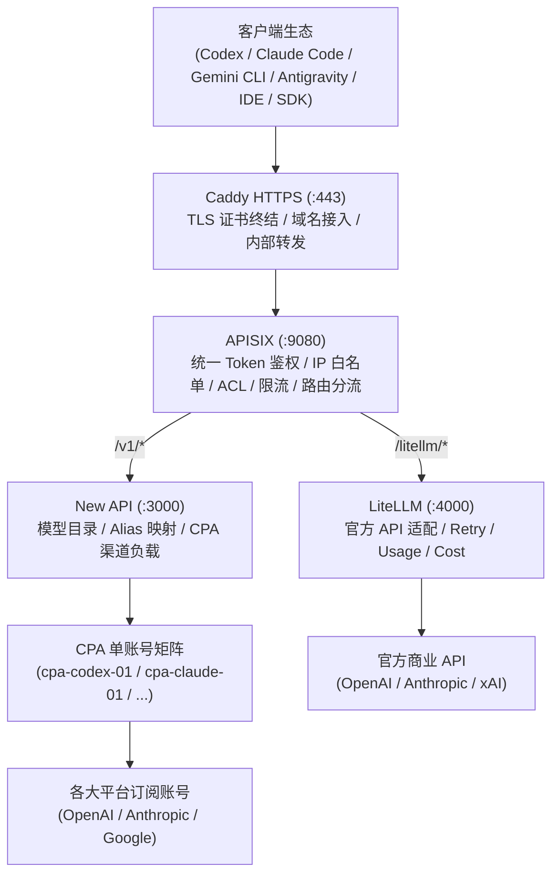

# 再也不用多账号切换了：手把手教你搭建个人专属全能 AI 聚合网关（二）

> **导读**：一个优秀的 AI 基础设施，对外部使用者而言应当如水和电一样自然——只需一个 URL、一个 Token，即可随心调用所有底座模型。本文是“全能 AI 聚合网关”实战系列的第二篇，我们将重点拆解系统的流量流向图谱、核心路由规划、以及关键的“网关鉴权与内部业务 Token 解耦”契约设计。


---

## 一、全局架构拓扑与数据流走向

在设计个人与小团队网关时，网络安全性与协议统一性是首要考量。我们确立了三条核心网络准则：
1. **统一外部入口**：仅对外暴露标准 HTTPS 443 端口，域名统一为 `https://ai-internal.onwalk.net`；
2. **零内部公网监听**：除 Caddy 监听边缘网络外，内部所有服务（APISIX、New API、LiteLLM、CPA 实例）一律绑定在本地回环地址（`127.0.0.1`）；
3. **两级分流处理**：Caddy 专职处理证书与反代，APISIX 承担全部业务安全、限流与智能路由分发。



### 完整流量流转时序

1. **终端发起请求**：客户端（例如正在运行 Python 脚本的工程师或 Claude Code 命令行）向 `https://ai-internal.onwalk.net` 发送请求；
2. **边缘 TLS 卸载 (Caddy)**：Caddy 接管 HTTPS 请求，完成证书校验与 TLS 终止，将流量通过 HTTP 协议转发至本地 `127.0.0.1:9080`（APISIX 端口）；
3. **网关安全防护 (APISIX)**：
   * 恢复真实客户端 IP，核验 IP 白名单；
   * 读取请求中的客户端 Token，执行 Consumer 鉴权与流控校验；
   * 鉴权通过后，APISIX 从请求头中剥离网关 Token，动态换入专用的 New API 内部通信 Token；
4. **模型分发层 (New API / LiteLLM)**：
   * 若访问 `/v1/*`，流量转入 New API，由其按照请求的模型名称匹配对应的 CPA 渠道实例；
   * 若访问 `/litellm/*`，APISIX 剥离前缀后直通 LiteLLM，由其向官方 API 发起商业调用；
5. **协议适配与上游执行 (CPA)**：CPA 实例校验内部 Channel 密钥，读取本机隔离目录中持久化的 OAuth 刷新凭据，组装真实请求发往各大 AI 平台完成推理并流式回传结果。

---

## 二、统一路由与协议路径规划

网关对外必须保持完全向下兼容，支持标准 OpenAI 与 Anthropic 协议生态：

| 外部暴露路径 | 上游后端服务 | 路径功能与协议语义说明 |
| :--- | :--- | :--- |
| `/v1/chat/completions` | New API (`:3000`) | OpenAI 标准 Chat 对话接口，兼容绝大多数 SDK、WebUI、Agent 及 IDE 插件。 |
| `/v1/responses` | New API (`:3000`) | OpenAI Codex 原生 Responses 协议接口，专门适配新一代 CLI 代码生成工具。 |
| `/v1/messages` | New API (`:3000`) | Claude Messages 原生兼容接口，供 Claude Code、Anthropic SDK 直接调用。 |
| `/v1/models` | New API (`:3000`) | 聚合模型目录接口，用于客户端动态拉取当前所有已挂载并启用的模型清单。 |
| `/litellm/*` | LiteLLM (`:4000`) | 官方商业 Provider 直连通道，APISIX 剥离 `/litellm/` 前缀后转送至 LiteLLM。 |
| `/official/v1/chat/completions` | AI 插件 / LiteLLM | 独立保留路径，用于通过网关直接调用官方商业 API，进行延时与质量对比。 |

---

## 三、双层认证解耦：实现“单一 Token”终极体验

在搭建聚合网关时，最容易走入的误区是“把下层系统的复杂度直接推给客户端”。许多系统要求开发者既要在请求头中塞入网关自定义 Header（如 `X-Gateway-Key`），又要在 `Authorization` 中填入下游系统 Token。这对于只允许配置单个 API Key 的第三方工具（如各类 IDE 插件）而言是无法使用的。

为此，我们制定了**网关层与内部业务层的单向认证解耦契约**：

```text
客户端请求 (携带 AI_GATEWAY_CLIENT_KEY)
  │  Header 形式支持三选一:
  │  - Authorization: Bearer <key>
  │  - x-api-key: <key>
  │  - apikey: <key>
  ▼
Caddy (完成 TLS 卸载，保持原有 Headers 转发)
  ▼
APISIX (key-auth 插件统一拦截校验)
  │  1. 验证客户端网关 Token 合法性与租户配额；
  │  2. 剥离传入的网关 Key 相关头部；
  │  3. 动态注入内部预置凭据: Authorization: Bearer <NEW_API_INTERNAL_TOKEN>
  ▼
New API (使用高权限内部 Token 校验成功，执行渠道路由)
  ▼
CPA 实例 (使用 Channel Token 校验通过，读取本地 OAuth 登录态)
```

通过这一设计，下游 New API、CPA 的任何密钥轮转或重构，都局限在内网环境中，**终端开发者完全无感，真正实现了“一个 Key 走天下”**。

---

## 四、真实客户端 IP 恢复与网络零信任防线

在反向代理多层转发的链条中，如果配置不当，后端服务拿到的请求 IP 会全变成 `127.0.0.1`，导致 IP 白名单和限流策略彻底失效。

### 1. OpenResty Real-IP 信任链绑定
在 APISIX 配置中，我们通过 OpenResty 底层指令严格锁定只信任来自 Caddy（`127.0.0.1`）的转发头：

```yaml
# apisix.yaml 核心片段
apisix:
  proxy_protocol: false
  real_ip_header: "X-Forwarded-For"
  real_ip_from:
    - "127.0.0.1"
```

这能够确保任何由外部恶意伪造的伪造客户端头在经过 Caddy 时被安全重写，APISIX 始终能提取到真实物理来源 IP。

### 2. 端口隔离与管理后台防护
* **内部组件零公网监听**：PostgreSQL、New API、LiteLLM 以及所有 CPA 实例仅监听本地回环地址，从操作系统网络层杜绝未授权探测；
* **管理端点访问隔离**：New API 与 APISIX 的管理控制台均受到 Key Auth 与来源白名单严格保护，避免公网扫描探测暴露管理员入口。

---

## 五、小结

清晰的流量拓扑和透明的认证契约，是构建稳定 AI 聚合网关的基础。通过 Caddy 的 TLS 卸载和 APISIX 的多协议路由、Token 动态改写，我们成功构建了一条安全、高效、对客户端完全透明的调用通道。

在下一篇中，我们将直面最棘手的账号风控与敏感数据管理问题：
**《再也不用多账号切换了：手把手教你搭建个人专属全能 AI 聚合网关（三）—— 凭据篇：CPA 账号矩阵隔离与 Vault 敏感凭据注入落地》**。

---

## 六、多平台发布矩阵适配（微信公众号 / 小红书 / X）

### 1. 微信公众号 & 朋友圈文案

> **标题备选**：
> 1. 一个 Token 跑通所有大模型：Caddy + APISIX 双层网关架构实战
> 2. 再也不用多账号切换了：AI 聚合网关的流量中枢与安全防线（架构篇）
> 3. 别把下游复杂度推给前端！聊聊 AI 网关的单一 Token 解耦设计

**推文导语与摘要**：
做 AI 基础设施最大的误区，就是把内部各个系统的 Token 和鉴权头一股脑丢给客户端去配。好的架构对使用者必须透明——外部永远只有一个 Token 和一个统一域名。本文深入解析 Caddy + APISIX 双层架构的流量图谱、OpenResty Real-IP 防线，以及如何动态将网关 Key 无感置换为上游高权限通信 Token。

**朋友圈转发文案**：
做网关千万别偷懒把下游系统的鉴权直接暴露给开发者！
很多闭源 IDE 插件（如 Cursor、Android Studio）只支持配一个 API Key，根本不支持你自定义 Headers。
在我们的 AI 聚合网关里，用 APISIX 实现了一套极简的“单向认证解耦”：
客户端只要带一个 `AI_GATEWAY_CLIENT_KEY`，APISIX 校验通过后自动剥离并换成内部 New API Token，下游爱怎么折腾架构调整，前端完全无感。
架构图和 OpenResty 信任链配置都在正文里了，欢迎收藏围观！👇

---

### 2. 小红书爆款图文文案

**笔记封面大字**：
🛡️ AI 网关架构长这样！
🔌 一个 Token 玩转所有模型
🚀 双层路由 + 零公网端口暴露

**正文内容**：
很多宝子问我：自己搭 AI 网关，怎样才算真正“好用”？
我的标准只有一条：
**对开发者来说，它必须像家里的插座一样无感！插上就能用！**🔌

今天更新【AI 聚合网关实战】第二篇：流量架构与安全防线！
看看我是怎么设计的：
1️⃣ **边缘 TLS 卸载 (Caddy)**：负责收管所有 HTTPS 流量，自动续期证书；
2️⃣ **流量控制中枢 (APISIX)**：拦截请求校验 Token，做 IP 白名单和动态限流；
3️⃣ **灵魂设计：单 Token 鉴权解耦**！
很多网关要填两套 Key，烦得要死。我们用 APISIX 拦截后，自动换入高权限内部 Token，不管下游 New API 和渠道怎么变，客户端永远只需要一个 Key！
4️⃣ **绝对安全**：除 Caddy 暴露 443 外，其他所有数据库、APISIX、New API 和账号服务，全部锁死在 `127.0.0.1` 本地回环！外网扫描器连门都摸不到！

下期揭秘最硬核的【账号矩阵防封号与凭据安全】，赶紧关注追更吧～✨

🏷️ #技术架构 #AI开发 #系统设计 #API网关 #APISIX #程序员摸鱼神器 #架构师日常

---

### 3. X (Twitter) Thread / 文章

**Tweet 1 (Hook)**:
The hallmark of great AI infrastructure:
For the developer, it should feel like utility electricity—a single base URL, a single API key, zero friction.

Here is Part 2 of building a self-hosted AI Aggregator Gateway: Dual-layer routing & auth decoupling 🧵👇

**Tweet 2 (Traffic Topology)**:
Why dual-tier?
- **Caddy (:443)**: Edge TLS termination and reverse proxying.
- **APISIX (:9080)**: Tenant ACL, IP whitelisting, rate limiting, and protocol path dispatch.
- **Backend Services**: Bound strictly to `127.0.0.1` loopback. Zero public exposure.

**Tweet 3 (The Single-Token Decoupling Contract)**:
Never leak internal complexity to developers!
APISIX validates the client's `AI_GATEWAY_CLIENT_KEY`, strips the header, and transparently injects an internal New API token upstream.
Third-party IDE plugins (Cursor, JetBrains) work out of the box with zero custom header hacks.

**Tweet 4 (Real-IP Defense)**:
Behind reverse proxies, naive setups see all incoming traffic as `127.0.0.1`.
Using OpenResty's `set_real_ip_from 127.0.0.1`, APISIX trusts forward headers exclusively from Caddy, preserving genuine client IPs for bulletproof whitelisting.

Next: How we isolate multi-account OAuth sessions to prevent cascading bans!
Like & Repost to support open engineering 🚀 #SystemArchitecture #AIGateway #APISIX #DevOps
