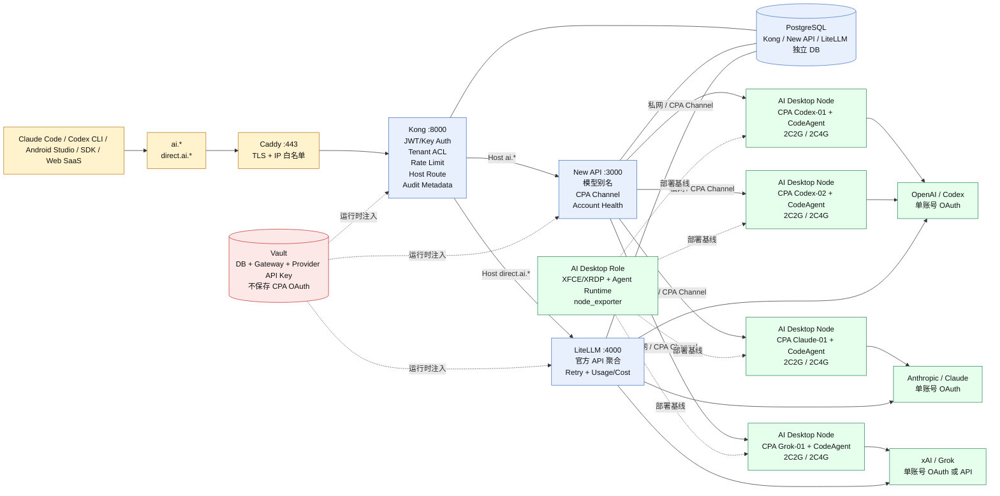

# AI Gateway v1 架构图

> 本图是 AI Gateway v1 的拓扑事实源。CPA 节点必须通过 `AI Desktop Role`
> 部署桌面基线，再装配 Agent Runtime、基础监控和一个账号对应的 CPA 实例。

## 运行时拓扑



## 边界与部署模型

- 公网只开放 Caddy `:443`；Caddy 负责 TLS 和物理源 IP 白名单。
- Kong 只监听 loopback，负责 Token、租户 ACL、限流、Host 路由和审计元数据；使用 PostgreSQL，不部署 etcd。
- `ai.<domain>` 进入 New API，再按 CPA channel 访问私网 CPA；`direct.ai.<domain>` 进入 LiteLLM，直连官方 OpenAI、Anthropic、xAI API。
- CPA 每个实例只绑定一个账号；OAuth bundle 仅位于该节点的加密本地 `auth/` 目录，不进入 Vault、Git、Terraform state 或 CI artifact。
- CPA 节点由 `deploy_ai_desktop.yml -e ai_desktop_cpa_codeagent=true` 调用现有 `roles/vhosts/ai_desktop`，并启用 `roles/ai_agent_runtime` 与 `roles/vhosts/node_exporter`。
- UAT 是 AWS ARM64 Spot、默认 60 分钟；Prod 复用现有持久节点。每个 CPA 节点最低 2C2G，建议 2C4G。

## 交付顺序

```text
GitOps 声明
  → Terraform/CMDB 生成节点
  → deploy_ai_desktop.yml(cpa_codeagent) + AI Desktop Role + Agent Runtime + node_exporter
  → CPA 本地 auth 目录初始化
  → Gateway Vault 凭据注入
  → Kong / CPA / LiteLLM / New API stage
  → 人工完成 4 个 CPA OAuth 登录
  → 协议、租户、故障隔离验证
  → activate
```
