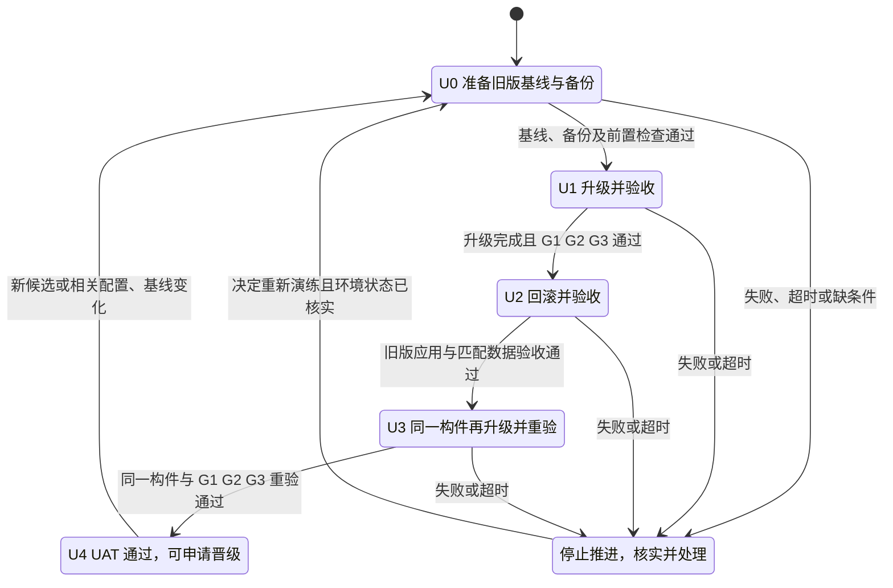
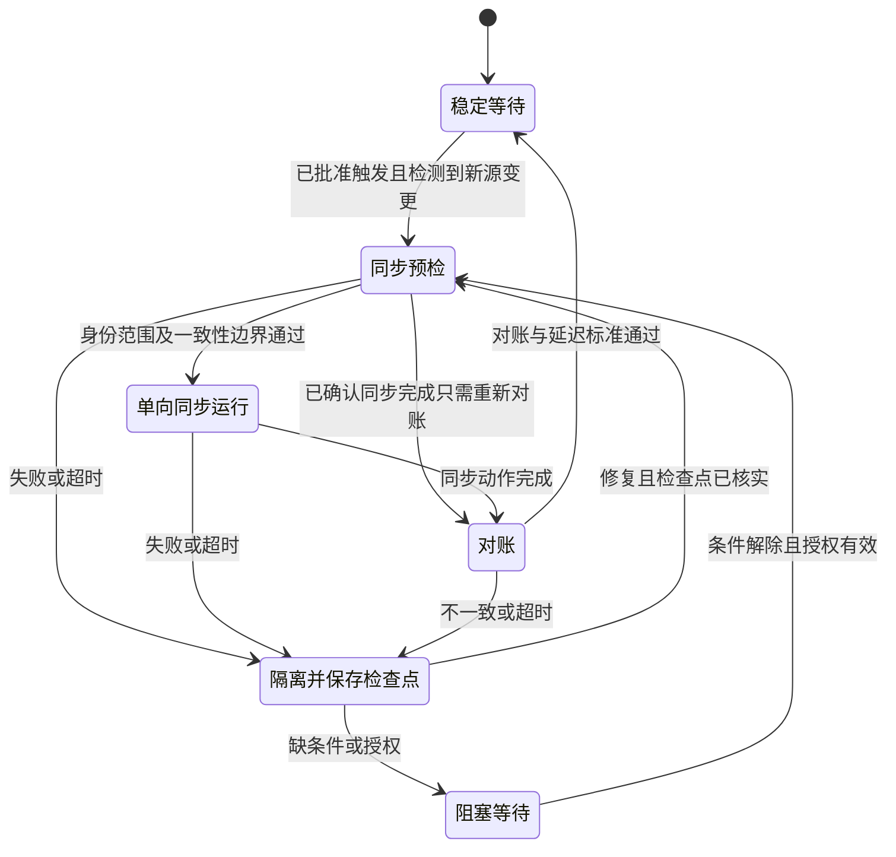
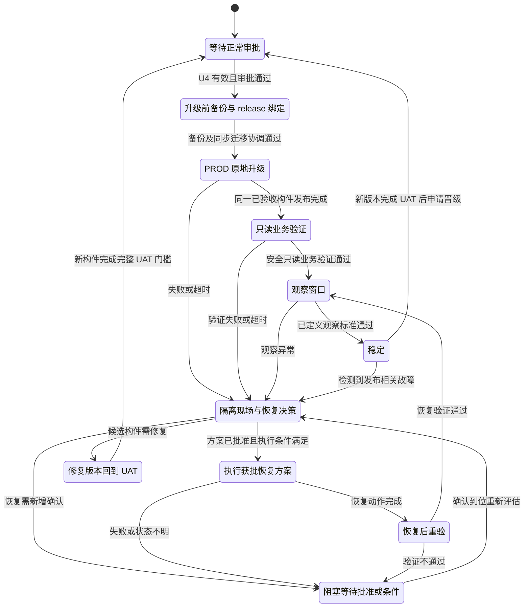

# 数据库同步与发布晋级状态机

工作流描述与验收规格  ·  版本 1.4 迁移前置条件与准备 TLDR  ·  2026 年 10 月 5 日

适用对象：Claude Code 实现者、仓库维护者与发布审批人。本文将已确认的六步流程转为可实现的状态机，规定进入条件、动作、证据及失败处理。闭环指控制状态有反馈、恢复、重入和重新验收路径；数据流仍严格单向。闭环不等于无限重试或自动恢复生产数据。本文是目标设计，不代表已执行同步、已完成验收或已授权生产变更。

## 1 核心目标与边界

以 PROD Supabase 为常规生产数据权威源，在 UAT Selfhost PostgreSQL 完成备份恢复、升级、业务验收、回滚及再次升级。三项业务门槛全部通过后，才具备将同一份不可变构件晋级 PROD Selfhost 的条件。

| 必须成立 | 实施约束 |
| --- | --- |
| 数据权威性 | 同步只沿已批准的单向链路进行；UAT 和 Selfhost 演练数据不得回灌 PROD Supabase。 |
| 环境隔离 | 升级、回滚、恢复演练默认只在 UAT Selfhost；PROD Selfhost 正常发布保留生产备份和正常审批。 |
| Supabase 恢复 | Supabase 自身备份与还原仅作为应急人工旁路，由用户手动操作，不进入日常自动演练。 |
| 真实业务证据 | 必须证明旧版本真实升级、原用户真实登录与权限保留、非空订阅及权益保留。SQL 一致性或绿色 CI 不能替代。 |
| 生产范围 | 不自动执行 PROD 数据库恢复演练，不创建凭据、不扩大 IAM 或网络权限、不承诺新增费用。 |

### 数据基线状态

选定候选基线为此前在 UAT Supabase 查到的 23 用户、schema 2026092703、0 条订阅。它尚不能直接认定为 PROD 快照。执行前须核实快照标识、来源数据库、时间、一致性边界及与 PROD 源的对应关系。

0 条订阅不能证明订阅保留。须准备获授权的非空订阅样本，并明确状态、套餐、权益、到期时间及关联用户等预期结果；不得自动生成真实收费订阅。

## 2 数据拓扑与运行单元

### 常规生产链路

PROD Supabase  →  PROD Selfhost PostgreSQL
PROD Selfhost 本地 /data 备份用于生产保护；生产恢复必须另行授权并安排维护窗口。

### 一次性建立 UAT 基线

PROD Supabase  →  UAT Supabase  →  UAT Selfhost PostgreSQL
经范围批准的初始化完成后，冻结演练基线；不默认持续覆盖 UAT。后续重复演练使用已冻结的 UAT Selfhost 基线。

UAT Supabase 和 UAT Selfhost 应记录各自数据库身份及核对结果。脱敏后的数据可与 PROD 原始记录不同，必须记录映射与预期差异，不能用原始逐行相等作为唯一验收标准。

### 迁移连接与权限前置条件

迁移连接按平台和源/目标角色分开，实际值只存放在 Vault，执行时按批准的环境与链路读取。文档、Git、运行日志和验收证据仅保存脱敏模板及秘密引用。

UAT 配置位置：Vault KV v2 的 `kv/uat/accounts-migration`（API 读取路径为 `kv/data/uat/accounts-migration`）。用户提供的入口为[版本 4 配置参考](https://vault.svc.plus/ui/vault/secrets/kv/kv/uat%2Faccounts-migration/details?version=4)；此处未访问或验证 Vault 实际内容。每次执行记录实际读取的版本，旧链接不作为永久有效的凭据版本。

#### 脱敏 DSN 模板

以下为字段约定和占位模板，不能直接执行；host、端口、数据库名和账号须按实际环境确认。保留现有 `SelfHost_Postgreqsql` 拼写，避免配置读取不一致。

```json
{
  "MIGRATION_Supabase_SOURCE_DSN": "postgresql://<SUPABASE_READONLY_USER>:<URL_ENCODED_PASSWORD>@<SUPABASE_SOURCE_HOST>:<PORT>/<DATABASE>?sslmode=verify-full&sslrootcert=<CA_PATH>",
  "MIGRATION_Supabase_TARGET_DSN": "postgresql://<SUPABASE_WRITER_USER>:<URL_ENCODED_PASSWORD>@<SUPABASE_TARGET_HOST>:<PORT>/<DATABASE>?sslmode=verify-full&sslrootcert=<CA_PATH>",
  "MIGRATION_SelfHost_Postgreqsql_SOURCE_DSN": "postgresql://<SELFHOST_READONLY_USER>:<URL_ENCODED_PASSWORD>@<SELFHOST_SOURCE_HOST>:<PORT>/<DATABASE>?sslmode=verify-full&sslrootcert=<CA_PATH>",
  "MIGRATION_SelfHost_Postgreqsql_TARGET_DSN": "postgresql://<SELFHOST_WRITER_USER>:<URL_ENCODED_PASSWORD>@<SELFHOST_TARGET_HOST>:<PORT>/<DATABASE>?sslmode=verify-full&sslrootcert=<CA_PATH>"
}
```

若 Selfhost 经已验证的 SSH 隧道连接，目标可采用 `postgresql://<TARGET_USER>:<URL_ENCODED_PASSWORD>@127.0.0.1:15432/<DATABASE>?sslmode=disable`。仅在隧道覆盖远端数据库连接且监听回环地址时适用；`127.0.0.1` 指实际执行迁移工具的主机，不能据此确认目标数据库身份。远程直连使用 TLS，`verify-full` 需要可信 CA 与匹配的主机名。[PostgreSQL SSL 说明](https://www.postgresql.org/docs/current/libpq-ssl.html)

| 字段 | 权限与用途 |
| --- | --- |
| `MIGRATION_Supabase_SOURCE_DSN` | Supabase 专用只读源账号，只读取批准的业务范围 |
| `MIGRATION_Supabase_TARGET_DSN` | Supabase 目标专用可写账号，仅授予批准目标范围所需权限 |
| `MIGRATION_SelfHost_Postgreqsql_SOURCE_DSN` | Selfhost 专用只读源账号，用于备份、导出和核对 |
| `MIGRATION_SelfHost_Postgreqsql_TARGET_DSN` | Selfhost 目标专用可写账号，用于获批导入、迁移或恢复 |

四个字段是角色约定，不要求每个任务都使用四个连接。每段任务显式选择环境与源/目标：

- PROD Supabase → UAT Supabase：使用 PROD 的 Supabase SOURCE 与 UAT 的 Supabase TARGET。
- UAT Supabase → UAT Selfhost：使用 UAT 的 Supabase SOURCE 与 UAT 的 Selfhost TARGET。
- PROD Supabase → PROD Selfhost：使用 PROD 的 Supabase SOURCE 与 PROD 的 Selfhost TARGET。
- Selfhost 备份导出：使用对应环境的 Selfhost SOURCE；恢复使用批准的 TARGET，演练恢复须指向隔离测试库。

PROD 凭据使用独立且已批准的 Vault 配置，不能把 UAT 路径中四个字段自动视为覆盖所有生产和测试数据库。旧字段 `MIGRATION_SOURCE_DSN`、`MIGRATION_TARGET_DSN` 若工具仍需使用，仅在选定单段任务后由适配层映射；与新字段冲突时停止，不静默回退。可选 `MIGRATION_SOURCE_SSH_PRIVATE_KEY_B64` 只在已确认需要对应 SSH 通道时安全读取，目标隧道凭据另行明确；Base64 是编码，不是脱敏，文档不保存其值。

#### Supabase cloud 准备 TLDR

1. **确认项目**：区分 PROD 与 UAT 项目，记录非敏感项目标识、数据库身份和允许迁移的数据范围；需新项目时另行完成项目创建和费用确认。
2. **准备账号**：由管理员配置专用源只读角色和目标可写角色。源限于批准范围的连接、schema 使用和 SELECT 权限，不授予写入、对象所有权、可写角色继承或可导致写入的函数权限；目标导入涉及 DDL、序列或恢复时，按动作补齐必要权限。RLS 下必须核实获批数据是否完整可读，不能把被过滤结果当作完整导出。[Supabase 角色说明](https://supabase.com/docs/guides/database/postgres/roles)
3. **获取连接**：从项目 Dashboard 的 Connect 复制实际 endpoint。迁移、备份与恢复优先使用直连；执行主机只有 IPv4 且直连不可达时选择 Session pooler，并验证工具兼容性。共享 pooler 自定义角色用户名采用 `<ROLE>.<PROJECT_REF>`；避免将 Transaction pooler 当作这些任务的默认连接。[Supabase 连接说明](https://supabase.com/docs/guides/database/connecting-to-postgres)
4. **保存秘密**：密码按 URI 规则编码，配置 TLS 和 CA；将完整 DSN 存入对应环境的 Vault，不粘贴到文档或命令输出。
5. **完成预检**：以专用角色连接，核实数据库身份、schema、批准范围的读取能力及权限；确认目标可执行选定的导入方式，记录脱敏结果。Supabase 平台管理对象不纳入默认全库覆盖。

#### SelfHost_Postgreqsql 准备 TLDR

1. **准备实例**：在批准的 UAT/PROD 主机准备 PostgreSQL 与业务数据库，确认主版本、所需扩展、数据目录、磁盘容量和备份目录；备份文件与数据库数据目录分开。导出、恢复工具版本须与实际数据库兼容。
2. **准备账号**：建立专用源只读角色与目标可写角色，按批准 schema 和对象授予权限。目标账号可写不等于能够恢复任意数据库；需建表、修改 schema 或操作序列时，核实相应权限，避免默认使用应用日常账号或超级用户。
3. **准备连接**：配置受限的监听地址、访问规则与 TLS，或经已批准的 SSH 隧道连接；隧道监听回环地址并验证 SSH 主机身份，不开放数据库公网访问作为默认步骤。
4. **保存秘密**：实际 SOURCE/TARGET DSN 写入对应 Vault 配置；SSH 密钥按需要单独安全注入，不写入仓库或持久化日志。
5. **准备回滚**：固定旧版应用、配置和 schema；确认 /data 备份可写且容量足够，在隔离测试数据库实际恢复并校验。恢复目标不得误指向源库或运行中的生产库。

#### 前置检查通过标准

- 选定链路的 DSN 非空、可解析、可连接；核对真实源/目标数据库身份、环境和目标覆盖范围，不能仅凭变量名或隧道端口判断。
- 源账号有效权限只读；只读事务设置是辅助保护，不能替代角色权限检查。检查写权限、角色继承、对象所有权与函数权限，不在生产源执行试写。
- 目标账号具备选定导入、迁移或恢复动作所需权限；需要试写时仅在获批隔离测试库验证并清理。
- TLS 或隧道验证通过；源目标范围、Vault 实际版本和脱敏结果有记录。源只读不限制目标覆盖范围，目标写入仍需批准。
- 任一缺项进入 BLOCKED，不能使用管理员源 DSN、忽略证书检查或扩大权限自动绕过。准备步骤是操作指引，本次文档更新不代表账号、项目、隧道或 Vault 配置已实际创建或验证。

### 三个独立运行单元

| 运行单元 | 触发与稳定态 | 隔离要求 |
| --- | --- | --- |
| 生产单向同步 | 显式触发；频率和方式待定。核对成功进入稳定态；新源变更在已批准触发方式下启动下一轮。 | 不触发发布、不覆盖 UAT，不承担恢复演练。 |
| UAT 初始化与演练 | 已批准的数据范围和候选构件触发；通过后进入可晋级等待态；异常经修复和重验返回流程。 | 一次性初始化有独立运行编号；重跑不得隐式重建基线。 |
| PROD 晋级 | UAT 可晋级且正常审批通过后触发；发布后验证并观察进入稳定态；异常受控恢复后重验。 | 只晋级已验收 digest；不携带 UAT 数据。 |

### 事件与状态语义

事件包括 REQUEST、SOURCE_CHANGED、PREFLIGHT_PASS、ACTION_OK、CHECK_PASS、APPROVAL_GRANTED、APPROVAL_DENIED、FAIL、TIMEOUT、CANCEL、RESUME、RETRY、REPAIRED、CANDIDATE_CHANGED 和 AUTHORITY_RESTORED。事件不得直接跳过 guard。动作开始只记 RUNNING，完成且验收通过才记 PASS。

每次执行绑定 run_id、attempt_id、parent_run_id、environment_id、baseline_id、config_revision、目标提交和镜像 digest；异常关联 incident_id。状态恢复保留旧证据与失败原因，不能覆盖失败历史。逻辑上稳定的状态持续等待下一合法事件，不代表系统永远结束。

## 3 UAT DB 演练闭环状态机

UAT 演练只保留五个主阶段：**准备 → 升级并验收 → 回滚并验收 → 同一构件再升级并重验 → 可晋级**。每个阶段包含动作和验收；全部检查通过才进入下一阶段。首次初始化作为准备阶段的按需步骤，已有有效冻结基线时直接复用。



| 阶段 | 动作与通过条件 | 成功出口 |
| --- | --- | --- |
| U0 准备 | 核实来源、数据库与主机身份，完成第 2 节 DSN、权限及连接预检；固定旧版本、候选 release tag、digest、目标 schema 和配置；准备真实登录方式、非空订阅样本及授权；确认旧版基线、回滚策略和 UAT /data 备份可用 | U1 |
| U1 升级并验收 | 从旧版基线执行迁移与部署；核对实际 digest、精确 schema 和迁移状态；G1/G2/G3 全部通过，保存首轮证据 | U2 |
| U2 回滚并验收 | 按已选兼容 schema 或配套快照策略回滚；核对旧版应用与匹配数据状态，验证登录、权限、订阅及权益恢复；保存实际回滚和验收证据 | U3 |
| U3 再升级并重验 | 使用首轮相同 digest、目标 schema 和迁移内容再次升级，重新验证 G1/G2/G3；保存独立重验结果 | U4 |
| U4 可晋级 | 准备、升级、回滚和再升级证据完整有效，绑定同一候选；可申请第 5 节 PROD 审批 | 第 5 节 R0 |
| UX 异常处理 | 停止新动作，记录失败步骤、现场与检查点；核实实际应用、数据库和在途动作状态，按第 6 节处理 | 条件恢复后安全继续，或回 U0 重新演练 |

### 准备阶段的按需步骤

- **首次初始化**：核实候选 23 用户、schema 2026092703 快照的来源、时间、一致性边界与 PROD 对应关系。数据白名单、脱敏、认证秘密排除和目标覆盖范围获得批准后，执行两段单向复制、核对并冻结；部分复制先核实检查点，再决定能否安全重试。
- **复用基线**：已有有效冻结基线时检查其身份与版本，不重新复制或覆盖 UAT。0 条订阅不能证明订阅保留，仍须准备获授权的非空样本。
- **备份与恢复**：升级前完成 /data 备份，并在隔离测试数据库实际恢复、校验旧版基线；恢复验证失败不得进入 U1。确认演练期间业务写入与同步不会覆盖被测数据，并明确恢复点之后写入的处置。

### 统一失败与继续规则

阶段执行结果使用待执行、执行中、通过、失败、暂停或 BLOCKED 记录；不为每种结果再增加主流程节点。

任何阶段失败都停止推进并保留旧证据。缺权限或输入时记录 BLOCKED；取消时记录 PAUSED 和 resume_state；超时先核实动作是否仍在运行或已经完成。上述规则同样适用于 U0 的初始化和备份步骤。

同一候选、基线及配置未变化时，人工核实实际状态、授权和安全重试条件后，可以继续当前阶段；动作已完成时仅重做验收，不重复迁移、复制或恢复。图中仅画出重新演练的入口，当前阶段继续通过记录的 resume_state 管理。

修改构件、目标 schema、迁移或相关配置后，生成新的验证批次，从 U0 重新完成整轮演练。基线或数据库身份改变时重新核实来源；确需初始化则重新取得复制批准。旧候选晋级资格失效。

U2 回滚失败时先处理环境，旧版应用和匹配数据未验收通过不得进入 U3。U4 只表示 UAT 通过；生产升级仍须独立审批和升级前备份。全局重试预算、证据保护及敏感数据边界沿用第 6 节。

## 4 验收门槛与回滚语义

| 门槛 | 必须验证 | 不构成通过 |
| --- | --- | --- |
| G1 平滑升级 | 真实旧版本实例与冻结基线；升级前后数据核对；正确 digest；迁移 clean 且达到精确目标；服务恢复；记录中断时长与允许窗口。 | 只运行单元测试、全新空库部署，或仅判断版本不降低。 |
| G2 原用户登录 | 原有普通用户和管理员通过实际登录链路；验证角色、资源访问及权限边界；记录用户样本的脱敏标识和结果。 | 仅用户数量相同、密码字段存在、SQL 查询成功，或跳过登录检查。 |
| G3 订阅保留 | 升级前存在获授权非空样本；验证用户关联、套餐、状态、周期、额度和权益语义；验证应用实际读取并生效。 | 0 条订阅前后相等，或仅表存在、行数一致。 |

每个门槛均绑定 baseline_id、目标 digest、数据库身份、执行时间及证据引用。首轮升级和再次升级各保存一套结果；最终晋级使用再次升级通过的同一目标构件。

### 数据库回滚策略必须先选定

策略 A：旧应用兼容升级后的 schema。执行前须有兼容性证据，回退应用后保留该 schema，并验证旧应用的读写和业务行为。

策略 B：恢复配套快照。仅在 UAT 演练中隔离业务写入与同步，恢复匹配旧应用的快照，再验证完整性。须记录恢复点之后写入的处置；不能把这些写入静默丢弃并报告成功。

两种策略都必须确认同步在演练期间不会覆盖被测数据。仅回退镜像不等于数据库回滚；不得用修改迁移版本号、清除 dirty 标志或跳过断言制造通过。

### 身份与敏感信息

生产会话、MFA 密钥、支付凭据和访问令牌不得顺带复制。原用户登录验证的身份映射与安全测试方式须单独明确；需要认证秘密时由用户处理，不在报告或日志保存秘密。脱敏不应破坏需要验证的用户关联与权限语义。

平滑升级不预设零停机。实现前定义允许中断窗口、探测方式及恢复阈值；缺少这些标准时只记录观测结果，不能直接宣称满足平滑升级。

## 5 生产同步与发布反馈闭环

### 常规生产单向同步



文本回路：稳定 → 新变更触发 → 预检 → 同步 → 对账 → 稳定。异常 → 隔离与检查点 → 修复 → 预检 → 幂等同步或仅重新对账。频率、同步方式和延迟阈值待定，图示不自动授予定时执行权限。

| 状态 | 成功与重入 guard | 异常出口 |
| --- | --- | --- |
| P0 稳定 | 新源变更在已批准触发方式下到 P1；不得覆盖被冻结 UAT | 源权威身份改变进入应急闭环 |
| P1 预检 | 源目标匹配、范围获批、无未处理写冲突、检查点可用才到 P2 | 缺项 BLOCKED；超时或失败 PX |
| P2 同步 | 记录一致性边界与检查点；复制完成到 P3 | 部分完成到 PX；重入先确认幂等及实际状态 |
| P3 对账 | 数量、关系、字段或批准差异与延迟通过到 P0 | 不一致到 PX；只需重验时可由预检返回 P3 |

取消和恢复执行也采用第 6 节的统一 PAUSED 与安全重入规则；P0 在没有新变更时保持稳定等待。

### PROD Selfhost 发布与恢复反馈

#### 实用发布闭环

主流程：**UAT 完整演练通过 → PROD 原地升级前备份 → 发布 → 验收与观察；失败恢复旧版，修改后重新走 UAT。** 下方状态机展开这条流程的检查、等待和异常出口；执行时沿用现有部署方式，不要求额外建设灰度或流量切换系统。

1. **UAT 完整演练**：旧版升级至候选版本，完成 G1/G2/G3 验收，再回滚并验收旧版，最后使用同一构件再升级并重验。全部通过后获得晋级资格。
2. **PROD 升级前保护**：核实当前应用和 schema 支持已演练的升级路径；在批准的维护窗口内协调业务写入与同步，完成升级前数据库备份。备份失败或回滚条件不成立时停止发布。
3. **绑定 release tag 与快照**：本次目标 release 的发布记录保存 `release_tag`、`artifact_digest`、`previous_release_tag`、旧版构件 digest、`previous_config_revision`、升级前 schema、`backup_snapshot_id`、快照时间及一致性边界、`uat_evidence_refs` 和 `prod_result`。快照用于恢复升级前状态，须与旧版应用和配置配套；同一 release 多次发布以独立 `run_id` 区分快照。
4. **原地升级与验收**：部署 UAT 已验收的同一不可变构件，执行批准的迁移，完成生产安全只读业务验收及约定观察。通过后记录新版稳定，并按计划恢复正常写入与同步。
5. **失败恢复**：先核实实际状态，再执行获批回滚。旧应用兼容当前 schema 时可仅回退应用；需要恢复数据库时，使用本次发布绑定的升级前快照及匹配旧版应用、配置。恢复后重新验收和观察，记录“候选发布失败、旧版恢复稳定”；恢复失败则保持异常或 BLOCKED。
6. **修改后重新验证**：修改生成新的候选 release tag 和构件，重新完成一次完整 UAT 演练，再申请 PROD 晋级；保持已验收 tag 与构件不变，不复用失效的晋级证据。

备份可用性须有依据：UAT 已实际验证同类备份恢复方式，PROD 本次备份检查完成状态、完整性及可访问性。若回滚会恢复数据库快照，从备份一致性点到恢复正常写入期间须隔离相关业务写入与同步，或预先明确新增写入的保留和处置方案，不能静默丢弃期间数据。观察结束后发生故障，也须重新评估新增写入，不能直接套用发布时的快照恢复条件。上述生产恢复继续遵守独立确认与维护窗口要求。



| 状态 | 必要 guard 与证据 | 成功出口与重入 |
| --- | --- | --- |
| R0 待审批 | UAT U4 有效；环境、digest、schema 与审批对象一致 | 到 R1；审批拒绝或超时保持阻塞，重新批准才能重入 |
| R1 保护 | 升级前快照绑定目标 release、旧版构件与配置；备份可用，发布范围、写入及同步迁移协调、已批准故障处置方案明确 | 到 R2；失败停止发布，经修复重新预检 R1 |
| R2 发布 | 原地升级，只部署 UAT 已验收的不可变构件，执行批准范围内步骤 | 到 R3；失败先 RX，不盲目重复迁移 |
| R3 验证 | 安全只读健康与业务检查，核对构件、schema 和数据状态 | 到 R4；失败 RX；发布已完成时可核实后重验 R3 |
| R4 观察 | 观察时长、指标与阈值必须事先明确，不能虚构固定值 | 达标到 R5；异常 RX；恢复后重新计入有效观察窗口 |
| R5 稳定 | 保存发布结论；下一候选须重新完成 UAT 和审批 | 新候选到 R0；故障到 RX |
| RX 恢复决策 | 保留现场，界定影响；评估兼容应用回退或必要数据恢复 | 已批准到 RR；需确认到 RB；修复版本到 UAT |
| RR 恢复执行 | 仅执行已批准方案；需恢复数据时使用本次 release 绑定的升级前快照、匹配旧版构件和配置，并核实新增写入处置；PROD 数据恢复需单独确认与维护窗口 | 到 RV；失败或取消先隔离，不自动追加其他恢复动作 |
| RV 恢复重验 | 核对实际恢复版本、数据状态和安全只读业务结果 | 通过到 R4；失败 RB，修复后重新预检与重验 |

生产恢复闭环用于事故处置，不授权日常破坏性演练。回退到旧构件后可形成“已恢复旧版本稳定”结论，但原候选发布仍为失败；修复候选必须回到 UAT 重新演练再申请晋级。等待恢复批准时，不得暗中切换至其他数据库或绕过安全检查。

### Supabase 应急人工旁路

权威源异常 → 暂停受影响同步并保留检查点 → 用户手动执行 Supabase 应急备份或还原 → 核实新的权威数据库身份、恢复点与数据版本 → 使旧检查点及受影响验收证据失效 → 重新批准必要的下游对账或重建 → P1 预检 → 单向同步和对账 → P0 稳定。

若权威源恢复失败、结果未知或下游重建权限缺失，停在 BLOCKED；用户完成处置并补充证据后，从权威基线核实重新进入。UAT 冻结基线不会因生产源恢复被自动覆盖；确需重新建立 UAT 时回到 U0 核实来源并取得对应复制批准。

## 6 失败处理与实现契约

### 全局异常出口与可控重入

以下规则是每个非稳态的强制转移契约，覆盖 U0–U3、UX、P1–P3、R0–R4、RX、RR、RV；稳定等待态 U4、P0、R5 也响应取消、条件失效和新请求。

| 事件 | 出口动作 | 允许重入的 guard |
| --- | --- | --- |
| 成功 | 保存证据后转到状态表指定节点 | 全部 guard 和断言通过；不得用 skipped 代替 |
| 失败 | 进入异常隔离，保存现场、检查点与 incident_id | 修复已完成；核实实际状态、权限和幂等性后重新预检 |
| 超时 | 当作结果未知，停止新动作并核实在途执行 | 确认动作终止或完成；不能因客户端超时自动再执行 |
| 取消 | 进入 PAUSED，记录 resume_state、在途结果；不自动恢复数据 | 收到明确 RESUME；重检范围、审批和证据有效性 |
| 缺条件或审批拒绝 | BLOCKED，列明 reason_code 与所需批准 | 条件真正解除；批准仍绑定同一目标，才回预检 |
| 重试耗尽 | BLOCKED 并请求人工诊断，不扩大重试预算 | 人工确认修复和新预算后创建关联 attempt 再预检 |

暂停后决定放弃候选时，应保留失败或取消记录并关闭该 attempt；环境仍须进入已验证安全稳定态或明确 BLOCKED。新的请求可创建 parent_run_id 关联的运行，从对应前置状态重启，不能抹去历史。

### 证据失效和返回位置

| 变化 | 返回位置 | 必须失效的证据 |
| --- | --- | --- |
| 新构件 digest 或目标 schema | UAT U0，再备份核对、升级及全轮演练 | 原候选 G1/G2/G3、回滚再升级和晋级资格 |
| 快照、源目标数据库身份变化 | U0；需复制则重新取得初始化批准 | 原基线及依赖其的所有验收 |
| 相关配置或迁移脚本变化 | U0，重新完成全轮演练 | 受影响状态及其下游证据；无法证明无影响时全轮重验 |
| 审批对象或范围改变 | R0；技术对象改变同时返回 UAT | 旧审批以及不再匹配的验收 |
| Supabase 人工恢复 | 权威基线核实和 P1 | 旧同步起点；必要时重建下游，不自动覆盖 UAT |

### 阻塞与重试

缺少源头证明、非空订阅样本、真实登录结果、备份恢复证据或审批时，记录明确 reason_code 并进入 BLOCKED。依赖恢复后以同一运行记录的重试事件恢复；若目标或基线改变，则创建新验证批次。

网络等瞬时故障只对可证明幂等的动作有限重试。迁移、复制和恢复先读取实际状态及检查点；不能从失败日志推断动作未发生，不能盲目重复覆盖。重试次数与间隔为实现参数，不能无限循环。

为每个环境和数据库设置互斥锁；生产同步、数据库迁移与恢复不得互相覆盖。解除锁前核实在途动作已终止。取消操作不自动触发数据库恢复。

### 最小证据记录

| 字段组 | 必填内容 |
| --- | --- |
| 身份与范围 | run_id、attempt_id、parent_run_id、incident_id、resume_state、config_revision、environment_id、source_db_id、target_db_id、数据白名单、脱敏策略版本与批准记录。 |
| 基线 | baseline_id、快照时间与一致性边界、源版本、冻结后版本、用户及订阅样本数量、脱敏字段核对结果。 |
| 构件与迁移 | 旧版和目标提交、镜像 digest、精确 schema 目标、schema_migrations 结果、迁移及回滚策略。 |
| 动作与结果 | 状态、事件、guard 结果、开始结束时间、备份标识和校验、恢复结果、G1/G2/G3 两轮证据及失败原因。 |
| 审批与发布 | 审批对象绑定的 digest 与环境、审批人及时间、PROD 发布记录、验收结果与例外处理记录。 |

证据只包含必要标识、聚合数量、校验结果和受控引用。行级指纹与备份留在受控环境，日志不输出数据库连接密钥、Vault 值、支付凭据或原始用户记录。

### 实施前仍需补齐

① 候选快照与 PROD 来源的对应证据；② 获授权的非空订阅样本；③ 原用户登录验证方式和操作者；④ 精确目标构件与 schema；⑤ 同步方式、频率、冲突处理和迁移协调；⑥ UAT 中断窗口与恢复指标；⑦ PROD 正常审批及故障处置边界；⑧ 生产观察窗口、指标、超时与有限重试预算。

仓库职责建议：platform-ops-toolkit 编排状态与证据；playbooks 实现可复用主机动作；gitops 声明环境和构件；服务仓库维护 SQL、镜像及业务验收契约。本文件不宣称相关实现已经合并或运行。

依据：用户于 2026 年 10 月 4 日确认的六步流程及“整理为状态机 工作流 描述文档”请求。本文不以历史 PR 状态替代当前运行证据。

## 7 实现与评审验收清单

### 基线与安全范围
- [ ] 核实 23 用户、schema 2026092703 的快照来源、时间和 PROD 对应关系
- [ ] 明确 PROD Supabase、UAT Supabase、UAT Selfhost、PROD Selfhost 四个数据库身份
- [ ] 完成 Supabase cloud 与 Selfhost 准备 TLDR，按任务显式选择对应环境的 SOURCE/TARGET DSN
- [ ] 源角色有效权限只读，目标具备批准动作所需写入及迁移权限；连接和数据库身份预检通过
- [ ] DSN 与可选 SSH 密钥仅安全存入或读取 Vault，记录实际秘密版本，不将密码或 Base64 私钥写入文档及日志
- [ ] 确认复制数据白名单、脱敏映射及授权，排除生产会话、MFA 和支付凭据
- [ ] 准备获授权的非空订阅样本，保存业务字段和权益预期
- [ ] 明确真实原用户登录方式；需要认证秘密时由用户安全处理
- [ ] 固定旧版本、目标 digest、精确 schema 目标及回滚策略

### UAT 初始化与演练
- [ ] 一次性两段复制完成核对，演练基线冻结并有唯一标识
- [ ] /data 备份完成，且已实际恢复到隔离测试数据库并校验
- [ ] 确认演练期间同步及写入隔离，避免外部数据覆盖被测状态
- [ ] 首轮升级满足 G1，真实登录与权限满足 G2，非空订阅权益满足 G3
- [ ] 应用和匹配数据状态回滚后，旧版服务及业务恢复
- [ ] 再升级同一构件，G1、G2、G3 再次全部通过
- [ ] 日志、备份及证据无明文认证秘密；环境和 digest 绑定完整

### PROD 晋级
- [ ] U4 证据有效，正常分支与环境审批已通过
- [ ] 生产备份及同步迁移协调方案已验证，故障处置边界明确
- [ ] PROD 原地升级前备份可用；目标 release tag、digest、旧版本与配置、升级前 schema 和快照绑定到本次发布记录
- [ ] 需要快照恢复时已隔离相关写入与同步，或明确新增写入保留及处置方案
- [ ] 晋级同一份已验收不可变构件，未重新构建替换
- [ ] 未将 UAT 数据回灌 PROD，未自动启动生产恢复演练
- [ ] 生产只读业务验收及观察窗口通过；故障经受控恢复、重验与重新观察回到稳定
- [ ] 修复候选回到 UAT 全轮验收，旧版本恢复稳定不冒充新版本发布成功
- [ ] 修改后生成新候选 release tag，重新完成升级、验收、回滚、回滚验收、再升级与重验后申请晋级
- [ ] 所有节点测试失败、取消、超时、缺审批、重试耗尽及安全重入路径
- [ ] 验证新构件、基线或配置变化会使旧证据失效
- [ ] Supabase 人工恢复后重新核实权威基线，完成下游单向对账闭环

以上复选框默认均未完成；它们是实现与验收条件，不是当前状态报告。
