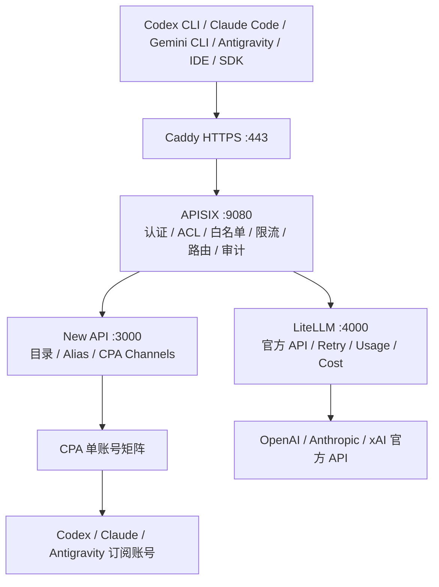

# AI Aggregator Gateway：选型、架构与 Home-Lab 实施

整理日期：2026-10-01。部署状态依据本次会话最后一次节点验证记录，本文写入时未重新连接节点；服务运行与真实模型调用验收分别记录。

本文为 AI Aggregator Gateway 的统一阅读入口，整合 Caddy、Kong/APISIX 选型、多租户、New API、LiteLLM、CPA 矩阵、Google Antigravity / Gemini CLI、Vault 和部署验收。逐步操作见 [CPA OAuth TLDR](./ai-aggregator-cpa-oauth-tldr.zh.md)，历史交付资料见文末关联文档。

## 目标与选型

面向个人和小团队提供统一 AI HTTPS 入口，供 Codex CLI、Claude Code、Google Gemini CLI、Antigravity、Android Studio、SDK 和 Web SaaS 接入。订阅账号与官方 API 是并列上游，通过 APISIX 聚合访问。

| 组件 | 职责 | 运行方式 |
| --- | --- | --- |
| Caddy | TLS 终止、域名绑定、反向代理 | systemd |
| APISIX | 统一认证、IP 白名单、租户 ACL、限流、路由、审计 | Standalone 文件配置、systemd |
| New API | 模型目录、Model Alias、CPA Channel、渠道管理 | systemd、PostgreSQL |
| LiteLLM | 官方 OpenAI / Anthropic / xAI 适配、Retry、Usage、Cost | systemd、独立 PostgreSQL 数据库 |
| CLIProxyAPI / CPA | 单账号 OAuth、协议适配 | 每实例独立用户与 systemd unit |
| Vault | 数据库 DSN、网关密钥、官方 Provider API Key | 运行时注入 |

APISIX 配置由 GitOps YAML/JSON 渲染为 `apisix.yaml`，使用 Standalone，不依赖 etcd，也不使用 PostgreSQL 作为原生配置后端。Kong 已停用并禁用。

### Kong 与 APISIX 的选型对比

本项目选择 APISIX Standalone，主要依据是文件驱动 GitOps、减少网关配置数据库依赖，以及使用开源 `ai-proxy-multi` 探索多模型调度；不是因为 Kong 没有 AI 插件，也不是因为 Kong 必须依赖 etcd。

| 比较项 | Kong | APISIX | 本项目判断 |
| --- | --- | --- | --- |
| 配置后端 | Traditional 使用 PostgreSQL；DB-less 可加载 YAML/JSON | 传统模式通常使用 etcd；Standalone YAML 模式无需 etcd | 当前采用文件声明与部署对账，APISIX Standalone 合适；Kong DB-less 也属于可行替代 |
| PostgreSQL 配置需求 | 原生支持 Traditional 配置存储，通过 Admin API / decK 管理 | 不是原生配置后端 | 若必须使用 PostgreSQL 管理动态网关实体，优先重新评估 Kong |
| 通用网关功能 | 认证、ACL、路由、限流和插件体系 | 认证、Consumer 权限、路由、限流和插件体系 | 两者都可承担网关职责，具体策略要逐项映射验证 |
| AI 代理 | `ai-proxy` 提供 Provider 适配；`ai-proxy-advanced` 提供更高级能力 | `ai-proxy`、`ai-proxy-multi` | 两者均有 AI 能力，不能将“有 AI 插件”作为唯一选择依据 |
| AI 授权边界 | 官方将 `ai-proxy-advanced` 标为 AI License Required；不能将此标签扩大到所有 Kong 功能 | `ai-proxy-multi` 属于 Apache APISIX 开源插件 | 当前个人探索倾向开源多模型插件；Kong 需按具体插件、发行版和版本核对授权 |
| 动态租户维护 | Traditional 可以通过受控 Admin API 更新实体 | 当前 YAML 模式通过渲染和下发完整声明更新 | 当前模式接受声明式对账，不等价于数据库驱动动态控制面 |
| 多节点限流 | 受插件、策略及共享状态配置影响 | 当前 `limit-count` local 策略仅在单节点维护状态 | 横向扩展后必须设计共享配额；配置复制不能实现全局限流 |
| 运维成本 | Traditional 增加网关 DB、migration、备份；DB-less 可减少依赖 | Standalone 减少控制面组件，仍需配置下发、回滚和 Runtime 匹配 | 判断基于本项目依赖数量，不是未测量的性能或内存结论 |

Kong 的部署模式与限制见[官方部署拓扑](https://developer.konghq.com/gateway/deployment-topologies/)；AI 能力和授权分别见 [AI Proxy](https://developer.konghq.com/plugins/ai-proxy/) 与 [AI Proxy Advanced](https://developer.konghq.com/plugins/ai-proxy-advanced/)。APISIX 的模式与多模型能力见[部署模式](https://apisix.apache.org/docs/apisix/deployment-modes/)和 [ai-proxy-multi](https://apisix.apache.org/docs/apisix/plugins/ai-proxy-multi/)。资料核对日期为 2026-10-01。

选型代价也需要保留：APISIX 当前运行在固定的 3.16.0 源码与独立 Runtime 上，插件 schema、依赖和协议能力应以该版本源码及实测为准，不能直接套用最新文档的全部功能。Home-Lab 已遇到 Lua 库、共享字典与 worker 配置权限问题，后续必须固化版本组合和安装过程。

当需要高频动态租户 CRUD、数据库权威控制面、已有 Kong 平台集成或商业支持时，可重新评估 Kong Traditional；当需要 APISIX 动态控制面时，也应评估对应部署模式的额外依赖。两个适配器共享业务契约，但不保证插件、状态与更新语义完全相同。当前不同时运行两套网关承载同一入口。

## 架构与入口



统一内网入口为 `https://ai-internal.onwalk.net`。Caddy 只转发到 APISIX；IP 白名单、身份认证和业务分流由 APISIX 承担。New API 与 LiteLLM 并列，LiteLLM 不作为 CPA 前置代理。

| 路径 | 上游 | 状态与用途 |
| --- | --- | --- |
| `/v1/chat/completions` | New API | CPA OpenAI Chat 兼容入口，真实调用待验收 |
| `/v1/responses` | New API | Codex Responses 入口，真实调用待验收 |
| `/v1/messages` | New API | Claude Messages 入口，真实调用待验收 |
| `/v1/models` | New API | 模型目录 |
| `/litellm/*` | LiteLLM | 当前保留路径，剥离 `/litellm/` 前缀 |
| `/official/v1/chat/completions` | AI 插件或 LiteLLM | 待配置；每条路由只能选择一种承载方式 |
| 管理页面和管理 API | 独立受限路由 | 浏览器认证入口待完善 |

`ai-proxy-multi` 已加载，但官方 Provider Key 尚未注入，官方调用路由尚未完成真实验证。直接由插件调用 Provider 与通过 LiteLLM 调用，需要明确选择，避免重复调度、重试和用量统计。

## 认证与多租户

当前 APISIX 通过 `apikey` 请求头校验网关凭据，隐藏该头后转发；上游 New API 的 `Authorization` 独立保留。APISIX 验证成功不等于 New API 业务授权自动成功。

最终客户端契约需选择：客户端分别提供网关和业务凭据，或由 APISIX 根据租户注入受控上游凭据。该选择应完成后再验收不支持自定义请求头的第三方 APP。

GitOps 保存租户 ID、允许路由、模型范围、限流和启用状态，不保存凭据值。当前只有个人 Consumer 基础配置，完整多租户越权、限流和审计验收尚未完成。

真实 IP 仅信任来自 loopback 上 Caddy 的转发头。APISIX 使用 OpenResty real-IP 配置恢复客户端地址，再执行 IP 白名单；APISIX 和业务后端均不直接公开监听。

管理后台当前也受到 Key Auth 保护，直接用浏览器打开可能返回 `401`。需要独立定义浏览器适用的管理认证流程。

## CPA 账号矩阵和认证存储

| 实例 | Provider | CPA 登录参数 | 账号标识 |
| --- | --- | --- | --- |
| `cpa-codex-01` | Codex | `--codex-device-login` | `manbuzhe2009@qq.com` |
| `cpa-codex-02` | Codex | `--codex-device-login` | `manbuzhe2008@gmail.com` |
| `cpa-claude-01` | Claude | `--claude-login` | `haitaopanhq@gmail.com` |
| `cpa-antigravity-01` | Antigravity | `--antigravity-login` | `haitaopanhq@gmail.com` |
| `cpa-grok-01` | xAI / Grok | `--xai-login` | 尚未部署 |

每个实例拥有独立 Unix 用户、端口、配置、认证目录和 New API Channel。OAuth bundle 仅保存在节点本地加密目录 `/var/lib/ai-aggregator/cpa/<instance-id>/auth/`，权限 `0700`，不进入 Git、Vault、数据库明文、Terraform state、CI artifact 或日志。

独立 CodeAgent CLI 和 CPA 的认证格式不保证相同。聚合服务使用 CPA 自己的登录流程生成认证材料。CPA + CodeAgent 节点由 `ai_desktop` role 提供运行基线，建议 2C4G、最低按实际负载验证 2C2G；Gateway 的容量需要另行压测，不能把 CPA 节点规格当作完整网关容量结论。

### Google：Antigravity / Gemini CLI

Antigravity 与 Gemini CLI 均归 Google 平台，在账号矩阵中按 Google 统一分类，操作上分别记录登录状态。AI Desktop 基线提供 Gemini CLI；当前 Antigravity 仅部署 CPA adapter，尚未安装完整 Antigravity 桌面应用。`cpa-antigravity-01` 的 OAuth 不能自动视为 Gemini CLI 已登录。

Gemini CLI 的独立客户端登录、配置和运行状态归对应节点用户管理；CPA Antigravity 的 OAuth 归该实例加密 auth 目录管理。不得把 `~/.gemini/config/config.json` 当成完整认证材料，也不批量复制 `.gemini/` 到 CPA 或仓库。

如需新增 Gemini CPA 上游，须先核对当前 CPA 构建的 Gemini 登录能力，再增加独立实例、账号声明、私网端口、模型映射和 Channel。当前节点 `--help` 已核对的参数包含 `--antigravity-login`，未确认独立 Gemini 登录参数，不能直接套用。

Gemini CLI 通过统一网关接入需要单独验证客户端支持的 Provider、base URL、认证头和协议。当前已规划的 OpenAI Chat/Responses、Claude Messages 兼容性不自动覆盖 Gemini 原生协议；需要客户端支持相应兼容 Provider，或另行增加经过测试的 Gemini 协议适配。Google 官方 Gemini API 接入属于后续扩展，当前官方 Provider 范围仍为 OpenAI、Anthropic、xAI。

### 四个平台 OAuth 操作 TLDR

| 平台 | 登录入口 | 实例与操作条件 |
| --- | --- | --- |
| OpenAI | CPA `--codex-device-login --no-browser` | 两个 Codex 实例各自执行设备登录，浏览器核对对应邮箱 |
| Anthropic | CPA `--claude-login --no-browser` | Claude 实例，按终端提示完成授权和回调 |
| xAI | CPA `--xai-login --no-browser` | Grok 实例尚未部署，先补 GitOps、用户、配置、加密目录和服务 |
| Google：Antigravity / Gemini CLI | CPA `--antigravity-login --no-browser`；Gemini CLI 使用自身登录流程 | 当前 Google CPA 是 Antigravity adapter；两个工具的登录状态分别验证 |

统一步骤：检查实例用户和加密认证目录 → 交互式登录 → 必要时建立 localhost 回调隧道 → 确认服务运行 → 模型和真实推理验证 → 启用对应 Channel。

人工登录在交互式 SSH 中逐个完成：

逐平台前置检查、回调隧道和登录后验证见 [CPA OAuth 操作 TLDR](./ai-aggregator-cpa-oauth-tldr.zh.md)。当前四个实例包含两个 Codex，Grok 仍需单独部署。

登录命令必须先进入对应实例用户可访问的工作目录；从 root 的 `/root` 目录直接 `runuser` 会导致 CLI 的 `stat .: permission denied`。

```bash
ssh -t root@10.79.0.7

runuser -u cpa-codex-01 -- /opt/ai-aggregator/cliproxyapi \
  --config /run/ai-aggregator/cpa-codex-01.yaml --codex-device-login --no-browser
runuser -u cpa-codex-02 -- /opt/ai-aggregator/cliproxyapi \
  --config /run/ai-aggregator/cpa-codex-02.yaml --codex-device-login --no-browser
runuser -u cpa-claude-01 -- /opt/ai-aggregator/cliproxyapi \
  --config /run/ai-aggregator/cpa-claude-01.yaml --claude-login --no-browser
runuser -u cpa-antigravity-01 -- /opt/ai-aggregator/cliproxyapi \
  --config /run/ai-aggregator/cpa-antigravity-01.yaml --antigravity-login --no-browser
```

Grok 部署后执行以下命令；当前不具备直接执行条件：

```bash
runuser -u cpa-grok-01 -- /opt/ai-aggregator/cliproxyapi \
  --config /run/ai-aggregator/cpa-grok-01.yaml --xai-login --no-browser
```

参数依据当前节点 CPA `--help` 核对。操作者在浏览器确认矩阵账号；设备码及授权链接不发到日志或聊天。需要 localhost 回调时，在 Mac 转发 CLI 实际显示的端口：

```bash
ssh -N -L <port>:127.0.0.1:<port> root@10.79.0.7
```

认证文件存在、服务 active 或模型目录可读均不等于真实推理成功；完成推理测试后再启用对应 Channel。

## Vault 与持久化契约

GitOps 使用以下逻辑路径；KV v2 API 在 `kv/` 后加入 `data/`，例如 `/v1/kv/data/uat/ai-aggregator/database/new-api`。

```text
kv/<env>/ai-aggregator/database/new-api
kv/<env>/ai-aggregator/database/litellm
kv/<env>/ai-aggregator/gateway/caddy
kv/<env>/ai-aggregator/gateway/apisix
kv/<env>/ai-aggregator/gateway/new-api
kv/<env>/ai-aggregator/gateway/litellm
kv/<env>/ai-aggregator/litellm/providers/openai
kv/<env>/ai-aggregator/litellm/providers/anthropic
kv/<env>/ai-aggregator/litellm/providers/xai
```

数据库路径保存 DSN；Gateway 路径保存必要运行密钥及 TLS 引用；Provider 路径保存 endpoint 和 API Key。UAT 与 Prod 分环境授权，服务仅读取自身所需路径。运行时敏感文件放入 `/run/ai-aggregator/`，限制访问权限。

不再使用 `accounts/*`、`instances/*`、`clients/*`、`cpa/*`、`database/backup`。数据库备份凭据沿用现有数据库基础设施契约。

当前 Home-Lab APISIX 仍从历史 `gateway/kong` 读取 bootstrap client key。迁移到 `gateway/apisix` 是待完成项，旧值不应直接写入 GitOps。

## 仓库交接与部署流程

| 项目 | 责任 |
| --- | --- |
| `gateway` | 公共契约、配置渲染、适配器和 AI profiles |
| `gitops` | 环境、节点、域名、矩阵、租户、路由、版本与生命周期 |
| `playbooks` | 安装、systemd、Vault 注入、权限和配置部署 |
| `platform-ops-toolkit` | 校验、部署、验证和环境 promotion |
| `knowledge` | 架构与实施说明 |
| `edge-gateway` | 原 Cloudflare Worker / Web SaaS 功能 |

Ansible 入口为 `deploy_ai_aggregator.yaml`，主要 role 为 `roles/vhosts/ai_aggregator_v1`。CPA 基线使用 `deploy_ai_desktop.yml`。

```text
GitOps validate → stage → Vault 注入 / PostgreSQL 检查
  → CPA / LiteLLM / New API / APISIX 启动
  → Caddy validate / reload
  → 人工 OAuth → 协议 / 真实推理 smoke test → activate 对应 Channel
```

Home-Lab 为当前持久节点部署；AWS/GCP Spot UAT 可由环境声明选择并配置 TTL，不能将历史云端临时环境的生命周期直接套到 Home-Lab。Prod promotion 单独执行。

## 已有证据与验收边界

最后一次节点检查确认 Caddy、APISIX、New API、LiteLLM 和四个 CPA 服务全部 active；Kong disabled，未监听 `8000/8001`。APISIX、New API、LiteLLM 仅监听 `127.0.0.1:9080/3000/4000`。

Caddy validate 与 reload 通过；HTTPS 未授权请求返回 `401`；APISIX 本地白名单地址加 Token 返回 `200`。HTTPS 携带有效 Token 的完整验收尚未完成。当前有效配置仅使用 `ai-internal.onwalk.net`，`direct-ai.onwalk.net` 仅存在于旧备份。

当前 Caddy 使用 Vault 注入的已有证书，自动签发尚未实现。节点 LAN 地址曾变化导致 reload 失败，现已修复；后续应从 inventory 获取地址，避免长期固化 DHCP 地址。

APISIX 修复包括匹配 Runtime Lua 库、让 worker 能读取非敏感配置、启用 Prometheus 依赖共享字典以及配置真实客户端 IP。节点专用脚本需收敛回 Ansible role，确保重新部署可复现。

后续验收按顺序执行：

1. 收敛 GitOps、Ansible role、Vault 路径和文档，验证重启恢复。
2. 四个 CPA 人工登录，逐渠道真实推理并启用。
3. 注入官方 Provider Key，验证 LiteLLM 和选定 AI 插件路由。
4. 验证 OpenAI Chat、Responses、Claude Messages、streaming、工具调用和错误格式。
5. 验证 Codex CLI、Claude Code、Gemini CLI、Antigravity、Android Studio、SDK、Web SaaS 的实际接入；Google 客户端分别记录独立登录与网关协议兼容结果。
6. 验证多租户越权拒绝、限流、审计、单 CPA 故障隔离和并列上游隔离。
7. 验证配置回滚、PostgreSQL 备份恢复；备份排除 OAuth bundle 与运行时密钥。

升级使用固定版本和校验和，先备份非敏感配置与数据库，再在 UAT 验证。回滚同时考虑程序版本、数据库 migration 兼容性和 APISIX 配置；Caddy reload 失败应恢复磁盘配置并确认旧运行配置仍生效。

## 相关文档

- [CPA 人工 OAuth TLDR：OpenAI / Anthropic / xAI / Google](./ai-aggregator-cpa-oauth-tldr.zh.md)：实例检查、逐平台登录、回调隧道、服务恢复和渠道验收。
- [APISIX 目录索引](./README.md)：平台文档导航。
- [Ansible 历史交付基线](../../02-iac-devops/ansible/ai-aggregator-v1-architecture-and-delivery.zh.md)
- [历史架构图](../../02-iac-devops/ansible/ai-aggregator-v1-architecture-diagram.zh.md)
- [Vault 与 GitOps 规格](../../02-iac-devops/ansible/ai-aggregator-vault-and-gitops-specification.zh.md)

上述历史文档含 Kong、双域名或旧状态描述；当前 Home-Lab 选型以本文为准，具体部署仍以当前 GitOps 和节点实测为准。
