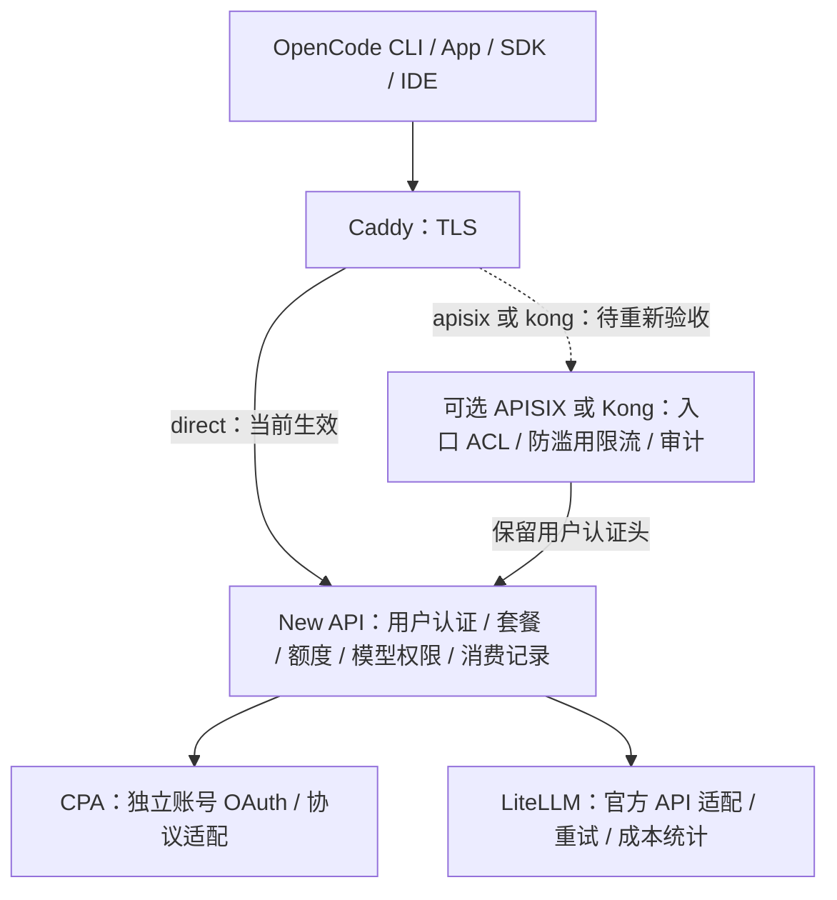

# AI Gateway 统一入口：设计、Home-Lab 状态与实施任务

更新日期：2026-10-04（Asia/Shanghai）。本次通过 SSH 核实 Home-Lab 生效配置与 systemd 状态；未执行网关切换或真实模型推理。

本文是当前入口与认证设计的事实源。历史架构中的双凭据、APISIX 注入共享 New API Token、多个业务域名和 APISIX 直接分流 LiteLLM，不作为当前实施契约。

## 1. 目标与最终职责

客户端只配置一个 HTTPS 端点、一个 New API 用户 API Key 和标准模型名。用户、套餐、额度、模型权限和消费记录由 New API 统一管理；订阅账号接入 CPA，官方 API 接入 LiteLLM。



| 组件 | 负责 | 边界 |
| --- | --- | --- |
| Caddy | HTTPS、证书加载与续期衔接、反向代理 | 无模型调度、无用户额度账本 |
| APISIX / Kong | Host/Path ACL、来源 IP 防滥用限流、请求 ID、审计 | 用户 Key 透传；当前不维护第二套 Key Auth 目录 |
| New API | 用户认证、分组/套餐、额度、模型权限、渠道选择、消费记录、Web Console | 用户额度的唯一权威账本 |
| CPA | 订阅账号 OAuth、上游协议适配 | 一实例一账号；账号订阅额度仍受 Provider 限制 |
| LiteLLM | 官方 Provider 适配、重试、超时、上游用量与成本统计 | 不建立另一套面向用户的套餐或钱包扣款链路 |

网关的“认证职责”是可扩展能力边界。当前最小配置将用户认证委托给 New API；只有需要网关识别租户时才设计统一认证扩展，不能宣称当前网关已完成租户身份校验。

## 2. Home-Lab 当前实测状态

节点 `10.79.0.7`，主机名 `xworkmate-bridge.svc.plus`；入口 `https://ai-internal.onwalk.net`，需内网/VPN 路由可达。

| 服务 | 本次状态 | 说明 |
| --- | --- | --- |
| Caddy | active / enabled | 生效片段 `/etc/caddy/conf.d/ai-aggregator.caddy` |
| New API | active / enabled | `/api/status` 本地 HTTP 200 |
| LiteLLM | active / enabled | 服务状态通过；官方推理未在本次验证 |
| APISIX | inactive / disabled | 不在当前流量链路中 |
| Kong | inactive / disabled | 不在当前流量链路中 |
| cpa-codex-01 | active / enabled | 运行状态不代表账号推理成功 |
| cpa-codex-02 | active / enabled | 同上 |
| cpa-claude-01 | active / enabled | 同上 |
| cpa-antigravity-01 | active / enabled | Google Antigravity adapter；不等同于 Gemini CLI 登录格式 |

当前生效的入口片段：

```caddyfile
ai-internal.onwalk.net {
    bind 10.79.0.7
    tls /run/ai-aggregator/tls/fullchain.pem /run/ai-aggregator/tls/privkey.pem
    reverse_proxy 127.0.0.1:3000 {
        flush_interval -1
    }
}
```

当前证书由运行时文件提供，不能将该配置描述为 Caddy 已自主完成自动签发。证书续期、Vault 注入、权限、重启恢复应作为独立验收项。

沿用此前监听布局：New API `127.0.0.1:3000`，LiteLLM `127.0.0.1:4000`，CPA `8317–8320`；本次核实服务状态，下一次切换前须重新检查所有监听地址。

## 3. 单 Key 认证契约

```text
AI_GATEWAY_CLIENT_KEY = 当前用户的 New API 用户 API Key
```

这是客户端变量名，不是全局共享身份，也不是 APISIX bootstrap key。每个用户或客户端按需要签发独立、可撤销、有限权限的 New API Token。

```text
Authorization: Bearer <New API 用户 Key>
  → Caddy 原样转发
  → 可选 APISIX/Kong 原样转发
  → New API 校验 Token、用户状态、模型权限与可用额度
```

OpenAI 客户端使用 `/v1` Base URL；Anthropic 客户端使用根 URL 并请求 `/v1/messages`，携带 `x-api-key` 和 `anthropic-version`。网关保留相应请求头，不擅自删除或替换它们；Anthropic 的运行兼容性需单独验收。

不为 `Authorization` 配置普通 `key-auth` 的重复校验：这会引入网关凭据同步，还可能把整个 `Bearer ...` 字符串当作 Key。也不向所有请求注入一个共享 New API 用户 Key，否则所有用户额度和审计归属都会合并。

网关不信任客户端自行填写的 `X-Tenant-ID`、`X-Consumer-*`。需要可信租户元数据时，由受信任的认证组件生成；本阶段用户身份以 New API 校验结果为准。

## 4. 三种可切换部署模式

| mode | 链路 | 配置后端 | 当前验收 |
| --- | --- | --- | --- |
| direct | Caddy → New API | 现有 Ansible/GitOps | Home-Lab 当前生效，服务与健康接口通过 |
| apisix | Caddy → APISIX → New API | Standalone YAML，免 etcd | 待按本契约重新渲染及验收 |
| kong | Caddy → Kong → New API | Traditional PostgreSQL，经 Admin API/decK 管理 | 待按本契约重新渲染及验收 |

三种模式都保持同一端点、用户 Key、路径和模型名。一次只启用一个入口治理网关；网关管理端口不对公网或 VPN 客户端开放。APISIX 不使用 PostgreSQL 作为原生配置后端，Kong 不直接通过 SQL 修改内部配置表。

声明契约示例（设计字段，尚不保证现有 role 已全部消费）：

```yaml
entrypoint:
  domain: ai-internal.onwalk.net
  bind_address: 10.79.0.7
gateway:
  mode: direct # direct | apisix | kong
  authentication: new_api_passthrough
  enabled_plugins: [] # 根据选定适配器渲染最小插件集
new_api:
  bind_address: 127.0.0.1
  port: 3000
  authoritative_user_ledger: true
```

## 5. APISIX / Kong 最小插件策略

| 能力 | APISIX 候选 | Kong 候选 | 要求 |
| --- | --- | --- | --- |
| 来源 ACL | ip-restriction + 路由 Host/Path | ip-restriction + Routes | CIDR 来自 GitOps；不能将 IP 白名单称为用户租户 ACL |
| 请求频率 | limit-count 或 limit-req | rate-limiting | 先选择一种频率控制；单节点本地计数不等于全局配额 |
| 并发限制 | limit-conn（按需） | 按安装版本和插件能力另行确认 | 不假设两适配器等价 |
| 请求关联 | request-id | correlation-id | 不含用户 Key；处理客户端伪造 ID 的策略须固定 |
| 审计 | 接入现有日志采集 | 接入现有日志采集 | 仅状态码、路径、耗时、上游等；过滤 query/headers 中的敏感值 |
| 监控 | prometheus（已有采集需要时） | prometheus（已有采集需要时） | 仅内网抓取；不为精简关闭已有必要监控 |

认证头透传不需要额外转换插件。业务路由不启用 `ai-proxy-multi`、AI 请求改写、body 转换、重复 Key Auth 或调试插件。按插件依赖确定实际加载集合，不能只删除所有不在上表中的模块而忽略依赖。

Lua 优化重点：避免请求阶段同步读取 Vault/数据库；避免完整正文读取、重复 JSON 解码与重写；复用上游连接；保持 SSE 不缓存；审计批量异步采集。worker 数、共享字典、连接池和超时按节点资源与并发测量调整，不凭插件数量承诺性能提升。

真实 IP 只接受来自 Caddy 的可信代理头。限流同时检查伪造 `X-Forwarded-For` 不能改变计数身份；APISIX/Kong 仅监听 loopback，跨节点时使用受控私网和必要的 TLS。

## 6. 密钥、配置与数据归属

- GitOps：域名、mode、节点、端口、CIDR、路由、插件开关、secret_ref；不含 Key。
- Vault：DB DSN、服务端 session/crypto secret、Provider API Key、必要的网关管理凭据。已废弃的 bootstrap client key 不参与客户端认证。
- New API 数据库：用户、套餐、额度、Token 业务状态、渠道和消费记录；Token 的实际存储方式以部署版本为准，不能未经核实宣称仅保存哈希。
- OpenCode：通过 `opencode auth login ai-internal` 或 App 本地凭据界面登记用户 Key；配置文件只保存端点、Provider 和模型。
- CPA：本地受限 OAuth 目录；不复制到文档、Git、日志或 CI artifact。加密磁盘是否已配置需另行确认。

OpenCode 凭据存储的文件/数据库位置与安全属性需要按本机版本确认。文件权限 `0600` 是访问控制，不是加密；不能把文件凭据存储描述成 macOS Keychain。Shell 中的临时变量也不是加密凭据存储。

## 7. New API 额度与上游边界

New API 用户额度与 Provider 订阅可用额度是两个独立约束。用户钱包预扣费失败，应检查该用户、Token、套餐/分组、模型定价、预扣 Token 数量和请求输出上限；Provider 还有额度不代表 New API 必须放行。

不通过切换网关或注入共享高额度 Key 绕过用户账本。订阅渠道可按业务要求设置合理价格和套餐政策，但修改前备份配置，修改后验证消费记录与用户隔离。LiteLLM 的上游成本统计用于核对，不产生第二笔用户扣款。

## 8. 验证流程与判定

先验证 direct，再验证 apisix，最后验证 kong；每种模式复用同一有效 New API 用户 Key。切换前保留已验证的 Caddy 片段与配置校验结果。

```bash
dig +short ai-internal.onwalk.net
ssh root@10.79.0.7 'systemctl is-active caddy ai-aggregator-new-api ai-aggregator-litellm'
curl --noproxy '*' --connect-timeout 5 --max-time 15 \
  --fail-with-body https://ai-internal.onwalk.net/api/status
```

在本机 zsh 隐藏输入用户 Key，再测试目录。不要使用 curl `-v` 或 shell `set -x`：

```zsh
read -r -s 'AI_GATEWAY_CLIENT_KEY?New API user key: '
printf '\n'
export AI_GATEWAY_CLIENT_KEY
curl --noproxy '*' --http1.1 --fail-with-body --max-time 30 \
  -H "Authorization: Bearer ${AI_GATEWAY_CLIENT_KEY}" \
  https://ai-internal.onwalk.net/v1/models
unset AI_GATEWAY_CLIENT_KEY
```

以上交互命令避免将 Key 字面量写入历史，但 curl 认证头仍可能短暂出现在进程参数中。严格场景使用 SDK 从受限凭据源读取，或通过 curl stdin 配置传递认证头。

```bash
opencode auth list
opencode models
opencode run --model ai-internal/gpt-5.6-luna 'Reply exactly: hello'
```

`opencode models` 是客户端配置目录，不代表远端已验证模型目录。分别检查 `/v1/models`、Chat、Responses、Messages；每种协议补充 SSE、工具调用、错误格式、取消与超时验证。图像模型使用其支持的图像接口，不用 Chat hello 成败判定全部能力。

| 结果 | 判定与下一步 |
| --- | --- |
| 首页或 `/api/status` 200 | Web/健康链路通过，不证明推理成功 |
| 未认证 `/v1/models` 401 | 用户认证正常拒绝 |
| 有效 Key `/v1/models` 200 | Token 与目录访问通过，仍需推理 |
| Invalid token | 核对 New API 用户 Key、启用/过期状态及 OpenCode Provider 凭据 |
| 预扣费额度不足 | 检查 New API 用户账本与定价，不归因于 CPA OAuth |
| auth_unavailable / Provider 401 | 检查对应 CPA 的账号和 OAuth 状态 |
| 429 | 区分网关频率限制、New API 限制与 Provider 配额 |
| 502/504/空响应 | 分层检查 Caddy、所选网关、New API 与上游，关联请求 ID |

逐模式测试有效、缺失和无效 Key，确认额度归属仍是同一用户。入口插件不能吞掉 New API 的认证错误、改写为成功或绕过权限。记录总耗时、首 Token 耗时、p50/p95、CPU/内存和并发；性能对比使用相同请求及上游，并单列网关额外延迟。

## 9. 项目任务与发布闭环

| 阶段 | 任务 | 完成条件 | 当前状态 |
| --- | --- | --- | --- |
| D0 | 固定 direct 基线 | 生效 Caddy 路由、服务状态、健康接口可核验 | 本次通过；推理待复测 |
| D1 | 用户 Key 与 OpenCode 修复 | CLI 和 App 新会话最小请求成功 | 未验收；此前 Invalid token |
| D2 | 用户与渠道测试 | 有效/失效 Key、额度归属、CPA/官方路由分别通过 | 待执行 |
| G1 | GitOps 定义三种 mode | schema 校验、单选约束、无敏感值 | 待核对/实施 |
| G2 | playbooks 适配 | direct/APISIX/Kong 均透传认证头，独立最小插件集 | 待核对/实施 |
| G3 | 网关 UAT 切换 | 候选配置校验、端口探测、协议与限流测试通过 | 待执行 |
| O1 | 审计与性能验证 | 无凭据日志泄漏、SSE 正常、可比较的延迟数据 | 待执行 |
| R1 | 发布与回滚 | PR → main → 固定版本 → 部署 → 运行验收 | 本文仅更新文档 |

仓库边界：公共 gateway 组件定义契约与适配器；gitops 选择环境与 mode；playbooks 安装服务及渲染配置；platform-ops-toolkit 执行校验/部署；knowledge 保存设计与验收记录。

切换流程：准备候选网关并检查 loopback 健康 → 校验候选配置 → 校验 Caddy → reload → 目录与最小推理 → 协议验收。失败时恢复已验证的 direct 片段，校验并 reload；停止候选网关。Kong 数据库 migration 和版本回滚单独评估，不把 Caddy 回滚等同于数据库回滚。

New API Web Console、静态资源、登录与会话 API 单独验收，不给浏览器管理页强加 SDK Key Auth。入口保持 VPN 可达边界，New API 继续执行登录和角色权限。

## 10. 关联资料与历史状态

- [选型、架构与 Home-Lab 实施（历史架构及 CPA 操作）](./ai-aggregator-gateway-architecture.zh.md)
- [对接与验证 TLDR（历史测试；认证部分以本文为准）](./ai-aggregator-client-acceptance-tldr.zh.md)
- [CPA OAuth 操作 TLDR](./ai-aggregator-cpa-oauth-tldr.zh.md)
- [OpenCode CLI 与 App 接入记录](../../00-global/essays/ai-aggregator-gateway/06-opencode-cli-and-desktop-integration.zh.md)

历史脚本 `scripts/ai-gateway-internal-verify.sh` 默认读取 APISIX 运行时 client-key，同时发送 apikey/Bearer；当前 direct 模式不得沿用这个默认凭据来源。后续脚本修订应以用户 Key 显式输入和本文件的认证契约为准，本次未修改脚本。
