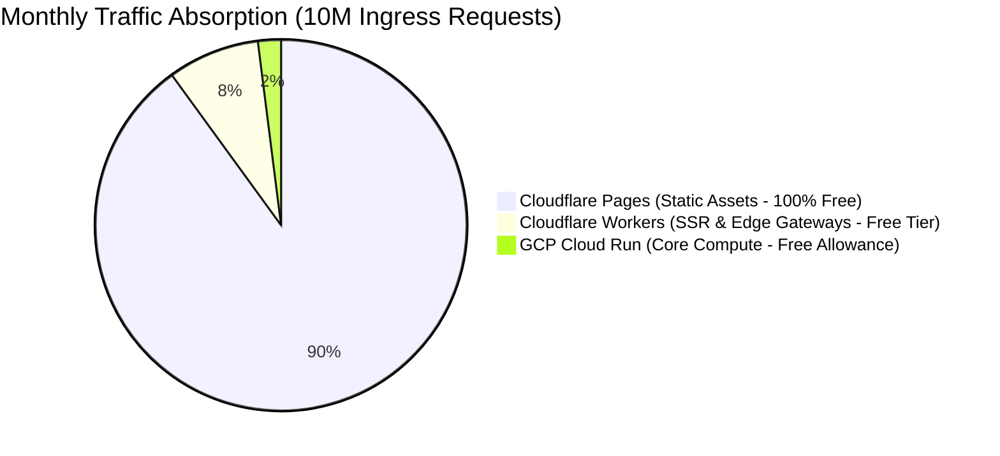

# How to Leverage Free SaaS to Launch Online Services: Full-Stack Architecture from Self-Hosted to Serverless and Hybrid Edge Scheduling

> **Author**: Architecture & Full-Stack Engineering Practice Group  
> **Target Audience**: Indie Hackers, Solopreneurs, Technical Co-founders, Cloud-Native Architects

---

## 1. Architectural Evolution: The Three Eras of Indie Infrastructure

For solo developers, technical founders, and early-stage engineering teams, choosing an infrastructure baseline often swings between two extreme orthodoxies: the fragile, single-node monolith ($5 VPS) versus the complex, unconstrained cloud-native serverless setup (AWS Lambda + DynamoDB).

```
[Traditional Monolith / VPS]              [Full-Blown Pure Serverless]
  (Single $5 DigitalOcean Box)              (AWS Lambda + API GW + DynamoDB)
- Pros: Simple mental model, flat pricing  - Pros: Auto-scaling, zero ops
- Cons: Single point of failure, no CDN    - Cons: Cold starts, bill shock, lock-in
                         \                /
                          \              /
                 [Pragmatic Hybrid Scheduling]
         (Edge Workers + Serverless Containers + Free Cloud DB)
         - Radical Cost Efficiency: Squeezing $0-$20/mo out of generous Free Tiers
         - Global Performance: Millisecond Edge SSR + dynamic fallback compute
         - Built-in Resilience: Multi-level circuit breaking and failover routing
```

### 1.1 Era 1: The Single-Node Self-Host Trap
- **Single Point of Failure (SPOF)**: A kernel panic, hardware fault, or hypervisor reboot brings your entire business down.
- **Cross-Border Latency Penalties**: Users across the globe suffer 200ms~400ms round-trip times when connecting to a single datacenter.
- **DDoS Vulnerability**: Moderate scanning attacks or small-scale volumetric DDoS can easily saturate a single VPS interface.

### 1.2 Era 2: The Pure Serverless Mirage
- **Cold Start Storms**: Sudden traffic spikes trigger dozens of container/V8 isolate cold boots, degrading p99 latencies into multiple seconds.
- **Database Connection Collapse**: Highly concurrent ephemeral Lambdas instantly exceed traditional relational database connection limits (`max_connections`).
- **Billing Shock**: Unprotected endpoints scraped by aggressive botnets can generate thousands of dollars in surprise invocations.

### 1.3 Era 3: Edge-First + Serverless + Free SaaS Hybrid Scheduling
By strategically chaining modern free tiers with edge routing, we can establish an **Anycast-accelerated, self-healing, zero-idle-cost architecture capable of serving millions of requests for $0 to $5 per month**:
- **Edge Layer (Cloudflare Edge)**: Absorbs $>90\%$ of static assets and read traffic, executing edge SSR and lightweight auth at the edge.
- **Elastic Compute (GCP Cloud Run)**: Executes core business logic in stateless containers with scale-to-zero economics.
- **Stateful Core (Supabase Cloud PostgreSQL)**: Managed PostgreSQL 15+ backed by Supavisor connection pooling for burst capacity.
- **Hybrid Ingress Dispatcher (Gateway Failover)**: Dynamically steers traffic between low-cost primary VPS nodes and cloud serverless fallbacks.

### 1.4 Architectural Archetypes Comparison

```
┌─────────────────────────┬─────────────────────────┬─────────────────────────┐
│      Self-Host VPS      │     Pure Serverless     │ Hybrid Edge & Free SaaS │
├─────────────────────────┼─────────────────────────┼─────────────────────────┤
│ 1. Ingress Layer        │ 1. Ingress Layer        │ 1. Edge Ingress & Route │
│    - Direct IP / Nginx  │    - API Gateway costs  │    - Cloudflare Edge    │
│    - No Global CDN      │      per-request        │      absorbs 90% traffic│
│    - Volumetric risk    │    - Scraper cost risks │    - 5 Edge SSR Workers │
├─────────────────────────┼─────────────────────────┼─────────────────────────┤
│ 2. Compute Layer        │ 2. Compute Layer        │ 2. Elastic & Failover   │
│    - Monolith on 1 VPS  │    - Fragmented FaaS    │    - GCP Cloud Run      │
│    - Single point (SPOF)│    - Cold start latency │      Scale-to-Zero      │
│                         │    - High concurrency $ │    - Primary-to-Cloud   │
│                         │                         │      failover routing   │
├─────────────────────────┼─────────────────────────┼─────────────────────────┤
│ 3. Database Layer       │ 3. Database Layer       │ 3. Managed DB & Pooling │
│    - Local Postgres disk│    - Direct connections │    - Supabase Postgres  │
│    - Manual maintenance │      exhaust pool limits│    - Supavisor txn pool │
├─────────────────────────┼─────────────────────────┼─────────────────────────┤
│ 💡 BEST FOR             │ 💡 BEST FOR             │ 💡 BEST FOR             │
│    - Fixed $5 budget dev│    - Event-driven burst │    - $0–$5/mo bootstrap │
│    - Toy / Internal POC │    - Enterprise budgets │    - Global low-latency │
│    - Single-region apps │    - Zero-ops preference│    - Indie Hackers SaaS │
└─────────────────────────┴─────────────────────────┴─────────────────────────┘
```

---

## 2. System Topology & Cloud-Native Asset Catalog

### 2.1 Complete Architectural Blueprint

```
                           [ Global Ingress Traffic ]
                                       │
                                       ▼
                 ┌───────────────────────────────────────────┐
                 │             Cloudflare Edge               │
                 │   - Anycast DNS + WAF + DDoS Mitigation   │
                 │   - SSL/TLS Termination & Global Caching  │
                 └─────────────────────┬─────────────────────┘
                                       │
                                       ▼
                 ┌───────────────────────────────────────────┐
                 │         Frontend Router (Worker)          │
                 │   (Dynamic Ingress / A-B Testing / Proxy) │
                 └───────────┬───────────────────┬───────────┘
                             │                   │
            ┌────────────────┴─────┐        ┌────┴─────────────────┐
            ▼                      ▼        ▼                      ▼
┌────────────────────────┐ ┌──────────────┐ ┌───────────────────────────┐
│ 5 Domain SSR Workers   │ │ Pages Assets │ │ 3 Edge Gateway Workers    │
│ - public   (Landing)   │ │ (Next/SPA)   │ │ - auth  (/api/auth/*)     │
│ - content  (Docs/Blog) │ │ /_next/*     │ │ - admin (/api/admin/*)    │
│ - auth     (SSO/Login) │ │ /static/*    │ │ - core  (/api/*)          │
│ - console  (Dashboard) │ └──────────────┘ └─────────────┬─────────────┘
│ - workspace(App Canvas)│                                │
└────────────────────────┘                                │ (Failover Routing)
                                                          ▼
                                            ┌───────────────────────────┐
                                            │       GCP Cloud Run       │
                                            │  - accounts microservice  │
                                            │  - content-service        │
                                            │  - billing-service        │
                                            └─────────────┬─────────────┘
                                                          │
                                                          ▼
                                            ┌───────────────────────────┐
                                            │ ★ Supabase Cloud DB       │
                                            │  - PostgreSQL 15+         │
                                            │  - Supavisor Conn Pooler  │
                                            └───────────────────────────┘
```

### 2.2 Cloud Assets and Resource Direct Mapping

| Component Tier | Service / Identifier | Environment Coverage | Routing & Ingress Mapping |
| :--- | :--- | :--- | :--- |
| **Edge & DNS** | Cloudflare Zone (`onwalk.net` / `svc.plus`) | SIT / UAT / PROD | Anycast DNS, Edge SSL, WAF Threat Defense |
| **Frontend Router** | `frontend-router-{env}` | SIT / UAT / PROD | Attached to `console-{env}.onwalk.net` / `console.svc.plus` |
| **5 SSR Workers** | `public` / `content` / `auth` / `console` / `workspace` | Independent Worker Boundaries | Route dispatching (`/*`, `/blogs*`, `/login*`, `/panel*`, `/ai-workspace*`) |
| **Pages Static Build** | `ai-workspace-portal-{env}.pages.dev` | SIT / UAT / PROD | Static prefixes `/_next/*`, `/static/*`, `/assets/*` |
| **3 Gateway Workers** | `edge-gateway-auth` / `admin` / `core` | API Ingress Perimeter | Mounted on `accounts-{env}.onwalk.net`, with Primary-Fallback failover |
| **Elastic Compute** | `accounts` / `content-service` / `billing-service` | GCP Project: `xworktech` (`asia-northeast1`) | Stateless Docker containers with Scale-to-Zero |
| **Core Database** | PostgreSQL 15+ & Supavisor Pooler | Project: `iqkxspmhcfqmhkbjdoms` | Transaction-mode connection pooling on port 6543 |

---

## 3. Economics & Capacity Modeling: Serving 10 Million Requests for $0–$5/mo

### 3.1 Free Tier Allocation Matrix



| Cloud Provider / SaaS | Free Tier Allocation | Estimated Production Value | Engineering Strategy & Constraints |
| :--- | :--- | :--- | :--- |
| **Cloudflare Workers** | 100,000 requests/day | ~3,000,000 invocations/mo | Edge HTML caching minimizes raw Worker invocations |
| **Cloudflare Pages** | **Unlimited Bandwidth & Invocations** | Huge bandwidth cost savings | Route 100% of static chunks (`/_next/*`, `/assets/*`) to Pages |
| **GCP Cloud Run** | 2,000,000 reqs/mo + 360,000 GB-sec compute | Covers typical microservice API needs | Set `min-instances: 0`, single container concurrency = 80 |
| **Supabase** | 500MB DB, 50,000 MAU, 5GB storage | Full Postgres + Auth + Pooler | Enable Supavisor; stream blobs/media to Cloudflare R2 |
| **Cloudflare R2** | 10GB storage/mo, 10M Class B reads | Zero egress fee S3 alternative | Object storage for user uploads & CI/CD artifacts |
| **VictoriaMetrics** | Single-binary self-hosted instance | Ingests thousands of metrics/sec | Ultra-compact footprint (<80MB RAM required) |

### 3.2 Real-World Traffic Capacity Calculus (10M Hits Breakdown)

Consider an online SaaS processing **10,000,000 requests/month (10M requests)**:
1. **9,000,000 requests (90%)** target JS/CSS bundles, static icons, and cached marketing pages:
   - Handled directly by **Cloudflare Pages & Edge Cache**.
   - **Cost: $0.00**.
2. **800,000 requests (8%)** hit the 5 SSR Workers and 3 Edge Gateway Workers:
   - Consumes ~26,000 invocations/day (well within the 100,000/day free limit).
   - **Cost: $0.00** (or $5.00/mo if upgrading to Workers Paid for uncapped CPU).
3. **200,000 requests (2%)** reach core API microservices (authentication, mutations, billing):
   - Handled by **GCP Cloud Run** (consuming only 10% of the 2M free invocation quota; compute vCPU-sec and GiB-sec remain well within free thresholds).
   - **Cost: Effectively ~$0.00** (To be technically rigorous, minor peripheral items like cross-region outbound egress beyond 1GB, Artifact Registry image storage, or Secret Manager API calls may incur trivial marginal costs, typically **$0.10 to $1.00/mo**).
4. **Database Workload**:
   - 200,000 queries pooled through Supavisor maintain 10–20 active Postgres connections with $<100\text{MB}$ memory consumption.
   - **Cost: $0.00**.

**Total Monthly Operational Cost**: **$0.00 to $5.00 USD** (even accounting for minor outbound egress and optional Worker Paid features), effortlessly supporting tens of thousands of Monthly Active Users (MAU).

---

## 4. Multi-Environment GitOps & Delivery Pipeline (SIT / UAT / PROD)

High availability requires strict environment isolation without duplicating your infrastructure bills.

```
Git Push -> CI Pipeline (GitHub Actions)
  ├── Branch 'dev'   ──> Deploy to SIT  (Wrangler: -e sit, Cloud Run tag: sit)
  ├── Branch 'stage' ──> Deploy to UAT  (Wrangler: -e uat, Cloud Run tag: uat)
  └── Branch 'main'  ──> Deploy to PROD (Wrangler: -e prod, Cloud Run tag: prod)
```

### 4.1 Cloudflare Worker Environment Declarations
Defined declaratively in `wrangler.toml`:
```toml
name = "frontend-router"
main = "src/index.ts"
compatibility_date = "2026-08-01"

[env.sit]
name = "frontend-router-sit"
routes = [
  { pattern = "console-sit.onwalk.net/*", zone_name = "onwalk.net" }
]
[env.sit.vars]
ENVIRONMENT = "sit"
API_GATEWAY_URL = "https://accounts-sit.onwalk.net"

[env.prod]
name = "frontend-router-prod"
routes = [
  { pattern = "console.svc.plus/*", zone_name = "svc.plus" }
]
[env.prod.vars]
ENVIRONMENT = "prod"
API_GATEWAY_URL = "https://accounts.svc.plus"
```

### 4.2 Cloud Run Zero-Cost Environment Tagging
Instead of provisioning separate Cloud Run clusters, utilize **Traffic Tagging**:
- Inside `accounts-service`:
  - Revision `accounts-v12-sit` $\rightarrow$ Assigned tag `sit` (`https://sit---accounts-xxx.a.run.app`)
  - Revision `accounts-v11-prod` $\rightarrow$ Receives 100% production traffic.

### 4.3 Supabase Database Multi-Environment Strategy
- **Bootstrap Phase**: Utilize PostgreSQL schema isolation (`sit_schema`, `uat_schema`, `public`) inside a single free Supabase instance.
- **Production Scaling Phase**: Fork PROD to a dedicated database instance while keeping SIT/UAT on a shared development sandbox.

---

## 5. Full-Stack Observability & Zero-Cost Telemetry (VictoriaMetrics + Grafana)

Serverless architecture turns dangerous when it behaves as an unobservable black box. We deploy a unified, low-overhead telemetry pipeline:

### 5.1 Data Pipeline Architecture

```
[Cloudflare Edge]  ──> (Logpush / Analytics API) ──┐
[GCP Cloud Run]    ──> (OTel / Cloud Monitoring) ──┼──> [ Vector Collector Agent ]
[Supabase DB]      ──> (postgres_exporter)       ──┤          │
[Blackbox Prober]  ──> (Synthetic HTTPS Probes)  ──┘          ▼
                                                ┌───────────────────────────┐
                                                │ VictoriaMetrics (TSDB)    │
                                                │ VictoriaLogs    (Logs)    │
                                                └─────────────┬─────────────┘
                                                              ▼
                                                ┌───────────────────────────┐
                                                │     Grafana Dashboard     │
                                                │ (serverless-fullstack-..) │
                                                └───────────────────────────┘
```

### 5.2 Unified Grafana Dashboard Specifications

**Dashboard UID**: `serverless-fullstack-architecture`  
**Templating Variables**:
- `$env`: Environment switcher (`sit`, `uat`, `prod`, `All`)
- `$DS_METRICS` / `$DS_LOGS`: Primary metric and log data sources
- `$ssr_worker`: `public`, `content`, `auth`, `console`, `workspace`
- `$gateway_worker`: `auth`, `admin`, `core`
- `$cloudrun_service`: `accounts`, `content-service`, `billing-service`
- `$database`: `postgres`, `accounts`, `billing`

#### The 8 Golden Observability Pillars

```
┌────────────────────────────────────────────────────────────────────────┐
│ 1. Full-Stack Architecture Pulse                                       │
│ [ Synthetic SLA: 99.99% ] [ Edge QPS: 340 req/s ] [ Worker CPU: 3.2ms ]│
│ [ Gateway Failover: 0.0% ] [ Active Containers: 2 ] [ Pool Sat: 14% ]  │
├──────────────────────────────────┬─────────────────────────────────────┤
│ 2. DNS & Edge Ingress Analytics  │ 3. Blackbox Probes & SSL Health     │
│ - Query rates & response codes   │ - Domain probe matrix (console/acc) │
│ - HTTP status breakdown (2xx..5x)│ - SSL expiry countdown (<15d / <7d) │
│ - Edge Cache Hit Ratio & Savings │ - Latency waterfall (DNS/TLS/TTFB)  │
├──────────────────────────────────┼─────────────────────────────────────┤
│ 4. 5 Domain SSR Workers Health   │ 5. 3 Edge Gateways & Failover State │
│ - Ingress QPS & CPU percentiles  │ - API prefix traffic distributions  │
│ - Subrequest counts (KV/DB/Ext)  │ - JWT verification latency (p95 ms) │
│ - Unhandled exceptions & 5xx     │ - 401/403 block rate & Fallback reqs│
├──────────────────────────────────┼─────────────────────────────────────┤
│ 6. GCP Cloud Run Compute         │ 7. ★ Supabase Deep DB Analytics     │
│ - Request volume & p95 latency   │ - Active, idle, idle-in-txn conns   │
│ - Active instances & cold starts │ - Supavisor queue depth & pool sat. │
│ - Container CPU & Memory usage   │ - Cache hit ratio (>99%) & slow SQL │
├──────────────────────────────────┴─────────────────────────────────────┤
│ 8. VictoriaLogs Unified Log Stream Drilldown                           │
│ [ Error Sources ] cloudflare: 2 | cloud_run: 0 | supabase: 0            │
│ [ Slow Query Log ] SELECT * FROM workspace_nodes WHERE ... (523ms)      │
└────────────────────────────────────────────────────────────────────────┘
```

1. **Architecture Pulse**:
   - **Global SLA**: `avg(probe_success{env=~"$env"}) * 100` tracks live service availability.
   - **Gateway Failover Ratio**: Detects when primary compute drops traffic and falls back to Cloud Run.
2. **DNS & Edge Ingress**:
   - Real-time DNS resolution health, HTTP status distribution, and edge bandwidth caching efficiency.
3. **Endpoint Synthetic Probes & SSL Expiry**:
   - Automated certificate expiration countdown ($<15$ days warning, $<7$ days critical).
   - Multi-phase latency waterfall (DNS resolution $\rightarrow$ TCP connection $\rightarrow$ TLS handshake $\rightarrow$ TTFB).
4. **5 Domain SSR Workers Performance**:
   - Evaluates CPU duration (p50/p95/p99) across `public`, `content`, `auth`, `console`, and `workspace`.
5. **3 Edge Gateways (Auth / Admin / Core)**:
   - JWT validation latency (target $<5\text{ms}$), 401/403 authorization rejection rates, and failover trigger counters.
6. **GCP Cloud Run Container Performance**:
   - Active instances, cold-start frequency, and CPU/Memory utilization ceilings.
7. **★ Supabase Cloud DB / PostgreSQL Deep Metrics (Critical State)**:
   - **Connection Pool Saturation**: Active versus `idle in transaction` connections, Supavisor client queue depth.
   - **Shared Buffer Cache Hit Ratio**: Enforce $>99\%$; alert immediately if dipping below $95\%$.
   - **Dead Tuples & Autovacuum**: Track `n_dead_tup` table bloat and vacuum execution frequency.
8. **Unified VictoriaLogs Log Streaming**:
   - Correlates errors across Cloudflare Edge, Cloud Run containers, and PostgreSQL engine in a single pane of glass.

---

## 6. Production Pitfalls & Hard Architecture Trade-offs

| Threat / Operational Bottleneck | Anti-Pattern (What breaks) | Production Solution (The Right Way) |
| :--- | :--- | :--- |
| **Connection Exhaustion Storm** | Ephemeral serverless containers connecting directly to Postgres port 5432 | Force all client queries through **Supavisor Transaction Pooler (Port 6543)** |
| **Edge Worker CPU Budget Ceiling** | Executing heavy cryptography or image processing in Workers | Offload heavy computation to Cloud Run; use Workers solely for streaming |
| **Cloud Run Cold Start Lag** | Large, unoptimized container images (>500MB) causing 8s startup delays | Build minimal Docker images (Scratch/Alpine, <50MB); set container concurrency to 80 |
| **Vendor Lock-in Risk** | Hardcoding logic to proprietary cloud BaaS primitives | Use standard SQL migrations and automate daily `pg_dump` backups to Cloudflare R2 |
| **Runaway Billing Spikes** | Exposing raw APIs to internet scrapers without rate limits | Deploy Cloudflare WAF rate limiting + Edge Gateway pre-authentication |

### 6.1 Key Operational Insights
1. **Transaction Pooler vs Session Pooler**:
   - Always run Supavisor in **Transaction Mode** for serverless workloads. Connections are recycled immediately after each query or transaction completes, allowing thousands of ephemeral clients to share 10–20 physical connections. Avoid session-level features like `LISTEN/NOTIFY` in transaction mode.
2. **Edge Worker Execution Limits**:
   - The free Cloudflare Worker tier enforces a 10ms CPU limit. Keep edge handlers lightweight; push data-heavy aggregation or high-iteration hashing down to Cloud Run.
3. **Automated Disaster Recovery**:
   - Never rely entirely on a single SaaS provider. Run a scheduled GitHub Action to trigger automated `pg_dump` backups, encrypt the dump, and sync it to Cloudflare R2. This guarantees the ability to restore full functionality on any standard VPS within 30 minutes.

---

## 7. Implementation Checklist

By pairing **Cloudflare Edge Routing** with **GCP Cloud Run Compute** and **Supabase Managed Postgres**, indie hackers achieve a resilient, enterprise-grade cloud architecture on a near-$0 budget:
- [x] **Global Anycast Edge Acceleration & WAF Protection**
- [x] **Sub-millisecond Edge SSR and Ingress Routing**
- [x] **Scale-to-Zero, Maintenance-Free Container Compute**
- [x] **Connection-Pooled, High-Concurrency Managed PostgreSQL**
- [x] **Comprehensive End-to-End Metrics and Logs via Grafana**
- [x] **Multi-Region Failover Routing & Automated Offsite Backups**
