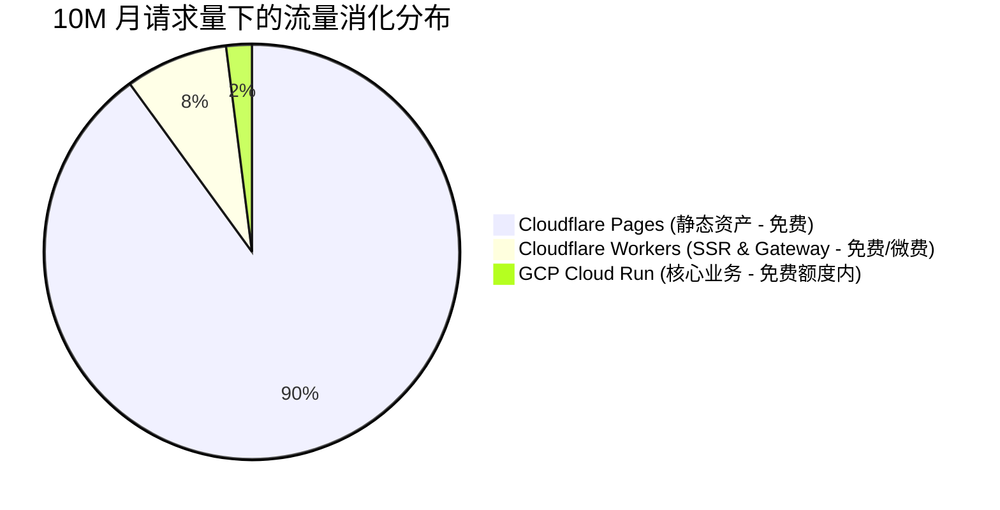

# 如何利用好 Free SaaS 开启自己的在线服务：从 Self-Host 到 Serverless 与边缘混合调度的全栈架构实战

> **作者**：架构与全栈实践团队  
> **适用受众**：独立开发者 (Indie Hackers)、初创团队技术负责人、云原生架构师

---

## 1. 架构演进之路：独立开发者的基础设施三部曲

对于独立开发者和初期创业团队而言，基础设施选型通常在两个极端之间摇摆：一边是“一台 $5 VPS 跑所有服务的传统单机架构”，另一边是“全盘押注 AWS/GCP 的纯 Serverless 架构”。两者都有其致命的短板。

```
[传统单机 Self-Host]                  [纯粹全托管 Serverless]
  (一台 $5 VPS 打天下)                  (全上 AWS Lambda + DynamoDB)
- 优点: 成本固定，技术直观            - 优点: 免运维，自动弹性
- 缺点: 单点故障，无全球 CDN，易被攻击 - 缺点: 冷启动严重，计费陷阱，厂商锁死
                          \          /
                           \        /
                      [现代混合调度架构]
          (Edge + Serverless Container + Free Cloud DB)
          - 极致成本: 最大化利用 Free SaaS 免费额度 ($0-$20/月)
          - 极致性能: 全球边缘 SSR 极速响应，核心计算弹性扩缩
          - 极致可靠: 多级熔断与主备降级 (Failover)
```

### 1.1 第一阶段：单机 Self-Host 的局限
- **单点故障 (SPOF)**：VPS 宕机或宿主机维护，服务直接中断。
- **跨国访问延迟**：用户遍布全球时，单一地域 VPS 导致跨洲网络延迟高达 200ms~400ms。
- **防御能力薄弱**：遭遇几百兆的恶意扫描或 DDoS 攻击时，服务器网络带宽瞬间被打满。

### 1.2 第二阶段：纯 Serverless 的陷阱
- **冷启动风暴 (Cold Starts)**：流量突增时，几百个无状态函数冷启动耗时可达数秒，严重破坏用户体验。
- **数据库连接池耗尽 (Connection Exhaustion)**：函数并发实例化瞬间打爆传统关系型数据库的最大连接数限制（Max Connections）。
- **账单刺客 (Billing Shock)**：未配置防护的 API Gateway 遭遇爬虫恶意遍历，按调用次数计费的账单可能瞬间突破数千美元。

### 1.3 第三阶段：边缘计算 + Serverless + Free SaaS 混合调度
结合现代云基础设施的免费层（Free Tier）与边缘计算能力，我们能够构建出一套**全球分发、弹性容灾、毫秒级响应且初期成本趋近于 $0** 的生产级混合架构：
- **边缘层 (Cloudflare Edge)**：吸收 90% 以上的静态资源与常规流量，负责 Edge SSR 与边缘鉴权。
- **弹性计算层 (GCP Cloud Run)**：处理核心 API 与微服务计算，Scale-to-zero 无闲置浪费。
- **核心持久层 (Supabase Cloud PostgreSQL)**：托管关系型数据，利用 Supavisor 连接池支撑高并发突发。
- **调度中枢 (Gateway Failover)**：主备多路由自动切换，在低成本 VPS 与 Serverless 间智能平衡。

### 1.4 三大架构原型全方位对比

```
┌─────────────────────────┬─────────────────────────┬─────────────────────────┐
│     Self-Host VPS       │     Pure Serverless     │ Hybrid Edge & Free SaaS │
├─────────────────────────┼─────────────────────────┼─────────────────────────┤
│ 1. 接入层 (Ingress)     │ 1. 接入层 (Ingress)     │ 1. 边缘接入与分流       │
│    - 单 IP / Nginx 直连 │    - API Gateway 按次计费│    - Cloudflare Edge 吸收│
│    - 无全球 CDN 加速    │    - 爬虫与突发流量成本高│      90% 静态与缓存流量 │
│                         │                         │    - 5 SSR Workers 边缘渲染│
├─────────────────────────┼─────────────────────────┼─────────────────────────┤
│ 2. 计算层 (Compute)     │ 2. 计算层 (Compute)     │ 2. 弹性计算与容灾       │
│    - 单台 VPS 跑全栈单体│    - 零散 FaaS 函数     │    - GCP Cloud Run 容器 │
│    - 存在单点故障 (SPOF)│    - 冷启动时延与突发瓶颈│      支持 Scale-to-Zero │
│                         │                         │    - 主备回退平滑调度   │
├─────────────────────────┼─────────────────────────┼─────────────────────────┤
│ 3. 存储层 (Database)    │ 3. 存储层 (Database)    │ 3. 托管数据与连接池     │
│    - 本地磁盘 PostgreSQL│    - FaaS 直连导致      │    - Supabase PostgreSQL│
│    - 备份/扩容运维繁琐  │      连接池瞬间打爆     │    - Supavisor 事务池化 │
├─────────────────────────┼─────────────────────────┼─────────────────────────┤
│ 💡 BEST FOR             │ 💡 BEST FOR             │ 💡 BEST FOR             │
│    - $5 固定预算开发验证│    - 事件驱动突发型系统 │    - $0~$5/月 极致低成本│
│    - 单机玩具/内部原型  │    - 预算充足的大中型企业│    - 独立开发者 & 出海 SaaS│
│                         │                         │    - 全球毫秒级低延迟服务│
└─────────────────────────┴─────────────────────────┴─────────────────────────┘
```

---

## 2. 全栈架构拓扑与资产清单 (System Topology)

### 2.1 整体拓扑架构

```
                           [ 全球用户请求 Ingress ]
                                    │
                                    ▼
                 ┌──────────────────────────────────────┐
                 │          Cloudflare Edge             │
                 │   - DNS (Anycast) + WAF + DDoS 防护   │
                 │   - SSL/TLS 终止与边缘缓存              │
                 └──────────────────┬───────────────────┘
                                    │
                                    ▼
                 ┌──────────────────────────────────────┐
                 │       Frontend Router (Worker)       │
                 │   (动态分流 / 灰度路由 / 静态回源)       │
                 └──────────┬──────────────────┬────────┘
                            │                  │
            ┌───────────────┴────┐        ┌────┴────────────────┐
            ▼                    ▼        ▼                     ▼
┌──────────────────────┐ ┌──────────────┐ ┌──────────────────────────┐
│  5 大 SSR Workers    │ │ Pages 静态产物│ │ 3 大 Edge Gateway Workers│
│ - public (落地页)     │ │ (Next/SPA)   │ │ - auth  (/api/auth/*)    │
│ - content (博客/文档) │ │ /_next/*     │ │ - admin (/api/admin/*)   │
│ - auth (登录/认证)    │ │ /static/*    │ │ - core  (/api/*)         │
│ - console (控制台)    │ └──────────────┘ └────────────┬─────────────┘
│ - workspace (工作区)  │                               │
└──────────────────────┘                                │ (Failover / Proxy)
                                                        ▼
                                          ┌──────────────────────────┐
                                          │      GCP Cloud Run       │
                                          │  - accounts (用户微服务)   │
                                          │  - content-service       │
                                          │  - billing-service       │
                                          └─────────────┬────────────┘
                                                        │
                                                        ▼
                                          ┌──────────────────────────┐
                                          │ ★ Supabase Cloud DB     │
                                          │  - PostgreSQL 15+        │
                                          │  - Supavisor 连接池       │
                                          └──────────────────────────┘
```

### 2.2 云原生资产与控制台配置规范

| 组件层级 | 服务 / 标识 | 环境分布 | 路由与控制台配置 |
| :--- | :--- | :--- | :--- |
| **Edge & DNS** | Cloudflare Zone (`onwalk.net` / `svc.plus`) | SIT / UAT / PROD | Anycast DNS 解析、WAF 规则、DDoS 缓解 |
| **Frontend Router** | `frontend-router-{env}` | SIT / UAT / PROD | 挂载于 `console-{env}.onwalk.net` / `console.svc.plus` |
| **5 SSR Workers** | `public` / `content` / `auth` / `console` / `workspace` | 独立 Worker 边界 | 路由分流 (`/*`, `/blogs*`, `/login*`, `/panel*`, `/ai-workspace*`) |
| **Pages 静态产物** | `ai-workspace-portal-{env}.pages.dev` | SIT / UAT / PROD | 静态资源前缀 `/_next/*`, `/static/*`, `/assets/*` |
| **3 Gateway Workers** | `edge-gateway-auth` / `admin` / `core` | API Ingress | 挂载于 `accounts-{env}.onwalk.net`，支持主备回退路由 |
| **弹性计算 (Cloud Run)** | `accounts` / `content-service` / `billing-service` | GCP Project: `xworktech` (Region: `asia-northeast1`) | 无状态容器，按需伸缩 |
| **核心数据库 (Supabase)** | PostgreSQL 15+ & Supavisor Pooler | Project: `iqkxspmhcfqmhkbjdoms` | 事务模式连接池（端口 6543） |

---

## 3. 经济学与承载能力精算：$0 到 $20/月的千万级并发底气

### 3.1 免费层 (Free Tier) 资源盘点矩阵



| 云服务商 | 免费额度 (Free Tier Quota) | 折合生产价值 | 核心优化与约束对策 |
| :--- | :--- | :--- | :--- |
| **Cloudflare Workers** | 100,000 请求 / 天 (免费版) | 约 300 万次边缘请求/月 | 配置 Edge Cache 缓存 HTML，降低 Worker 调用次数 |
| **Cloudflare Pages** | **无限流量与无限请求**，500 次构建/月 | 价值极高，省去巨大流量费 | 前端打包资源 (`/_next/*`, `/assets/*`) 全部走 Pages |
| **GCP Cloud Run** | 200 万次请求/月 + 360,000 GB-秒计算 | 足够支撑中小型核心业务 API | 配置 `min-instances: 0`，设置单容器并发度为 80 |
| **Supabase** | 500MB DB，50,000 MAU，5GB 存储 | 生产级 Postgres + Auth + Pooler | 开启 Supavisor；大文件/图片写入 Cloudflare R2 |
| **Cloudflare R2** | 10GB 存储/月，1000 万次 Class B 读取 | 替代 AWS S3，**无出网流量费** | 用于用户上传文件、前端构建产物备份 |
| **VictoriaMetrics** | 自建极简实例 (单核 512MB VPS 即可) | 支撑 1000+ 指标秒级写入 | 单二进制部署，内存常驻 < 80MB |

### 3.2 千万级月访问量 (10M Requests) 成本测算

假设您的 SaaS 服务每月迎来 **1,000 万次请求 (10M requests)**：
1. **9,000,000 次 (90%)** 命中前端 JS/CSS 静态产物、静态图片与边缘缓存页面：
   - 全部由 **Cloudflare Pages & Edge CDN** 承接。
   - **实际费用：$0.00**。
2. **800,000 次 (8%)** 命中 5 个 SSR Workers 与 Edge Gateway 边缘鉴权：
   - 消耗约 26,000 次/天的 Worker 请求（在 10 万次/天免费额度内）。
   - **实际费用：$0.00**（即便是升级到 Worker Paid 计划，也仅需 $5.00/月）。
3. **200,000 次 (2%)** 穿透至后端微服务（登录、支付、核心数据更新）：
   - GCP Cloud Run 消耗 20 万次调用（仅占 200 万次免费额度的 10%），计算时长（vCPU-秒 / GiB-秒）完全处于免费层包络线内。
   - **实际费用：趋近于 $0.00**（严谨来说，若产生跨地域网络出网流量、容器镜像存储 Artifact Registry 或 Secret Manager 轮询，每月可能会产生极小额的边际费用，通常在 **$0.10 ~ $1.00** 之间）。
4. **数据库与连接池负载**：
   - 20 万次查询经由 Supavisor 连接池复用，稳定保持在 10~20 个物理长连接，内存占用低于 100MB。
   - **实际费用：$0.00**。

**每月总运营成本**：**$0.00 ~ $5.00 USD**（即便计入微量出网流量与边缘可选付费计划，依然保持极致低成本），承载能力直接支撑数万日活（DAU）！

---

## 4. 多环境 GitOps 与无缝部署 (SIT / UAT / PROD)

为了保证生产稳定性，独立开发者必须具备多环境隔离能力，同时避免因环境复制导致基础设施成本成倍增加。

```
Git Push -> CI Pipeline (GitHub Actions)
  ├── 分支 'dev'   ──> 部署至 SIT  (Wrangler: -e sit, Cloud Run tag: sit)
  ├── 分支 'stage' ──> 部署至 UAT  (Wrangler: -e uat, Cloud Run tag: uat)
  └── 分支 'main'  ──> 部署至 PROD (Wrangler: -e prod, Cloud Run tag: prod)
```

### 4.1 Cloudflare Worker 环境变量隔离
在 `wrangler.toml` 中通过环境矩阵管理路由与服务绑定：
```toml
name = "frontend-router"
main = "src/index.ts"
compatibility_date = "2026-08-01"

[env.sit]
name = "frontend-router-sit"
routes = [
  { pattern = "console-sit.onwalk.net/*", zone_name = "onwalk.net" }
]
[env.sit.vars]
ENVIRONMENT = "sit"
API_GATEWAY_URL = "https://accounts-sit.onwalk.net"

[env.prod]
name = "frontend-router-prod"
routes = [
  { pattern = "console.svc.plus/*", zone_name = "svc.plus" }
]
[env.prod.vars]
ENVIRONMENT = "prod"
API_GATEWAY_URL = "https://accounts.svc.plus"
```

### 4.2 GCP Cloud Run 流量标签与修订版本管理
无需为每个环境创建独立的 Cloud Run 服务，通过 **Traffic Tagging** 实现零闲置成本的多环境切分：
- `accounts-service` 单一服务下：
  - Revision `accounts-v12-sit` $\rightarrow$ 绑定 Tag `sit` (URL: `https://sit---accounts-xxx.a.run.app`)
  - Revision `accounts-v11-prod` $\rightarrow$ 分配 100% 生产主流量。

### 4.3 Supabase 数据库多环境隔离策略
- **初期极简阶段**：单 Supabase 实例内通过 PostgreSQL Schema 隔离 (`sit_schema`, `uat_schema`, `public`)，共享连接池与计算资源。
- **正式生产阶段**：为 PROD 单独开通独立 Supabase 项目，SIT/UAT 共享开发实例，确保测试环境的数据脏写与压测绝不波及生产数据。

---

## 5. 分层可观测性设计与指标规范 (Full-Stack Observability)

无服务器架构最大的隐患在于链路黑盒化。我们构建了一套基于 **VictoriaMetrics + VictoriaLogs + Grafana** 的高能效、低资源消耗可观测性体系。

### 5.1 采集器与数据导出链路 (Data Pipeline)

```
[Cloudflare Edge]  ──> (Logpush / Analytics API) ──┐
[GCP Cloud Run]    ──> (OTel / Cloud Monitoring) ──┼──> [ Vector 统一中继 Agent ]
[Supabase DB]      ──> (postgres_exporter)       ──┤          │
[Blackbox Prober]  ──> (HTTPS 合成探针)          ──┘          ▼
                                                ┌───────────────────────────┐
                                                │ VictoriaMetrics (时序指标) │
                                                │ VictoriaLogs    (统一日志) │
                                                └─────────────┬─────────────┘
                                                              ▼
                                                ┌───────────────────────────┐
                                                │     Grafana Dashboard     │
                                                │ (serverless-fullstack-..) │
                                                └───────────────────────────┘
```

### 5.2 看板核心变量与黄金监控维度

**看板 UID**：`serverless-fullstack-architecture`  
**模板变量**：
- `$env`：环境选择器 (`sit`, `uat`, `prod`, `All`)
- `$DS_METRICS` / `$DS_LOGS`：指标与日志数据源
- `$ssr_worker`：`public`, `content`, `auth`, `console`, `workspace`
- `$gateway_worker`：`auth`, `admin`, `core`
- `$cloudrun_service`：`accounts`, `content-service`, `billing-service`
- `$database`：`postgres`, `accounts`, `billing`

#### 8 大核心监控模块详细规范

```
┌────────────────────────────────────────────────────────────────────────┐
│ 1. 全链路架构脉搏 (Architecture Pulse)                                 │
│ [ SLA 可用性: 99.99% ] [ 边缘 QPS: 340 req/s ] [ Worker CPU: 3.2ms ]   │
│ [ Gateway 降级率: 0.0% ] [ Cloud Run 实例: 2 ] [ DB 池饱和度: 14% ]     │
├──────────────────────────────────┬─────────────────────────────────────┤
│ 2. 边缘 DNS & 接入分析           │ 3. 终端黑盒探针 & SSL 证书监控       │
│ - DNS 解析速率与响应状态分布     │ - 全域端点可用性矩阵 (console/acc)  │
│ - HTTP 状态码分布 (2xx/3xx/4xx..)│ - SSL 证书到期倒计时 (<15d 黄 / <7d)│
│ - 缓存命中率与带宽节省趋势       │ - 耗时分解 (DNS/TCP/TLS/TTFB)       │
├──────────────────────────────────┼─────────────────────────────────────┤
│ 4. 5 大 SSR Workers 运行状态     │ 5. 3 大 Edge Gateway 调度分析       │
│ - 各 Worker 分发 QPS 与 CPU 耗时 │ - 3 大边界路由流量分布 (/api/*)     │
│ - 子请求 (Origin/KV/DB) 速率     │ - JWT 鉴权耗时 (p95 ms)             │
│ - 未捕获异常与 5xx 错误分布      │ - 401/403 拦截与 Failover 回退状态  │
├──────────────────────────────────┼─────────────────────────────────────┤
│ 6. GCP Cloud Run 弹性容器        │ 7. ★ Supabase PostgreSQL 深度性能   │
│ - 服务请求 QPS 与 p95 响应时延   │ - 活跃/空闲/事务中空闲连接数分布    │
│ - 容器实例伸缩数与冷启动计数     │ - Supavisor 客户端等待队列与池饱和度│
│ - 容器 CPU 与 Memory 资源水位    │ - 缓存命中率 (>99%) & 慢 SQL 耗时   │
├──────────────────────────────────┴─────────────────────────────────────┤
│ 8. VictoriaLogs 全栈统一日志流下钻                                     │
│ [ 错误源分布 ] cloudflare: 2 | cloud_run: 0 | supabase: 0               │
│ [ 慢查询日志 ] SELECT * FROM workspace_nodes WHERE ... (523ms)         │
└────────────────────────────────────────────────────────────────────────┘
```

1. **全链路架构脉搏 (Architecture Pulse)**：
   - **SLA 可用性**：`avg(probe_success{env=~"$env"}) * 100`，全面反映对外服务黑盒可用性。
   - **Gateway 回退比例**：监控主节点不可用时平滑向 Cloud Run fallback 的流量占比，及时发现主路故障。
2. **边缘接入与 DNS (DNS & Edge Ingress)**：
   - 监控 A/AAAA 解析吞吐、HTTP 2xx/3xx/4xx/5xx 分布，以及 Edge 缓存命中带宽。
3. **终端可用性与 SSL 证书黑盒探测 (Synthetic Probe)**：
   - SSL 证书剩余有效天数预警（$<15$ 天黄色预警，$<7$ 天严重告警），杜绝证书过期导致的停机事故。
   - TTFB 首字节时延分段（DNS 解析 $\rightarrow$ TCP 建连 $\rightarrow$ TLS 握手 $\rightarrow$ 数据传输）。
4. **5 大 SSR Workers 运行态**：
   - 监控 `public`, `content`, `auth`, `console`, `workspace` 各自的 CPU 耗时分位数（p50/p95/p99）。
5. **3 大 Edge Gateway (Auth / Admin / Core)**：
   - JWT 边缘解析耗时（目标 $<5\text{ms}$），401/403 鉴权拦截速率，Failover 请求触发计数。
6. **GCP Cloud Run 弹性容器**：
   - 实例活跃数（Active Instances）与冷启动次数（Startup Count）。
7. **★ Supabase Cloud DB / PostgreSQL 深度性能 (核心关注)**：
   - **连接池健康度**：`active` 连接、`idle in transaction`（防止长事务锁表）、Supavisor 客户端排队深度。
   - **共享内存缓存命中率 (Shared Buffer Cache Hit Ratio)**：维持在 $>99\%$，低于 $95\%$ 立即触发调优告警。
   - **死元组与膨胀 (Dead Tuples)**：监控 `n_dead_tup` 与 Autovacuum 执行周期。
8. **VictoriaLogs 统一日志流**：
   - 单一入口按 `source_type` 聚合 `cloudflare`, `cloud_run`, `supabase` 错误日志，支持按 TraceID 瞬间下钻。

---

## 6. 生产级避坑指南与硬核权衡 (Trade-offs & Anti-patterns)

| 潜在陷阱 / 痛点 | 常见错误做法 (Anti-Pattern) | 生产级正解 (Production Pattern) |
| :--- | :--- | :--- |
| **数据库连接风暴** | FaaS 函数每次直连 Postgres 5432 端口 | 强制经由 **Supavisor 事务连接池 (端口 6543)** |
| **Worker CPU 超时** | 在边缘 Worker 跑重型加解密或大图像压缩 | 复杂计算下沉至 Cloud Run，Worker 仅做流式转发 |
| **Cloud Run 冷启动** | 容器镜像动辄几百 MB，启动耗时 5~10 秒 | 使用 Scratch / Alpine 极简镜像，镜像体积控制在 50MB 以内 |
| **跨云供应商锁定** | 深度绑定特定云厂商的专有云数据库 API | 坚持标准 PostgreSQL 规范，每天自动 `pg_dump` 至 Cloudflare R2 |
| **突发流量计费刺客** | API 接口裸奔，未配置边缘限流与验证码 | Cloudflare WAF 开启 Rate Limiting + Gateway 边缘鉴权拦截 |

### 6.1 深度避坑要点
1. **连接池的“事务模式”与“会话模式”**：
   - 在 Serverless 场景下，Supavisor 必须选择 **Transaction Mode**。此时客户端在事务执行完毕后立即释放连接，支持数千个并发请求复用 10~20 个真实物理连接。注意避免在代码中使用 `LISTEN/NOTIFY` 或临时表（此类功能需要 Session Mode）。
2. **边缘 Worker 的 CPU 预算控制**：
   - Cloudflare Worker Free 版本的 CPU 限制为 10ms。所有边缘代码必须保持纯净高效，避免无意义的重型正则匹配或多层嵌套解析。
3. **数据备份的安全底线**：
   - 绝不将鸡蛋放在一个篮子里。通过 GitHub Actions 定时流水线调用 `pg_dump` 导出压缩数据，并加密上传至 Cloudflare R2，确保即便单个 SaaS 服务商出现服务故障，也能在 30 分钟内于任意 VPS 节点全量恢复。

---

## 7. 总结与落地清单

通过这套架构，独立开发者不仅将前期基础设施运营成本降至极限（**接近 $0 / 月**），而且具备了与一线互联网大厂相媲美的架构能力：
- [x] **全球 Anycast CDN 加速与 WAF 安全防护**
- [x] **秒级边缘 SSR 动态渲染与前端分流**
- [x] **免维护、弹性伸缩的容器化微服务算力**
- [x] **自带连接池的企业级托管 PostgreSQL 数据库**
- [x] **涵盖指标、日志与黑盒探针的全栈 Grafana 可观测性**
- [x] **主备平滑降级与自动化数据异地备份容灾**
