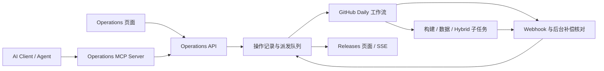
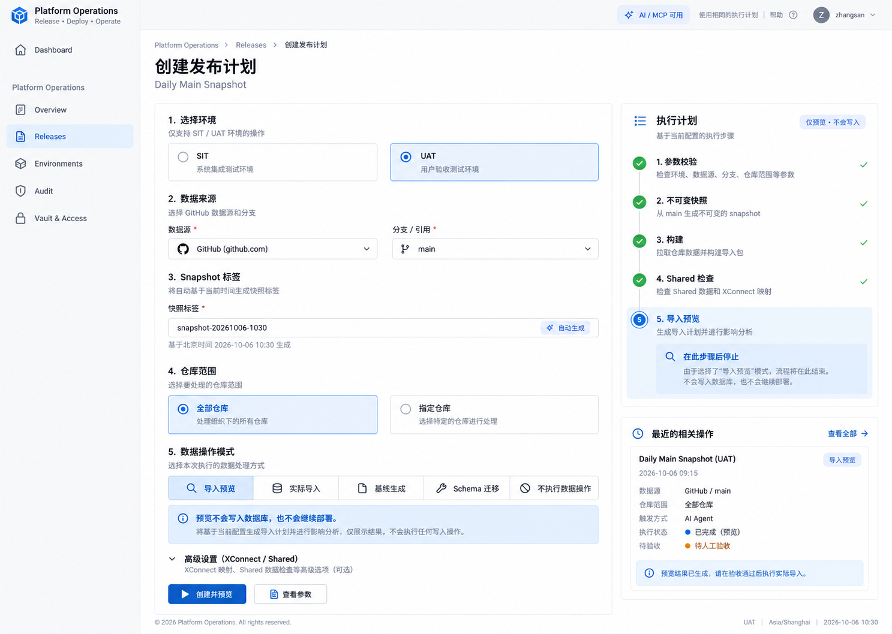
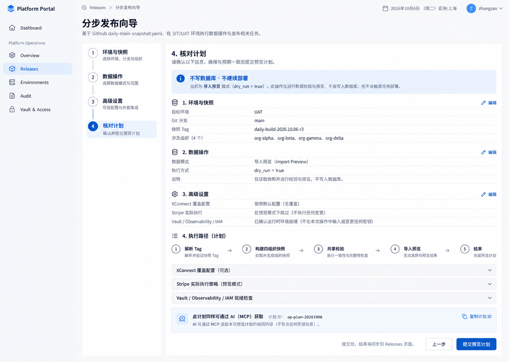
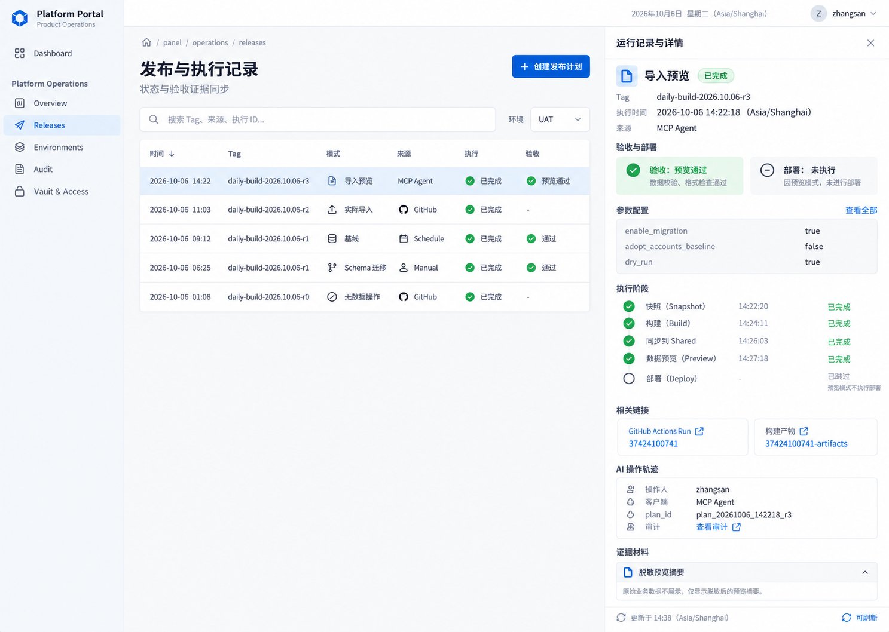
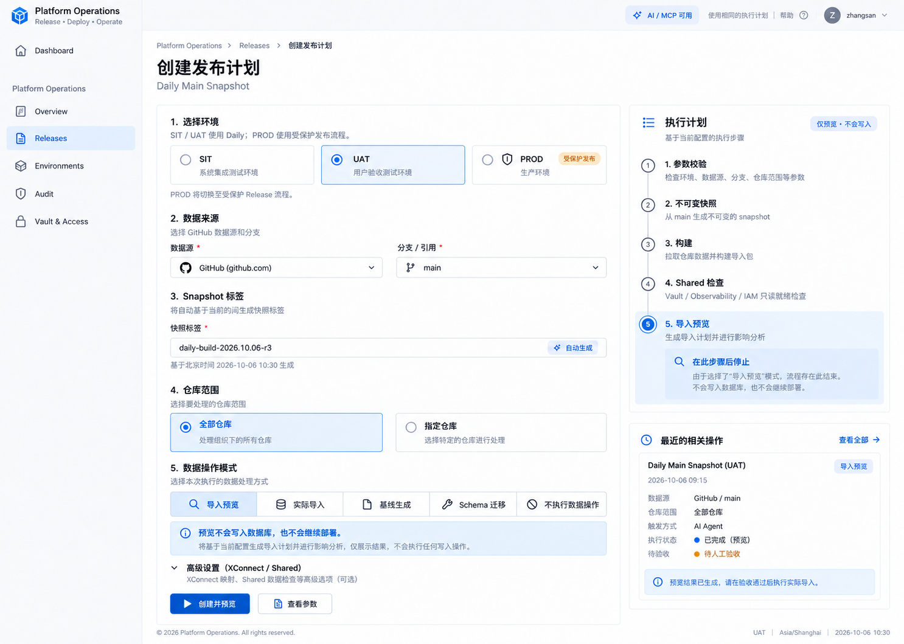

# 平台操作中心与 Daily Snapshot 发布验收架构

> 状态：目标设计与首期交付记录；首期页面、目录和计划 API/MCP 已实现，Console UAT 已发布。完整执行服务、生产发布及登录后 UAT 验收尚未完成。核对日期：2026-10-06。部署成功不构成数据迁移或业务运行验收证明。

## 1. 目标与当前实现

将 `/panel/operations/` 设计为执行中心，将 `/panel/operations/releases` 设计为发布记录与验收中心。两页共享操作记录，从提交请求开始展示，持续同步父工作流、子工作流、构件及实际验收结果。

侧栏入口独立归入“平台运维”，显示“操作中心”“发布记录”等条目，不再混在“账户与权限”中使用含糊的 Overview 标签。`admin` 角色及 `admin / administrator / root` 管理员组按现有规则可见，普通账号和访客不可见；保留原有权限和租户检查，不修改账号权限，不解除 PROD 执行保护。导航、权限和计划接口等 63 项本地回归测试通过；未进行真实账号登录核验时，不推断实际会话中的角色或租户信息。

工作流入口为 [Daily Main Snapshot](https://github.com/ai-workspace-infra/platform-ops-toolkit/actions/workflows/daily-main-snapshot.yaml)。已核对的 Toolkit 提交为 `452265c3596de0d68cda9ae020ec8295f7db3c78`；后续实现须重新核对工作流版本，不能将该快照视为永久合同。

Portal 源码定位：

- `src/modules/extensions/builtin/platform-operations/index.ts`：已注册 Overview、Releases、Environments、Audit、Vault & Access 路由。
- `src/modules/extensions/builtin/platform-operations/components/ReleaseStatusPage.tsx`：在最新 `origin/main`（`31969c69b9964cb0d2b6e9b949f00581d9496807`）已通过 `/api/operations/releases` 读取真实发布目录；保留该实现，不覆盖为示例数据。
- `src/app/api/operations/releases/route.ts`：鉴权后读取 Toolkit `release-status` 分支的 `releases.json`；目录中的工作流状态不自动等同于实际登录或业务验收。
- `src/app/globals.css`：现有主题变量与排版约定。

线上参考入口为 [UAT Releases](https://console-serverless-uat.onwalk.net/panel/operations/releases)。设计阶段访问超时，未取得参考截图；后续发布检查已验证匿名登录门禁和线上静态资源，未取得登录后的页面截图。

首期实现范围：参数表单覆盖 19 个输入、SIT/UAT/受保护 PROD、单选数据模式、执行计划、真实发布目录，以及受现有账号权限保护的 catalog/plans/MCP 接口。MCP 仅提供目录、计划和发布查询；计划返回 `executable=false`，没有工作流派发、操作记录持久化、Webhook/SSE 或生产执行工具。完整执行服务必须由后端所有者承接，不能在 Portal 中偷渡执行器。

用户已授权补齐 Console-only UAT 入口，以及 frontend-router 的 catalog/plans/MCP 三个精确路由并发布 UAT Router。独立 Vault 角色只绑定 Portal Console UAT 的 main 工作流与 `uat` 环境，只读 `kv/data/uat/serverless/cloudflare`，未修改通用 Console 角色，未授予 PROD 或数据库权限。未执行数据操作，用户选择暂不做登录后验收。

### 1.1 首期发布证据

- Portal [PR #403](https://github.com/ai-workspace-services/portal/pull/403)、[PR #404](https://github.com/ai-workspace-services/portal/pull/404)、[PR #405](https://github.com/ai-workspace-services/portal/pull/405) 已合并；共享导航清单 [.github #16](https://github.com/ai-workspace-services/.github/pull/16) 与双语文案 [knowledge #102](https://github.com/ai-workspace-services/knowledge/pull/102) 已合并。
- Console UAT [运行 37434573081](https://github.com/ai-workspace-services/portal/actions/runs/37434573081) 成功；不可变 tag `uat-daily-build-2026.10.06-r2`，源码 `c931752b82894b239198000e8443a9ecc55a9982`，知识内容 `4eadd2bb31c2168861b021ae47ac846b388bcc90`，GitOps `b1a96c7cdd5cd3aa44506ce5355d006e5d766849`。
- Worker `frontend-ssr-console-uat`，deployment `5c55399f-05a7-4429-8f00-409f0b1449af`，version `0fb3f368-b54f-4902-b11e-80841bc18565`；51 个线上 JS/CSS 文件校验通过，绑定与配置保留验证通过。两页匿名访问返回同源登录跳转。
- Router [PR #32](https://github.com/ai-workspace-services/frontend-router/pull/32) 已合并并发布 UAT；deployment `3a379bff-f007-4e78-81a3-38da68b12996`，version `8efa65d6-7aa6-438f-8ba9-f7a7f6246414`。三个精确路由已命中 `ssr-console`，未改动域名和其他路由。
- `r2` 发布后匿名检测发现 MCP 正确公网 Origin 被误拒为 403。[Portal #406](https://github.com/ai-workspace-services/portal/pull/406) 已合并，使用可信构建域名而非内部 Worker URL，保留鉴权、POST Origin 和跨站保护；针对性测试和全量 CI 通过。
- 最新 Console UAT [运行 37436294009](https://github.com/ai-workspace-services/portal/actions/runs/37436294009) 成功；不可变 tag `uat-daily-build-2026.10.06-r3`，源码 `c042a156d5024b2f23f2729c1da21f31f704db22`，内容与 GitOps SHA 同上。deployment `4b4756c1-a9db-416a-9420-d7aae73f49c4`，version `12d07656-47e5-457d-afa6-dc5a772089fa`，51 个线上资源及绑定校验通过。两个页面返回 307 同源登录跳转，catalog/plans/MCP/releases 均返回 401，跨站 MCP 请求仍返回 403 `invalid_origin`。真实登录后的表单、计划、查询与侧栏显示未验收。
- 交付范围为表单、计划与已有发布目录查询；`executable=false`。真实工作流派发、操作记录持久化及执行结果同步尚未交付，不以 Console 发布回执冒充完整运行验收。仅保存脱敏证据，未上传原始日志、业务快照或凭据。

## 2. 所有权与系统边界

| 组件 | 职责 | 边界 |
| --- | --- | --- |
| Portal | 参数表单、执行计划、运行列表、证据详情、实时状态 | 不持有 GitHub App 私钥、Vault token 或数据库连接串；不执行 SQL |
| Operations API（拟新增） | 身份权限、输入校验、幂等派发、持久化记录、Webhook 与补偿同步 | 归属现有后端需在实施前确认；不把页面鉴权当作服务端授权 |
| Operations MCP Server（拟新增） | 将相同操作能力作为 AI 工具暴露，提供结构化输入与结果 | 复用 Operations API，不另设 SQL、任意命令、GitHub workflow 或 Vault 执行通道 |
| Toolkit | Daily 入口、跨仓库编排、门禁、父子运行关联和发布结果 | 不复制 Playbooks 或 IaC 的执行器 |
| Playbooks | 数据操作、主机与服务部署、执行回执 | 数据导入与 schema 操作保留各自明确范围 |
| IaC Modules | 云资源、状态与基础设施证据 | 页面不隐式扩大资源变更范围 |
| GitOps / Vault | 非敏感环境声明 / 运行时凭据 | 页面使用受控配置引用，不读取或显示敏感值 |



## 3. 执行中心：完整参数映射

复用 Portal 现有侧栏、主题和组件。主区域填写参数，右侧固定展示执行计划；高级项渐进展开。主按钮随计划显示“构建并部署”或“构建并预览导入”，不使用含糊的“执行”隐藏写入语义。

| 分组 | 工作流输入 | 交互与校验 |
| --- | --- | --- |
| 环境 | `deploy_env` | 页面提供 SIT / UAT / PROD；Daily 只接收 SIT / UAT，PROD 切换到独立受保护发布计划 |
| 快照 tag | `snapshot_tag` | 默认自动解析；显示请求值与最终不可变 tag，包括冲突产生的 revision |
| 来源 | `snapshot_source_ref` | 留空使用 main；指定 ref 的行为按工作流与校验器解释 |
| 仓库 | `repositories` | 全部 / 精确多选；生成逗号分隔值 |
| Stripe | `skip_stripe_catalog` | 展示有效行为；当前 Hybrid 调用固定跳过同步，不能仅凭开关声称会同步 |
| XConnect One | `xconnect_one_release_tag` | 留空使用 GitOps 声明；支持版本覆盖 |
| XConnect Gateway | `xconnect_gateway_release_tag` | 同上 |
| 数据导入 | `enable_migration`、`migration_config_json` | 结构化表单生成非敏感 JSON，默认预览 |
| Baseline | `adopt_accounts_baseline` | 数据操作单选模式之一，UAT only |
| Schema | `apply_accounts_schema_migration` | 数据操作单选模式之一，UAT only |
| Schema 起点 | `accounts_schema_expected_version` | 数字版本；绑定实际目标版本证据 |
| Schema 终点 | `accounts_schema_target_version` | 数字且大于起点 |
| SQL 校验 | `accounts_schema_sha256` | 64 位小写十六进制 SHA-256 |
| Shared Vault | `shared_vault_endpoint` | 受控只读探针地址 |
| Shared Observability | `shared_observability_endpoint` | 受控只读探针地址 |
| Shared IAM | `shared_iam_endpoint`、`shared_iam_issuer` | 探针与期望 issuer |
| 探针超时 | `shared_readiness_timeout_seconds` | 正整数，默认 20 秒 |

后端应读取受支持 workflow 版本对应的参数合同；发现新增或不兼容输入时提示合同待更新，不能静默忽略。该表覆盖核对时的全部 19 个 dispatch 输入。

### 3.1 数据操作用单选模式表达

| 模式 | 参数 | 实际效果 |
| --- | --- | --- |
| 无数据操作 | 三个开关均 false | 正常快照链路 |
| 导入预览 | migration=true，baseline/schema=false，dry_run=true | 预览后结束，不写数据库、不继续应用部署 |
| 实际导入 | migration=true，baseline/schema=false，dry_run=false | 导入成功后进入后续 UAT 部署 |
| Baseline adoption | baseline=true，migration/schema=false | 原地 baseline 补齐，不能与其他数据模式组合 |
| 增量 schema | schema=true，migration/baseline=false | 必填版本及 checksum；使用完整 UAT 快照 |

实际导入必须明确选择写入模式并展示受控源、目标、范围与恢复依据，不能将预览自动升级成写入。`legacy_import` 的身份域合并不能表述为完整数据库迁移或三表重建验收。

`migration_config_json` 优先通过来源、目标、传输方式、数据范围和配置引用生成；高级视图提供 JSON 预览。使用服务端 allowlist 映射 Vault 引用；禁止任意路径、连接串、密码、token、SQL 或命令输入。

### 3.2 执行条件必须在计划中可见

- 指定 `repositories` 时，当前 Daily 跳过完整 UAT 部署链路；显示“选定仓库快照”，不能承诺局部部署。
- 数据导入、baseline、schema 组合与环境/ref/仓库限制，前端提前提示，服务端再次校验，并复用 Toolkit 校验合同。
- XConnect 发布派发与组件构建分开展示。当前工作流在 xstream matrix 成功后派发多平台发布；仓库筛选对该步骤的实际影响须按源码呈现，不能推断为自动跳过。
- Shared readiness 是只读探针；成功不表示 Shared 已部署，也不表示业务登录通过。
- 计划显示实际将创建的 tag、触发的构建和下游部署，保留所有阶段的条件及跳过原因。

### 3.3 PROD 环境选择与执行路由

用户已选择方向 1 作为 base，并要求增加 PROD 环境标签。环境区并列展示 SIT、UAT、PROD；PROD 标注“生产环境 / 受保护发布”。选择 PROD 后切换为受保护 Release 计划，不向 `daily-main-snapshot.yaml` 提交 `deploy_env=prod`。

PROD 计划使用经过验收的不可变 release 及其构件证据；具体生产工作流、受支持参数、审批和权限从后端 catalog 的已核对合同解析。该适配尚未实现，未配置时允许查看环境和限制说明，禁用执行并显示“生产发布入口待接入”，不能伪造可执行能力。

切换环境应重新生成计划并使旧 plan_hash / 确认失效，不继承 UAT 的实际导入、baseline 或 schema 迁移配置。Portal 与 MCP 对 PROD 使用同一能力合同、权限和保护规则。此处补充页面选择与路由设计，不构成生产部署授权或工作流修改。

## 4. Releases：操作记录与验收证据

提交后立即跳转 `/panel/operations/releases?operation=<operation_id>`。尚无 GitHub run 时显示“已提交，等待运行绑定”。

列表字段：提交时间、环境、模式、请求 tag / 实际 tag、申请人、来源、当前阶段、工作流结论、验收结论、最近同步时间。

详情分为请求、执行、构件、验收四部分：

1. 请求：用户输入、有效默认值、计划摘要、workflow SHA 与操作人。
2. 执行：参数门禁、tag 解析、四组织快照、Shared readiness、数据操作、Hybrid 与子任务时间线。
3. 构件：仓库 SHA、镜像 digest、GitOps SHA、产物和脱敏证据链接；不存在的数据保持缺失状态。
4. 验收：部署、服务健康、登录、数据校验、备份与恢复分别记录环境、构件、时间和证据。

| 场景 | 执行展示 | 验收展示 |
| --- | --- | --- |
| 输入冲突 | 失败，显示失败步骤 | 未执行 |
| 导入预览成功 | 预览通过 | 数据写入和部署未执行 |
| Checkpoint 成功 | Checkpoint 完成 | 恢复验证待证据 |
| 父 run 完成、子发布运行中 | 父流程完成，子任务进行中 | 尚未完成 |
| 部署通过、登录未验证 | 部署通过 | 登录待验证 |
| Artifact 过期或证据不可读 | 执行结论保留 | 证据不可用，禁止推断通过 |

状态支持 pending、queued、waiting、in_progress、success、failure、cancelled、skipped、unknown。缺证据显示“待验证”；不满足条件显示“跳过：原因”；同步中断显示“状态可能过期”。取消 run 不代表数据库写入回滚。

## 5. API、关联与结果同步

拟定 API：

```text
GET  /api/operations/catalog
POST /api/operations/plans
POST /api/operations/plans/:id/execute
GET  /api/operations/releases
GET  /api/operations/releases/:id
GET  /api/operations/releases/:id/events
POST /api/operations/github/webhook
```

计划绑定输入 hash、workflow SHA、目标环境和有效配置；执行时重新验证权限与版本。提交返回 `202 + operation_id`，先持久化再通过队列派发。相同幂等键只产生一次操作，派发响应不确定时先核对关联记录，不能盲目重试制造重复写入。

Daily 增加可选 `operation_id`，写入 run-name 和结构化回执，向下游传递 correlation。人工及 schedule 运行无 operation_id 时由同步器建立外部来源记录。不能通过“最近一个 run”关联。

记录至少分为 operation、run、artifact/evidence：

- operation：身份与环境范围、输入摘要、请求/实际 tag、计划 hash、来源、操作时间。
- run：repository、workflow、run_id、run_attempt、parent_run_id、operation_id、SHA、GitHub 原始状态与结论。
- evidence：证据类型、环境、构件、来源 run、artifact locator/hash、验证结果、时间、保留期限。

同步采用 Webhook 主动更新、后台轮询补偿、页面 SSE。Webhook 校验签名并按 delivery ID 去重；乱序事件不能覆盖较新状态；重跑按 run_attempt 分开保留。SSE 断线后按事件游标恢复，并以持久化快照补齐。

现有 `daily-snapshot-status-*`、`daily-snapshot-summary-*`、`daily-data-dispatch-receipt` 可作为输入证据，但不得假定它们覆盖所有成功子任务、镜像 digest 或完整验收。Toolkit 需要补齐统一版本化回执，特别是跨仓库 XConnect 发布和 Hybrid 子任务的关联及结论。

同步器仅导入 allowlist 脱敏元数据；页面展示摘要和 GitHub 链接，不保存业务快照、数据库 dump、凭据或未经筛选的原始日志。未知来源或无法校验的回执不得升级为验收通过。

## 6. AI 操作接口与 MCP Server

Portal 参数表单、执行计划、运行列表及详情全部对应可机器调用的 Operations API。交互不依赖 DOM 自动化；MCP Server 是同一业务合同的适配层，可与 API 同服务部署，也可单独部署，通过现有身份系统进行受控调用。具体部署归属在实施阶段确定。

| MCP tool（建议命名） | 能力 | 对应边界 |
| --- | --- | --- |
| `operations_get_catalog` | 获取支持的输入 schema、默认值、约束、workflow 版本 | 读取，不执行 |
| `operations_create_plan` | 从结构化参数生成计划、有效输入和后果摘要 | 创建计划，不派发 |
| `operations_get_plan` | 读取计划、校验错误、权限与确认状态 | 读取 |
| `operations_execute_plan` | 执行指定 plan_id、plan_hash，使用幂等键 | 与 Portal 共用执行门禁 |
| `operations_list_releases` | 按环境、模式、来源、状态分页查询 | 身份范围过滤 |
| `operations_get_release` | 返回父子任务、实际 tag、构件及验收 | 结构化结果，不提供原始敏感日志 |
| `operations_get_events` | 按游标读取增量事件 | 支持 Agent 恢复与有界轮询 |
| `operations_get_evidence` | 获取允许读取的脱敏证据和验证结果 | 不读取业务快照或凭据 |

AI 标准流程为 catalog → create_plan → get_plan → execute_plan → get_release / get_events → get_evidence。数据导入预览与实际写入使用不同明确参数；Agent 不得把 dry_run 从 true 静默改为 false。需要确认时返回 `confirmation_required` 及计划摘要，由现有确认机制对绑定 plan_hash 的具体操作签发授权，不能将模型生成的 `confirmed=true` 当作授权。

读、计划、派发、数据写入使用区分的身份权限和环境范围，MCP 必须复用相同服务端规则。远程 MCP 的 OAuth/OIDC、audience、scope、token 生命周期与现有 IAM 合同对齐；不得向所有 MCP 客户端提供共用管理员身份。协议版本及传输方式在实施时按官方 MCP 规范确认，首选支持远程调用的 Streamable HTTP，保留协议演进兼容边界。

每次操作记录真实用户主体、Agent/client 身份、来源 `portal|mcp|github|schedule`、计划 hash、幂等键、确认人与父子运行关联。AI 来源在 Releases 与 Audit 可见。MCP 工具描述和 GitHub/日志文本属于数据，不得改变用户授权、权限或请求范围。

响应提供版本化 schema、operation_id、run locators、状态、验收、next_cursor、last_synced_at、retry_after 与结构化错误。工具调用保持有界；长运行返回 queued/in_progress，由 Agent 查询，不阻塞 MCP 请求直到完整构建结束。断线重试使用同一幂等键，派发结果不确定时返回待核对状态。取消及重跑不列入首轮必备工具，后续开放需复用后端范围控制并明确已发生的写入不会自动撤销。

## 7. 权限与运行边界

复用已有 platform-operations 登录和访问规则，并在 API 增加读取、创建计划、派发、数据写入的权限区分。平台级发布不能仅靠 tenantScoped 页面配置获得权限，服务端需校验实际平台与环境授权。

GitHub App 凭据保持服务端运行时注入；Actions job 内继续使用 Vault OIDC。GitOps 声明接口地址、回调入口和非敏感 allowlist。端点高级输入经过允许域名校验，不能让探针成为访问任意内部地址的入口。

本设计增加 PROD 环境选择标签，预留独立受保护发布适配；当前 Daily 执行范围仍为 SIT/UAT，不把失败重跑、取消或回滚作为默认自动操作。既有 GitHub 人工触发及每天北京时间 00:00 的定时运行须同步可见；计划任务仅展示既有 schedule，页面改时间需要独立工作流变更。

## 8. 视觉设计与状态

线上页面截图未取得。用户已明确允许基于核对过的 Portal 源码与现有主题继续生成三个设计方向。视觉稿属于设计参考，不是运行截图或真实验收证据。

共享主题：背景 `#f8f9fa`、白色表面、主色 `#0058bd`、正文 `#1c1b1f`、次要文字 `#667085`、8px 大圆角、系统 sans / mono 字体；实际实现使用现有 token，不复制硬编码色值。

探索方向为“表单与执行计划”“分步发布向导”“运行记录与详情”。以 1440 × 1024 桌面界面探索不同信息层级，保留数据模式互斥、预览语义和执行/验收分离。用户已选方向 1 作为 base，并提出 PROD 标签修订；修订视觉稿已生成，UI 尚未实现。

### 8.1 三个初始视觉方向（方向 1 已选为 base）

以下按本次聊天中的展示顺序编号。使用内置 Image Gen 独立生成，图片已保存在 knowledge；未使用线上截图。所有操作人、时间、完成状态、run 链接和验收字段均为概念示例，不能作为 live 证据。







生成提示词共用约束：单张 1440 × 1024 桌面界面、Portal 浅色主题 token、中文优先、日期锚点 2026-10-06 Asia/Shanghai、SIT/UAT、数据模式互斥、默认导入预览、执行与验收区分、AI/MCP 使用相同计划。独立构图分别为中央表单与右侧计划、四步向导核对页、运行表格与右侧详情。此节只记录已生成结果，不表示 UI 已实施。

实施前修正文案偏差：计划阶段使用未执行标记而非成功勾选；tag 使用 daily-build 合同，不沿用图中任意 snapshot 命名；四组织使用真实仓库组织名；Shared 表示只读 readiness 而非“同步 Shared”；预览成功不自动代表验收通过。以本文业务合同为准。

### 8.2 方向 1 修订稿：增加 PROD 标签



内置 Image Gen 使用方向 1 原图编辑，保留主题、表单与右侧计划布局，增加 PROD 受保护发布标签；UAT 保持选中。同步修正计划阶段为待执行编号、daily-build tag 和 Shared 只读探针说明。图中其它运行内容仍是概念示例。

## 9. 实施顺序与验收

1. 确定 Operations API 所属后端及状态存储；建立运行、父子关联和脱敏证据合同。
2. 替换 Releases 静态数据，先实现 GitHub 人工/定时运行同步与状态详情。
3. 接入 Operations 完整输入、服务端校验、计划与幂等派发，并用相同合同提供 MCP Server。
4. 补齐 Toolkit 成功/失败/中断回执、构件与下游验收聚合。
5. 按 PR → merge main → 不可变 release → UAT 部署 → live verification 验收。

必须覆盖：互斥参数拒绝；预览无数据库写入且不继续部署；重复点击只派发一次；两次并发准确绑定；关闭页面后恢复；Webhook 重复/丢失/乱序；run_attempt 重跑；子任务失败；取消但执行效果未知；证据缺失/过期；SSE 断线；人工及定时任务同步；未授权跨环境操作拒绝。

MCP 增加验收：与 Portal 相同参数产生相同计划；只读身份不能派发；AI 不能自行确认数据写入；计划 hash 变更使旧确认失效；断线重试不重复派发；Agent 与人类主体可审计；工具结果中的指令文本不能扩大授权。

视觉稿、本地检查、dispatch 接收、父 run 成功均不能单独替代实际 UAT 验收。
