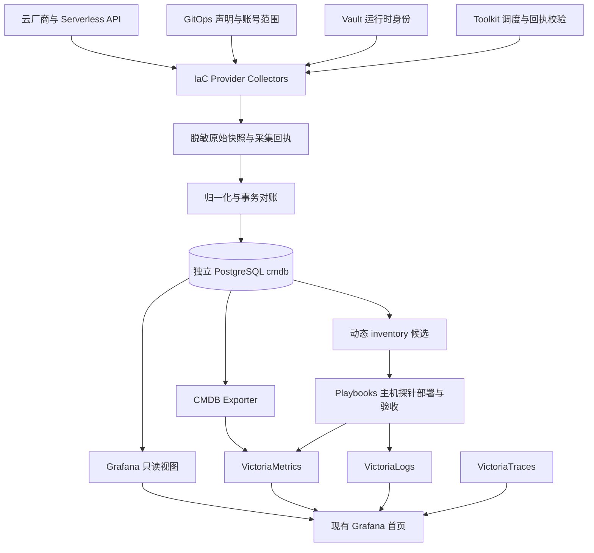

# 多云与 Serverless 动态 CMDB：独立 PostgreSQL 与 Grafana 落地规划

## 1. 已确定的方案与交付边界

CMDB 使用独立 PostgreSQL 数据库 `cmdb`，保存资源事实、观察历史、采集回执、声明关联和监控覆盖。Grafana 复用现有首页 `default-home-dashboard`；VictoriaMetrics、VictoriaLogs、VictoriaTraces 分别承接指标、日志和追踪。

本文是实施规划。数据库实例选址、账号权限、云 API 采集器、Grafana 数据源与面板、动态 inventory、探针部署和在线验收均需按后续阶段完成。本次文档写入不表示上述能力已经上线，也不表示此前请求的全主机探针部署已完成。

“独立数据库”指独立 database、角色、迁移和备份生命周期；可部署在现有 PostgreSQL 引擎中。`postgresql.svc.plus` 是候选接入位置，实际 engine、环境、网络和容量需核实后固定到部署 manifest，不能从 DNS 或旧 inventory 推断数据库落点。

## 2. 首批范围与证据

以下是 2026-10-08 本次会话范围，实施前重新采集。用户提供的数量用于对账，不能直接写入为 API 已确认的运行资源。

| 类别 | 首批数量 | 证据与限制 |
| --- | ---: | --- |
| GCP Compute | 7 | 本次会话 `gcloud compute instances list` 返回 RUNNING；分布于 `open-platform-prod`、`open-platform-shared`、`open-platform-shared-510113`，尚未保存可重放的采集回执 |
| AWS Compute | 1 | 用户提供；账号、区域、原生实例 ID 和状态待 API 核实 |
| Linode / Akamai Compute | 1 | 用户提供；账号、原生实例 ID 和状态待 API 核实 |
| UCloud Global 轻量主机 | 2 | 用户明确 TW 1 台、PH 1 台；产品 API、账号、区域和原生实例 ID 待核实 |
| Compute 范围合计 | 11 | 初始对账目标；发现更多或更少资源时保留差异，由事实驱动数量 |
| Serverless / 托管资源 | 待采集 | 首批核对 Cloud Run、Cloudflare Workers/Pages、Supabase；区分服务、修订、项目和托管数据库 |

两个 Shared GCP 项目均在本次观察中存在运行实例，同名资源必须保留各自项目身份。是否迁移或退役属于独立变更；CMDB 不据此自动停止或删除实例。

之前静态 Ansible 清单的 7 个公网地址仅有端口可达证据，其中存在旧服务映射。它与本次 GCP 7 台不是同一资源集合，不得拼接成正式部署范围。对旧清单按原生 ID、DNS、SSH 和服务关系逐项核对。

## 3. 架构与 owner 分工

| Owner | 交付职责 |
| --- | --- |
| GitOps | 账号/项目/区域与产品 allowlist、环境关联、采集周期、TTL、版本及非敏感 secret refs |
| IaC Modules | 云 API collectors、原生资源归一化、资源对账、CMDB 写入与动态 inventory 输出 |
| Toolkit / Pipeline | 调度、固定 owner SHA、身份获取、输入校验、run 回执、失败汇总和发布门禁 |
| Playbooks | PostgreSQL 引擎核实与独立库初始化、roles/迁移、collector/exporter 服务、Grafana provisioning、主机探针与备份恢复 |
| Observability | 使用说明、安装器版本关联、监控指标与面板语义；服务模板仍由 Playbooks 维护 |
| Knowledge | 本规划、接口约定、阶段证据和验收记录 |

定时采集不应触发 Terraform apply、DNS 修改或主机安装。探针安装通过明确目标和独立部署运行执行。

## 4. 独立 PostgreSQL 数据库

数据库名 `cmdb`，schema `cmdb`。SIT、UAT、PROD 使用各自明确的数据库连接目标；不能默认复用 PROD 连接做测试。Shared 资源可以纳入对应环境的观察模型，但必须保留 `scope=shared` 和使用环境关系。

| 角色 | 登录与用途 | 权限 |
| --- | --- | --- |
| `cmdb_owner` | NOLOGIN，对象所有者 | 拥有 schema 与表 |
| `cmdb_migrator` | 受控迁移身份 | 在迁移运行中使用 owner 权限；不供 collector 使用 |
| `cmdb_writer` | collector 运行身份 | 指定表 SELECT/INSERT/UPDATE 和必要 sequence 权限；无 DDL、无业务库权限 |
| `cmdb_reader` | Grafana 查询身份 | 指定展示视图 SELECT，无写入或 owner 权限 |
| `cmdb_auditor` | 审计与报表身份 | 已脱敏历史及回执视图 SELECT |

初始化流程显式执行 `init`，创建 database/schema/roles；普通 deploy/probe 只检查准备状态。配置 CONNECT、schema USAGE、默认权限与连接限额；按实际共享引擎使用者评估 PUBLIC 权限调整，防止影响其他数据库。访问走受控网络，远程 TLS 校验与 CA 配置纳入 manifest。密码和 DSN 从 Vault 注入，不出现在 Git、进程参数或日志中。

### 4.1 数据表

| 表 | 主要内容 |
| --- | --- |
| `resources` | 资源主键、原生 ID、产品、账号、项目、区域、名称、当前 provider 状态、最近成功观察时间、删除确认 |
| `resource_observations` | 追加观察历史；run ID、provider 时间、接收时间、标准字段和脱敏快照引用 |
| `raw_snapshots` | 按字段 allowlist 保留的 JSONB payload、版本、hash、采集范围与 run ID |
| `collection_runs` | 起止时间、owner SHA、账号/区域/产品范围、分页完成、成功/部分/失败、计数及脱敏错误分类 |
| `desired_resources` | GitOps ref、resource key、期望配置及与 observed 资源的显式关联 |
| `resource_relations` | 服务到修订、服务到主机、域名到服务、Shared 资源使用关系；记录来源与有效期 |
| `monitoring_status` | 原生资源 ID 对应的部署回执、探针版本、最后指标/日志时间和验收结果 |

逻辑唯一键：`(provider, account_ref, project_ref, resource_kind, native_resource_id)`。`project_ref` 对不适用的 provider 使用统一非空值；确保数据库唯一约束不会因 NULL 漏掉重复记录。区域属于原生 ID 作用域时，将区域纳入 canonical ID。资源重建产生新身份；名称和 IP 均为可变属性。

`scope` 支持 `shared/sit/uat/prod/unknown`，另用关系记录消费环境。未确认环境的资源保留 unknown，展示但不进入自动部署候选。原有只允许 sit/uat/prod 的聚合契约需在 owner/caller 中显式扩展 Shared，不能将其强行归入 prod。

### 4.2 事务与保留策略

同一采集范围只允许一个 writer 提交；使用 run ID 幂等和数据库锁防止并发覆盖。分页快照先验证完整性，再事务提交当前状态与观察历史。较旧 run 不得覆盖较新成功观察。部分成功可以保存单项观察，但不能据此推断其他资源已删除。

初始保留提案：raw snapshots 30 天、观察历史 90 天、采集与部署回执 180 天，按容量和审计要求调整。当前资源与退役记录另按生命周期保留。快照剔除密码、Token、private key、环境变量值、启动脚本和可能含凭据的 user data；完整 provider 响应不可未经筛选直接入库。

独立登记备份、迁移版本与恢复演练。初始目标 RPO 24 小时、RTO 4 小时，需在实际引擎与备份设施验证后确认。恢复完成前暂停 writer，验证版本、最新 run 和只读查询再恢复采集。

## 5. Provider 与 Serverless 采集合同

每个 collector 接收 allowlist、分页/超时参数、run ID 和运行时只读身份，输出统一 observations、范围完成标记及回执。身份无实例启停、删除或主机配置权限。API 失败记录 UNKNOWN/采集故障，绝不返回“成功且 0 台”。

| Collector | 范围与核实事项 |
| --- | --- |
| GCP Compute | 明确项目/zone 范围与实例 ID；覆盖两个 Shared 项目，使用全部状态采集再统计 RUNNING |
| AWS Compute | 账号及 region allowlist；实例与分页状态完整采集，区域不从本机默认值推断 |
| Linode / Akamai | 账号、实例 ID、region 和 provider 原生状态；归一化 provider 命名并保留原值 |
| UCloud Global | 优先核实 TW/PH 的实际轻量主机产品、区域代码及可用 API；不能用 UHost API 结果证明 ULightHost 库存完整 |
| Cloud Run | 服务、就绪条件、修订、流量分配、扩缩容配置；实际实例数只从监控观察获取 |
| Cloudflare | 区分 Worker、Pages 项目、deployment 与路由；不把每个路由计成独立服务 |
| Supabase | 记录 project 与托管数据库服务关系；托管数据库归 `managed_database`，避免同时计入 serverless 服务总数 |

UCloud 轻量产品如果没有可用只读 API，使用有时间戳和出处的受控 external inventory，并标记 `source=external_inventory`、验证时间与 TTL。保留 API 缺口，不能将人工条目标记为 provider API 已核实。

Compute 统计运行实例；Serverless 统计服务，revision/deployment 用于明细和历史，不加入主机或服务总数。Serverless 不产生 SSH inventory，监控通过产品指标、日志导出和 HTTP 探测接入。

## 6. 状态与删除判定

采用独立状态维度，避免一个综合状态混淆云、网络和探针事实：

| 维度 | 示例 |
| --- | --- |
| provider_state | running / stopped / suspended / ready / failed / unknown；同时保留原始 provider 状态 |
| freshness | fresh / stale / never_observed |
| health | healthy / degraded / unreachable / unknown，来自独立探测 |
| declaration | matched / drifted / declared_only / observed_only |
| monitoring | reporting / missing / stale / deployment_failed / not_applicable |
| lifecycle | present / missing_candidate / deletion_confirmed / retired |

一次完整采集未发现资源，只标记 missing_candidate。建议至少连续 3 次范围完整成功且超过 15 分钟后，再结合原生 ID 查询确认删除；权限变更、范围缩小、API 超时和分页失败不能触发删除。人工退役还需生命周期回执。云状态 stopped/suspended 不表示删除。

Compute 和 Serverless 建议每 5 分钟采集、freshness TTL 15 分钟；HTTP/监控覆盖检查每分钟一次。Provider 限速、账号规模和运行成本在 UAT 校准。采集故障时保留 last_known_state 和时间，当前视图明显标记 stale/unknown。

## 7. Grafana 首页集成

目标首页：[现有 Observability Home](https://observability.svc.plus/grafana/d/default-home-dashboard/home)。本规划以用户给出的 UID 为接入目标，尚未读取并确认在线 dashboard JSON、权限和 provisioning 来源。

通过固定版本的 Playbooks 新增 PostgreSQL datasource UID `cmdb_postgres`，使用 `cmdb_reader` 和脱敏展示视图；schema、只读视图和连接权限部署完成后，再提供 datasource。Grafana 查询 SQL 必须只读，并设置超时和合理结果上限。

建议提供 `v_resource_current`、`v_provider_summary`、`v_collection_health`、`v_monitoring_coverage`、`v_serverless_current`、`v_resource_history`。当前资源视图按最新有效观察返回；历史视图支持 Grafana 时间范围，避免首页“过去 1 小时”筛选误隐藏最后观察早于窗口的 stale 资源。

| 面板 | 数据源 | 展示 |
| --- | --- | --- |
| Compute / Serverless / Managed Database 总览 | PostgreSQL | 各类型独立计数、运行与就绪数量、unknown/stale 数量 |
| Provider / Scope / Region 分布 | PostgreSQL | GCP、AWS、Linode、UCloud TW/PH；Shared 单列 |
| 资源明细 | PostgreSQL | ID、环境归属、产品、IP/URL、状态、来源、last_seen、声明差异 |
| 采集健康与数据新鲜度 | PostgreSQL + VictoriaMetrics | 成功、部分、失败、范围完成、最近成功与延迟 |
| Compute 监控覆盖 | PostgreSQL + VictoriaMetrics | 运行主机、已验收探针、最近指标/日志、覆盖缺口 |
| Serverless 服务与修订 | PostgreSQL | Ready、revision、traffic、URL、配置与观察时间 |
| CPU/内存、日志与追踪 | 现有监控数据源 | 原有运行时观测与资源明细链接关联 |

保留现有 `environment`、`DS_METRICS`、`DS_LOGS`、`DS_TRACES`、`target_instance`、`alert_state` 变量合同，新增 provider/region/resource_kind/resource_status。Shared 与 unknown 选项需明确设计并校验现有 panel 行为。以 canonical resource ID 为关联键，兼容现有 instance 标签映射，不能只按名称连接两个 Shared 项目。

CMDB exporter 输出低基数指标，例如 `cmdb_resources{provider,scope,kind,state}`、`cmdb_collection_last_success_timestamp_seconds{collector,account_ref}`、`cmdb_collection_run_success` 和 `cmdb_monitoring_coverage_ratio`。Exporter 服务自身由 `up` 监控；资源运行状态和探针上报状态分别统计。IP、任意 tags、错误详情与完整 JSON 留在 PG 明细中。

## 8. 动态 inventory 与探针补齐

动态 inventory 是部署输入的候选输出；正式部署还需绑定允许范围、数据库快照/run ID、owner SHA 与唯一主机身份。候选条件：kind=compute、provider_state=running、freshness=fresh、环境已确认、SSH 地址/用户/认证引用明确。

从 CMDB 事实导出 non-secret inventory，随后只读验证 SSH 认证和 reviewed known_hosts；使用 `StrictHostKeyChecking=yes`，不自动接受新指纹。vault refs 可以作为引用，Token、密码、私钥值不得写入 inventory。

探针执行入口为 Playbooks `deploy_observability_agent.yml`。先确认 OS/Python、已有 exporter/Vector、现有 Billing/Xray 采集和配置备份，再分批部署。不能把已有 Vector 的 Billing fan-out 配置覆盖为独立安装器默认值。Vault 监控认证、云只读认证、数据库 writer/reader 身份各用自己的授权合同。

逐台验收服务状态、本机指标、认证写入、中心端最近两个采集周期的新指标和日志，以资源 ID、版本、run ID 写入 monitoring_status。服务启动或一次 HTTP 接受只构成中间证据。Serverless 的 monitoring_status 使用产品采集/健康检查回执，不作为“缺少主机探针”告警。

## 9. 分阶段落地与验收

| 阶段 | 交付物 | 完成条件 |
| --- | --- | --- |
| P0 资源合同与现状核实 | 11 台候选身份对账、Serverless 清单、Shared/环境映射、PG engine/落点、在线 Grafana JSON 与版本 | 每条身份和来源可复核；缺口明确；保存原首页备份 |
| P1 独立数据库 | GitOps DB manifest、Playbooks init/migration、权限与脱敏视图、备份配置 | UAT 独立库就绪；reader 写入失败、writer DDL 失败、跨业务库隔离；备份恢复成功 |
| P2 Provider Collectors | IaC collectors、快照归一化、Toolkit 调度和回执 | GCP 全状态采集；AWS/Linode/TW/PH 原生身份确认；分页、403、限速、部分失败与重复 run 验证 |
| P3 Serverless 与对账 | Cloud Run/Cloudflare/Supabase adapters、desired 关联、删除/TTL 状态 | 服务计数不含修订；API 故障不变为零库存；旧 run 不覆盖新 run；Shared 无误归类 |
| P4 Grafana 与 exporter | PG datasource、视图查询、首页新增 panels、采集健康告警 | 登录态页面可用；当前/历史查询语义正确；无 datasource error；数量与相同 run 的 API 对账一致 |
| P5 主机监控覆盖 | 受控动态 inventory、分批探针、验收回执 | 11 台候选逐台确认实际范围；两周期连续上报；失败项保留准确目标与回执 |
| P6 PROD 发布 | PR、main、不可变 tag、环境部署与证据包 | UAT 完整验收后按保护流程晋级；记录实际 owner/caller SHA 与 live 证据 |

拟议调度 DAG：validate-scope → 并行 collect-provider → normalize-and-commit → verify-receipt → publish-inventory-and-summary。失败的 provider 范围保留失败回执，不阻止其他已验证范围提交；整体 run 标记 partial，部署仅消费指定 fresh 的成功范围。Grafana/exporter 常驻读取 PG，探针部署作为独立授权任务。

### 9.1 必要验证场景

- 同名主机跨 project/account 不合并；IP 更换、资源重建、Shared 双项目保持正确身份。
- 多页 API、空但完整的响应、403、超时、限速、范围缩小、部分成功都有不同回执。
- 删除候选连续确认、TTL 超时、旧 run 重放、重复 run、writer 并发不会损坏当前事实。
- 原始 payload 含疑似秘密字段时筛除；日志和回执不含 DSN/Token/user data。
- Grafana reader 不能写表或读秘密；数据库恢复后 collector 可恢复且迁移版本一致。
- 探针已有 Billing/Xray 配置保留，失败部署回执不能写成 reporting。

## 10. 回退与待核实项

先暂停采集调度、保留最后成功状态与故障回执。应用回退到上一不可变版本；数据库优先使用前向修复，破坏性 schema 变更另行规划。Grafana datasource/panel 回退使用 P0 备份，探针配置使用部署前备份，所有回退结果都需现场验证。

实施前待核实：PG 实际 engine 与运行环境；各账号/区域只读身份；UCloud 轻量产品 API；Serverless provider 范围；Shared 环境契约扩展；Grafana 在线 provisioning owner；CMDB 数据库授权/备份资源；现有探针与 Vector 配置。Token 在用户终端注入不表示 agent 工具 shell 已继承环境，实施时须通过可用的受控身份通道验证，不从终端历史或输出提取秘密。

## 11. 关联资料

- [多云平台工程技术白皮书](multi-cloud-platform-engineering-whitepaper.zh.md)：四仓职责、Shared 生命周期与 Vault 路径迁移。
- [Toolkit Daily Main Snapshot 实施规划](platform-ops-toolkit-daily-main-snapshot-plan.zh.md)：调用层、快照与证据边界。
- [平台操作中心与 Daily Snapshot 发布验收架构](../design/platform-operations-daily-snapshot.zh.md)：资源与发布状态关联。
- [Supabase 操作参考](supabase-operations.zh.md)：托管数据库的受控读写身份。

源码语义参考：Toolkit `docs/resource-aggregation-model.md`（desired/observed 分离）、Playbooks `deploy_observability_agent.yml`（采集入口）、Observability `docs/zh/architecture.md`（数据链路与固定 Playbooks 消费）。本次仅核对本地源码；实施回执必须另记实际提交 SHA 与部署环境。

## 12. 2026-10-09 实施进展

Shared 独立 UAT `cmdb` 已完成显式迁移、GCP Compute/Cloud Run 真实快照入库、幂等重放、reader 写入拒绝、writer DDL 拒绝与 Grafana 6 个面板只读验证。当前结果为 7 台运行实例、1 台暂停实例、4 个 Ready Cloud Run 服务；一个 Cloud Run 范围保留 API 403 故障回执。按需快照不表示定时采集已启用。

完整目标、owner commit、run ID、备份和未完成项见[Shared UAT 证据](cmdb-shared-uat-evidence-20261009.zh.md)；身份路径与权限提案见[Vault KV 路径规划](cmdb-vault-paths.zh.md)。按用户要求不补全 bootstrap 脚本；Vault provision、只读身份授权、其余 provider、探针部署和恢复演练仍待执行。
