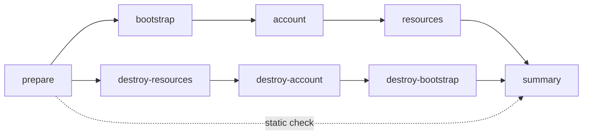

# 六云统一 IaC Pipeline：Bootstrap、账号、资源与销毁设计

**版本：0.7 · 盘点日期：2026-10-07 · PROD 发布规则修订：2026-10-10 · 状态：设计评审稿，尚未实施。**

本文把六个 provider 的资源管理收敛为一套阶段契约：`prepare → bootstrap → account → resources → summary`；销毁采用独立的反向链路。统一 pipeline 同时支持手动运行和被 Selfhost/Serverless orchestrator 调用。八个 job 的主 DAG 保持不变，整合通过统一命名、契约和复用实现，不把全部身份、provider 和自检逻辑合成一个大 workflow。**platform-ops-toolkit 持有 orchestrator 与 pipeline；iac_modules 通过 .github/actions 提供固定版本的资源执行能力。** GitOps 负责目标声明，Vault 提供受约束的运行时身份和凭据。

**iac_modules 是依赖 GitOps 声明配置的执行库，不是可独立部署环境的 pipeline。** 它提供可复用 actions、Terraform 模块、renderer 与执行脚本；仅有 IaC 仓库源码不能确定部署目标或执行资源操作。完整链路是：固定 GitOps 声明 → Toolkit 校验/编排 → IaC action 执行 → 资源事实与 receipt。目标环境、provider、账号、namespace、组件和保护策略必须来自经验证的声明，运行时身份来自 Vault/联合认证。

IaC 相关 actions 统一存放在 `iac_modules/.github/actions/`，包括目标契约校验、自检、阶段执行、认证、生命周期、receipt 验证和汇总。Toolkit 通过固定版本的 uses 复用这些能力，并继续持有目标选择规则、审批、DAG 和最终放行决策；通用 orchestrator 功能不因 IaC action 归并而迁出 Toolkit。

v0.7 补充 GCP VM 承载的 PROD workload 发布边界：先创建 immutable `v*` release tag；不触发 Toolkit 部署流水线；授权操作员通过 GCloud SSH 手动对齐主机前置状态，再由 GitOps + Doco-CD 收敛应用。现有 tag-triggered workflow 必须先关闭或改为不执行 PROD 部署，避免创建 tag 时自动发布。

本次没有执行 release tagging、GCloud SSH、Doco-CD 部署或 PROD 验收；本修订是待实施设计。六云 IaC pipeline 的 stage 契约和 DAG 不因该人工应用发布路径而改变。

该说明保留设计 v0.6 的原始审计范围；后续编码、清理、PR 与尚未完成的运行验收另见 [2026-10-07 分批执行记录](multi-cloud-iac-cleanup-batches-20261007.zh.md)。

相关资料：[平台工程白皮书](multi-cloud-platform-engineering-whitepaper.zh.md)、[多云身份 Bootstrap 与状态契约](../../content/02-iac-devops/cloud-infrastructure-devsecops-baseline/11-cloud-oidc-bootstrap-contract.zh.md)、[参考资料索引](index.md)。历史资料的适用日期及管理模式须单独判断，不能把旧文档中 UCloud/ULightHost 的合并槽位当作本设计的 provider 分类。

## 1. 范围与源码证据

### 1.1 固定基线

| 来源 | 本轮读取版本 | 证据范围 |
| --- | --- | --- |
| platform-ops-toolkit | `854d125534a3e53d79f6e0cab997654876cc421b` | 九个主分析 workflows；Akamai/external adapter；两个 orchestrator；provider registry、认证 action、bootstrap 和 self-check 脚本 |
| iac_modules | 本地 `origin/main` 快照 `dedb5598046393172460667a65219081b60c4920` | `AGENTS.md`、统一 state 契约、模块目录；通过 `git show` 读取，不改变旧本地 checkout |
| knowledge | HEAD `109f89c634efab1a46b058e7e3b7300cf613872b`，含既有未提交文档修改 | 内容规范、身份契约与白皮书上下文；只新增本文，不修改既有工作树文件 |

固定源码能证明路径和调用逻辑存在，不能证明云端身份、Vault 权限、资源或 state 当前可用。本轮未把 provider registry 中的认证模式视为已通过真实认证验收。

### 1.2 六个 Terraform provider

| Provider | 统一标识 | GitOps provider 目录 | Terraform tree | 当前 registry 认证模式 |
| --- | --- | --- | --- | --- |
| AWS | `aws-cloud` | `aws` | `aws-cloud` | `aws-oidc` |
| Azure | `azure-cloud` | `azure` | `azure-cloud` | `azure-federated-identity` |
| Vultr | `vultr-vps` | `vultr` | `vultr-vps` | `vault-vultr-token` |
| GCP | `gcp-cloud` | `gcp` | `gcp-cloud` | `gcp-wif-vault` |
| UCloud | `ucloud` | `ucloud` | `ucloud` | `vault-ucloud-api-key` |
| Akamai Cloud | `akamai-cloud` | `akamai` | `akamai-cloud` | `vault-linode-token` |

统一 provider 意味着统一参数、生命周期、状态隔离和 receipt，不要求所有云都使用 OIDC。UCloud、Vultr、Akamai 当前使用 Vault 托管的 provider key/token；不得把这些路径描述成原生云端 OIDC 联合身份。

ULightHost 是独立的 existing inventory adapter，不属于这六个 Terraform provider。它不得进入 Terraform create/destroy；Selfhost 的 existing-host 复用能力也不因本次聚合而隐式改变管理模式。Cloudflare 的已有 DNS owner 链路保持明确边界，不自动扩展为第七个全栈 provider。

## 2. 当前 jobs/steps 统计

### 2.1 九个主分析文件

显式 step 按 YAML 中 `jobs.<id>.steps` 数组长度计数，不展开 composite action、不把 reusable 调用重复计入子文件，也不把条件跳过的 step 从静态统计中扣除。

| Workflow | Job 定义 | 显式 steps | 主要构成 | 当前触发方式 |
| --- | ---: | ---: | --- | --- |
| `iac-pipeline-multi-cloud-master.yaml` | 8 | 2 | prepare + 七个 reusable 调用 | push、dispatch |
| `iac-pipeline-multi-cloud-landingzone-baseline.yaml` | 2 | 12 | landingzone 12 + GCP 调用 | push、PR、dispatch、call |
| `iac-pipeline-multi-cloud-account-matrix.yaml` | 2 | 14 | component matrix 14 + GCP 调用 | push、PR、dispatch、call |
| `iac-pipeline-multi-cloud-resources-matrix.yaml` | 2 | 12 | component matrix 12 + GCP 调用 | push、PR、dispatch、call |
| `aws-oidc-bootstrap.yml` | 1 | 11 | AWS 信任恢复及 PROD state adoption | dispatch |
| `gcp-oidc-bootstrap.yml` | 1 | 23 | WIF/IAM bootstrap、凭据清理、运行时记录 | dispatch |
| `gcp-iac-pipeline.yml` | 1 | 24 | manifest、认证、render、Terraform、验证与 inventory | dispatch、call |
| `ucloud-iac.yml` | 1 | 15 | account 绑定、render、Terraform 与 inventory | dispatch、call |
| `iac-self-check-matrix.yml` | 3 | 11 | prepare 2 + matrix 6 + summary 3 | dispatch、PR、push |
| **合计** | **21** | **124** | **原四文件 14 jobs / 40 steps；新增五文件 7 jobs / 84 steps** | |

补充读取的 `akamai-cloud-iac.yml` 为 1 job / 16 steps，`external-inventory-state.yml` 为 1 job / 7 steps；两者不计入上述九文件合计。Selfhost/Serverless 是 caller 分析范围，也不计入该表。

### 2.2 原四文件的 steps

| Job | Steps 顺序 |
| --- | --- |
| master.prepare-matrix | Checkout → 解析 account/resources 组件 |
| baseline.landingzone | Checkout Toolkit → Checkout IaC → Vault → 环境准备 → GCP 认证 → Init → Plan → 上传 Plan → Apply → 验证 → SMTP 凭据 → 通知 |
| account.terraform | Checkout Toolkit → Checkout IaC → Vault → 环境准备 → GCP 认证 → AWS 配置 → AWS 认证 → Backend 参数 → Init → Plan → Apply → Destroy → Skip → Output |
| resources.terraform | Checkout Toolkit → Checkout IaC → Vault → 环境准备 → GCP 认证 → Backend 参数 → Init → Plan → Apply → Destroy → Skip → Output |

GCP 认证 step 虽在三个通用执行 job 内，但这些 job 的条件排除了 GCP；GCP 实际经各自的 reusable 分支进入整栈 workflow。baseline 声明了 `deploy_dry_run`，当前执行 steps 未用它控制变更；baseline 也没有对应的 Destroy step。

### 2.3 矩阵展开口径

原 master 默认 `account=[vpc,role]`、`resources=[s3,ec2]`，三层开启时，AWS/Azure/Vultr 路径有 6 个带 steps 的执行 job、66 个 step 槽位：`2 + 12 + 2×14 + 2×12`。不计 reusable 调用节点及未选中的分支。

现有 self-check 默认只选 AWS/GCP/Azure/Vultr/Akamai：展开为 7 个执行 jobs、35 个 step 槽位。若补齐六云，展开为 8 jobs、41 个槽位；这是设计后的预计值，不是当前默认行为。总 step 数也不能视为运行耗时或验收覆盖。

## 3. 五个新增 workflow 的融合结论

### 3.1 AWS OIDC Bootstrap：身份恢复与纳管

当前 11 steps：三步 checkout/render → 条件 checkout identity module → 加载 bootstrap key 和可选 session token → 条件加载 state → reconcile trust → 用新 OIDC role 登录 → 条件安装 Terraform → 条件 adoption。

该 workflow 只支持 plan/apply、UAT/PROD。GitOps 和条件 IaC checkout 仍使用 `main`。恢复脚本核对 AWS 实际账号、信任 audience/subjects 和 root break-glass；`allow_root_break_glass` 必须保留为专用恢复授权，不能通过普通应用部署默认打开。PROD apply 对固定的三项身份资源进行 state adoption，脚本含固定账号和独立 bootstrap key；UAT 不走这份 PROD adoption。

融合位置：统一 `bootstrap` 调用独立的 AWS bootstrap 模块，该模块保留可单独运行和被复用的能力。普通 resources 调用仅验证已建立的信任及账号绑定；显式 identity reconcile 调用才加载受控 bootstrap 凭据。reconcile、import、云端 IAM 执行迁入 IaC Modules；Toolkit 保留审批、Vault 授权与调用。AWS 第二账号支持需要先把环境级 bootstrap 声明和凭据扩为 account-scoped，不能仅增加矩阵行。

### 3.2 GCP OIDC Bootstrap：建立 WIF 与收尾

23 steps 包括：固定 GitOps/IaC checkout、身份声明校验、Vault backend 与一次性 credential、token 交换、项目与权限校验、tfvars、Init/Validate、Import、Plan/Apply、outputs、credential cleanup、WIF 登录、项目访问与 UAT 隔离验证、写运行时 Vault 记录。

保留的契约是 bootstrap principal 与 runtime principal 分离，GitOps project 与实际身份一致，一次性凭据清理以及 UAT/PROD 隔离验证。当前支持 UAT/PROD/shared，不支持 SIT。

**现状问题：Import step 没有 action 条件，plan 路径仍可能执行 `terraform import`、改变 remote state。** 不能把当前 bootstrap plan 描述为严格只读。目标设计把 adoption/import 放入独立维护操作，普通 plan 只报告待纳管对象；不得自动 import、migrate-state、refresh-only apply 或写 Vault 业务记录。[Terraform import 官方说明](https://developer.hashicorp.com/terraform/cli/commands/import)明确说明 import 将对象加入 state。

当前 cleanup 位于新 WIF 验证和运行时记录持久化之前，且部分失败只产生 warning。目标 receipt 必须分别记录 identity readiness、cloud credential revocation、Vault credential removal 和 runtime metadata publication。正常路径先验证可用 runtime identity，再清理；失败收尾仍独立执行既定凭据清理，不能因 runtime 验证失败而默认延长 bootstrap 凭据寿命。半完成状态必须报告失败及人工恢复所需的非敏感标识。

融合位置：统一 `bootstrap` 的 GCP adapter；WIF/IAM/Terraform 与 credential 生命周期的 provider 执行归 IaC Modules，Vault 角色/授权与受控非秘密记录发布仍按 Toolkit 控制面契约交接。现有控制面 state key 单独兼容，不能套用工作负载 key 后直接换 backend。

### 3.3 GCP IaC Pipeline：整栈执行器拆分

24 steps 可归为声明/身份/渲染 9 步、backend 2 步、Validate 1 步、条件 adoption 3 步、Plan/Apply/Destroy 3 步、资源验证 3 步、inventory 生成/发布/附加 3 步。

可复用能力：环境/账号/项目校验、manifest-derived state、WIF 登录、保存 plan 后 apply、持久化主机/data disk 保护、VM 状态核对及 CMDB 输出。已有 `shared` 和 `web-saas` destroy 限制必须保留。

整栈中 network、共享组织策略、IAM、VM 和磁盘不能机械地在三个 stage 各执行一次。先形成资源 identity/address → stage → state 的唯一归属表，再拆 adapter。state adoption、legacy backend migration 和 privileged policy import 移入显式维护流程，不随日常 resources apply 自动发生。plan 路径的 backend migration 参数也必须拒绝或仅报告，不能因 Init 分支执行而隐式迁移。

融合位置：认证信任建于 bootstrap；账号级网络/通用权限归 account；工作负载 VM、磁盘及独立 namespace 资源归 resources。inventory 继续由 IaC Modules 产生，不将云事实手工写回 GitOps。

### 3.4 UCloud IaC：资源执行与前置资源引用

15 steps：三步 checkout → state contract → account/workspace 校验 → Vault → credential binding → Terraform setup → manifest → render → backend → Validate/Plan → Apply/Destroy → inventory → 写 inventory/run record。

现有 workflow 已按环境/account 读取 UCloud 凭据，并校验 `UCLOUD_PROJECT_ID == account`；同时要求 `UCLOUD_SECURITY_GROUP_ID`、`UCLOUD_KEY_PAIR_ID`。对应 credential helper 只负责写/check 凭据，其注释提到独立 bootstrap Job 会提供两个资源 ID，但该注释不证明其 caller、state owner 或 live 验收已完成。

融合位置：凭据引用及可用性验证归 bootstrap；共享 security group/key pair 若由本目标管理则归 account；UHost 等归 resources。非敏感资源 ID 逐步由受校验 account receipt 或声明引用交接，避免把“secret record 中有 ID”当成资源归属证明。API key 留在 Vault，不写入公开 receipt。

当前 plan 后 apply 会重新计算，未保存并消费同一 plan；inventory/run JSON 也缺少统一的父运行、owner SHA、checksum 和 convergence 字段。目标 adapter 补齐这些契约；保留 UCloud API key 模式，不虚构 OIDC 能力。

### 3.5 IaC Self-check：静态门禁与独立 CI

当前 self-check 不认证 Vault、不运行 Terraform plan、不调用云 API。它检查 registry/module tree/manifest 覆盖，生成 provider JSON/Markdown，并上传汇总。

需要修正的源码缺口：

- workflow 默认字符串在 dispatch 和 prepare fallback 中均遗漏 UCloud；空输入也会被 fallback 替换，未实现描述中的“空值即全 registry”。
- 脚本使用跨 provider 的环境默认 account，SIT/PROD 默认含 `primary`；报告 state 的 project 使用脚本常量 `STATE_PROJECT`，不能代表 manifest 解析出的真实目标。
- 没有 manifest 等部分缺口被标为 WARN，可能 exit 0；aggregate 会忽略损坏 JSON，没有 expected-target 集合，空报告也可能返回成功。
- checkout 未固定 IaC/GitOps SHA；汇总不证明六云运行时可用，也不证明身份/区域隔离。

融合位置：抽出无凭据的共同静态校验器并封装为 `iac_modules/.github/actions/iac-self-check/`，在 unified pipeline 的 prepare 内复用；`iac-self-check-matrix.yml` 保留独立 PR/push 静态 CI，并扩展 dispatch/workflow_call，把 `gcp-iac-pipeline.yml`、`ucloud-iac.yml` 的独立操作入口合并进来。该文件目标定位为“六云矩阵自检与独立操作入口”，check 默认；显式 plan/apply/destroy 转调用统一 master，具体执行仍使用 IaC owner。

日常 master.prepare 只调用共同静态校验器，不反向调用该矩阵 workflow，避免形成 `matrix → master → matrix` 循环。独立 coverage 报告可保留 WARN，执行门禁必须对所选目标的缺声明、缺 adapter 或 account 不匹配判定失败。

目标入口模式与 jobs：

| 触发/操作 | 路径 | 约束 |
| --- | --- | --- |
| PR / push | prepare → self-check → summary | 强制 check；无 Vault/云认证或资源写入 |
| dispatch / call + check | prepare → self-check → summary | 与静态 CI 复用 checker；报告 provider 覆盖 |
| dispatch / call + plan/apply/destroy | prepare → execute-iac → summary | 要求 target_manifest 与固定 refs；execute-iac 调用 master，消费其 receipt |

该矩阵入口拟定义四个 jobs：prepare、self-check、execute-iac、summary；它不改变 master 的八个 jobs。self-check/execute-iac 二选一，summary 校验选中路径，未选路径记 not_selected。操作级审批、正反向 DAG、state 保护和 provider 执行都复用 master/owner；矩阵入口不再复制这些逻辑。当前源码仍是三个静态 jobs，尚未实现上述扩展。

原 GCP state migration/adoption 等专用维护参数不自动进入这个普通操作入口，应转入受控 maintenance 模块。GCP/UCloud 的旧 workflow 文件仅在过渡期保留转发，caller/UAT 完成后可退役；现有保护规则、环境限制和资源验证随 owner 保留。

## 4. 目标分层与所有权

### 4.1 三仓硬契约

| 仓库 | 持有内容 | 交接方式 |
| --- | --- | --- |
| gitops | 声明式 config：目标、账号、区域、组件、阶段依赖、保护策略与非敏感引用 | 固定 gitops_sha 的 manifest/config，保留来源路径和 digest |
| platform-ops-toolkit | orchestrator/pipeline、目标选择、校验、runner、审批、顺序及最终结果 | 将受校验 GitOps config 和固定 IaC 版本交给对应 action |
| iac_modules | IaC 相关的目标校验/自检/执行/证据 actions、Terraform 模块、renderer、provider/state/inventory 执行脚本 | 必须消费 GitOps 配置和 Toolkit 调用契约，返回验证结果、资源事实与 receipt |

IaC action 接收到的 target-contract 是 GitOps 配置的受控派生物，必须保留 gitops_sha、来源路径与 manifest digest，并核对环境/provider/account/workspace 一致。Toolkit inputs 用于选择操作和目标，不能覆盖声明中的目标身份后继续执行。

缺少 GitOps checkout、固定 SHA、适用声明或必要 config 时，必须在云/state 变更前停止；不得回退到 IaC 仓库示例配置、默认账号或上一运行生成的 tfvars。生成的 backend、Terraform root、tfvars 与 inventory 是本次运行的派生工件，不能成为绕开 GitOps 的第二份目标配置。当前 AWS bootstrap 等读取 IaC 本地环境 config 的 LEGACY 路径，须先盘点并迁移声明归属，不能因 action 化而默认为符合此契约。

### 4.2 阶段职责

| Stage | 管理对象 | 默认行为 | 排除内容 |
| --- | --- | --- | --- |
| prepare | 目标、版本、能力、依赖、静态自检 | 无凭据校验与生成矩阵 | 云端写入、state adoption |
| bootstrap | 联合信任、部署身份、组织/LandingZone 基础控制 | 普通 caller 验证已有基础；显式 standalone 请求才 reconcile | 创建用于支撑自身运行的未就绪 Vault/backend；应用、数据库初始化 |
| account | 账号级共享网络、子网、通用 role/policy、受声明控制的访问资源 | 按账号/组件执行 | 工作负载专属角色及资源不得重复纳管 |
| resources | namespace/workload 的 VM、磁盘、存储、LB 等 | 按声明管理并输出资源事实 | SSH/Ansible、服务安装、数据迁移、业务健康验收 |
| summary | 阶段 receipt、目标覆盖、plan 变更与最终状态 | 汇总、校验、失败关闭 | 用绿色 workflow 代替业务验收 |

LandingZone 中的资源按实际作用分配到 bootstrap 或 account；不能保留旧 landingzone 全量执行器后又在 account 管理同一 VPC/IAM。工作负载专属 identity 也可以归 resources，关键是全局唯一的资源/state owner。

Vault 初始信任和可用 backend 是前置管理基础。首次接入尚无运行时 OIDC 时，使用专用、短期、经审核的 bootstrap 路径；pipeline 不得循环依赖“先用待创建身份登录”或“先把 backend 写到尚未创建的 backend”。共享 backend 使用独立管理 lifecycle，普通资源链不能将其作为自身销毁目标。

## 5. 正向、销毁与静态检查 DAG

统一入口定义八个 jobs。六个执行阶段通过 matrix 调用同一个 `iac-pipeline-multi-cloud-stages.yaml` reusable 编排模块。该文件包含 bootstrap/account/resources 三个 jobs，每次调用通过 stage 选择其中一个。三个 jobs 在 Toolkit runner 中通过 step-level uses 调用固定版本的 IaC Modules composite action，执行代码仍由 IaC Modules 维护，不在 IaC Modules 新增交付 workflow；prepare 和 summary 是 Toolkit 控制面 jobs。destroy 分支复用该文件及相同 action，传入 action=destroy；不复制三套 Terraform 销毁实现。



| Job | 执行条件 | 依赖与产物 |
| --- | --- | --- |
| prepare | 所有操作 | 固定 SHA；目标及 dependency 集合；能力/保护校验；分层 matrix；静态报告 |
| bootstrap | plan/apply 且选中该层 | bootstrap plan/readiness 或 reconcile receipt |
| account | plan/apply 且选中该层 | prepare 成功；bootstrap 成功或已验证；account receipt |
| resources | plan/apply 且选中该层 | 所有必要基础依赖已验证；plan/inventory/CMDB/receipt |
| destroy-resources | destroy 且选中该层 | destroy plan、目标归属、保护校验；清理验证 receipt |
| destroy-account | destroy 且选中该层 | 下游已清理且无外部引用；account 清理 receipt |
| destroy-bootstrap | destroy 且选中该层 | account 清理验证通过；仅目标拥有且允许删除的基础对象 |
| summary | 请求结束后尽力运行 | 直接依赖 prepare 和六阶段；综合 needs 与 expected receipt 判定 |

1. 一次只执行正向、销毁或静态检查路径；未选路径标记 `not_selected`。
2. 上游失败造成的 skipped 是 `blocked`，不能当作用户关闭或 `not_applicable`。resources 校验 bootstrap/account 全部必要依赖，修复当前 master 仅接受 account skipped 而可能穿透 baseline 失败的问题。
3. 矩阵采用 `fail-fast: false` 收集结果。初版采用阶段屏障：一层必选目标失败，下一层停止；不声称矩阵自动按目标一一串联。后续可按独立依赖闭包分组提高并发。
4. prepare 失败时 summary 仍记录 needs 结果；receipt 不完整时不能放行。整个运行被强制取消时无法保证收尾 job 执行，caller 必须把 cancelled/缺 summary 判为失败，并安排目标状态核对。
5. 静态 `check` 只执行 prepare/summary；无 credentials、Init、云 API 或 state 写入。
6. 全新环境的 account/resources plan 若依赖尚未创建的上层 ID，标记 `blocked_by_unprovisioned_dependency`；不能伪造 ID 或声称完整 plan 已通过。分层 apply 后重新规划下一层，记录实际消费的前置 receipt。

### 5.1 销毁保护

全量销毁指所选目标声明的可销毁依赖闭包，不是整个云账号。protected/shared/external 对象、独立持久化数据卷、共享管理网络、执行身份、backend 和 state 证据不得随业务栈自动删除。

每层先生成 destroy plan，核对资源集合、删除/替换、依赖引用及环境审批，再执行审核过的计划；下游清理和事实核对成功后才允许上一层。`stage_scope=resources` 只销毁目标资源；`all` 也不能绕过 shared/protected 策略。失败、超时或取消可能已产生部分变更，必须先核对 target state 与 receipt，再决定重试。

正常销毁保持管理身份、锁及 backend 可用，直到最后的验证和证据发布完成。专门退役管理身份/backend 是独立生命周期操作，本 pipeline 不提供随业务销毁自动注销自身的路径。

## 6. 统一输入、输出和 receipt

### 6.1 入口

保留 `iac-pipeline-multi-cloud-master.yaml` 为统一聚合入口，同时声明 workflow_dispatch/workflow_call。bootstrap/account/resources 编排合并为一个 stages 模块；AWS/GCP 身份 bootstrap wrapper 仍在 Toolkit，IaC owner provider action 独立维护。`gcp-iac-pipeline.yml`、`ucloud-iac.yml` 的独立资源操作入口合并到 `iac-self-check-matrix.yml`，由该入口复用 master。LEGACY 标记用于旧命名、重复实现或旧执行归属，不能因一个 owner action 独立存在就判定必须删除。

| 输入 | 目标规则 |
| --- | --- |
| action | `check / plan / apply / destroy`；新增 check 表示静态校验，plan 默认 |
| environment | `sit / uat / prod / shared`；provider/阶段不支持该环境则停止，不回退 UAT |
| target_manifest | 必须引用固定 GitOps SHA 内的目标/config；单目标引用一份 resource manifest，多目标逐行定义六要素；缺声明不得执行 |
| gitops_ref、iac_ref | 解析为固定完整 SHA；禁止执行阶段重新 checkout main；owner action 与模块版本默认绑定同一 iac_sha |
| stage_scope | `all / bootstrap / account / resources`；独立运行可显式选择 all，orchestrator 默认 resources |
| bootstrap_mode | `verify / reconcile`，默认 verify；reconcile 需显式 bootstrap 范围及对应授权 |
| github_environment | 由受控环境映射决定；caller 不能任意选择宽权限 Environment |
| correlation_id | 根运行关联值；provider 目标由声明确定，不能靠该值覆盖目标身份 |

原 `deploy_action/vault_env_path/state_account/resource_manifest` 等参数在兼容层归一化。新旧参数同时提供且不一致时失败，不用优先级掩盖冲突。adoption、state migration、root break-glass 归独立维护入口，普通 deploy/upgrade 不隐式启用。

### 6.2 输出

workflow_call 输出统一由 summary job 生成：`result`、`gitops_sha`、`iac_sha`、`receipt_artifact_id`、`receipt_sha256`、`inventory_artifact_id`、`deploy_matrix`。大型矩阵/清单通过 artifact 交接，小规模 JSON 才放 output。

每个目标/阶段 receipt 至少记录：schema_version、correlation_id、caller run ID/attempt、Toolkit workflow ref/SHA、目标 ID、environment/project/provider/account/workspace、stage/action、requested/resolved refs、owner action 路径与代码 SHA、manifest digest、state key、plan digest、变更统计、阶段结果、跳过原因、验证结果及 inventory digest。bootstrap 增加 runtime identity readiness 和 credential cleanup 状态；destroy 增加目标清理验证。

不同操作分别标记 `static_checked`、`planned`、`applied_verified`、`destroyed_verified`，不能统一称为 deployed。只读前置检查用 `verified_existing`，无适用对象用 `not_applicable`；不可执行或缺证据用 failed/blocked。

credential、access token、session、原始 tfstate 和未脱敏 Terraform 输出不得进入公开 receipt/summary。Terraform plan 可能含敏感值，完整计划只存受控执行工件；公开 Markdown 仅列脱敏变更统计。credential 在每个执行 job 内按自身权限加载，禁止把上层 job 的 token 当作跨 job 输出。

### 6.3 矩阵和运行上下文

矩阵分支各自上传带 target/stage/run-attempt 的唯一 receipt；下游按 prepare 的 dependency 集合取证。summary 对 expected-target 集合逐项核对，不接受空报告、重复目标、损坏 JSON、上次运行的报告或“只找到成功分支”。

不能把 matrix reusable workflow 的单一 output 当成全部目标的聚合；GitHub 文档说明该 output 取最后成功完成且设置值的分支。聚合由 artifact 集合完成，再由 summary 导出统一输出。[GitHub reusable workflows](https://docs.github.com/en/actions/how-tos/reuse-automations/reuse-workflows)。

### 6.4 GCP PROD release tag 与 GitOps/Doco-CD 发布

本节定义 GCP VM 承载的 PROD workload 发布路径，优先于通用 pipeline 对该目标的自动触发规则。生产发布必须使用不可变 `vMAJOR.MINOR.PATCH` release tag；不接受 `main`、`release/v*` 分支、daily/UAT tag 作为生产发布身份。

1. 从已审核且已通过所需 UAT 验收的源码/制品选择确切 commit 和制品 digest。授权发布人创建一个新的 `v*` tag，确认该 tag 不存在或已指向同一审核 commit；不得移动、覆盖或删除已发布 tag。记录 tag 对应 commit 与制品 digest。tag 是发布身份，不隐含部署授权。
2. 创建 tag 前确认 tag push 不会启动 Selfhost、Serverless 或 IaC 的 PROD 自动部署。现有 `v*` push trigger 若仍能执行生产变更，必须先关闭该部署 job/规则或改为纯校验；不得用 `workflow_dispatch`、复用入口或 `release/v*` 分支绕过此边界。
3. 授权操作员在已核验的 GCP project、zone、instance 上，通过 GCloud SSH 手工对齐主机前置状态，例如 host baseline、Doco-CD 运行时和 GitOps 读取配置。记录执行身份、时间、project/zone/instance、批准的命令清单和退出结果。范围限于主机前置条件与 Doco-CD agent；不得在 SSH 会话内直接替换应用镜像、运行 Compose 发布或更改业务数据。
4. 在 GitOps 中提交 PROD desired state，引用本次 immutable `v*` 制品和已核验 digest；核对 Doco-CD PROD target 指向预期 GitOps repository/ref、stack 与服务集合。Doco-CD 是应用的唯一收敛路径。验证目标 Doco-CD 已拉取本次 GitOps commit、运行容器 image digest 与声明一致，再按该服务的 acceptance contract 验证健康状态。
5. 记录 release tag/source commit、制品 digest、GitOps commit、Doco-CD target、GCP instance identity、人工 SSH 变更单、收敛结果、健康证据和回滚 tag。回滚通过新的 GitOps commit 指向此前审核过的 immutable tag/digest，再由 Doco-CD 收敛；不得移动旧 tag。

该流程不调用统一 IaC master、Selfhost/Serverless PROD deployment workflow 或其他部署 pipeline。若底层 cloud resource 需要创建、替换或销毁，应另行完成基础设施变更审查；本节的手工 host alignment 不授权 Terraform、state 或共享基础设施变更。Toolkit 可校验源码/manifest/tag 规则和证据格式，但不能把 SSH 或 Doco-CD 执行实现放入 Toolkit workflow。

**实施门槛：**当前通用交付标准和 `v*` push workflows 仍描述 PROD pipeline 路径，尚未按本节验证或改造。必须先更新 allowlist、Vault role、tag trigger 和人工变更记录；用无变更检查证明 tag push 只执行校验。完成这些改造前，不应创建用于 PROD 发布的 tag。

## 7. State、认证和版本兼容

### 7.1 State 不因 workflow 聚合自动迁移

工作负载保持已有 canonical key：

```text
terraform/<environment>/<project>/<provider>/<account>/<workspace>/terraform.tfstate
terraform/<environment>/<project>/<provider>/<account>/<workspace>/terraform.tfstate.tflock
```

`workspace` 是资源状态命名空间，不等同于未经配置的 Terraform CLI workspace。新建阶段可声明独立 `bootstrap-identity`、`account-network` 等 namespace；已有资源保留原 key 直至完成正式迁移。

GCP bootstrap 解析器当前接受独立的 `platform-ops-toolkit/<environment>/<account>/gcp-oidc-bootstrap/terraform.tfstate` 形态，并对 shared 项目有特例。AWS PROD adoption 使用独立 `platform-ops-toolkit/prod/aws-cloud/bootstrap/identity/terraform.tfstate`。这些是 LEGACY 兼容键，不能直接切到工作负载格式并初始化一份空 state。

拆分 state 前，建立完整 address/resource ID/旧 state/新 state/stage 对照，核对唯一归属及跨层引用；由 IaC owner 在锁保护下执行经过评审的迁移，保留受控备份及回退证据，并要求零意外创建/删除/替换的后续 plan。禁止以 `-target` 代替阶段/state 所有权拆分。

### 7.2 Provider 认证与 backend 认证分离

AWS 使用 GitHub OIDC→STS；GCP 分别使用 GitHub JWT→Vault 读取受限元数据/状态凭据，以及 GitHub OIDC→Google STS/WIF 获取云运行时身份。Vault 不是自动替代 Google STS 的 token 发放者。其他 provider 按真实 adapter 使用联合身份或 Vault key/token。

当前 `kv/CICD/...` 与部分 `kv/<env>/platform/oidc/...` 路径作为 LEGACY 消费路径登记。白皮书中的 `kv/<scope>/<project>/<category>/.../<record>` 是目标规划，不在此次文档工作中迁移。切换需同时更新消费者、JWT role/policy、轮换/回退和真实 UAT；不能只改路径字符串。

每个目标校验声明身份与实际认证身份：AWS account；GCP account/project；Azure tenant/subscription/client；UCloud project；Vultr/Akamai 账号归属。只检查 secret 非空不够。各 provider 的多账号 readiness 单独验收，registry 中列出六云不等于六云已可安全 apply。

### 7.3 Toolkit workflow 调用 IaC action

master→stages 是 Toolkit 同仓 job-level reusable workflow 调用；stages→IaC Modules 是 step-level composite action 调用。前者控制 jobs/DAG，后者复用同一个 runner 内的执行 steps。[GitHub reusable workflows](https://docs.github.com/en/actions/how-tos/reuse-automations/reuse-workflows)、[Composite action 官方说明](https://docs.github.com/en/actions/tutorials/create-actions/create-a-composite-action)。

默认先 checkout `ai-workspace-infra/iac_modules@iac_sha` 到固定路径 `iac_modules`，核对实际 SHA 后使用 `./iac_modules/.github/actions/iac-bootstrap`、`iac-account`、`iac-resources`。这样 action、provider 适配和 Terraform 模块使用同一固定版本。也可以直接使用审核过的完整 SHA 引用 `ai-workspace-infra/iac_modules/.github/actions/iac-bootstrap@<fixed-sha>`；直接引用方案仍须明确模块源码位置、版本及仓库访问权限。

同一执行 job 还必须 checkout GitOps@固定 gitops_sha 到 gitops-root，并将明确的 manifest/config 路径传给 IaC action。直接引用远端 action 只取得执行代码，不自动补齐部署声明、凭据或目标；action 必须校验调用方提供的配置来源，不能自行追随 GitOps main 选择目标。

`uses` 路径/ref 不写动态表达式。若 iac_ref 需按请求选择，使用“固定 SHA checkout + 固定本地 action 路径”，不拼接 `@${{ inputs.iac_ref }}`。嵌套 owner actions 使用同一已 checkout 的仓库路径，脚本以 github.action_path 或显式受校验 iac-root 定位，不假定 runner 当前目录就是 IaC 仓库。[GitHub workflow syntax](https://docs.github.com/en/actions/reference/workflows-and-actions/workflow-syntax)。

runner、Environment 审批、permissions、concurrency 和失败收尾在 Toolkit stages job 声明；composite action 不持有这些 job 级控制。根 caller 提供必要的 contents/id-token/证据读取权限，嵌套 workflow 不提升权限。实际 OIDC/JWT workflow 身份仍是 Toolkit 的执行 workflow，IaC action 的仓库来源不会使 job_workflow_ref 变成 IaC workflow；Vault/cloud trust 按 Toolkit workflow ref/SHA、repository、subject、audience、ref 和 Environment 核验，receipt 另记 IaC action SHA。

三个 stages job 使用同一受控模板：checkout 固定源码 → 调用对应 IaC stage action → always 调用 IaC cleanup/receipt action → 上传证据。action 失败仍保持失败状态；清理、验证和证据失败分别报告，不使用 continue-on-error 把变更操作变绿。强制取消可能中断收尾，仍需核对实际目标状态。

三个 IaC stage actions 共用输入契约：action、provider、target-contract-file、iac-root、gitops-root、gitops-sha、manifest-path、manifest-digest、correlation-id、receipt-path；stage 由 action 入口明确。输出为 receipt-path、plan-digest、inventory-path 和阶段验证结果，凭据不作为 action 公共输出。schema、GitOps 配置来源、目标身份、源码 SHA 和操作能力在调用前及 owner 内部校验。Toolkit 只转交已验证的契约与路径，provider/Terraform 命令仍位于 IaC owner action/script。

每个 job 独立 checkout/认证，不能依赖另一 job 的本地文件或 GITHUB_ENV。并发锁由 Toolkit 绑定目标/state，避免 parent 与 reusable child 相同独占 group 自阻塞；状态变更不启用 cancel-in-progress，Terraform backend lock 保留。

## 8. Selfhost / Serverless caller 接入

### 8.1 Selfhost

当前 `provision` 同时进行路由、认证、Terraform、资源核对、inventory 与 deploy matrix 构建，向下游暴露 `resource_file/state_key/terraform_workspace/account/hosts_*` 等输出。

目标链路：`resolve-targets → unified IaC → verify-receipt / normalize-inventory → Playbooks deploy → application acceptance`。目标解析保留 profile、具体账号、namespace、固定 refs 和操作选择；云执行从 provision 迁入 IaC owner，消费层只验证 receipt 和构建业务部署矩阵。过渡兼容 action 映射既有 outputs，避免一次性改动全部 downstream jobs。

| Selfhost 操作 | IaC 行为 |
| --- | --- |
| plan | 选中目标的资源 plan；不部署应用 |
| infra | 对显式范围 apply；首次完整接入可授权 all |
| deploy / deploy+init / deploy+migrate | 若原 routing 声明 run_infrastructure，则调用 resources apply；否则验证已有资源，不创建新 state |
| migrate / native-* / existing-host | 保留各自原有边界；不因统一入口而隐式创建或销毁云资源 |
| destroy | 交接业务清理门槛后调用显式销毁范围；默认 resources，不扩大至共享账号基础 |

`deploy+init` 的数据库初始化授权与 IaC bootstrap 无关。existing-host/ULightHost 继续经 existing adapter；不得为方便 matrix 输出把它们转换为 Terraform targets。

### 8.2 Serverless

当前 preflight 固定 GitOps topology revision；随后已有 Cloud Run/Cloudflare 应用、schema/data 和域名操作。`cloud_provider` 输入描述为混合环境关联云，选项及 dispatch 校验缺 UCloud；它并不意味着 Cloud Run 会在所选 provider 上运行。

目标在 preflight 后解析实际 IaC target manifest，再调用 unified IaC、核对 receipt，成功后进入依赖基础设施的应用 job。普通部署默认 resources；纯 schema/data 操作不触发云资源变更。若环境禁止 destroy（当前 PROD），caller 必须保留禁止规则，不能因通用 pipeline 支持 destroy 而绕过。

补齐 UCloud 输入/校验时同步保留“关联云”语义；由 manifest 决定实际 provider 和资源，而非复用一个 cloud_provider 覆盖所有 serverless 基础设施。现有固定 SHA 的 Cloudflare DNS owner 调用保留独立阶段及职责，避免在统一 resources 内再次发布同一域名。服务发布、初始化和数据迁移不计作 IaC 验收。

### 8.3 两种入口的一致性

独立 dispatch 和 workflow_call 对相同目标/refs/action/scope 生成同样的执行计划、state identity 和 receipt。caller 输出的 success 不足以放行：必须匹配当前 run/attempt、manifest/refs、目标与 inventory digest。调用失败、取消或证据缺失时，依赖应用部署的下游停止。

## 9. 命名规范、模块布局与高度复用

### 9.1 稳定 DAG 与模块分工

八个主 job ID 固定为 `prepare/bootstrap/account/resources/destroy-resources/destroy-account/destroy-bootstrap/summary`。统一 stages 模块内固定三个 job ID：`bootstrap/account/resources`；provider/component matrix 由 Toolkit pipeline 管理，IaC actions 内按明确 inputs 选择适配代码。这些子 job 不改变主 DAG 的八个 job 定义，也不应被错误计为八个总执行 job。

执行核心调用分为三层：`Toolkit master workflow → Toolkit stages workflow → IaC Modules stage action`。Selfhost/Serverless 调用 master；合并后的独立矩阵入口通过 `iac-self-check-matrix.yml → master` 使用同一核心。AWS/GCP OIDC bootstrap 保留 Toolkit 专用身份入口并调用同一 owner action；provider adapters 在 IaC Modules 独立维护。静态检查通过共同 checker 复用，master 不调用矩阵入口。

stages 的内部接口为 `stage=bootstrap|account|resources`、`action=plan|apply|destroy` 及标准 target/refs/关联参数。每次只执行所选 job，其余两项标记 not_selected。stages 内不建立固定的 bootstrap→account→resources needs 链，阶段顺序和前置依赖验证统一由 master 管理，避免 resources 单独调用被未选 job 的 skipped 状态阻断。

| Master job | 调用文件 | stage | action |
| --- | --- | --- | --- |
| bootstrap | `iac-pipeline-multi-cloud-stages.yaml` | bootstrap | plan / apply |
| account | 同上 | account | plan / apply |
| resources | 同上 | resources | plan / apply |
| destroy-resources | 同上 | resources | destroy |
| destroy-account | 同上 | account | destroy |
| destroy-bootstrap | 同上 | bootstrap | destroy |

master 在 prepare 中校验 stage/action 能力与依赖，summary 按 expected receipt 校验所选 job 实际完成；非法输入或三 job 全跳过不能作为成功。需要单独运行某层时仍从 master 的 workflow_dispatch 选择 stage_scope，以保留 prepare、审批和 summary。

### 9.2 命名规则

| 对象 | 规范 | 例子与边界 |
| --- | --- | --- |
| 聚合入口 | `iac-pipeline-multi-cloud-master.yaml` | 延续现有文件名；workflow name 为 Multi-cloud IaC Pipeline |
| 分层编排模块 | `iac-pipeline-multi-cloud-stages.yaml` | 同一文件含 bootstrap/account/resources jobs；stage 选 job，action 选操作 |
| IaC 分层 action | `.github/actions/iac-<stage>/action.yml` | iac-bootstrap/account/resources；受校验的 provider 输入选择独立适配代码 |
| Provider owner action | `.github/actions/iac-<provider>-<stage>/action.yml` | iac-gcp-cloud-bootstrap、iac-ucloud-resources；仅真实差异需要单独 action，不生成空壳 |
| 专用维护 action | `.github/actions/iac-maintenance/action.yml` | 显式 operation/provider；受控 Toolkit wrapper 持有审批，action 执行 adoption/state migration/recovery |
| 矩阵自检与独立操作入口 | `iac-self-check-matrix.yml` | 保留用户指定文件名；workflow name 为 Multi-cloud IaC Matrix；check 默认，显式资源操作调用 master |
| IaC 校验与证据 action | `iac-targets / iac-self-check / iac-receipt-verify / iac-summary` | 全部位于 iac_modules/.github/actions；Toolkit 调用并持有最终放行规则 |
| IaC owner action | `iac-terraform-lifecycle / iac-receipt / auth-<provider>` | 共用生命周期及证据；provider 认证差异独立，不建立包含全部云逻辑的大 action |
| 运行名与工件 | `<provider> / <stage> / <action> / <target-id>` | artifact 同时绑定 run-attempt；不使用一个固定名称覆盖矩阵兄弟 |

新建 workflow 统一使用 `.yaml`；已使用的 `.yml` 通过兼容 wrapper 分阶段演进，不单纯为扩展名一致制造 caller 断点。account/resources matrix 是实现策略，不是生命周期名称，统一 stages 模块名称不再带 matrix；原文件名可保留为兼容入口。bootstrap 中需要区分身份或 LandingZone 时使用组件名，避免将两个名字作为两个独立资源 owner。

### 9.3 拟议布局

以下文件是拟新增或拟重构的目标，不代表当前已存在可用实现：

```text
platform-ops-toolkit/
  .github/workflows/iac-pipeline-multi-cloud-master.yaml   # dispatch + call；8 jobs
  .github/workflows/iac-pipeline-multi-cloud-stages.yaml   # bootstrap/account/resources 三 jobs
  .github/workflows/iac-self-check-matrix.yml             # 静态 CI + provider 独立操作；调用 master
  .github/workflows/aws-oidc-bootstrap.yml                # 原名称兼容 wrapper；无重复执行
  .github/workflows/gcp-oidc-bootstrap.yml                # 原名称兼容 wrapper

iac_modules/
  .github/actions/iac-targets/action.yml                 # GitOps 目标契约、能力及矩阵校验
  .github/actions/iac-self-check/action.yml              # 无凭据的 IaC 静态自检
  .github/actions/iac-receipt-verify/action.yml           # 精确目标/版本/运行证据校验
  .github/actions/iac-summary/action.yml                 # IaC 结果聚合及脱敏摘要
  .github/actions/iac-bootstrap/action.yml               # 六云 bootstrap 执行/适配入口
  .github/actions/iac-account/action.yml                 # 六云 account 执行/适配入口
  .github/actions/iac-resources/action.yml               # 六云 resources 执行/适配入口
  .github/actions/iac-aws-cloud-bootstrap/action.yml      # AWS identity 差异实现
  .github/actions/iac-gcp-cloud-bootstrap/action.yml      # GCP WIF/IAM 差异实现
  .github/actions/iac-<provider>-<stage>/action.yml       # 其他真实 provider/stage 差异
  .github/actions/iac-maintenance/action.yml             # 受控维护，不随 deploy 执行
  .github/actions/iac-terraform-lifecycle/action.yml      # 共用 Init/Validate/Plan/Apply/Destroy
  .github/actions/iac-receipt/action.yml                  # 共用执行证据输出
  .github/actions/iac-cleanup/action.yml                  # 凭据和运行时临时材料收尾
  .github/actions/auth-<provider>/action.yml              # 独立 provider 认证实现
  scripts/pipeline/...                                  # provider/stage 执行实现
  terraform-hcl-standard/...                             # Terraform 模块和 renderer
```

新增 action 前先搜索现有能力，复用同一契约，不建立重复实现。IaC 专属 action.yml、目标/配置校验、自检、证据工具、执行脚本、renderer 和 Terraform 模块全部归 IaC Modules；Toolkit 不保留第二份 IaC actions。Toolkit 拥有所有交付 workflow、runner、审批和编排，并在 workflow 中应用最终放行规则。IaC summary/verify action 返回核验结果，不替 Toolkit 授权新目标、审批或改变阶段顺序。IaC Modules action 不提供 workflow_dispatch/workflow_call，不生成额外 job，也不单独持有 pipeline。

上述布局中的 IaC action/script 都依赖 GitOps config 和 Toolkit 提供的调用上下文；布局不表示 checkout iac_modules 后即可独立 plan/apply/destroy。仓库维护者可验证模块和契约，但环境资源执行必须走完整声明、身份、审批与证据链。

当前 Toolkit AGENTS.md 以固定 SHA owner workflow 和 Toolkit 控制面 composite 描述交接/复用方式；实施时应按本设计支持固定 SHA IaC owner action，并明确 IaC 专属校验/证据 actions 的保存位置，让 scanner/契约测试验证仓库归属及调用证据。该调整来自本轮明确的架构要求，通用 orchestrator 仍归 Toolkit。

### 9.4 复用规则

1. 正向与反向 job 调用同一个 stages 文件，通过 stage/action 复用其中三个 job；模块显式校验操作能力及保护策略，顺序由主 DAG 管理。
2. 六云共用 schema、target/state 校验、plan 执行契约、receipt 与 inventory 交接；provider 的认证、renderer、资源验证和保护差异保持独立。
3. GCP/UCloud 的独立资源操作从矩阵入口调用 master，再走同一个 owner；不保留第二份 Terraform/云 API 实现。OIDC 恢复和 maintenance 的独立授权继续隔离。
4. iac_modules 的 self-check、targets、summary、receipt-verify actions 复用于 master.prepare/summary、矩阵入口与 caller；这些能力按同一 iac_sha 引用。master 不依赖矩阵 workflow，避免调用循环。
5. 不先生成十八个空 provider-stage 模块。按 capability 实现真实 owner；not_applicable 由审核过的能力声明和统一 receipt 机制表达，unsupported 必须阻断所选操作。

### 9.5 现有入口演进映射

| 现有入口 | 融合目标 | 演进/退役门槛 |
| --- | --- | --- |
| master | 唯一通用入口；补齐 call、正反向 DAG、summary | 六云能力与 caller 契约通过 |
| landingzone/account/resources 三文件 | 合并到统一 stages 文件的三个 jobs；原名称保留兼容 wrapper | 无重复 state owner；旧 caller 全切换；UAT 后关闭无用途的重复触发 |
| AWS/GCP OIDC bootstrap | Toolkit standalone/call wrapper + IaC bootstrap/maintenance actions | runtime 信任、身份隔离、cleanup 与 adoption 证据完整；独立入口可长期保留 |
| gcp-iac/ucloud-iac | 独立入口合并到 iac-self-check-matrix；执行迁到 IaC provider actions | 原 caller 切换；保护与 inventory/receipt 契约通过；UAT 后退役旧 wrapper |
| akamai-cloud-iac | 保留 Toolkit 过渡 wrapper，复用 IaC Akamai action 与共用生命周期 | 原保护逻辑保留；不扩展当前 GCP/UCloud 合并范围 |
| self-check | 共同静态校验器 + PR/push CI + dispatch/call 资源操作入口 | 四 job 分支校验、六云覆盖、固定 refs、缺报告负例；静态路径绝不进入执行分支 |

## 10. 实施顺序与验收

| 阶段 | 工作 | 退出条件 |
| --- | --- | --- |
| P0 契约 | GitOps config 强依赖、目标 schema、阶段 capability、资源唯一归属、state 映射、receipt 与权限 claim | 缺声明即停止；六云逐项能力表；已有 state 无隐式改名；原保护策略可追溯 |
| P1 自检 | 补 UCloud、取消跨云默认 account、严格执行门禁与报告完整性 | 六云正例及缺声明、坏报告、账号不匹配负例通过 |
| P2 Owner | IaC 目标/自检/证据与 stage/provider/maintenance actions；共享生命周期；迁移认证与云执行；明确只读 plan | IaC actions 统一归属和固定 SHA 交接、保存计划执行、保护/锁、adoption 隔离、receipt 契约通过 |
| P3 统一入口 | Toolkit 八 job 主 DAG、stages 三 job 模块及 owner action 调用、dispatch/call、skip reason、summary | Toolkit 审批/权限/runner 有效，正向/销毁/静态路径及失败传播通过 |
| P4 Caller | Selfhost 兼容输出；Serverless target 接入和 UCloud 校验；GCP/UCloud standalone 合并到矩阵入口 | 不改变业务操作授权；不同入口产生相同目标契约；无 matrix/master 循环调用 |
| P5 UAT | 每 provider 对具体 environment/account/workspace 验证 | 固定 owner/caller SHA、plan、执行与结果 receipt；真实 cloud/state/inventory 核对 |
| P6 Cleanup | 关闭无用途的重复触发、删除 legacy 执行副本；保留有用途的独立 wrapper | 所有消费迁移且回退窗口关闭；不得以静态 scanner 代替 UAT |

必要验收用例：

1. 六云分别进行目标选择、账号身份绑定和独立 state plan；缺 GitOps 配置、SHA/digest 不匹配或目标被 inputs 覆盖时，在资源操作前阻断；未就绪 Azure/其他 adapter 被正确阻断，不能用 registry 存在代替 readiness。
2. 静态 check 无认证/云 API/state 写入；plan 无 import、backend migration 或业务 metadata 写入。首次基础未就绪时准确报告 blocked，而非伪造完整计划。
3. resources-only 能验证已有 bootstrap/account；缺失、过期或目标不匹配的前置证据阻断；not_applicable 有能力契约和原因。
4. bootstrap/account 失败、matrix 单目标失败或上游取消，不被下游 skipped 掩盖；summary 缺/坏/重复/旧报告必须失败。
5. 正向 apply 消费审核过的 saved plan；持久化主机/数据卷出现未授权删除或替换时停止。
6. 销毁逆序且逐层验证；外部引用、shared/protected 身份/网络/backend 阻断删除；失败后先核对目标再重试。
7. AWS 受控恢复不默认打开 root break-glass；UAT 不消费 PROD adoption；GCP runtime 可用与 cleanup 分别取证，UAT/PROD 隔离经实际权限核验。
8. UCloud 前置 security group/key pair 有明确 owner/ref；provider credentials 与 state credentials 分离，不仅检查 key 非空。
9. master standalone、矩阵独立入口、Selfhost、Serverless 同目标输入产生一致 refs/state/receipt；矩阵 PR/push/check 不执行资源分支，无 matrix/master 调用循环；existing、native、schema/data-only 操作不隐式执行 IaC。
10. 两个 caller 的应用验收独立完成；IaC 运行 success 不自动赋予生产晋级资格。PROD 沿用不可变 release、已验证 UAT 证据及受保护审批边界。

## 11. 固定源码链接与官方语义

本章源码链接全部固定到本轮审计版本；不使用 main 链接证明本轮逻辑。

| 来源 | 链接 |
| --- | --- |
| Master | [iac-pipeline-multi-cloud-master.yaml](https://github.com/ai-workspace-infra/platform-ops-toolkit/blob/854d125534a3e53d79f6e0cab997654876cc421b/.github/workflows/iac-pipeline-multi-cloud-master.yaml) |
| Baseline | [iac-pipeline-multi-cloud-landingzone-baseline.yaml](https://github.com/ai-workspace-infra/platform-ops-toolkit/blob/854d125534a3e53d79f6e0cab997654876cc421b/.github/workflows/iac-pipeline-multi-cloud-landingzone-baseline.yaml) |
| Account | [iac-pipeline-multi-cloud-account-matrix.yaml](https://github.com/ai-workspace-infra/platform-ops-toolkit/blob/854d125534a3e53d79f6e0cab997654876cc421b/.github/workflows/iac-pipeline-multi-cloud-account-matrix.yaml) |
| Resources | [iac-pipeline-multi-cloud-resources-matrix.yaml](https://github.com/ai-workspace-infra/platform-ops-toolkit/blob/854d125534a3e53d79f6e0cab997654876cc421b/.github/workflows/iac-pipeline-multi-cloud-resources-matrix.yaml) |
| AWS bootstrap | [aws-oidc-bootstrap.yml](https://github.com/ai-workspace-infra/platform-ops-toolkit/blob/854d125534a3e53d79f6e0cab997654876cc421b/.github/workflows/aws-oidc-bootstrap.yml) |
| GCP bootstrap | [gcp-oidc-bootstrap.yml](https://github.com/ai-workspace-infra/platform-ops-toolkit/blob/854d125534a3e53d79f6e0cab997654876cc421b/.github/workflows/gcp-oidc-bootstrap.yml) |
| GCP resource pipeline | [gcp-iac-pipeline.yml](https://github.com/ai-workspace-infra/platform-ops-toolkit/blob/854d125534a3e53d79f6e0cab997654876cc421b/.github/workflows/gcp-iac-pipeline.yml) |
| UCloud | [ucloud-iac.yml](https://github.com/ai-workspace-infra/platform-ops-toolkit/blob/854d125534a3e53d79f6e0cab997654876cc421b/.github/workflows/ucloud-iac.yml) |
| Self-check workflow / implementation | [iac-self-check-matrix.yml](https://github.com/ai-workspace-infra/platform-ops-toolkit/blob/854d125534a3e53d79f6e0cab997654876cc421b/.github/workflows/iac-self-check-matrix.yml) · [platform-ops_iac-self-check.py](https://github.com/ai-workspace-infra/platform-ops-toolkit/blob/854d125534a3e53d79f6e0cab997654876cc421b/.github/scripts/platform-ops/observe/platform-ops_iac-self-check.py) |
| Provider registry | [iac_provider_registry.json](https://github.com/ai-workspace-infra/platform-ops-toolkit/blob/854d125534a3e53d79f6e0cab997654876cc421b/config/iac_provider_registry.json) |
| Account contract | [multi-cloud-account-contract.md](https://github.com/ai-workspace-infra/platform-ops-toolkit/blob/854d125534a3e53d79f6e0cab997654876cc421b/docs/iac/multi-cloud-account-contract.md) |
| Bootstrap scripts | [scripts/cloud/bootstrap](https://github.com/ai-workspace-infra/platform-ops-toolkit/tree/854d125534a3e53d79f6e0cab997654876cc421b/scripts/cloud/bootstrap) |
| Selfhost caller | [selfhost-orchestrator.yml](https://github.com/ai-workspace-infra/platform-ops-toolkit/blob/854d125534a3e53d79f6e0cab997654876cc421b/.github/workflows/selfhost-orchestrator.yml) |
| Serverless caller | [serverless-orchestrator.yml](https://github.com/ai-workspace-infra/platform-ops-toolkit/blob/854d125534a3e53d79f6e0cab997654876cc421b/.github/workflows/serverless-orchestrator.yml) |
| Toolkit ownership | [AGENTS.md](https://github.com/ai-workspace-infra/platform-ops-toolkit/blob/854d125534a3e53d79f6e0cab997654876cc421b/AGENTS.md) |
| IaC state / ownership | [unified-iac-state-contract.md](https://github.com/ai-workspace-infra/iac_modules/blob/dedb5598046393172460667a65219081b60c4920/docs/howto/unified-iac-state-contract.md) · [AGENTS.md](https://github.com/ai-workspace-infra/iac_modules/blob/dedb5598046393172460667a65219081b60c4920/AGENTS.md) |

官方资料核对日期为 2026-10-07：[Reusable workflows](https://docs.github.com/en/actions/how-tos/reuse-automations/reuse-workflows)、[Composite actions](https://docs.github.com/en/actions/tutorials/create-actions/create-a-composite-action)、[Workflow syntax](https://docs.github.com/en/actions/reference/workflows-and-actions/workflow-syntax)、[Terraform import](https://developer.hashicorp.com/terraform/cli/commands/import)。这些资料用于核对调用及 state 语义，不能替代具体 provider adapter 的运行验收。
