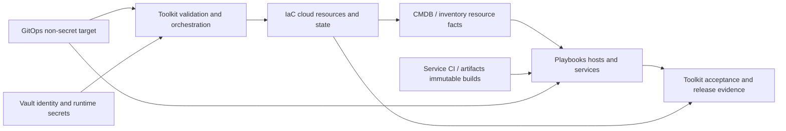
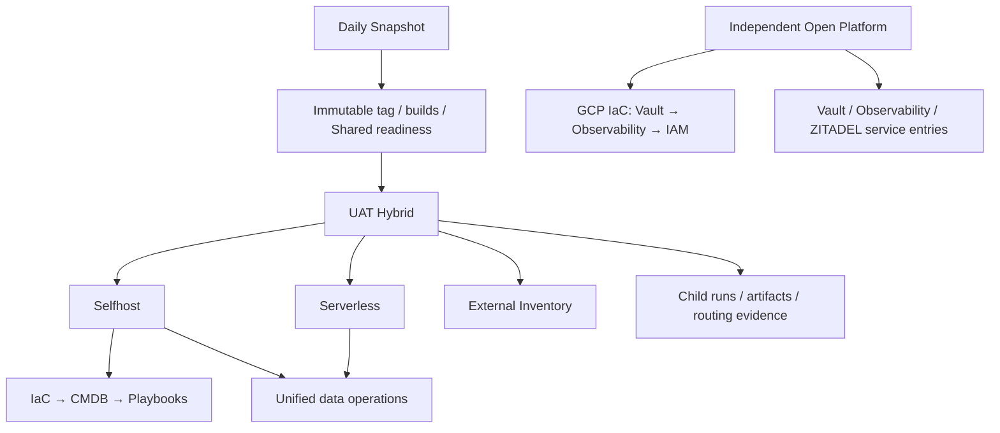
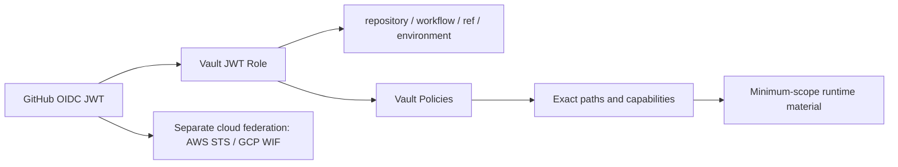

# Multi-Cloud Platform Engineering Technical White Paper

**Version 1.1 · Source audit baseline: October 5, 2026 · Status: architecture and contract review draft**

[中文版](multi-cloud-platform-engineering-whitepaper.zh.md) · [Reference overview](overview.en.md)

## Abstract

Multi-cloud platform engineering connects desired configuration, execution logic, authorization, resource facts, and release evidence into an auditable delivery system. This white paper consolidates the complete inventory of 40 workflows, repository responsibilities, execution routes, state hierarchy, secret paths, and migration gates for `platform-ops-toolkit`, `playbooks`, `iac_modules`, `gitops`, and Vault.

The operating model is straightforward: **GitOps declares the target; Toolkit orchestrates; IaC Modules manages cloud resources; Playbooks configures hosts and services; Vault supplies runtime identity and secrets.** Service CI and the artifacts system retain responsibility for application builds.

The platform has multi-cloud and multi-runtime entry points, but execution ownership is still converging. Toolkit registers 15 legacy execution items. Shared namespaces conflict with older documentation. XConnect has cross-environment reads and a workflow trust mismatch for a new caller. Real upgrade adapters remain unregistered. This paper distinguishes observed source behavior, target requirements, and incomplete work; documentation, merged PRs, and passing CI are not presented as runtime acceptance.

Version 1.1 adds the unified Vault path proposal in section 8.5, explicitly marking CICD as a legacy namespace and mapping its material by scope/project/purpose with migration gates. The proposal has not changed live Vault, policies, or callers.

## Reading guide

- Chapters 1–3: evidence scope, architecture, and repository ownership.
- Chapters 4–6: environment identity, GitOps, Terraform state, and resource handoffs.
- Chapters 7–9: workflow routes, Vault fields, and authorization boundaries.
- Chapters 10–12: release, data upgrades, acceptance, and migration sequencing.
- Appendix A: all 40 workflows; Appendix B: terminology; Appendix C: sources.

## 1. Scope, baseline, and evidence levels

### 1.1 Intended use

This paper serves platform engineers, SREs, application delivery owners, identity administrators, and architecture reviewers. It covers the boundaries of Shared, SIT, UAT, and PROD and the Selfhost, Serverless, Hybrid, Terraform, and external-inventory delivery models. It is not deployment authorization, a credential migration instruction, or certification that UAT has passed.

### 1.2 Fixed source baseline

| Repository | Audited SHA | Primary evidence |
| --- | --- | --- |
| Toolkit | `2e7b1d9387de615f882ec6cf8084781d0d006415` | Workflows, callers, JWT roles/policies, frozen inventory |
| Playbooks | `94b9ca010efb1eeb62469f791a910dd361f1abae` | Roles, playbooks, reusable workflows |
| IaC Modules | `a0185e61fc2b41ac4dbd40c8037016aaef1b3973` | Renderers, Provider entry points, backend/state contracts |
| GitOps | `d6a734b12e91241557803895ad454c538ea5d6ae` | Resources, topology, account and Vault references |

The audit subsequently produced three local contracts in Toolkit commit `f0669ae8`. That commit is an unpushed review draft, not a remotely merged standard. This white paper consolidates that material independently in knowledge and does not depend on temporary file paths. A workflow may pin an owner SHA older than the main baseline above; runtime evidence must record the SHA actually consumed.

### 1.3 Six distinct evidence levels

| Level | What it establishes | What it does not establish |
| --- | --- | --- |
| Source/contract exists | Inputs, declarations, and routes can be inspected | Working identities, secrets, or targets |
| Local static/offline checks | Formatting, references, selected behaviors and negative cases | Correct cloud or host behavior |
| CI passes | Checks completed for a particular ref | Live UAT or business acceptance |
| Owner/caller merged | Code entered each repository's main | Applied Vault configuration or an executable caller |
| Exact environment run completes | Result of the specified deployment or operation | Entitlements, data consistency, or full promotion qualification |
| Business acceptance/qualification | Gates are met for a fixed artifact, environment, target, and receipt set | Reuse for another version, environment, or target |

The writing uses source and existing contracts. It did not read live Vault values, dispatch workflows, or change cloud resources, hosts, DNS, or databases. [S1], [S2]

## 2. Platform architecture and engineering principles

Four connected chains organize the platform: declarations specify the target; resource and configuration execution realizes it; identity limits available capabilities; evidence establishes the actual result.



The architecture applies seven principles:

1. **Separate declarations from execution.** GitOps stores data; renderers, Providers, Ansible, and deployers belong to their execution owners.
2. **Assign ownership by behavior.** Filenames, directories, and scanner labels do not replace behavioral review.
3. **Bind environment, account, state, and version explicitly.** Do not infer targets from a hostname, default cloud project, or credential response.
4. **Give Shared an independent lifecycle.** Ordinary business releases consume ready services and do not bootstrap Shared.
5. **Keep artifacts immutable and evidence correlated.** Tags, digests, source, and runs must identify the same release.
6. **Stop when dependencies are missing.** Missing manifests, owners, identities, targets, or matching receipts fail without switching to another environment.
7. **Agree on contracts before migration.** Follow owner → caller → UAT → cleanup and preserve dates when reconciling historical documentation. [S1], [S2]

## 3. Responsibility matrix and authoritative storage

### 3.1 Repository-level responsibilities

| Layer | Responsibility | Inputs | Outputs |
| --- | --- | --- | --- |
| Toolkit | Workflow entry points, input/version selection, approvals, GitOps validation, Vault login, sequencing, acceptance | Operation request, GitOps ref, release tag | Child runs, execution contracts, sanitized release evidence |
| IaC Modules | Terraform, renderers, Providers, Cloudflare DNS, state/leases, resource-fact adapters | Resource declarations, Provider identity, backend credentials | Cloud resources, state identifiers, CMDB/inventory |
| Playbooks | OS initialization, host configuration, installation, application deployment, data lifecycle, host health | CMDB, service variables, artifacts, Vault material | Service state, data/checkpoints, failure and idempotency receipts |
| GitOps | Environments, topology, resources, routing, versions, non-secret identity/Vault references | Reviewed declarations | Desired state at a fixed ref |
| Vault | JWT authorization, credentials, secrets, certificates | Constrained identities and controlled writes | Runtime material within the minimum required scope |
| Service CI / artifacts | Application compilation, images/packages, provenance | Fixed source and build contracts | Immutable tags/digests/release manifests |

### 3.2 Ownership by execution behavior

| Behavior | Authoritative owner | Essential contract |
| --- | --- | --- |
| Desired state, lifecycle, non-secret account bindings | GitOps | Validated manifest fields and ref |
| Inputs, approvals, phase ordering, child-run waits | Toolkit | Environment/target/artifact, exact run ID, propagated result |
| GitOps readers/validators | Toolkit | Missing or conflicting declarations fail immediately |
| Render, plan/apply/import/destroy, Provider/DNS, state/leases | IaC Modules | Verified account, independent backend, exact resource scope |
| Packages, files, systemd, Caddy, services, XConnect host joins/probes | Playbooks | CMDB target, artifact, failure/idempotency and cleanup |
| Backup, isolated restore, schema/data migration and verification | Playbooks / service owner | Same-environment data contract, versions/checksum, checkpoint |
| Service builds and artifact publication | Service CI / artifacts | Digest and provenance |
| Vault role/policy declarations and bootstrap orchestration | Toolkit | Workflow/ref/environment agree with path capabilities |
| Credential rotation, revocation, retired-record cleanup | Vault administrator / protected specialist workflow | Approved scope, versions, consumers, rollback |
| Promotion, cross-layer acceptance, evidence aggregation | Toolkit | Same artifact, environment, target, and run |

Reusable host configuration belongs in Playbooks; service repositories retain application-specific runtime and deployment logic. Provider describe and OCI inspect may serve as Toolkit release gates, while generic resource-fact adapters remain in IaC. Assign HTTP POST ownership by request semantics: Vault/Accounts control requests, host enrollment, and cloud-resource writes are different behaviors.

Toolkit currently retains inline Terraform, host operations, and wrappers calling legacy executors. Location describes the current implementation; this matrix defines target ownership. Record and migrate the difference behavior by behavior. [S2], [S3], [S4]

### 3.3 Five kinds of authoritative facts

| Fact | Authoritative location | Use |
| --- | --- | --- |
| What should exist | GitOps | Execution input; does not replace observed runtime state |
| What Terraform manages | Independent backend state | Consumed by IaC; Ansible does not read tfstate directly |
| Resource facts for this run | CMDB / inventory artifact | Used by Playbooks and acceptance; not a hand-maintained second topology |
| What can be released | Tag/digest/release manifest | Preserve provenance; rebuilding main does not reproduce accepted evidence |
| Identity and secrets | Vault / dynamic identity | Minimum-scope access; excluded from ordinary declarations and public evidence |

## 4. Environment, account, and Provider boundaries

### 4.1 Environment model

| Scope | Lifecycle | Delivery boundary |
| --- | --- | --- |
| Shared | Persistent Vault, Observability, IAM, and platform services | Independent Open Platform; business releases use a read-only readiness gate |
| SIT | Integration validation | Only explicitly supported entry points, identities, paths, and state; UAT templates do not imply support |
| UAT | Preproduction business validation and controlled rehearsals | Current Daily → UAT Hybrid → child routes |
| PROD | Production delivery | Independent identity/state/approval; consumes accepted artifacts, not UAT run receipts as production proof |

`open-platform-shared` is an existing GCP account configuration identifier. The actual Shared project is `open-platform-shared-510113`. Some Shared workflows use GitHub Environment `prod`; this does not make them business PROD resources. Record logical project, namespace, state_project, Provider account, actual cloud project ID, and Vault scope separately.

The current Hybrid `vault_env_path` accepts only `uat`. Planned PROD Hybrid delivery is not an existing executable entry point. [S5], [S6]

### 4.2 Multi-account maturity

| Provider | Identity contract | Baseline status and outstanding requirements |
| --- | --- | --- |
| AWS | Twelve-digit account ID, GitHub OIDC → IAM role | Runtime checks the declared account; currently one account profile per environment; bootstrap/declaration selection needs further account scoping |
| GCP | Stable account identifier, actual project ID, Vault JWT configuration + WIF | Account-specific bootstrap/runtime paths and roles exist; actual identity/project must still be verified before writes |
| Azure | Tenant, subscription, client/application ID, OIDC | Selfhost retains placeholder IDs; requires real GitOps identities and active tenant/subscription checks |
| Vultr VPS | Concrete account, Vault API token | Generic Selfhost still reads an environment token without authenticated-account checks; multi-account support remains incomplete |
| Akamai Cloud / Linode | Concrete account, Vault `LINODE_TOKEN` | Account-specific KV/roles exist; tokens authorize an account; default/primary/main aliases are invalid |
| UCloud UHost | Concrete project/account, Vault API credentials | Standalone workflow reads a project path; the legacy Selfhost path and identity validation still need convergence |
| ULightHost existing | External inventory owner/account and host connection facts | Inventory-only; does not create, adopt, or destroy Terraform resources |

Options, Provider registries, and module directories demonstrate code structure, not safe multi-account delivery. That capability also requires row-level selection, matching credentials/federation, authenticated identity, a distinct state prefix, least-privilege policy, and mismatch regression coverage. [S7]

## 5. GitOps, IaC state, and CMDB contracts

### 5.1 Declaration layout

| Directory | Content |
| --- | --- |
| `resources/<project>/<env>/<provider>/` | Resource targets, account bindings, sizing, lifecycle |
| `topology/<env>/<mode>/` | Cross-service Selfhost/Serverless/Hybrid topology, domains, routing |
| `services/` | Service configuration, versions, cluster declarations |
| `environments/` | Flux/Kustomize and other cluster environment entry points |

Mode is a runtime-topology dimension, not a single-Provider directory. Declarations may contain SSH public keys, public origins, and Vault references; private keys, passwords, API keys, database connection strings, and generated inventory remain outside them. A missing expected declaration must fail its consumer. [S3]

### 5.2 Resource handoff

```text
GitOps YAML
  → Python / Jinja2 render
  → explicit Terraform module / resource blocks
  → terraform plan / apply
  → merge Terraform runtime outputs with YAML static fields
  → cmdb.json / inventory
  → Playbooks host and service configuration
  → Toolkit acceptance aggregation
```

Batch-environment loops and composition belong in the renderer; generated HCL contains explicit resource blocks. Rendered HCL, tfvars, CMDB, and inventory are derived outputs, not another manual source of truth. Refresh inventory after IaC changes; existing adapters must identify the origin of their resource facts. [S4], [S8]

### 5.3 Backend and locking

```text
terraform/<scope>/<project>/<provider>/<account>/<workspace>/terraform.tfstate
terraform/<scope>/<project>/<provider>/<account>/<workspace>/terraform.tfstate.tflock
```

Together these dimensions define the state boundary. Use a concrete stable account identity; default/primary/main must not merge accounts silently. Vault `kv/CICD/<scope>/iac_state` stores `TF_STATE_*` backend connection credentials; tfstate resides in S3-compatible object storage. Provider and backend identities are separate.

The standard using S3 `use_lockfile` requires Terraform 1.10 or later. State migration records old/new keys, uses controlled migrate-state, validates, and checks a drift-free plan; retain old object versions and the previous backend through acceptance. Changing a Vault path does not migrate state. [S8]

### 5.4 Non-Terraform inventory

ULightHost declares `management_mode: existing`, `provisioner: ansible`, and `lifecycle: external`, producing no tfstate. Non-secret facts and run records use:

```text
inventory/<scope>/<project>/<provider>/<account>/<workspace>.json
runs/<scope>/<project>/<provider>/<account>/<workspace>/<run-id>.json
```

UCloud UHost is a standard Terraform resource. Similar naming is not a reason to assign it the ULightHost external lifecycle. [S8]

## 6. Common invocation and execution contracts

Each request and sanitized receipt should correlate scope/environment, logical project/namespace, Provider/account/actual project ID, workspace/state key, actual SHAs for all four repositories, tag/digest, CMDB target/user/state directory, and workflow run/attempt. Record missing fields as gaps; do not guess them or rewrite an existing state identity.

| Invocation | Current example | Verification focus |
| --- | --- | --- |
| Same-repository reusable workflow | Master → Provider; Open Platform → GCP | needs/if, with, permissions, actual ref |
| Cross-repository reusable workflow | Selfhost → domain CD; data entry → owner workflow | Owner SHA, JWT caller claims, environment, output/failure semantics |
| Independent dispatch | Daily → Hybrid; Hybrid → child entry; platform → service | Exact run ID, wait, conclusion, artifact correlation |
| Execute after checkout | Renderer, Ansible, service deployer | Actual checkout SHA, working directory, inputs/outputs, temporary-material cleanup |
| Indirect wrapper | Toolkit helper → legacy executor | Complete caller graph; no wrapper marker does not prove correct ownership |

Input validation, authenticated cloud identity, backend readiness, apply-attempt/output evidence, SSH trust, host status, and business validation are separate gates. Preserve original failure evidence after partial apply or data writes and inspect actual state before recovery. Cleanup must not overwrite failure with success. [S2], [S9]

## 7. Main workflow routes and specialist entry points



The diagram shows reachable calls, not branches executed by every operation.

### 7.1 Daily → UAT Hybrid

Daily creates immutable cross-repository tags, dispatches builds, verifies artifacts, and performs a read-only Shared readiness check. `dispatch-uat-combined.sh` currently sends combined UAT delivery to Hybrid. Hybrid reads GitOps `topology/uat/hybrid/resource-matrix.json`, selects Provider, account, manifest, and child entry per row, and waits for exact child runs.

Ordinary business deploy skips Shared resources. Explicit Hybrid maintenance operations still have Shared-row handling, so it is inaccurate to claim every operation is unable to touch Shared. Combined deployment rejects data synchronization and XConnect release overrides; validated Accounts baseline/schema requests may be explicitly forwarded. This path skips Stripe catalog synchronization and must not report it as completed. [S5], [S9]

### 7.2 Selfhost and Serverless

Selfhost orchestrates IaC/CMDB, host initialization, domain CD, data, and DNS phases; reusable execution belongs in IaC or Playbooks. Serverless orchestrates Cloud Run, Cloudflare Pages/Workers, service deployment, data owners, and artifact evidence. The selected GitOps mode document constrains domains, origins, and backend policy; one mode must not substitute for another.

The Hybrid baseline design uses Selfhost priority and Serverless fallback, but actual routing, single-writer data policy, and replication must consume fixed GitOps declarations. The existence of two deployment routes does not prove accepted failover or data synchronization. [S3], [S5]

### 7.3 Independent Open Platform

`open-platform-orchestrator.yml` orders GCP IaC as Vault → Observability → IAM, then dispatches and waits for service phases according to operation and target_services. It has no destroy operation. Infrastructure, service configuration, historical-data migration, DNS cutover, and observation windows have separate evidence; ordinary business releases do not rebuild Shared services. [S6]

### 7.4 Generic Multi-cloud Master

- AWS/Azure/Vultr: Landing Zone → Account → Resources, subject to switches and dependency results.
- GCP, Akamai, UCloud: delegate to their Provider workflows.
- ULightHost: External Inventory without Terraform.
- The three generic child entries may independently delegate to GCP.
- `gcp-uat-workload-sequence.yml` is an independent manual sequence, not a required Daily/Hybrid stage. [S10]

### 7.5 Product, network, and operational entries

AI Aggregator, Global Mesh, XConnect bootstrap, Vault, ZITADEL, Observability, Runner, resize, DNS/TLS, performance, regional acceptance, and cleanup have dedicated entries listed in Appendix A. `xconnect-runtime-control.yml` currently exposes only `gateway_verify` and `one_verify`. Installation, joining, existing-One, observation, leases, and cleanup still include legacy mixed routes. Chapter 9 records the runtime caller's Vault trust mismatch.

## 8. Vault KV hierarchy and field contracts

### 8.1 Path representations

| Context | Path |
| --- | --- |
| CLI / GitOps logical reference | `kv/CICD/uat/iac_state` |
| Data API / policy | `kv/data/CICD/uat/iac_state` |
| Metadata API / policy | `kv/metadata/CICD/uat/iac_state` |

`data` and `metadata` are KV v2 API layers. The root record `kv/CICD` and child record `kv/CICD/uat` are independent; reading the root does not authorize its descendants. A generic environment role must not use `kv/data/CICD/*` as a shortcut across every environment.

### 8.2 Current namespace families (including legacy paths)

The tree records references/declarations at the fixed baseline, not live record existence or field completeness. Not every family supports SIT.

**Mark `CICD` as a legacy namespace pending migration.** It mixes delivery identities, cloud bootstrap, backend credentials, certificates, and service material. Existing callers still read it. Legacy describes the path model, not credential validity or permission to delete. The target design adds no records to this mixed root; new requirements follow section 8.5, while existing consumers retain compatibility until migrated.

```text
kv/
├── CICD                          # LEGACY: outdated namespace, active consumers, migration pending
│   ├── github-app/daily-snapshot
│   ├── domains/<domain>
│   ├── observability
│   ├── <env>/
│   │   ├── iac_state
│   │   ├── aws-bootstrap
│   │   ├── gcp-bootstrap/<account>
│   │   ├── akamai-cloud/<account>
│   │   └── ucloud/<project>
│   └── shared/
│       ├── iac_state
│       ├── gcp-bootstrap/<account>
│       ├── xconnect
│       ├── xconnect-operator-invite
│       └── xconnect-operator-invite/<network>
├── <env>/
│   ├── platform/oidc/<account>
│   ├── platform/{jwt,cloudflare,gcp,observability,gitea}
│   ├── serverless/{gcp,cloudflare,dts,...}
│   ├── services/{xconnect,ai-workspace}
│   ├── databases
│   ├── agent-proxy
│   ├── xconnect-one
│   ├── ulighthost-xconnect/<node>
│   └── ai-aggregator/...
├── shared/
│   ├── platform/oidc/<account>
│   ├── iam
│   └── databases
├── iam/<env>/<integration>/<account>/<purpose>
├── action-runner
├── openclaw
└── WEB_SAAS
```

`<env>` denotes a business environment; `<scope>` may also include explicitly declared Shared resources. `shared/iam` contains ZITADEL service material; `iam/<env>/...` holds workforce/workload/application integration records. Provider API credentials remain under CICD. Root and per-network invitation records have different callers and must not be merged automatically. Other product namespaces such as `github-actions/` and `xworkmate/` are not cleanup candidates merely because this tree omits them.

### 8.3 Current principal paths and fields

| CLI path | Fields/purpose | Consumption/change boundary |
| --- | --- | --- |
| `kv/CICD` | Shared CI fields and legacy SSH/DNS material | Exact-root reads; inventory all consumers before migration |
| `kv/CICD/github-app/daily-snapshot` | `app_private_key` | Snapshot, release downloads, cross-repository operations; separately verify App installation permissions |
| `kv/CICD/domains/<domain>` | `tls_fullchain_pem_b64`, `tls_key_pem_b64`; trust/CA/expiry depend on caller | Deployment reads; rotation and other write grants reviewed separately |
| `kv/CICD/observability` | `user`, `password` | Shared monitoring access |
| `kv/CICD/<scope>/iac_state` | `TF_STATE_ENDPOINT`, `TF_STATE_BUCKET`, `TF_STATE_ACCESS_KEY`, `TF_STATE_SECRET_KEY`, `TF_STATE_REGION` | Backend-only; does not store tfstate |
| `kv/CICD/<env>/aws-bootstrap` | `AWS_ACCESS_KEY_ID`, `AWS_SECRET_ACCESS_KEY`; session material by contract | Currently environment-scoped; multi-account migration is separate |
| `kv/CICD/<scope>/gcp-bootstrap/<account>` | `GCP_PROJECT_ID`, `GCP_AUTH_JSON` or `GCP_ACCESS_TOKEN` | Dedicated one-time bootstrap role |
| `kv/<scope>/platform/oidc/<account>` | `gcp_workload_identity_provider`, `deploy_service_account`, `gcp_oidc_audience`, `project_id` | Account-specific runtime identity after bootstrap |
| `kv/CICD/<env>/akamai-cloud/<account>` | `LINODE_TOKEN` | Concrete account binding; aliases rejected |
| `kv/CICD/<env>/ucloud/<project>` | `UCLOUD_PUBLIC_KEY`, `UCLOUD_PRIVATE_KEY`, `UCLOUD_PROJECT_ID`, `UCLOUD_REGION`; SG/key-pair IDs | Standalone entry consumption; legacy Selfhost base path reviewed separately |
| `kv/<env>/serverless/gcp` | `GCP_WORKLOAD_IDENTITY_PROVIDER`, `GCP_SERVICE_ACCOUNT_EMAIL` | Serverless WIF compatibility contract; do not duplicate GitOps project/region settings |
| `kv/<env>/serverless/cloudflare` | `CLOUDFLARE_ACCOUNT_ID`, `CLOUDFLARE_API_TOKEN` | Environment-specific edge delivery |
| `kv/<env>/platform/jwt` | `issuer`, `audience`, `signing_key` | JWT material; applications consume only required signing/verification material |
| `kv/<env>/platform/cloudflare` | `api_token`, `account_id`, `zone_id` | Matching platform DNS scope |
| `kv/<env>/platform/gcp` | `project_id`, `region`, `artifact_registry` | Existing documented fields; avoid a second target configuration when consuming them |
| `kv/<env>/platform/observability` | `grafana_admin_password`, `remote_write_token` | Environment-specific monitoring identity |
| `kv/<env>/platform/gitea` | `url`, `runner_token`, `webhook_secret` | Gitea integration |
| `kv/<env>/services/xconnect` | `supabase_url`, `supabase_service_role`, `jwt_audience` | XConnect service contract |
| `kv/<env>/services/ai-workspace` | `api_base_url`, `oauth_client_secret`, `jwt_audience` | AI Workspace service contract |
| `kv/<env>/databases`, `kv/<env>/agent-proxy` | Environment database passwords, proxy identity | General environment policy; further service scoping possible |
| `kv/<env>/xconnect-one`, `kv/<env>/ulighthost-xconnect/<node>` | Network identity, exact external-host connection material | Explicit target, SSH trust, environment |
| `kv/CICD/shared/xconnect` | `ZERO_SERVICE_TOKEN`, `VLESS_ID` | Dedicated read-only Shared enrollment/network role |
| `kv/CICD/shared/xconnect-operator-invite[/<network>]` | Short-lived one-use invitation | Current CI create/update without readback; operator consumes with separate identity |
| `kv/shared/iam`, `kv/shared/databases` | ZITADEL masterkey/admin/session, database passwords | shared-zitadel role; separate from business IAM integrations |
| `kv/iam/<env>/<integration>/<account>/<purpose>` | Integration fields/secrets | Purpose is workforce, workload, or application |
| `kv/action-runner`, `kv/openclaw`, `kv/WEB_SAAS` | Shared-service/legacy compatibility material | Validate actual consumers; WEB_SAAS still has readers |

New fields require coordinated changes to the field contract, consumer, policy, bootstrap/check, rotation/rollback, and acceptance. Non-secret identity metadata may remain in a complete identity record; target domains, regions, and routing remain authoritative in GitOps. The table preserves complete fields from older documentation; duplicated fields do not justify automatic consumer migration. [S11], [S12], [S13]

### 8.4 AI Aggregator minimum namespace and documentation differences

The Toolkit baseline minimal-KV document lists these records; LLM Providers are limited to openai, anthropic, and xai:

```text
kv/<env>/ai-aggregator/database/new-api
kv/<env>/ai-aggregator/database/litellm
kv/<env>/ai-aggregator/gateway/caddy
kv/<env>/ai-aggregator/gateway/apisix
kv/<env>/ai-aggregator/gateway/new-api
kv/<env>/ai-aggregator/gateway/litellm
kv/<env>/ai-aggregator/litellm/providers/openai
kv/<env>/ai-aggregator/litellm/providers/anthropic
kv/<env>/ai-aggregator/litellm/providers/xai
```

Listed database fields are `dsn`; Caddy uses `admin_basic_auth_hash`; New API uses `session_secret`, `crypto_secret`, `jwt_private_key`, `jwt_issuer`, and `jwt_audience`; LiteLLM uses `master_key` and `proxy_secret`; LLM Providers use `endpoint` and `api_key`. The document does not fully specify APISIX fields, so this paper does not invent them.

The contemporaneous GitOps KV document still lists `database/kong`, differing from Toolkit's Caddy/APISIX paths. This is an additional documentation discrepancy discovered during consolidation. Reconcile it against actual consumers; the union of both lists is not an approved contract. CPA OAuth stays in encrypted node-local auth directories. Client/account/instance metadata, token hashes, and jti/revocation state belong in PostgreSQL. New automation must not recreate deprecated accounts/instances/clients namespaces; deletion of existing records requires separate review. [S12], [S13]

### 8.5 Target path plan (design proposal; migration pending)

Use the consistent order **scope → project → category → resource → record**:

```text
kv/<scope>/<project>/<category>/.../<record>
```

The `scope` is shared, sit, uat, or prod. The `project` reuses a reviewed GitOps logical project such as svc.plus, onwalk.net, or xworktech.com; it is not a GCP or UCloud project ID. The `category` is one of the seven classes below. Subsequent segments depend on the resource type. Only the final record holds fields; intermediate groups contain no broad parent records. This proposal retains the existing kv mount; a project path is not a Vault Enterprise Namespace.

#### 8.5.1 Seven categories and the target tree

| Category | Stored material | Main consumers / write boundary |
| --- | --- | --- |
| delivery | Delivery control identities, including GitHub Apps | Toolkit; protected initialization and rotation |
| cloud | Cloud bootstrap, federation bindings, API credentials | Bootstrap / IaC / Serverless, separated by profile |
| state | Terraform backend connection credentials | IaC; separately authorized from Provider credentials |
| services | Runtime secrets, database connections, integrations, network invitations | Playbooks / service owner; split by actual readers and writers |
| identity | Workforce, workload, application integrations | Identity bootstrap and specific clients |
| hosts | SSH for an exact node/user and host Agent identities | Playbooks / Agent, restricted to node and purpose |
| certificates | Domain-specific certificates and private keys | Read-only deployment; dedicated rotation writer |

The tree is a template for one scope/project. All four scopes use the same categories, creating only records with declared requirements and consumers:

```text
kv/
├── shared/
│   └── <project>/
│       ├── delivery/github/apps/<app>/credentials
│       ├── cloud/<provider>/<account>/
│       │   ├── bootstrap/<profile>
│       │   ├── federation/<profile>
│       │   └── api/<profile>
│       ├── state/backends/<backend-id>/credentials
│       ├── services/<service>/
│       │   ├── runtime/<component>
│       │   ├── database/<database>/<principal>
│       │   ├── integrations/<integration>/<binding>
│       │   ├── providers/<provider>/<profile>
│       │   └── networks/<network>/
│       │       ├── service-token
│       │       ├── transport-auth
│       │       └── operator-invites/<invite-id>
│       ├── identity/<purpose>/<integration>/<account>/client
│       ├── hosts/<node>/
│       │   ├── ssh/<user>
│       │   ├── agent-proxy/auth
│       │   └── xconnect-one/auth
│       └── certificates/<domain>/tls
├── sit/<project>/...             # Same categories, only where supported
├── uat/<project>/...             # Same categories, independent credentials/policies
└── prod/<project>/...            # Same categories, independent credentials/policies
```

`services/<service>/...` is the category template; for example, XConnect network material uses `services/xconnect/networks/<network>/...`. ZITADEL, Observability, Gitea, Action Runner, OpenClaw, and AI Aggregator use services. IAM integrations use identity. Selfhost/Serverless are delivery modes rather than secret categories; they consume exact GitOps references to cloud or services records. A credential shared across projects has one authoritative record under its owner project; other projects use explicit references without duplication or access to the whole Shared tree.

#### 8.5.2 Naming and credential boundaries

1. **Scope follows ownership of the material.** Shared credentials stay shared even when a UAT workflow consumes them. A production node does not become shared merely because UAT uses it for verification.
2. **Separate project and account.** Provider/account uses concrete identifiers from the account registry. Record cloud_project_id, UCloud project, and state key separately. Profiles express purposes such as iac-deploy, serverless-deploy, or dns-reconcile; default/primary/main are invalid.
3. **One record represents one permission and rotation boundary.** Administrative passwords, runtime passwords, JWT signing, and database connections must not be bundled solely because they belong to one service. Reading a KV record returns its data fields. Split records for different consumers; selecting one field in the caller is not an isolation boundary. [S17], [S18]
4. **Separate bootstrap, federation, and api.** Federation records hold binding configuration, not persisted general-purpose dynamic cloud tokens. API-token Providers use concrete account/profile records.
5. **State records identify backend connections by backend-id.** The GitOps contract explicitly binds permitted state prefixes and Provider/account/workspace. A record path does not restrict object-storage permissions. Chapter 5's tfstate key remains unchanged.
6. **Use stable lowercase identifiers and hyphens for new names.** Existing project domains may retain dots; public node/domain IDs are acceptable. Paths contain no tokens or email addresses, and directory names do not prove cloud identity.
7. **Public target configuration remains in GitOps.** Do not create a second Vault configuration for domains, regions, routes, public issuers, or node connection facts. Non-secret fields required for a complete identity binding may accompany its credentials.
8. **Invitations need application-enforced expiry and one-use consumption.** KV does not issue dynamic secret leases. A path or Vault login-token TTL cannot expire an invitation. delete_version_after does not revoke external credentials; the invitation owner must validate, revoke, and clean them up. [S18], [S19]

Role declarations remain in auth configuration and Toolkit role/policy source. Vault root and unseal/recovery material follows a separate recovery contract, outside ordinary delivery KV. This proposal organizes static KV; it does not convert dynamic identities into static secrets.

#### 8.5.3 Mapping legacy paths to target paths

All targets below are proposals. `<project>` is verified against consumer contracts; `<scope>` follows actual ownership of the material. Neither is inferred automatically from a generic old env segment or the caller's GitHub Environment. Register `<account>`, `<backend-id>`, `<node>`, and `<network>` separately rather than reusing ambiguous abbreviations.

| Current path / status | Target path or owner | Mapping condition |
| --- | --- | --- |
| `kv/CICD` / `kv/CICD/<env>` — LEGACY | Split fields into delivery, cloud, hosts, certificates, services | Inventory every reader/writer; create no replacement catch-all root |
| `kv/CICD/github-app/daily-snapshot` — LEGACY | `kv/shared/<project>/delivery/github/apps/daily-snapshot/credentials` | Only for the genuinely cross-environment App identity; constrain installation permissions |
| `kv/CICD/<scope>/iac_state` — LEGACY | `kv/<scope>/<project>/state/backends/<backend-id>/credentials` | Explicit backend-id; bind object-storage prefixes without changing state keys |
| `kv/CICD/<env>/aws-bootstrap` — LEGACY | `kv/<scope>/<project>/cloud/aws/<account>/bootstrap/oidc-setup` | Resolve the real AWS account; do not copy one environment record to every account |
| `kv/CICD/<scope>/gcp-bootstrap/<account>` — LEGACY | `kv/<scope>/<project>/cloud/gcp/<account>/bootstrap/wif-setup` | Verify account and actual cloud project separately |
| `kv/<scope>/platform/oidc/<account>` | `kv/<scope>/<project>/cloud/gcp/<account>/federation/iac-deploy` | Preserve the complete WIF binding and controlled writer |
| `kv/<env>/serverless/gcp` | `kv/<scope>/<project>/cloud/gcp/<account>/federation/serverless-deploy` | Explicitly reuse a record only when identical to the IaC identity; no automatic merge |
| `kv/CICD/<env>/akamai-cloud/<account>` — LEGACY | `kv/<scope>/<project>/cloud/akamai/<account>/api/iac-deploy` | LINODE_TOKEN matches its actual account and purpose |
| `kv/CICD/<env>/ucloud/<project>` — LEGACY | `kv/<scope>/<project>/cloud/ucloud/<account>/api/iac-deploy` | Old project denotes UCloud; first bind the actual account and GitOps logical project |
| `kv/<env>/platform/cloudflare` / `kv/<env>/serverless/cloudflare` | `kv/<scope>/<project>/cloud/cloudflare/<account>/api/<profile>` | Separate dns-reconcile and edge-deploy permissions/rotation |
| `kv/CICD/domains/<domain>` — LEGACY | `kv/<scope>/<project>/certificates/<domain>/tls` | Assign scope by certificate ownership; do not default all certificates to shared |
| `kv/CICD/observability` — LEGACY / `kv/<env>/platform/observability` | `kv/<scope>/<project>/services/observability/<purpose>/<binding>` | Split admin, ingestion, and API identities by actual fields/consumers |
| `kv/shared/iam` / `kv/shared/databases` | `kv/shared/<project>/services/zitadel/runtime/<component>` / `kv/shared/<project>/services/zitadel/database/<database>/<principal>` | Separate runtime/database grants; verify other database consumers |
| `kv/<env>/platform/jwt` / `kv/<env>/platform/gitea` / `kv/<env>/services/<service>` | `kv/<scope>/<project>/services/<service>/runtime/<component>` / `kv/<scope>/<project>/services/<service>/integrations/<integration>/<binding>` | Verify JWT issuer owner and integration consumers before field-level migration |
| `kv/<env>/databases` / `kv/<env>/agent-proxy` | `kv/<scope>/<project>/services/<service>/database/<database>/<principal>` / `kv/<scope>/<project>/hosts/<node>/agent-proxy/auth` | Separate shared database users and node identities; retain exact targets |
| `kv/<env>/xconnect-one` / `kv/<env>/ulighthost-xconnect/<node>` | `kv/<scope>/<project>/hosts/<node>/xconnect-one/auth` / `kv/<scope>/<project>/hosts/<node>/ssh/<user>` | Bind actual CMDB node/user; existing PROD exceptions remain PROD |
| `kv/CICD/shared/xconnect` — LEGACY | `kv/shared/<project>/services/xconnect/networks/<network>/service-token` / `kv/shared/<project>/services/xconnect/networks/<network>/transport-auth` | Explicit network; split ZERO_SERVICE_TOKEN and VLESS_ID by consumer |
| `kv/CICD/shared/xconnect-operator-invite[/<network>]` — LEGACY | `kv/shared/<project>/services/xconnect/networks/<network>/operator-invites/<invite-id>` | Verify network separately for root and per-network records; use a unique invite-id per invitation |
| `kv/iam/<env>/<integration>/<account>/<purpose>` | `kv/<scope>/<project>/identity/<purpose>/<integration>/<account>/client` | Preserve workforce/workload/application and integration-account semantics |
| `kv/<env>/ai-aggregator/...` | `kv/<scope>/<project>/services/ai-aggregator/...` | Preserve component semantics and split by consumer/principal; reconcile APISIX/Caddy/Kong documentation first |
| `kv/action-runner` / `kv/openclaw` | `kv/<scope>/<project>/services/action-runner/...` / `kv/<scope>/<project>/services/openclaw/...` | Resolve scope/project from consumers; do not default them to shared |
| `kv/WEB_SAAS` — LEGACY | Map fields into cloud, services, hosts, certificates | Keep the old record during compatibility; introduce no new catch-all name |
| `kv/<env>/platform/gcp` (public-only fields) | GitOps resource/artifact declarations | Do not create a new KV record exclusively for non-secret configuration |

A proposed Shared GCP binding is `kv/shared/svc.plus/cloud/gcp/open-platform-shared/federation/iac-deploy`. The actual project remains `open-platform-shared-510113`; path names do not make these identifiers interchangeable.

#### 8.5.4 Authorization contract and migration gates

Register each target record's logical_path, scope, gitops_project, purpose/fields, every reader, writer, rotation owner, cloud/backend/node bindings, required capabilities, old path, status, and rollback condition. The registry contains only non-secret contracts/references; Vault supplies record values at runtime.

Deployment roles read exact required data records; bootstrap, certificate rotation, and invitation writes use separate roles. Grant list only on necessary metadata directories. KV v2 listing does not filter names by leaf policies, so whole-project list cannot replace exact references. Review delete, destroy, undelete, and metadata administration as distinct operations rather than granting them together for an entire directory. [S17], [S18]

Sequence implementation as **consumer inventory → approved mapping/permissions → owner support for explicit references → controlled write/rotation → caller switch → UAT/business verification → fixed compatibility window → revocation/cleanup**. A consumer reads one explicit path at a time without falling back to an old root or another environment. Rollback restores explicit versioned references. Verify field completeness, wrong accounts, denied cross-environment access, idempotency, rotation/rollback, failed-run cleanup, and unused references.

Record cross-environment XConnect purpose, node, readers, and an end condition before removing or narrowly retaining the exception. Moving a record to shared must not conceal actual PROD ownership. Each CICD record progresses through LEGACY → MIGRATING → RETIRED separately. Retirement requires switched consumers, converged old permissions, and complete backup/rollback conditions. Path organization does not repair chapter 9's JWT workflow-claim mismatch or change cloud accounts, state, or live credentials directly.

## 9. Identity, authorization, and historical exceptions



Vault login, reading a KV record, obtaining cloud identity, initializing a backend, and reaching a host are separate capabilities and require separate verification.

### 9.1 Authorization declarations and role classes

Toolkit stores declarations in `scripts/vault/roles/` and `scripts/vault/policies/`; `scripts/create_vault_service_repo_roles.sh` validates/applies them. Synchronization with live Vault must be verified separately.

| Class | Current contract | Distinction to preserve |
| --- | --- | --- |
| General SIT/UAT/PROD | Own CICD base/state and business root; general PROD data/metadata has no delete | Does not describe every specialist role |
| Shared CI / TLS | CICD exact root usually read; general environment policies retain domains/* writes; rotation has a dedicated role | Shared material is not universally read-only |
| Shared | Dedicated GCP runtime, Vault phase, ZITADEL, network roles | GitHub Environment prod differs from business prod scope |
| Bootstrap | GCP environment/account-specific; AWS currently environment-specific | Temporary bootstrap, runtime grants, revocation are separate |
| PROD release | Narrow-purpose permission for Daily on protected main to create a new provenance-bound v* tag | Does not authorize ordinary PROD deployment roles on main |

### 9.2 Five recorded Vault discrepancies

| ID | Source/document fact | Treatment |
| --- | --- | --- |
| V01 | Older GitOps docs deny kv/shared, while shared/platform/oidc, shared/iam, shared/databases are referenced | Align documentation with code references; do not move the platform based on old prose |
| V02 | UAT cloud-lab policy reads the exact PROD `kv/data/prod/ulighthost-xconnect/tw-xconnect.svc.plus` record | Record purpose and scope; it does not grant general UAT authority to operate PROD |
| V03 | Existing-One policy also reads `kv/data/prod/ulighthost-xconnect/*` | Explicitly record the wildcard; inventory callers and rollback before narrowing |
| V04 | Runtime-control uses the cloud-lab role whose job_workflow_ref trusts only the old zero-cloud workflow | Static trust mismatch; repair/apply separately, without claiming observed 403 or a completed fix |
| V05 | Old record inventory dates to 2026-07-22; CICD root and WEB_SAAS still have consumers | Historical missing/unused statements do not authorize deletion or permission changes |

The V03 Existing-One policy also explicitly grants read on `kv/data/prod/ulighthost-xconnect/observability.svc.plus`; record both the exact path and the wildcard. The full V04 role is `github-actions-platform-ops-toolkit-uat-xconnect-cloud-lab`. Its `job_workflow_ref` is `ai-workspace-infra/platform-ops-toolkit/.github/workflows/xconnect-zero-cloud.yaml@refs/heads/main`, excluding the new `xconnect-runtime-control.yml` caller.

A new workflow gains no automatic Vault access. V04 requires a decision between a dedicated runtime role and a narrowly extended existing role, with target, SSH fields, workflow/ref/environment, and necessary paths verified. Copying paths establishes structure, not independent underlying credentials. [S11], [S14]

### 9.3 Secret migration contract

First register owner/scope/purpose/fields and every read/write consumer; then verify role claims and policy capabilities. Add check/bootstrap/rotation/rollback before switching callers. Live migration separately defines scope, backup, overwrite behavior, and recovery. UAT covers denied boundary crossings, missing fields, wrong identity, idempotency, and cleanup. Review revocation/deletion only after all consumers have switched; do not expand wildcards for compatibility. [S11]

## 10. Releases, data upgrades, and promotion qualification

### 10.1 Immutable release evidence

Release evidence should connect `PR → merge main → immutable tag/digest → UAT deployment → business acceptance → production approval/promotion`. This is the target acceptance contract, not a claim that every current entry implements the entire chain. `auto-release.yaml` creates GitHub Releases; `release-status-console.yml` publishes sanitized status. Neither independently authorizes deployment or promotion.

Tags, image digests, and release manifests bind to provenance. Production consumes the same accepted artifact rather than treating a fresh build of main as that artifact. Creating a production tag and deploying production are separate stages; deployment completion still requires business acceptance. [S1], [S15]

### 10.2 Unified data control

Relevant Selfhost, Serverless, and Hybrid data phases enter `environment-data-operations.yml` through an adapter, delegating by mode to Playbooks data workflows at fixed SHAs or an IaC Akamai state preflight. Preflight, backup, probe, baseline, migrate, legacy_import, and upgrade rehearsal capabilities are not interchangeable.

The upgrade controller has eight phases:

```text
preflight → backup → migration → promotion → verification
          → rollback → repromotion → final_verification
```

A full UAT rehearsal requires preparation, upgrade acceptance, rollback acceptance, and another upgrade/acceptance of the same artifact before qualification. PROD consumes qualification and rechecks current production conditions; it does not run rehearsals or fault injection.

Checkpoints and isolated restores bind to the same environment/release/run. Migration binds exact start/end schema versions, checksum, dirty state, locks/timeouts, and forward compatibility. Rollback reverts the application while retaining compatible expanded schema; it does not run destructive down migrations. Repromotion proves the same digest, no rebuild, no Shared bootstrap, and no PROD→UAT data synchronization. A failed phase stops later actions. Inspect and repair actual state, then start a new run from preparation instead of skipping phases or reusing mismatched receipts. [S15]

### 10.3 Current execution prerequisites

`adapters.json` is `{"schema":2,"uat":{},"prod":{}}`. The controller, offline tests, and disposable PostgreSQL encrypted-backup/isolated-restore evidence do not replace actual UAT backup restoration, upgrades, rollback, and business checks. A complete live upgrade rehearsal or executable PROD Hybrid must not be claimed at this baseline. [S15]

## 11. Acceptance and observability

### 11.1 Layered verification matrix

| Layer | Required verification | Evidence |
| --- | --- | --- |
| Declaration | Environment, Provider, account, manifest, mode, ref, secret references agree | Parsing/validation at fixed SHAs |
| Identity | JWT claims, policy scope, actual cloud identity, backend identity agree | Sanitized identity/authorization receipts |
| IaC | Render, validate, plan, scope, lock, partial failure, cleanup | Plan/operation results, state identity, CMDB |
| Host/service | SSH trust, exact target, installation, health, invalid inputs, idempotency | Service-owner receipts and observed target state |
| Data | Backup checksum, isolated restore, schema/data fingerprint, wrong-key/occupied-database negatives | Same-environment checkpoints and restore receipts |
| Business | Original-credential login, permissions, subscription entitlements, quotas, financial/usage ledgers | Sanitized acceptance bound to the running digest |
| Release | Provenance, same digest, child runs, complete promotion qualification | Artifact manifests, exact runs, qualification file |

HTTP 200, systemd active, workflow success, a merge, and green CI each provide evidence, but are not substitutes for one another. Observability integration also proves actual metrics/log ingestion and retained history/dashboards. DNS cutover verifies the public entry and backend route, not just a Provider write receipt.

### 11.2 Diagnostic order

Trace `request/input → declaration parsing → identity/permissions → backend/state → cloud facts → CMDB → host/service → public routing → business data → evidence correlation`. For 403, inspect role claims and paths without expanding wildcards. Wrong accounts stop before Terraform. Successful dispatch requires exact child-run inspection. Failed apply retains diagnostics and checks actual resources. A healthy service with failing business behavior requires schema, entitlement, and ledger investigation.

Logs and artifacts retain only sanitized identity, summaries, checksums, status, and correlation identifiers. Do not include Vault responses, tokens, private keys, invitations, or complete database credentials. [S2], [S9], [S15]

## 12. Gap register and implementation roadmap

### 12.1 Seven gaps from the original audit

| ID | Gap | Subsequent owner/gate |
| --- | --- | --- |
| D01 | Fifteen legacy execution items; scanner is not a complete ownership analysis | Toolkit caller graph; IaC/Playbooks take over individual behaviors |
| D02 | Shared paths conflict with older KV documentation | Toolkit path/authorization contracts and GitOps documentation reconciliation |
| D03 | XConnect UAT reads PROD host records; existing-One includes a wildcard | Permission/migration-purpose review and exact consumer inventory |
| D04 | Runtime-control role trusts only the old zero-cloud workflow | Caller/role repair, controlled application, UAT |
| D05 | CICD/WEB_SAAS legacy mixing and a 2026-07-22 inventory | Complete consumers, independent credentials, backup/migration evidence |
| D06 | Generic entries retain default accounts/old repository defaults; uneven multi-account maturity | Toolkit inputs, IaC identity/state, GitOps account contracts |
| D07 | Empty upgrade adapter registry and UAT-only Hybrid | Data owners and live rehearsal prerequisites; no premature PROD capability claim |

The AI Aggregator documentation discrepancy in section 8.4 was recorded during white-paper consolidation. It is not presented as a finding already covered by the original seven-gap register.

### 12.2 C0–C5 delivery sequence

| Phase | Deliverable | Completion gate |
| --- | --- | --- |
| C0 Contract review | Responsibilities, routes, paths, 40 entries, discrepancy register | Traceable sources, owners, inputs/outputs; no runtime conclusion |
| C1 Owner implementation | Parameterized IaC entry or Playbooks Role/Workflow | Failure/idempotency/sensitive cleanup checks; owner merge SHA |
| C2 Caller switch | Toolkit consumes a fixed owner ref | Matching claims/target/CMDB/order; missing dependencies fail |
| C3 UAT | Success, failure, idempotency, business evidence | Exact repository SHAs, environment, target, tag/digest, run/receipts |
| C4 Cleanup | Delete old files whose callers are covered | Complete C1–C3 evidence, post-deletion reference checks and CI |
| C5 Documentation reconciliation | Owner backlinks and corrected operational guidance | Remove conflicting current instructions; preserve historical dates/baselines |

Each batch supplies a behavior/caller inventory, parameters and failure semantics, dependency order, acceptance, and rollback. Split mixed XConnect Terraform/lease/Provider operations from host enrollment/observation. Accounts invitation success does not prove a host joined. Old-copy deletion requires owner/caller merged SHAs, actual UAT, failure/idempotency/cleanup evidence, and post-deletion CI.

Suggested subsequent batches cover existing-One host behavior, Terraform/lease/state, DNS reconciliation, host readiness/Caddy, and SMTP Secret Manager Provider writes. Contract dependencies and verifiable targets determine the exact order. Fifteen frozen items measure static detection coverage, not all technical debt or migration completion. [S2]

## Appendix A: Complete inventory of 40 workflows

All entries reside in Toolkit `.github/workflows/`. Trigger abbreviations: P=push, R=pull_request, D=workflow_dispatch, C=workflow_call, S=schedule, W=workflow_run. Exact paths/ref/if restrictions follow the fixed source; a trigger does not guarantee a job executes.

| Workflow | Category | Triggers | Principal handoff / current status |
| --- | --- | --- | --- |
| `ai-aggregator-v1.yml` | Product | P/R/D | GitOps manifest → multi-Provider IaC branches → Playbooks; inline Terraform remains |
| `akamai-cloud-iac.yml` | Provider | D/C | IaC Akamai renderer / state / inventory |
| `auto-release.yaml` | Release | P | v* tag → repository GitHub Release; not deployment |
| `aws-oidc-bootstrap.yml` | Identity bootstrap | D | GitOps AWS trust → IaC bootstrap; temporary Vault credentials |
| `configure-email-dns.yaml` | DNS | D | Currently calls Playbooks configure_email_dns; Provider ownership still needs convergence |
| `cron-rotate-domain-tls-certs.yaml` | TLS | S/D | Certificate rotation script → Vault domain records; dedicated rotation role |
| `daily-main-snapshot.yaml` | Release orchestration | S/D | Tags / builds / Shared readiness → UAT Hybrid; other modes require separate review |
| `deploy-action-runner-iac.yaml` | Infrastructure | D | IaC Runner VM → Playbooks Runner installation |
| `environment-data-operations.yml` | Data control | D/C | Pinned Playbooks data workflows / IaC state preflight; live upgrade adapters unregistered |
| `environment-upgrade-ci.yml` | Contract CI | R/P | Offline phase/controller checks; no real upgrade |
| `external-inventory-state.yml` | External inventory | D/C | Existing Provider inventory/run records; no Terraform lifecycle |
| `gcp-iac-pipeline.yml` | Provider | D/C | GCP renderer / Terraform / inventory |
| `gcp-oidc-bootstrap.yml` | Identity bootstrap | D | Pinned GitOps/IaC refs; bootstrap → WIF runtime record |
| `gcp-uat-workload-sequence.yml` | Ordered entry | D | open-platform → web-saas → ai-workspace → JP → US → SG through GCP pipeline |
| `global-mesh.yaml` | Network | R/D | GitOps / global-mesh data synchronization → Playbooks Mesh deployment |
| `hybrid-orchestrator.yml` | Business orchestration | D | Current UAT matrix → Selfhost / Serverless / external child runs |
| `iac-pipeline-multi-cloud-account-matrix.yaml` | Account layer | P/R/D/C | IaC components / AWS OIDC; GCP delegation |
| `iac-pipeline-multi-cloud-landingzone-baseline.yaml` | Baseline layer | P/R/D/C | IaC Landing Zone; GCP delegation |
| `iac-pipeline-multi-cloud-master.yaml` | Resource orchestration | P/D | Generic three layers / GCP / Akamai / UCloud / external |
| `iac-pipeline-multi-cloud-resources-matrix.yaml` | Resource layer | P/R/D/C | IaC components; GCP delegation |
| `iac-self-check-matrix.yml` | Contract validation | D/R/P | IaC/GitOps matrix checks; not runtime acceptance |
| `iam-tests.yml` | Identity CI | R/P | Bootstrap behavior and contract checks |
| `k6-performance-test.yaml` | Performance | D | k6 tests and Playbooks material |
| `observability-server.yml` | Platform service | D | Selfhost dispatch or Shared IaC/Playbooks; phased migration/storage/MCP/DNS |
| `open-platform-orchestrator.yml` | Platform orchestration | D | Shared GCP IaC → platform service entries; independent lifecycle |
| `prod-agent-proxy-diagnostics.yml` | Diagnostics | D | GitOps target resolution and PROD Agent Proxy diagnostics |
| `release-status-console.yml` | Release records | W/S/D | Collects/publishes sanitized evidence; not release authorization or business acceptance |
| `repository-conventions.yml` | Repository CI | R/P | Cross-repository layout and ownership-scanner contracts |
| `resize-instance.yaml` | Sizing | C/D | IaC resize/snapshot; inspect indirect host operations by owner |
| `selfhost-orchestrator.yml` | Host orchestration | R/P/D | IaC/CMDB → Playbooks domain CD, data and DNS phases |
| `serverless-orchestrator.yml` | Serverless orchestration | D | Cloud Run / Cloudflare / service deployment; unified data and artifact evidence |
| `uat-daily-cleanup.yml` | Resource cleanup | D/S | UAT ephemeral compute cleanup; verify actual resource/state scope |
| `uat-regional-entry-acceptance.yml` | Regional acceptance | D | Public listener and route verification |
| `ucloud-iac.yml` | Provider | D/C | Account-scoped UCloud credentials → IaC renderer / Terraform / inventory |
| `validate-release-pr.yml` | Release PR CI | R | Workflow, reference, cross-repository contract and negative-case gates |
| `vault-server.yml` | Platform service | D | GitOps VaultServerDeployment → GCP IaC / Playbooks node stages |
| `weekly-reference-cleanup.yaml` | Git maintenance | S/D | Reference candidate audit/cleanup; scheduled and manual dry_run differ |
| `xconnect-runtime-control.yml` | Runtime verification | D | Pinned Playbooks owner; gateway_verify/one_verify only; Vault trust discrepancy recorded |
| `xconnect-zero-cloud.yaml` | Network bootstrap | D | Declared network, lab, existing One, enroll, cleanup; mixed legacy executors remain |
| `zitadel-server.yml` | Platform service | D | GCP IaC / temporary access → Playbooks IAM service; dedicated Shared role |

The inventory covers business/platform orchestration, generic IaC, Providers/external inventory, bootstrap, Runner/resize, products/networks, data, DNS/TLS, release, CI/acceptance, diagnostics, and ephemeral cleanup. Assign reusable execution by the ownership matrix in chapter 3. [S16]

## Appendix B: Terminology

| Term | Definition |
| --- | --- |
| Owner | Authoritative repository/component for a behavior and its input/output contract |
| Caller | Entry point that chooses scope, passes inputs, and invokes an owner |
| Desired state | Non-secret configuration describing what should exist |
| CMDB / inventory | Resource facts and host lists produced by an execution route |
| State / backend | Terraform's management state and its storage/locking mechanism |
| Scope / environment | Lifecycle scope and business environment, with Shared recorded separately |
| Account / project ID | Configuration identity and actual cloud identity; not interchangeable |
| Immutable artifact | Delivered artifact with unchanged provenance and digest |
| Receipt | Sanitized execution record correlated with version, target, environment, run |
| Qualification | Promotion eligibility from complete acceptance phases, not one successful deployment |

## Appendix C: Sources and maintenance

Facts link to fixed source SHAs. Preserve discrepancies between sources rather than executing migrations from prose. Future revisions update both languages, baselines, inventory, gap status, and acceptance references together. Source changes alone do not establish live acceptance.

- [S1 · Toolkit repository and delivery entries](https://github.com/ai-workspace-infra/platform-ops-toolkit/blob/2e7b1d9387de615f882ec6cf8084781d0d006415/README.md)
- [S2 · Execution ownership migration handoff](https://github.com/ai-workspace-infra/platform-ops-toolkit/blob/2e7b1d9387de615f882ec6cf8084781d0d006415/docs/agent/2026-10-05-ownership-migration-handoff.md)
- [S3 · GitOps scope and layout](https://github.com/ai-workspace-infra/gitops/blob/d6a734b12e91241557803895ad454c538ea5d6ae/README.md)
- [S4 · IaC execution entries and contracts](https://github.com/ai-workspace-infra/iac_modules/blob/a0185e61fc2b41ac4dbd40c8037016aaef1b3973/scripts/pipeline/README.md)
- [S5 · Current Hybrid inputs and orchestration](https://github.com/ai-workspace-infra/platform-ops-toolkit/blob/2e7b1d9387de615f882ec6cf8084781d0d006415/.github/workflows/hybrid-orchestrator.yml)
- [S6 · Independent Open Platform](https://github.com/ai-workspace-infra/platform-ops-toolkit/blob/2e7b1d9387de615f882ec6cf8084781d0d006415/.github/workflows/open-platform-orchestrator.yml)
- [S7 · Multi-cloud account contract](https://github.com/ai-workspace-infra/platform-ops-toolkit/blob/2e7b1d9387de615f882ec6cf8084781d0d006415/docs/iac/multi-cloud-account-contract.md)
- [S8 · Unified IaC state contract](https://github.com/ai-workspace-infra/iac_modules/blob/a0185e61fc2b41ac4dbd40c8037016aaef1b3973/docs/howto/unified-iac-state-contract.md)
- [S9 · Daily UAT dispatch](https://github.com/ai-workspace-infra/platform-ops-toolkit/blob/2e7b1d9387de615f882ec6cf8084781d0d006415/.github/scripts/snapshots/dispatch-uat-combined.sh)
- [S10 · Multi-cloud Master](https://github.com/ai-workspace-infra/platform-ops-toolkit/blob/2e7b1d9387de615f882ec6cf8084781d0d006415/.github/workflows/iac-pipeline-multi-cloud-master.yaml)
- [S11 · Vault authorization declarations](https://github.com/ai-workspace-infra/platform-ops-toolkit/blob/2e7b1d9387de615f882ec6cf8084781d0d006415/scripts/vault/README.md)
- [S12 · Toolkit AI Aggregator minimal KV](https://github.com/ai-workspace-infra/platform-ops-toolkit/blob/2e7b1d9387de615f882ec6cf8084781d0d006415/docs/vault/ai-aggregator-v1-minimal-kv.md)
- [S13 · GitOps KV documentation and path discrepancies](https://github.com/ai-workspace-infra/gitops/blob/d6a734b12e91241557803895ad454c538ea5d6ae/docs/vault-kv-paths.md)
- [S14 · XConnect cloud-lab role trust declaration](https://github.com/ai-workspace-infra/platform-ops-toolkit/blob/2e7b1d9387de615f882ec6cf8084781d0d006415/scripts/vault/roles/github-actions-platform-ops-toolkit-uat-xconnect-cloud-lab.json)
- [S15 · UAT / PROD upgrade gates](https://github.com/ai-workspace-infra/platform-ops-toolkit/blob/2e7b1d9387de615f882ec6cf8084781d0d006415/docs/data_migration/environment-upgrade.md)
- [S16 · Source directory for the 40 workflows](https://github.com/ai-workspace-infra/platform-ops-toolkit/tree/2e7b1d9387de615f882ec6cf8084781d0d006415/.github/workflows)

The target plan uses the following official references for Vault operation semantics, separately from repository facts at fixed SHAs:

- [S17 · KV v2 ACLs and capabilities](https://developer.hashicorp.com/vault/docs/secrets/kv/kv-v2/setup)
- [S18 · KV v2 data, metadata, and version APIs](https://developer.hashicorp.com/vault/api-docs/secret/kv/kv-v2)
- [S19 · Dynamic leases versus KV](https://developer.hashicorp.com/vault/docs/concepts/lease)

Additional source evidence:

- [Cloud-lab policy](https://github.com/ai-workspace-infra/platform-ops-toolkit/blob/2e7b1d9387de615f882ec6cf8084781d0d006415/scripts/vault/policies/github-actions-platform-ops-toolkit-uat-xconnect-cloud-lab.hcl)
- [Existing-One policy](https://github.com/ai-workspace-infra/platform-ops-toolkit/blob/2e7b1d9387de615f882ec6cf8084781d0d006415/scripts/vault/policies/github-actions-platform-ops-toolkit-uat-xconnect-existing-one.hcl)
- [XConnect runtime caller](https://github.com/ai-workspace-infra/platform-ops-toolkit/blob/2e7b1d9387de615f882ec6cf8084781d0d006415/.github/workflows/xconnect-runtime-control.yml)
- [Upgrade adapter registry](https://github.com/ai-workspace-infra/platform-ops-toolkit/blob/2e7b1d9387de615f882ec6cf8084781d0d006415/.github/scripts/environment-upgrade/adapters.json)
- [Shared Vault declaration](https://github.com/ai-workspace-infra/gitops/blob/d6a734b12e91241557803895ad454c538ea5d6ae/resources/svc.plus/shared/vault/server.yaml)
- [Playbooks execution entries](https://github.com/ai-workspace-infra/playbooks/blob/94b9ca010efb1eeb62469f791a910dd361f1abae/scripts/pipeline/README.md)
- [Terraform rendering constraints](https://github.com/ai-workspace-infra/iac_modules/blob/a0185e61fc2b41ac4dbd40c8037016aaef1b3973/terraform-hcl-standard/AGENTS.md)

[S1]: https://github.com/ai-workspace-infra/platform-ops-toolkit/blob/2e7b1d9387de615f882ec6cf8084781d0d006415/README.md
[S2]: https://github.com/ai-workspace-infra/platform-ops-toolkit/blob/2e7b1d9387de615f882ec6cf8084781d0d006415/docs/agent/2026-10-05-ownership-migration-handoff.md
[S3]: https://github.com/ai-workspace-infra/gitops/blob/d6a734b12e91241557803895ad454c538ea5d6ae/README.md
[S4]: https://github.com/ai-workspace-infra/iac_modules/blob/a0185e61fc2b41ac4dbd40c8037016aaef1b3973/scripts/pipeline/README.md
[S5]: https://github.com/ai-workspace-infra/platform-ops-toolkit/blob/2e7b1d9387de615f882ec6cf8084781d0d006415/.github/workflows/hybrid-orchestrator.yml
[S6]: https://github.com/ai-workspace-infra/platform-ops-toolkit/blob/2e7b1d9387de615f882ec6cf8084781d0d006415/.github/workflows/open-platform-orchestrator.yml
[S7]: https://github.com/ai-workspace-infra/platform-ops-toolkit/blob/2e7b1d9387de615f882ec6cf8084781d0d006415/docs/iac/multi-cloud-account-contract.md
[S8]: https://github.com/ai-workspace-infra/iac_modules/blob/a0185e61fc2b41ac4dbd40c8037016aaef1b3973/docs/howto/unified-iac-state-contract.md
[S9]: https://github.com/ai-workspace-infra/platform-ops-toolkit/blob/2e7b1d9387de615f882ec6cf8084781d0d006415/.github/scripts/snapshots/dispatch-uat-combined.sh
[S10]: https://github.com/ai-workspace-infra/platform-ops-toolkit/blob/2e7b1d9387de615f882ec6cf8084781d0d006415/.github/workflows/iac-pipeline-multi-cloud-master.yaml
[S11]: https://github.com/ai-workspace-infra/platform-ops-toolkit/blob/2e7b1d9387de615f882ec6cf8084781d0d006415/scripts/vault/README.md
[S12]: https://github.com/ai-workspace-infra/platform-ops-toolkit/blob/2e7b1d9387de615f882ec6cf8084781d0d006415/docs/vault/ai-aggregator-v1-minimal-kv.md
[S13]: https://github.com/ai-workspace-infra/gitops/blob/d6a734b12e91241557803895ad454c538ea5d6ae/docs/vault-kv-paths.md
[S14]: https://github.com/ai-workspace-infra/platform-ops-toolkit/blob/2e7b1d9387de615f882ec6cf8084781d0d006415/scripts/vault/roles/github-actions-platform-ops-toolkit-uat-xconnect-cloud-lab.json
[S15]: https://github.com/ai-workspace-infra/platform-ops-toolkit/blob/2e7b1d9387de615f882ec6cf8084781d0d006415/docs/data_migration/environment-upgrade.md
[S16]: https://github.com/ai-workspace-infra/platform-ops-toolkit/tree/2e7b1d9387de615f882ec6cf8084781d0d006415/.github/workflows
[S17]: https://developer.hashicorp.com/vault/docs/secrets/kv/kv-v2/setup
[S18]: https://developer.hashicorp.com/vault/api-docs/secret/kv/kv-v2
[S19]: https://developer.hashicorp.com/vault/docs/concepts/lease
