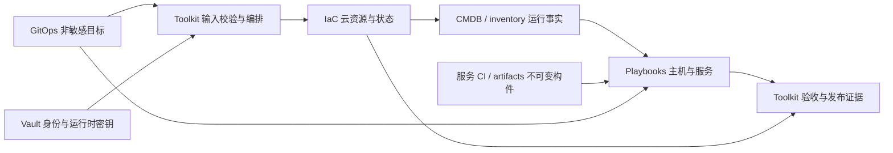
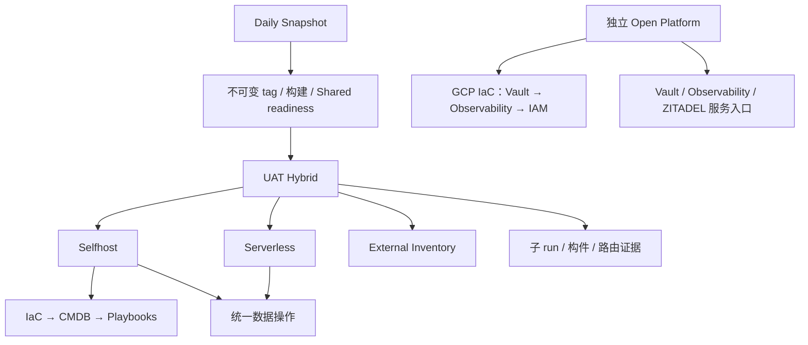
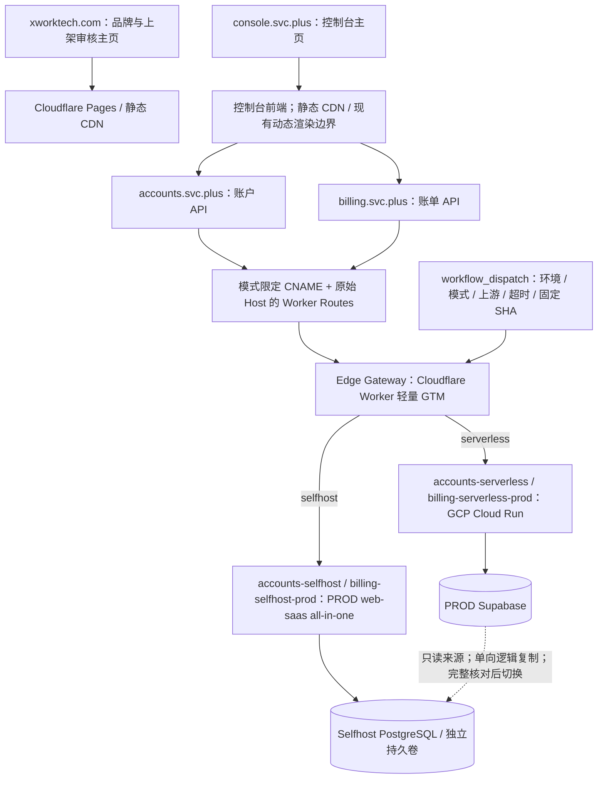
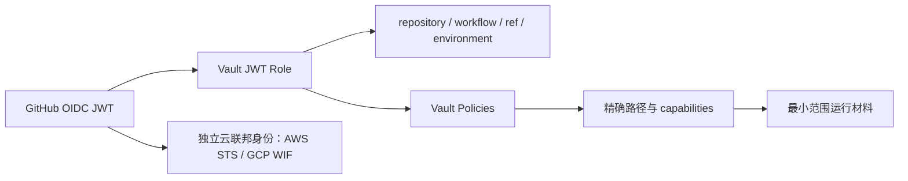

# 多云平台工程技术白皮书

**版本：1.3 · 源码盘点基线：2026-10-05 · 运行与额度补充：2026-10-06 · 状态：架构与契约评审稿**

[English version](multi-cloud-platform-engineering-whitepaper.en.md) · [参考资料总览](overview.zh.md)

## 摘要

多云平台工程需要把目标配置、执行逻辑、身份授权、资源事实与发布证据连成可审计的交付系统。本白皮书以 `platform-ops-toolkit`、`playbooks`、`iac_modules`、`gitops` 四个仓库及 Vault 为基础，完整整理已盘点的 40 个 workflow、职责矩阵、运行链路、状态层级、密钥路径和后续迁移门槛。

系统的基本分工是：**GitOps 声明目标，Toolkit 编排流程，IaC Modules 管云资源，Playbooks 管主机和服务，Vault 提供运行时身份与密钥。** 应用构建继续由服务 CI 或 artifacts 体系承担。

当前架构已具备多云和多运行时入口，但执行职责尚未全部收敛。Toolkit 仍登记 15 项 legacy execution；共享平台路径与旧文档有冲突；XConnect 存在跨环境读取例外和新 caller 的 role 信任不匹配；真实升级 adapter 尚为空登记。因此，本白皮书分别描述当前源码、目标规范和未完成事项，不把文档、PR 合并或 CI 通过写成运行验收。

1.1 版新增第 8.5 节的统一 Vault 路径提案，将 CICD 明确标注为陈旧命名空间，并给出按 scope/project/用途拆分的映射与迁移门槛。提案尚未改变真实 Vault、policy 或 caller。

## 阅读导航

- 第 1～3 章：证据范围、架构与仓库职责。
- 第 4～6 章：环境身份、GitOps、Terraform state 与资源交接。
- 第 7～9 章：workflow 调用链、Vault 路径与授权边界。
- 第 10～12 章：发布、数据升级、验收与迁移路线。
- 附录 A：全部 40 个 workflow；附录 B：术语；附录 C：来源。

## 1. 范围、基线与证据等级

### 1.1 适用范围

本文面向平台工程师、SRE、应用交付负责人、安全与身份管理员及架构评审者。涵盖 Shared、SIT、UAT、PROD 的边界模型，以及 Selfhost、Serverless、Hybrid、Terraform 和 external inventory 的交付方式。本文不是部署授权、凭据迁移指令或已通过 UAT 的认证报告。

### 1.2 固定源码基线

| 仓库 | 已核对 SHA | 主要依据 |
| --- | --- | --- |
| Toolkit | `2e7b1d9387de615f882ec6cf8084781d0d006415` | workflows、caller、JWT role/policy、冻结登记 |
| Playbooks | `94b9ca010efb1eeb62469f791a910dd361f1abae` | Roles、playbooks、可复用 workflows |
| IaC Modules | `a0185e61fc2b41ac4dbd40c8037016aaef1b3973` | renderer、Provider 入口、backend/state 合同 |
| GitOps | `d6a734b12e91241557803895ad454c538ea5d6ae` | resources、topology、账号和 Vault 引用 |

盘点后形成的三份本地契约提交为 Toolkit `f0669ae8`，属于尚未推送的评审稿；不能引用为远端已合并标准。本白皮书把其内容独立整合到 knowledge，不依赖临时文件路径。workflow 固定消费的 owner SHA 可能早于上述 main 基线；真实运行必须记录实际消费 SHA。

### 1.3 六个独立证据等级

| 等级 | 能证明什么 | 尚不能证明什么 |
| --- | --- | --- |
| 源码/契约存在 | 参数、声明和调用关系可检查 | 实际身份、凭据或目标可用 |
| 本地静态/离线检查 | 格式、引用、部分行为与负例正确 | 云和主机行为正确 |
| CI 通过 | 指定 ref 的 CI 检查完成 | 真实 UAT 或业务验收 |
| owner / caller 合并 | 代码进入各自 main | Vault 已应用、caller 可运行 |
| 精确环境运行完成 | 指定 run 的部署/操作结果 | 业务权益、数据一致性或完整晋级资格 |
| 业务验收/晋级资格 | 固定构件、环境、目标和回执满足门槛 | 可复用于另一版本、环境或目标 |

初始盘点使用源码和现有合同，未执行云、主机、DNS 或数据库变更；第 11 章另按日期记录后续经授权运行的实际证据，不能反向把这些结果扩展为原盘点已验收。[S1], [S2]

## 2. 平台架构与工程原则

平台以四条相互交接的链组织工作：声明链给出目标；资源与配置执行链实现目标；身份链限定执行能力；证据链证明实际结果。



架构要求以下原则贯穿变更：

1. **声明和执行分离**：GitOps 保存数据，renderer、Provider、Ansible 和部署器分别归执行 owner。
2. **按行为判断归属**：不能用 workflow 文件名、目录位置或 scanner 标签替代行为审查。
3. **环境、账号、状态和版本显式绑定**：不得从域名、默认云项目或凭据响应猜目标。
4. **共享平台有独立生命周期**：普通业务发布消费就绪服务，不 bootstrap Shared。
5. **构件不可变、证据可关联**：tag、digest、源码和 run 形成同一版本的证明链。
6. **缺依赖即停止**：缺 manifest、owner、身份、目标或匹配回执时失败，不静默转用另一环境。
7. **先合同后迁移**：owner → caller → UAT → cleanup，历史文档归并保留适用日期。[S1], [S2]

## 3. 职责矩阵与保存位置

### 3.1 仓库级分工

| 层 | 职责 | 输入 | 输出 |
| --- | --- | --- | --- |
| Toolkit | workflow 入口、输入/版本选择、审批、GitOps 校验、Vault 登录、调用顺序和验收 | 操作请求、GitOps ref、release tag | 子 run、执行合同、脱敏发布证据 |
| IaC Modules | Terraform、renderer、Provider、Cloudflare DNS、state/lease、资源事实适配 | 资源声明、Provider 身份、backend 凭据 | 云资源、state 标识、CMDB/inventory |
| Playbooks | OS 初始化、主机配置、服务安装、应用部署、数据生命周期、主机健康 | CMDB、服务变量、构件、Vault 材料 | 服务状态、数据/checkpoint、失败与幂等回执 |
| GitOps | 环境、拓扑、资源、路由、版本和非敏感身份/Vault 引用 | 经评审的声明 | 固定 ref 的 desired state |
| Vault | JWT 授权、凭据、密钥和证书 | 经约束身份及受控写入 | 最小范围的运行时材料 |
| 服务 CI / artifacts | 应用编译、镜像/安装包构建与来源证明 | 固定源码和构建合同 | 不可变 tag/digest/release manifest |

### 3.2 按执行行为划分 owner

| 行为 | 权威 owner | 关键合同 |
| --- | --- | --- |
| desired state、生命周期、非敏感账号绑定 | GitOps | manifest 字段与 ref 可校验 |
| 输入、审批、阶段顺序、子 run 等待 | Toolkit | 环境/目标/构件、精确 run ID、结果传播 |
| GitOps reader / validator | Toolkit | 缺声明或冲突立即失败 |
| render、plan/apply/import/destroy、Provider/DNS、state/lease | IaC Modules | 账号核验、独立 backend、精确资源范围 |
| 包、文件、systemd、Caddy、服务和 XConnect 主机加入/探针 | Playbooks | CMDB target、构件、失败/幂等与清理 |
| 备份、隔离恢复、schema/数据迁移与验证 | Playbooks / 服务 owner | 同环境数据合同、版本/checksum、checkpoint |
| 服务构建及构件发布 | 服务 CI / artifacts | digest 与来源证明 |
| Vault role/policy 声明及 bootstrap 编排 | Toolkit | workflow/ref/environment 与路径能力一致 |
| 凭据轮换、吊销、旧记录清理 | Vault 管理员 / 受保护专项流程 | 精确批准范围、版本、消费者与回退 |
| 晋级、跨层验收、证据汇总 | Toolkit | 同构件、同环境、同目标、同 run |

通用主机配置沉淀到 Playbooks，服务仓库保留应用自身运行和部署逻辑。Provider describe / OCI inspect 可用于 Toolkit 发布门禁；通用云资源事实适配仍归 IaC。HTTP POST 的 owner 要根据请求语义判断，Vault/Accounts 控制请求、主机加入和云资源写入不能混为一类。

当前 Toolkit 中仍有 inline Terraform、主机操作和 wrapper 调用旧 executor。位置表示现状，以上矩阵表示目标归属；两者的差距需登记后逐行为收敛。[S2], [S3], [S4]

### 3.3 五类事实

| 事实 | 权威位置 | 使用方式 |
| --- | --- | --- |
| 希望存在什么 | GitOps | 执行输入，不能替代运行状态 |
| Terraform 管理了什么 | 独立 backend 的 state | IaC 使用；Ansible 不直接读取 tfstate |
| 本次资源事实 | CMDB / inventory artifact | Playbooks 与验收消费，不能变成手维护拓扑 |
| 可发布构件是什么 | tag/digest/release manifest | 保留来源，不以重新构建 main 替代已验收构件 |
| 身份和密钥是什么 | Vault / 动态身份 | 最小范围读取，不进入普通声明或公开证据 |

## 4. 环境、账号与 Provider 边界

### 4.1 环境模型

| 范围 | 生命周期 | 交付边界 |
| --- | --- | --- |
| Shared | 持久 Vault、Observability、IAM 等共享平台 | 独立 Open Platform；业务发布只读就绪门禁 |
| SIT | 集成验证 | 仅声明支持的入口、账号、路径及 state；不能从 UAT 模板推导支持 |
| UAT | 预生产业务验证与受控演练 | 当前 Daily → UAT Hybrid → 子流程 |
| PROD | 生产交付 | 独立身份/状态/审批；消费验收构件，不能复用 UAT 运行回执 |

`open-platform-shared` 是现有 GCP 账号配置标识；实际 Shared 项目为 `open-platform-shared-510113`。GitHub Environment 当前部分 Shared 流程使用 `prod`，它不等于业务 PROD 的资源范围。逻辑 project、namespace、state_project、provider account、实际 cloud project ID 和 Vault scope 分别记录。

当前 Hybrid 的 `vault_env_path` 仅允许 `uat`。规划中的 PROD Hybrid 不能写成现有可执行入口。[S5], [S6]

### 4.2 多账号成熟度

| Provider | 身份合同 | 基线状态与未完成条件 |
| --- | --- | --- |
| AWS | 12 位 account ID、GitHub OIDC → IAM role | runtime 检查声明账号；当前每环境单账号 profile；bootstrap/声明选择需进一步 account-scoped |
| GCP | 稳定 account 标识、实际 project ID、Vault JWT 配置 + WIF | account-specific bootstrap/runtime 路径与 role 已有；写入前仍须核验实际身份/项目 |
| Azure | tenant、subscription、client/application ID、OIDC | Selfhost 尚有 placeholder ID；需真实 GitOps 身份及 active tenant/subscription 校验 |
| Vultr VPS | 具体账号、Vault API token | 通用 Selfhost 仍读环境级 token，缺 authenticated-account 校验；多账号尚未收敛 |
| Akamai Cloud / Linode | 具体 account、Vault `LINODE_TOKEN` | account-specific KV/role 已有；token 账号级授权，不能使用 default/primary/main 别名 |
| UCloud UHost | 具体 project/account、Vault API 凭据 | standalone workflow 已读 project 路径；Selfhost 旧路径仍需收敛和身份核验 |
| ULightHost existing | 外部 inventory owner/account 与主机连接事实 | inventory-only，不创建、不接管、不销毁 Terraform 资源 |

多云选项、Provider registry 或模块目录存在，只证明代码结构可见；安全多账号能力还要求逐行选择、对应凭据/联邦身份、authenticated identity、独立 state prefix、最小 policy 和错配负例。[S7]

## 5. GitOps、IaC State 与 CMDB 合同

### 5.1 声明目录

| 目录 | 内容 |
| --- | --- |
| `resources/<project>/<env>/<provider>/` | 云资源、账号绑定、规格与生命周期目标 |
| `topology/<env>/<mode>/` | Selfhost / Serverless / Hybrid 的跨服务运行拓扑、域名与路由 |
| `services/` | 服务配置、版本及集群声明 |
| `environments/` | Flux/Kustomize 等集群环境入口 |

mode 是运行拓扑维度，不属于单一 Provider 目录。声明中可以放 SSH 公钥、公开 origin 和 Vault 引用，不放私钥、密码、API key、数据库连接串或生成 inventory。缺预期声明必须使消费者失败。[S3]

### 5.2 资源交接链

```text
GitOps YAML
  → Python / Jinja2 render
  → 显式 Terraform module / resource 块
  → terraform plan / apply
  → Terraform 运行输出 + YAML 静态字段合并
  → cmdb.json / inventory
  → Playbooks 配置主机与服务
  → Toolkit 汇总验收
```

批量环境的循环和组合集中在 renderer，生成 HCL 保持显式资源块。rendered HCL、tfvars、CMDB 和 inventory 是派生产物，不是另一个人工事实来源。每次 IaC 变更后刷新 inventory；existing adapter 则标明其资源事实来源。[S4], [S8]

### 5.3 Backend 与锁

```text
terraform/<scope>/<project>/<provider>/<account>/<workspace>/terraform.tfstate
terraform/<scope>/<project>/<provider>/<account>/<workspace>/terraform.tfstate.tflock
```

这些维度共同定义 state 边界。账号必须是具体稳定标识，不能用 default/primary/main 静默合并。Vault `kv/CICD/<scope>/iac_state` 保存 `TF_STATE_*` backend 连接凭据，tfstate 在 S3-compatible 对象存储；Provider 身份与 backend 身份分开。

启用 S3 `use_lockfile` 的标准要求 Terraform 不低于 1.10。state 迁移先记录旧/新 key，受控执行 migrate-state，随后 validate 和无漂移 plan，并保留原对象版本与旧 backend 直到验收完成。改变 Vault 路径不会自动迁移 state。[S8]

### 5.4 非 Terraform 纳管

ULightHost 的合同为 `management_mode: existing`、`provisioner: ansible`、`lifecycle: external`，不产生 tfstate。非敏感事实与运行记录分别使用：

```text
inventory/<scope>/<project>/<provider>/<account>/<workspace>.json
runs/<scope>/<project>/<provider>/<account>/<workspace>/<run-id>.json
```

UCloud UHost 属于 Terraform 标准资源，不能因为名称相近而采用 ULightHost external 生命周期。[S8]

## 6. 调用与执行的共同合同

每个执行请求和脱敏回执至少关联 scope/environment、逻辑 project/namespace、Provider/account/实际 project ID、workspace/state key、四仓实际 SHA、tag/digest、CMDB target/user/state directory、workflow run/attempt。缺字段作为差距记录，不猜值或改旧 state 身份。

| 调用方式 | 当前例子 | 核验重点 |
| --- | --- | --- |
| 同仓 reusable workflow | master → Provider；Open Platform → GCP | needs/if、with、权限和实际 ref |
| 跨仓 reusable workflow | Selfhost → domain CD；数据入口 → owner workflow | owner SHA、JWT caller claims、environment、输出与失败语义 |
| 独立 dispatch | Daily → Hybrid；Hybrid → 子入口；平台 → 服务 | 精确 run ID、等待、结论和构件关联 |
| checkout 后执行 | renderer、Ansible、服务部署器 | 真正 checkout SHA、工作目录、输入输出与临时材料清理 |
| wrapper 间接调用 | Toolkit helper → 旧 executor | 完整 caller graph；wrapper 无 marker 不能证明职责正确 |

输入校验、云端身份验证、backend readiness、apply attempted 和实际输出、SSH trust、主机状态、业务验证是分别成立的门禁。发生部分 apply 或数据写入失败时保留原始失败证据，核实现状再恢复；cleanup 不能覆盖失败结果。[S2], [S9]

## 7. Workflow 主链与专项入口



图是可达调用关系，不意味着每种 operation 都执行全部分支。

### 7.1 Daily → UAT Hybrid

Daily 创建跨仓不可变 tag、触发构建、验证构件，执行 Shared 只读就绪门禁。`dispatch-uat-combined.sh` 当前把 UAT 组合交付统一发往 Hybrid；Hybrid 读取 GitOps `topology/uat/hybrid/resource-matrix.json`，逐行选 Provider、账号、manifest 和子入口，等待精确子 run。

普通业务 deploy 跳过共享平台资源；Hybrid 显式维护操作仍有共享行处理能力，不能声称任何 operation 都无法触碰 Shared。组合部署拒绝携带数据同步和 XConnect release override；经校验的 Accounts baseline/schema 请求可显式传入子链。该路径跳过 Stripe catalog，不能报告 catalog 同步完成。[S5], [S9]

### 7.2 Selfhost 与 Serverless

Selfhost 编排 IaC/CMDB、主机基线、domain CD、数据与 DNS 阶段；通用执行归 IaC 或 Playbooks。Serverless 编排 Cloud Run、Cloudflare Pages/Workers、服务部署、数据 owner 和构件证明。GitOps 的对应 mode 文件限定域名、origin 和后端策略，不能以一个 mode 的声明替代另一个。

Hybrid 的基础规划采用 Selfhost 优先和 Serverless fallback，但实际路由、数据单写者与复制策略必须消费固定 GitOps 声明。两条部署链存在不证明切换或数据同步已经验收。[S3], [S5]

### 7.2.1 多云、混合云数据面与轻量 GTM 调度边界

以下为用户确认的目标数据面；详细输入与当前运行证据见第 11.11–11.12 节。品牌、控制台、API 和数据库是独立边界，部署某个后端不能连带更换公开主页入口。



- **品牌主页**：`xworktech.com` 保持独立品牌、公司、产品和法律/支持信息的公开访问，支撑 Google Play、Apple、Microsoft/Azure 等审核；资料齐备与平台审核结论分别记录。
- **控制台**：`console.svc.plus` 保持用户入口。静态内容使用 Pages CDN；当前动态渲染、登录和会话继续按前端边界管理，不能把“静态 CDN 免费”泛化为所有 SSR 请求不计量。
- **账户与账单 API**：稳定域名分别通过 `accounts-{serverless,selfhost}-prod.svc.plus`、`billing-{serverless,selfhost}-prod.svc.plus` 的 CNAME 与独立 Worker Routes 接入。CNAME 选择环境限定目标；Worker 根据模式与固定配置选择真实 origin，两者在同一发布回执内核对。原始 Host 的路由必须保留，避免继承目标绑定的错误假设。
- **轻量 GTM**：三种模式均保留 Edge Gateway；运行在原生 Fetch/Web Crypto 上，默认 2500 ms 主节点预算。Hybrid 的超时/5xx 回退只用于 GET/HEAD/OPTIONS，不承担数据库复制、写入重放或多主协调。发布输入可覆盖非敏感变量，秘密仍由环境隔离的 OIDC→Vault 读取。
- **容量边界**：Workers Free 为账户共享 100,000 次/日（UTC 零点重置），包括 Pages Functions 和其他 Workers；不调用 Functions 的 Pages 静态请求免费且不限量。Pages/CDN 静态资源应直接服务，避免每个静态请求经过 API Worker。（[Cloudflare 官方计费说明](https://developers.cloudflare.com/pages/functions/pricing/)）
- **数据切换**：Serverless 为 Cloud Run + PROD Supabase，Selfhost 为 PROD all-in-one + PostgreSQL。复制按 email 唯一键匹配、保留 PROD Proxy UUID；身份域复制不足以放行，必须覆盖身份、订阅、额度、账本及全部业务表，最终追平后保证单写者，再验证生产入口。
- **资源身份**：日常创建/更新资源复用一次 bootstrap 建立的 GitHub OIDC/WIF 和专用 Service Account；首次 bootstrap、信任合同修复与日常部署分开审批和记录，不把个人 GCP 登录作为发布前置。

这套数据面调度与 Hybrid 的 IaC/部署子流水线编排分别验收：子 run 成功不证明稳定域名已切换；入口返回 200 也不证明两库业务一致。

### 7.2.2 免费额度、计量范围与混合云容量预算

以下额度于 **2026-10-06** 按官方页面核对，用于架构预算。实际消耗仍以各平台 dashboard 与 billing account / organization 的当前周期为准；多个环境不能各自重复享有共享额度。

| 服务 / 计量模式 | 主要免费额度 | 范围、周期与边界 |
| --- | --- | --- |
| Cloudflare Pages 静态资源 | 免费且不限请求量 | 请求不调用 Pages Functions；静态 CDN 与动态渲染分开计量 |
| Cloudflare Workers Free / Pages Functions | 100,000 请求/日；CPU 10 ms/调用 | 账户内 Workers/Functions 共享，UTC 零点重置；API 网关与现有 SSR 消耗同一账户预算 |
| Cloud Run 请求计费 | 2,000,000 请求/月；180,000 vCPU-seconds/月；360,000 GiB-seconds/月 | 按 GCP billing account 汇总多个项目；免费层按 Tier 1 价格折扣抵扣，实际额度价值随 region / billing mode 核算 |
| Cloud Run 实例计费 / Jobs | 240,000 vCPU-seconds/月；450,000 GiB-seconds/月 | 使用另一套计费口径；不能把请求计费的 200 万请求与该计算额度重复叠加为每个服务的独立配额 |
| Cloud Run 公网出口 | 北美范围 1 GiB/月免费传输 | 亚洲部署或其他方向不能直接套用；网络、构建、镜像仓库和日志分别预算 |
| Supabase Free PostgreSQL | 500 MB 数据库/项目；Shared CPU、500 MB RAM | 数据库容量按项目；容量、连接、查询压力与出口流量是不同指标 |
| Supabase Free 出口 | 5 GB 非缓存出口；另有 5 GB 缓存出口 | 按组织计量；数据库结果、Storage、Auth 等相关流量需按官方出口分类核算，不能把两类额度当作任意 DB 下载的 10 GB |
| Supabase Free Auth / Storage | 50,000 MAU；1 GB 文件存储 | 按组织套餐/当前周期核算；MAU 不等于数据库用户表行数 |
| Supabase Free 项目限制 | 2 个 active Free projects；低活跃项目可能在约 7 天后暂停 | 两项目限制跨本人作为 Owner/Admin 的 Free 组织累计；不能通过新建组织重复增加额度 |
| Supabase Free API / 数据保护 | API 请求数量不限；不含自动备份与 PITR | 无限 API 请求仍受 DB/出口等额度约束；数据备份由独立发布与运维流程提供 |

Cloud Run 来源：[官方价格与免费层](https://cloud.google.com/run/pricing)。Supabase 来源：[官方套餐](https://supabase.com/pricing)、[组织计费及项目额度](https://supabase.com/docs/guides/platform/billing-on-supabase)、[出口分类](https://supabase.com/docs/guides/platform/manage-your-usage/egress)。Cloudflare 来源：[Pages Functions 计费](https://developers.cloudflare.com/pages/functions/pricing/)、[Workers 限额](https://developers.cloudflare.com/workers/platform/limits/)。

容量策略与本平台边界：

1. 品牌与静态资源优先 Pages/CDN 直接服务；Edge Gateway 处理 Accounts/Billing API。SSR/Functions 的实际请求仍需计入 Workers 账户预算。
2. Accounts Serverless 与 Billing Serverless 的低流量/回退容量按 Cloud Run 当前计费模式、最小实例数和并发核算；scale-to-zero 能减少空闲计算，但不能取消网络、日志或镜像存储费用。免费层抵扣与运行限额分别记录。
3. Supabase 查询返回结果与跨环境全量复制会消耗来源出口；数据库内生成行数/hash 摘要能减少核对流量。来源端到控制端完成之后再 gzip，仅减少后续传输/存档大小，不回退已经发生的 Supabase 出口。
4. 用户截图显示出口 **9.49/5 GB**、日志写入 **1.31/1 GB** 已超当时额度，而 DB **152/500 MB** 仍有空间；日志 1 GB 是该截图所示周期限额，未把它推定为所有当前 Free 组织的通用套餐值。账本行数、存储容量、出口及日志用量分别优化，保持历史业务数据与 PROD Proxy UUID 不变。
5. 切换到 Selfhost 后，GCP VM、独立持久盘、快照与网络按各自计价；只有完整业务一致性、单写者切换和入口验收通过，才能调整主库。免费额度压力不放宽数据门禁。

本节未查询 Cloud Run 当期账单或 Supabase 组织实时用量；额度表是官方套餐基线，截图是用户提供的现场背景，两者不替代实际账单核对。

### 7.3 独立 Open Platform

`open-platform-orchestrator.yml` 的 GCP IaC 依赖为 Vault → Observability → IAM；按 operation 和 target_services 派发对应服务阶段并等待。该入口没有 destroy。基础设施、服务配置、历史数据迁移、DNS 切换和观察窗口分别记录，普通业务发布不重建共享服务。[S6]

### 7.4 通用 Multi-cloud Master

- AWS/Azure/Vultr：Landing Zone → Account → Resources，受开关与依赖结果约束。
- GCP、Akamai、UCloud：分别 delegate 到对应 Provider workflow。
- ULightHost：External Inventory，不运行 Terraform。
- generic 三个子入口也可单独 delegate 到 GCP。
- `gcp-uat-workload-sequence.yml` 是独立手动顺序入口，不是 Daily/Hybrid 必经阶段。[S10]

### 7.5 产品、网络与运维专项

AI Aggregator、Global Mesh、XConnect bootstrap、Vault、ZITADEL、Observability、Runner、resize、DNS/TLS、性能、区域验收与 cleanup 各有入口，完整清单见附录 A。`xconnect-runtime-control.yml` 当前仅暴露 `gateway_verify`、`one_verify`；安装、加入、existing-One、观察、lease 和 cleanup 仍有旧混合链路。运行验证 caller 的 Vault 信任差异见第 9 章。

## 8. Vault KV 层级与字段契约

### 8.1 不同路径表示

| 场景 | 路径 |
| --- | --- |
| CLI / GitOps logical reference | `kv/CICD/uat/iac_state` |
| 数据 API / policy | `kv/data/CICD/uat/iac_state` |
| Metadata API / policy | `kv/metadata/CICD/uat/iac_state` |

`data` 和 `metadata` 是 KV v2 API 层。`kv/CICD` 根记录与 `kv/CICD/uat` 子记录独立，读取根不授权子路径。不能给通用环境角色使用 `kv/data/CICD/*` 快捷授权全部环境。

### 8.2 当前路径族（含历史兼容路径）

下树只反映固定源码的声明/引用，不证明真实记录存在或字段齐全；不是每个路径族都支持 SIT。

**`CICD` 标注为陈旧命名空间（LEGACY，待迁移）**：其问题是混装了交付身份、云初始化、backend 凭据、证书和服务材料。现有 caller 仍在读取；“陈旧”指路径模型，不代表凭据失效或允许删除。目标设计不再向这个混装根新增记录，新需求按第 8.5 节归类；当前消费者在完成迁移前保持兼容。

```text
kv/
├── CICD                          # LEGACY：陈旧命名空间，仍有消费者，待迁移
│   ├── github-app/daily-snapshot
│   ├── domains/<domain>
│   ├── observability
│   ├── <env>/
│   │   ├── iac_state
│   │   ├── aws-bootstrap
│   │   ├── gcp-bootstrap/<account>
│   │   ├── akamai-cloud/<account>
│   │   └── ucloud/<project>
│   └── shared/
│       ├── iac_state
│       ├── gcp-bootstrap/<account>
│       ├── xconnect
│       ├── xconnect-operator-invite
│       └── xconnect-operator-invite/<network>
├── <env>/
│   ├── platform/oidc/<account>
│   ├── platform/{jwt,cloudflare,gcp,observability,gitea}
│   ├── serverless/{gcp,cloudflare,dts,...}
│   ├── services/{xconnect,ai-workspace}
│   ├── databases
│   ├── agent-proxy
│   ├── xconnect-one
│   ├── ulighthost-xconnect/<node>
│   └── ai-aggregator/...
├── shared/
│   ├── platform/oidc/<account>
│   ├── iam
│   └── databases
├── iam/<env>/<integration>/<account>/<purpose>
├── action-runner
├── openclaw
└── WEB_SAAS
```

`<env>` 表示业务环境；`<scope>` 还可包含明确声明的 Shared。`shared/iam` 是 ZITADEL 服务材料，`iam/<env>/...` 是 workforce/workload/application 集成记录；Provider API 凭据继续放 CICD。invite 根记录与 per-network 子记录有不同 caller，不能自动合并。其他产品的 `github-actions/`、`xworkmate/` 等命名空间不因未列入本树而进入清理范围。

### 8.3 当前主要路径和字段

| CLI 路径 | 字段/用途 | 消费与变更边界 |
| --- | --- | --- |
| `kv/CICD` | 共享 CI 字段及历史 SSH/DNS 基础字段 | 精确根读取；迁移前核对全部消费者 |
| `kv/CICD/github-app/daily-snapshot` | `app_private_key` | Snapshot、release 下载及跨仓调用；App installation 权限另验 |
| `kv/CICD/domains/<domain>` | `tls_fullchain_pem_b64`、`tls_key_pem_b64`，trust/CA/有效期按 caller | 部署读取；rotation 和其他写能力独立核对 |
| `kv/CICD/observability` | `user`、`password` | 共享监控接入 |
| `kv/CICD/<scope>/iac_state` | `TF_STATE_ENDPOINT`、`TF_STATE_BUCKET`、`TF_STATE_ACCESS_KEY`、`TF_STATE_SECRET_KEY`、`TF_STATE_REGION` | backend-only；不保存 tfstate |
| `kv/CICD/<env>/aws-bootstrap` | `AWS_ACCESS_KEY_ID`、`AWS_SECRET_ACCESS_KEY`，session 材料按合同 | 当前按环境；多账号需独立迁移 |
| `kv/CICD/<scope>/gcp-bootstrap/<account>` | `GCP_PROJECT_ID`、`GCP_AUTH_JSON` 或 `GCP_ACCESS_TOKEN` | 一次性 bootstrap 专用 role |
| `kv/<scope>/platform/oidc/<account>` | `gcp_workload_identity_provider`、`deploy_service_account`、`gcp_oidc_audience`、`project_id` | bootstrap 后的 account-specific runtime 身份 |
| `kv/CICD/<env>/akamai-cloud/<account>` | `LINODE_TOKEN` | 具体账号绑定，不接受别名 |
| `kv/CICD/<env>/ucloud/<project>` | `UCLOUD_PUBLIC_KEY`、`UCLOUD_PRIVATE_KEY`、`UCLOUD_PROJECT_ID`、`UCLOUD_REGION`；SG/key-pair ID | standalone 入口消费；Selfhost 旧基准路径另验 |
| `kv/<env>/serverless/gcp` | `GCP_WORKLOAD_IDENTITY_PROVIDER`、`GCP_SERVICE_ACCOUNT_EMAIL` | Serverless WIF 兼容合同，不重复 GitOps 项目/区域配置 |
| `kv/<env>/serverless/cloudflare` | `CLOUDFLARE_ACCOUNT_ID`、`CLOUDFLARE_API_TOKEN` | 对应环境 edge 交付 |
| `kv/<env>/platform/jwt` | `issuer`、`audience`、`signing_key` | JWT 材料；应用只消费实际需要的签名/验证材料 |
| `kv/<env>/platform/cloudflare` | `api_token`、`account_id`、`zone_id` | 对应平台 DNS 作用域 |
| `kv/<env>/platform/gcp` | `project_id`、`region`、`artifact_registry` | 现有文档字段；消费时避免第二份目标配置 |
| `kv/<env>/platform/observability` | `grafana_admin_password`、`remote_write_token` | 对应环境监控身份 |
| `kv/<env>/platform/gitea` | `url`、`runner_token`、`webhook_secret` | Gitea 集成 |
| `kv/<env>/services/xconnect` | `supabase_url`、`supabase_service_role`、`jwt_audience` | XConnect 服务合同 |
| `kv/<env>/services/ai-workspace` | `api_base_url`、`oauth_client_secret`、`jwt_audience` | AI Workspace 服务合同 |
| `kv/<env>/databases`、`kv/<env>/agent-proxy` | 环境数据库口令、代理身份 | 常规环境 policy；可进一步按服务收敛 |
| `kv/<env>/xconnect-one`、`kv/<env>/ulighthost-xconnect/<node>` | 网络运行身份、精确外部主机连接材料 | target、SSH trust 和环境必须明确 |
| `kv/CICD/shared/xconnect` | `ZERO_SERVICE_TOKEN`、`VLESS_ID` | Shared enrollment/网络专用只读 role |
| `kv/CICD/shared/xconnect-operator-invite[/<network>]` | 一次性短期 invitation | 当前 CI create/update，不回读；操作者独立身份读取 |
| `kv/shared/iam`、`kv/shared/databases` | ZITADEL masterkey/admin/session、数据库口令 | shared-zitadel role；不并入业务 IAM 集成路径 |
| `kv/iam/<env>/<integration>/<account>/<purpose>` | 身份集成字段/secret | purpose 为 workforce、workload、application |
| `kv/action-runner`、`kv/openclaw`、`kv/WEB_SAAS` | 公共服务/历史兼容材料 | 按具体消费者校验；WEB_SAAS 仍被读取 |

字段新增需同时更新字段合同、consumer、policy、bootstrap/check、rotation/rollback 和验收。非敏感身份元数据可以作为完整身份记录的一部分保留；域名、region 和路由等目标配置仍以 GitOps 为权威来源。表中保留历史文档定义的完整字段，不能据字段重复就自动迁移消费者。[S11], [S12], [S13]

### 8.4 AI Aggregator 最小命名空间与文档差异

Toolkit 基线的 minimal KV 文档列出以下记录；LLM Provider 仅为 openai、anthropic、xai：

```text
kv/<env>/ai-aggregator/database/new-api
kv/<env>/ai-aggregator/database/litellm
kv/<env>/ai-aggregator/gateway/caddy
kv/<env>/ai-aggregator/gateway/apisix
kv/<env>/ai-aggregator/gateway/new-api
kv/<env>/ai-aggregator/gateway/litellm
kv/<env>/ai-aggregator/litellm/providers/openai
kv/<env>/ai-aggregator/litellm/providers/anthropic
kv/<env>/ai-aggregator/litellm/providers/xai
```

database 的已列字段为 `dsn`；Caddy 为 `admin_basic_auth_hash`；New API 为 `session_secret`、`crypto_secret`、`jwt_private_key`、`jwt_issuer`、`jwt_audience`；LiteLLM 为 `master_key`、`proxy_secret`；LLM Provider 为 `endpoint`、`api_key`。该文档没有完整列出 APISIX 字段，不能补猜。

GitOps 同期 KV 文档仍列 `database/kong`，与 Toolkit 的 Caddy/APISIX 路径不同。这是本次整合额外确认的文档差异，需核对真实消费者后归并，不能把两份路径并集视为已批准合同。CPA OAuth 保留在节点加密 auth 目录；client/account/instance 元数据、token hash、jti/revocation 状态归 PostgreSQL。新自动化不重建废弃 accounts/instances/clients 等命名空间，既有记录清理另行评审。[S12], [S13]

### 8.5 目标路径规划（设计提案，尚未迁移）

推荐采用 **范围 → 项目 → 用途 → 对象 → 记录** 的统一顺序：

```text
kv/<scope>/<project>/<category>/.../<record>
```

`scope` 为 shared、sit、uat、prod；`project` 复用经评审的 GitOps 逻辑项目，例如 svc.plus、onwalk.net、xworktech.com，不是 GCP project ID 或 UCloud project ID。`category` 固定为下表七类。后续层级按对象类型定义，最后一层才存字段，中间层仅作分组，不保存大而全的父记录。本规划保留现有 kv mount，项目路径不是 Vault Enterprise Namespace。

#### 8.5.1 七类用途与树形结构

| category | 保存什么 | 主要消费者 / 写入边界 |
| --- | --- | --- |
| delivery | GitHub App 等交付控制身份 | Toolkit；受保护初始化与轮换 |
| cloud | 云 bootstrap 材料、联邦绑定、API 凭据 | bootstrap / IaC / Serverless，按 profile 分开 |
| state | Terraform backend 连接凭据 | IaC；与 Provider 凭据分别授权 |
| services | 服务运行密钥、数据库连接、服务集成与网络邀请 | Playbooks / 对应服务；按实际读写者拆分 |
| identity | workforce、workload、application 身份集成 | 身份 bootstrap 与具体客户端 |
| hosts | 精确节点及用户的 SSH、主机 Agent 身份 | Playbooks / Agent，限定节点与用途 |
| certificates | 指定域名的证书与私钥 | 部署只读，rotation 专用写入 |

下树是单个 scope/project 的模板；四个 scope 使用相同分类，但只创建确有声明和消费者的记录：

```text
kv/
├── shared/
│   └── <project>/
│       ├── delivery/github/apps/<app>/credentials
│       ├── cloud/<provider>/<account>/
│       │   ├── bootstrap/<profile>
│       │   ├── federation/<profile>
│       │   └── api/<profile>
│       ├── state/backends/<backend-id>/credentials
│       ├── services/<service>/
│       │   ├── runtime/<component>
│       │   ├── database/<database>/<principal>
│       │   ├── integrations/<integration>/<binding>
│       │   ├── providers/<provider>/<profile>
│       │   └── networks/<network>/
│       │       ├── service-token
│       │       ├── transport-auth
│       │       └── operator-invites/<invite-id>
│       ├── identity/<purpose>/<integration>/<account>/client
│       ├── hosts/<node>/
│       │   ├── ssh/<user>
│       │   ├── agent-proxy/auth
│       │   └── xconnect-one/auth
│       └── certificates/<domain>/tls
├── sit/<project>/...             # 同样七类，按实际支持范围创建
├── uat/<project>/...             # 同样七类，凭据与 policy 独立
└── prod/<project>/...            # 同样七类，凭据与 policy 独立
```

`services/<service>/...` 是分类模板，例如 XConnect 的网络材料属于 `services/xconnect/networks/<network>/...`。ZITADEL、Observability、Gitea、Action Runner、OpenClaw、AI Aggregator 都按服务名落到 services；IAM 身份集成落到 identity。Selfhost/Serverless 是交付方式，不再成为秘密分类，两者按精确 GitOps 引用消费 cloud 或 services 记录。一个跨项目共用凭据只在其 owner project 下保留一条权威记录，其他项目通过显式引用消费，不复制或开放整棵 Shared。

#### 8.5.2 命名与凭据边界

1. **scope 按材料归属确定。** Shared 凭据保持 shared；调用它的 UAT workflow 不改变其归属。某个生产节点不会因为供 UAT 验证使用就被改标 shared。
2. **project 与 account 分开。** provider/account 使用账号注册表的具体标识；cloud_project_id、UCloud 项目和 state key 另行记录。profile 标识用途，例如 iac-deploy、serverless-deploy、dns-reconcile，不接受 default/primary/main。
3. **一条记录对应一种权限与轮换边界。** 管理口令、业务运行口令、JWT 签名、数据库连接不能因属于同一服务就混装。读取 KV 记录会返回其数据字段；按不同消费者拆记录，不能依靠 caller 只取其中一个字段实现隔离。[S17], [S18]
4. **bootstrap、federation、api 分开。** federation 记录绑定配置，动态云 token 不持久化为通用 KV；API-token Provider 使用具体 account/profile。
5. **state 记录以 backend-id 标识连接身份。** GitOps 合同显式绑定允许的 state prefix、Provider/account/workspace；记录路径本身不会限制对象存储权限。tfstate key 继续遵循第 5 章，不随 KV 规划改变。
6. **新标识使用小写与连字符，保持稳定。** 既有项目域名可保留点；公开节点/域名可作标识。路径不含 token、邮件地址等敏感内容，也不以目录名暗示实际云身份。
7. **公共目标配置仍归 GitOps。** 域名、region、路由、公开 issuer、节点连接事实不单独复制为一份 Vault 配置；完整身份绑定所需的非敏感字段可随对应凭据记录保留。
8. **邀请必须有业务过期与一次性消费机制。** KV 不签发动态 secret lease；路径或 Vault 登录 token 的 TTL 不能替代邀请失效。delete_version_after 也不等于撤销外部凭据，需由 invitation owner 校验、吊销和清理。[S18], [S19]

角色声明仍归 auth 配置与 Toolkit 的 role/policy 源码；Vault root、unseal/recovery 材料继续遵循独立恢复合同，不进入普通交付 KV。这里是静态 KV 的整理方案，不表示要把现有动态身份改成静态密钥。

#### 8.5.3 陈旧路径到目标路径的映射

表中目标均为提案。`<project>` 由消费者合同确认，`<scope>` 按材料实际归属确认；不能从旧路径中的笼统 env 或当前 workflow Environment 自动填入。`<account>`、`<backend-id>`、`<node>`、`<network>` 等分别登记，不复用含义不清的简写。

| 当前路径 / 状态 | 目标路径或归属 | 映射条件 |
| --- | --- | --- |
| `kv/CICD` / `kv/CICD/<env>` — LEGACY | 按字段拆到 delivery、cloud、hosts、certificates、services | 先查全部读写者；没有统一新根记录 |
| `kv/CICD/github-app/daily-snapshot` — LEGACY | `kv/shared/<project>/delivery/github/apps/daily-snapshot/credentials` | 仅跨环境共用 App 身份；限定 installation 权限 |
| `kv/CICD/<scope>/iac_state` — LEGACY | `kv/<scope>/<project>/state/backends/<backend-id>/credentials` | backend-id 明确；绑定对象存储 prefix，不改 state key |
| `kv/CICD/<env>/aws-bootstrap` — LEGACY | `kv/<scope>/<project>/cloud/aws/<account>/bootstrap/oidc-setup` | 先解析真实 AWS account，不能一份环境记录复制给所有账号 |
| `kv/CICD/<scope>/gcp-bootstrap/<account>` — LEGACY | `kv/<scope>/<project>/cloud/gcp/<account>/bootstrap/wif-setup` | account 与实际 cloud project 分开核验 |
| `kv/<scope>/platform/oidc/<account>` | `kv/<scope>/<project>/cloud/gcp/<account>/federation/iac-deploy` | 保留完整 WIF 绑定与受控 writer |
| `kv/<env>/serverless/gcp` | `kv/<scope>/<project>/cloud/gcp/<account>/federation/serverless-deploy` | 与 IaC identity 相同才可显式引用同一记录；不自动合并 |
| `kv/CICD/<env>/akamai-cloud/<account>` — LEGACY | `kv/<scope>/<project>/cloud/akamai/<account>/api/iac-deploy` | LINODE_TOKEN 的真实账号和用途匹配 |
| `kv/CICD/<env>/ucloud/<project>` — LEGACY | `kv/<scope>/<project>/cloud/ucloud/<account>/api/iac-deploy` | 旧 project 为 UCloud 项目；先绑定真实账号与 GitOps 逻辑项目 |
| `kv/<env>/platform/cloudflare` / `kv/<env>/serverless/cloudflare` | `kv/<scope>/<project>/cloud/cloudflare/<account>/api/<profile>` | dns-reconcile 与 edge-deploy 分授权、分轮换 |
| `kv/CICD/domains/<domain>` — LEGACY | `kv/<scope>/<project>/certificates/<domain>/tls` | 按证书实际归属定 scope；不把所有证书默认改为 shared |
| `kv/CICD/observability` — LEGACY / `kv/<env>/platform/observability` | `kv/<scope>/<project>/services/observability/<purpose>/<binding>` | admin、ingestion、API 身份按实际字段与消费者拆分 |
| `kv/shared/iam` / `kv/shared/databases` | `kv/shared/<project>/services/zitadel/runtime/<component>` / `kv/shared/<project>/services/zitadel/database/<database>/<principal>` | 拆服务运行与数据库权限；核对数据库是否还有其他消费者 |
| `kv/<env>/platform/jwt` / `kv/<env>/platform/gitea` / `kv/<env>/services/<service>` | `kv/<scope>/<project>/services/<service>/runtime/<component>` / `kv/<scope>/<project>/services/<service>/integrations/<integration>/<binding>` | 先确认 JWT issuer owner 和集成 consumer，字段逐项迁移 |
| `kv/<env>/databases` / `kv/<env>/agent-proxy` | `kv/<scope>/<project>/services/<service>/database/<database>/<principal>` / `kv/<scope>/<project>/hosts/<node>/agent-proxy/auth` | 共用数据库与节点代理身份分别拆分，保留精确目标 |
| `kv/<env>/xconnect-one` / `kv/<env>/ulighthost-xconnect/<node>` | `kv/<scope>/<project>/hosts/<node>/xconnect-one/auth` / `kv/<scope>/<project>/hosts/<node>/ssh/<user>` | 以 CMDB 中实际节点与用户绑定；既有 PROD 例外仍标 PROD |
| `kv/CICD/shared/xconnect` — LEGACY | `kv/shared/<project>/services/xconnect/networks/<network>/service-token` / `kv/shared/<project>/services/xconnect/networks/<network>/transport-auth` | network 显式绑定；ZERO_SERVICE_TOKEN 与 VLESS_ID 按消费者拆分 |
| `kv/CICD/shared/xconnect-operator-invite[/<network>]` — LEGACY | `kv/shared/<project>/services/xconnect/networks/<network>/operator-invites/<invite-id>` | 根记录与网络记录分别核验 network；每次邀请使用唯一 invite-id |
| `kv/iam/<env>/<integration>/<account>/<purpose>` | `kv/<scope>/<project>/identity/<purpose>/<integration>/<account>/client` | 保留 workforce/workload/application 与集成账号含义 |
| `kv/<env>/ai-aggregator/...` | `kv/<scope>/<project>/services/ai-aggregator/...` | 保持组件语义，按 consumer/principal 拆分；先解决 APISIX/Caddy/Kong 文档差异 |
| `kv/action-runner` / `kv/openclaw` | `kv/<scope>/<project>/services/action-runner/...` / `kv/<scope>/<project>/services/openclaw/...` | scope/project 必须查现有 consumer，不能直接默认 shared |
| `kv/WEB_SAAS` — LEGACY | 按字段映射 cloud、services、hosts、certificates | 兼容期保留原记录；不建立新的大杂烩名称 |
| `kv/<env>/platform/gcp` 中仅含公开配置的字段 | GitOps 资源/构件声明 | 不为非敏感配置单独创建新 KV 记录 |

例如 Shared GCP 绑定可规划为 `kv/shared/svc.plus/cloud/gcp/open-platform-shared/federation/iac-deploy`；其实际项目仍为 `open-platform-shared-510113`。两者不能据路径名称互相替换。

#### 8.5.4 权限合同与迁移门槛

每条目标记录登记 logical_path、scope、gitops_project、用途/字段、全部 reader、writer、rotation owner、云/backend/节点绑定、所需 capabilities、旧路径、状态及回退条件。登记文件仅保存非敏感合同与引用，记录值运行时由 Vault 提供。

部署 role 精确读取所需 data 记录；bootstrap、证书轮换和邀请写入使用独立 role。需要 list 时仅给必要 metadata 目录；KV v2 的 list 不按各叶子 policy 过滤名称，不能授予全项目 list 来代替精确引用。delete、destroy、undelete、metadata 管理按专门操作分别评审，不能因属于一个目录就打包开放。[S17], [S18]

实施顺序为：**登记消费者 → 审定映射与权限 → owner 支持显式新引用 → 受控写入/轮换 → caller 切换 → UAT 与业务验证 → 冻结兼容窗口 → 吊销/清理旧记录。** 同一 consumer 一次只读一个明确路径，不自动 fallback 到旧根或另一环境；回退通过显式版本化引用恢复。验证覆盖字段完整性、错账号、跨环境拒绝、幂等、rotation/rollback、失败清理及未引用检查。

跨环境 XConnect 例外先登记目的、节点、reader 和截止条件，再选择取消或精确保留；不得用移动到 shared 掩盖真实 PROD 归属。CICD 每个子记录分别经历 LEGACY → MIGRATING → RETIRED；只有消费者已切换、旧权限已收敛且回退/备份条件齐备才标 RETIRED。路径整理不修复第 9 章的 JWT workflow claim 差异，也不直接调整云账号、state 或真实凭据。

## 9. 身份、授权及历史例外



登录 Vault、读取某个 KV、取得云身份、通过 backend 初始化、访问主机是不同能力，分别校验。

### 9.1 授权声明与角色类别

Toolkit 的 `scripts/vault/roles/` 和 `scripts/vault/policies/` 保存声明，`scripts/create_vault_service_repo_roles.sh` 验证/应用；真实 Vault 状态是否同步需另验。

| 类别 | 当前合同 | 需要保留的区别 |
| --- | --- | --- |
| 常规 SIT/UAT/PROD | 自己的 CICD base/state 和业务根；常规 PROD data/metadata 无 delete | 不推广到所有专用 role |
| 公共 CI / TLS | CICD 精确根通常 read；通用环境 policy 仍有 domains/* 写能力；rotation 有专用 role | 共享材料不等于全部只读 |
| Shared | GCP runtime、Vault 分阶段、ZITADEL、network 专用角色 | GitHub Environment prod 与业务 prod scope 不同 |
| Bootstrap | GCP environment/account 独立；AWS 当前 environment 独立 | 临时初始化与 runtime 权限、吊销分开 |
| PROD release | 窄用途允许 Daily 从 protected main 创建来源明确的新 v* tag | 不放宽普通 PROD 部署 role 到 main |

### 9.2 五项已记录的 Vault 差异

| 编号 | 当前源码/文档事实 | 处置原则 |
| --- | --- | --- |
| V01 | 旧 GitOps 文档说不存在 kv/shared，但当前 shared/platform/oidc、shared/iam、shared/databases 已被声明使用 | 文档对齐代码引用，不据旧文档迁走平台 |
| V02 | UAT cloud-lab policy 可读 PROD 的 `kv/data/prod/ulighthost-xconnect/tw-xconnect.svc.plus` 精确记录 | 登记跨环境用途，不等于普通 UAT 获得 PROD 操作权 |
| V03 | existing-One policy 还可读 `kv/data/prod/ulighthost-xconnect/*` | 明确 wildcard 范围；收窄前查全部 caller 与回退 |
| V04 | 新 runtime-control 使用 cloud-lab role，其 job_workflow_ref 只绑定旧 zero-cloud workflow | 静态信任合同不匹配；单独修复和应用，不宣称已实际 403 或已修好 |
| V05 | 旧路径存量盘点为 2026-07-22；CICD 根和 WEB_SAAS 仍有当前消费者 | 不用历史“缺失/未引用”判断删除或权限变更 |

V03 的 existing-One policy 还显式列出 `kv/data/prod/ulighthost-xconnect/observability.svc.plus` 的 read；精确记录与 wildcard 应同时登记。V04 的完整 role 为 `github-actions-platform-ops-toolkit-uat-xconnect-cloud-lab`，其 `job_workflow_ref` 为 `ai-workspace-infra/platform-ops-toolkit/.github/workflows/xconnect-zero-cloud.yaml@refs/heads/main`，没有包含新的 `xconnect-runtime-control.yml`。

新增 workflow 不自动取得 Vault 权限。V04 需明确选择专用 runtime role 或受限扩充旧 role，逐项校验 target、SSH 字段、workflow/ref/environment 和必要路径。路径复制只代表结构复制，不证明底层凭据已独立。[S11], [S14]

### 9.3 密钥迁移合同

先登记 owner/scope/用途/字段/全部读写消费者，再核对 role claims 和 policy capability；先补 check/bootstrap/rotation/rollback，后切 caller。真实迁移另明确范围、备份、覆盖与回退；UAT 验证越界拒绝、缺字段、错身份、幂等及清理。全部消费者切换后再评审吊销/删除；不扩大 wildcard 作为兼容方案。[S11]

## 10. 发布、数据升级与晋级资格

### 10.1 不可变发布证明

发布证明应关联 `PR → merge main → immutable tag/digest → UAT 部署 → 业务验收 → 生产审批/晋级`。它是目标验收合同，不表示当前所有入口都完整实现。`auto-release.yaml` 创建 GitHub Release，`release-status-console.yml` 发布脱敏状态，都不单独构成部署或晋级授权。

tag、镜像 digest 和 release manifest 必须绑定来源。生产应消费已验收的同一构件，不把重新构建的 main 当作原构件。生产 tag 的创建与生产部署是独立阶段；部署成功还需业务验收。[S1], [S15]

### 10.2 统一数据控制

Selfhost、Serverless、Hybrid 的相关数据阶段经 adapter 进入 `environment-data-operations.yml`，按 mode delegate 到固定 SHA 的 Playbooks 数据 workflow，或 IaC Akamai state preflight。常规 preflight、backup、probe、baseline、migrate、legacy_import 与升级演练的能力不能相互代替。

升级控制的八个阶段为：

```text
preflight → backup → migration → promotion → verification
          → rollback → repromotion → final_verification
```

UAT 完整演练要求准备、升级验收、回滚验收、同构件再次升级重验，然后产生晋级资格。PROD 消费资格并重新按实时生产条件预检，不在 PROD 运行 rehearsal 或故障注入。

checkpoint 与隔离恢复绑定同环境、release、run；migration 绑定精确起止 schema、checksum、dirty 状态、锁/超时及向前兼容；rollback 回退应用并保留兼容扩展 schema，不执行破坏性 down migration；repromotion 证明同 digest、无重建、无共享服务 bootstrap、无 PROD→UAT 数据同步。任一阶段失败停止后续动作，核实现状并修复后新开 run，从准备重新走完整演练，不跳过或复用不匹配回执。[S15]

### 10.3 当前执行条件

`adapters.json` 为 `{"schema":2,"uat":{},"prod":{}}`。控制面、离线测试和 disposable PostgreSQL 加密备份/隔离恢复证据不能替代真实 UAT 备份恢复、升级、回滚和业务验证；当前不能宣称完整真实升级演练或 PROD Hybrid 已可用。[S15]

### 10.4 2026-10-06 Daily UAT 重验证记录

本次从 `platform-ops-toolkit` 的 `main`（`c28e38c6`）触发 [Daily Main Snapshot run 37338490260](https://github.com/ai-workspace-infra/platform-ops-toolkit/actions/runs/37338490260)，目标为 UAT，`enable_migration=false`。不可变快照解析及各组织构建阶段已启动；PostgreSQL 子流程在 Vault JWT 登录阶段失败，错误为 `repository` claim 与角色绑定值不匹配，尚未进入 PostgreSQL 构建或部署验收。随后 Hybrid 子 run [37339183907](https://github.com/ai-workspace-infra/platform-ops-toolkit/actions/runs/37339183907) 在 Web SaaS 的 `selfhost_probe` 数据阶段再次因 `job_workflow_ref` 旧 SHA 被 Vault 拒绝，未完成 UAT 编排。该证据只能标记为“发布阻断”，不能标记为 UAT 成功。

修复已提交 [platform-ops-toolkit PR #1308](https://github.com/ai-workspace-infra/platform-ops-toolkit/pull/1308)：将 PostgreSQL 的 Vault role、快照 tag helper 和等待脚本统一到当前仓库 `ai-workspace-services/postgresql`，并将 Toolkit UAT/PROD role 的 Playbooks workflow pin 更新为本次实际调用的 `5a1f68c6…`，同时补充跨仓库契约检查。合并后还必须按既有 Vault role apply 流程同步 `github-actions-postgresql-uat` 与 `github-actions-platform-ops-toolkit-uat`，再重新触发同一 Daily 入口；只有 Hybrid 子 run 成功、部署证据和业务入口验证均完成，才可推进本节发布证明链。

## 11. 验收与可观测性

### 11.1 分层验证矩阵

| 层 | 必需验证 | 证据 |
| --- | --- | --- |
| 声明 | 环境、Provider、账号、manifest、mode、ref 和 secret reference 一致 | 固定 SHA 的解析/校验结果 |
| 身份 | JWT claims、policy 范围、实际云身份和 backend 身份匹配 | 脱敏身份/权限回执 |
| IaC | render、validate、plan、scope、锁、部分失败与清理 | plan/操作结果、state identity、CMDB |
| 主机/服务 | SSH trust、精确 target、安装、健康、错误输入和幂等 | 服务 owner 回执及目标状态 |
| 数据 | 备份 checksum、隔离恢复、schema/data fingerprint、wrong-key/占用库负例 | 同环境 checkpoint 和恢复回执 |
| 业务 | 原凭据登录、权限、订阅权益、额度、财务及用量账本 | 与运行 digest 绑定的脱敏验收 |
| 发布 | 来源、同 digest、子 run、完整晋级资格 | 构件 manifest、精确 run、资格文件 |

HTTP 200、systemd active、workflow success、合并和 CI green 各自有作用，但不能互相替代。Observability 接入还需证明实际指标/日志到达、历史数据和面板保留；DNS 切换需验证公开入口及后端链路，不能只看 Provider 写入回执。

### 11.2 故障定位顺序

按 `请求/输入 → 声明解析 → 身份/权限 → backend/state → 云资源事实 → CMDB → 主机/服务 → 公开路由 → 业务数据 → 证据关联` 追查。403 先核对 role claims 和路径，不扩大 wildcard；错误账号先止步于 Terraform；dispatch 成功先查精确子 run；apply 失败保留诊断并核实际资源；服务健康但业务失败继续查 schema、权益和 ledger。

日志和 artifact 只保留脱敏的身份、摘要、校验和、状态及关联标识，不保存 Vault response、token、私钥、邀请或完整数据库凭据。[S2], [S9], [S15]

### 11.3 空主机初始化、Pull CD 与验收闭环

2026-10-06 的 UAT 运行 `37397087620`（父运行 `37396670526`、版本 `daily-build-2026.10.06-r2`）揭示了两个相互独立的缺口：部署前回执明确记录 `account` 数据库不存在，部署后只读探测仍失败；DNS reconciler 把 CMDB 顶层的字符串元数据当成主机对象读取。主机检查确认 PostgreSQL 已运行，但业务库和角色尚未创建。Doco-CD healthy 和 GitOps 标签已写入均不能证明 Accounts 可用。

闭环须按下列顺序建立：

1. 从已成功或正在执行的受信任 caller 下载 CMDB，核对环境、唯一主机及 SSH 身份；记录空库或既有数据基线。
2. **仅对显式请求且真实空库的 UAT 执行 `selfhost_init`（Selfhost 入口选择 `operation=deploy+init`）**：由 Playbooks 限定创建 `account/account_user`，暂停应用写入进程，使用与镜像相同的不可变 Accounts ref 初始化 schema，随后恢复服务。普通 deploy、probe、verify 不建库、不重置 schema，也不隐式导入旧环境数据。
3. Pull CD 由 Doco-CD 按 GitOps 声明收敛；Playbooks 在有界等待内检查实际运行标签、Accounts `/readyz` 与 `/api/ping`、Console `/`。空库首部署及“已初始化但没有订阅样本”的基线用只读 probe；存在订阅样本的升级继续用 schema 与数据指纹 verify。probe 不证明历史订阅保留。
4. Toolkit 将成功的主机验收作为 UAT DNS 发布前置门禁；IaC Modules 从 CMDB 的主机对象读取资源事实，忽略顶层元数据，执行所选环境的 DNS reconcile。公开入口还需独立复验。
5. 记录精确 owner SHA、caller SHA、发布 tag、环境、目标、子运行和 live 回执。新的 owner 路由通过 UAT 后，删除 Toolkit 冻结的旧执行副本及旧执行测试；不得改写冻结校验和来绕过职责门禁。

数据库初始化与数据迁移是不同操作。以上空库恢复不构成备份恢复演练、历史业务数据验收或 PROD 晋级资格。原第 1.2 节保留历史盘点基线；此案例的实时验收证据由关联运行单独记录。

### 11.4 2026-10-06 UAT 闭环回执

[Selfhost run 37399874543](https://github.com/ai-workspace-infra/platform-ops-toolkit/actions/runs/37399874543) 的第 2 次尝试整体成功；重跑仅覆盖失败的公开入口验收，沿用首次尝试已成功的初始化与探测回执。范围为 `uat / web-saas-uat / daily-build-2026.10.06-r2`。

| 边界 | 固定版本与关联证据 | 结果 |
| --- | --- | --- |
| Toolkit caller | [PR #1313](https://github.com/ai-workspace-infra/platform-ops-toolkit/pull/1313)，merge `bea4820f407cdc41ba6d9a1c18411d5b6479a78b` | 显式空库初始化入口、精确子 run 关联与 DNS 前置验收门禁 |
| Playbooks 数据/主机 owner | [PR #577](https://github.com/ai-workspace-infra/playbooks/pull/577)，merge `7d660cdb4066e2a4cf3fed68bccafea939771e64` | [baseline 37399972538](https://github.com/ai-workspace-infra/platform-ops-toolkit/actions/runs/37399972538) 捕获 absent；[init 37400271339](https://github.com/ai-workspace-infra/platform-ops-toolkit/actions/runs/37400271339)、[probe 37400528913](https://github.com/ai-workspace-infra/platform-ops-toolkit/actions/runs/37400528913) 成功 |
| IaC DNS owner | [PR #396](https://github.com/ai-workspace-infra/iac_modules/pull/396)，merge `ed299ac0cbf0d7f3c355b36f2ecbed794ceebd7f` | 同一父 run 在主机验收后完成所选 UAT 记录 reconcile |
| GitOps 公开入口声明 | [PR #389](https://github.com/ai-workspace-infra/gitops/pull/389)，merge `cd6f28be2fa416f86fa124150df062f4b9d9595e` | 增加 `public_tcp_ports: [80, 443]`；[plan 37406125053](https://github.com/ai-workspace-infra/platform-ops-toolkit/actions/runs/37406125053) 和 [apply 37406218452](https://github.com/ai-workspace-infra/platform-ops-toolkit/actions/runs/37406218452) 均为 1 新增、0 修改、0 删除 |
| 公开 HTTPS | 同一父 run 的公开入口验收成功 | Console canonical 与 Selfhost 均 200，Accounts canonical 根路径预期 404，Bridge ping 预期 401 |

第三个缺口是云网络声明缺少公开 80/443：Caddy 本机和证书已正常，外网仍超时。该案例要求把主机 readiness 与云网络/公开入口分别验收。上述 Accounts canonical 根路径 404 与 Bridge 401 仅符合路由/鉴权探测合同，不能替代用户登录或业务账本验收。

[Toolkit 退役 PR #1314](https://github.com/ai-workspace-infra/platform-ops-toolkit/pull/1314) 删除已完成 UAT 切换的旧 DNS 执行副本及两项旧执行测试，保留 caller 固定 SHA 与门禁检查；其合并和 CI 结果见 PR。原盘点的 15 项 legacy 基线不重写，删除后 scanner 为 14 项，其他迁移仍按各自删除门槛推进。

### 11.5 2026-10-06 Daily Main Snapshot 与 Hybrid 完整回执

按 `uat` 重新触发 [Daily Main Snapshot run 37407684972](https://github.com/ai-workspace-infra/platform-ops-toolkit/actions/runs/37407684972)，caller SHA 为 `e6e927adcc6775352daa4c5b8d4db2fd04763ae8`，所有四个组织的 snapshot job 与汇总 job 均成功；解析出的不可变发布 tag 为 `daily-build-2026.10.06`。本次 `enable_migration=false`、`adopt_accounts_baseline=false`、`apply_accounts_schema_migration=false`、`skip_stripe_catalog=true`；既有空库初始化保留，未重复执行。

本轮修复由已合并变更组成：[Toolkit PR #1310](https://github.com/ai-workspace-infra/platform-ops-toolkit/pull/1310)（merge `4f1ddf0141ef8d91be4a2b7528d66a73725cd68f`）让新主机走 probe 并限定 DNS 责任范围；[Toolkit PR #1312](https://github.com/ai-workspace-infra/platform-ops-toolkit/pull/1312)（merge `b2ee73a255e0c2fd6aea979ade70cab3337a7983`）先把 CMDB 投影为 host-only 输入再交给 DNS owner；[Playbooks PR #578](https://github.com/ai-workspace-infra/playbooks/pull/578)（merge `f4b87c83851aedb9fc17d30a8da8a7c350b1f5af`）保留脱敏 Caddy ingress 诊断输出；[Toolkit PR #1315](https://github.com/ai-workspace-infra/platform-ops-toolkit/pull/1315)（merge `e6e927adcc6775352daa4c5b8d4db2fd04763ae8`）依据脱敏 baseline `row_counts.subscriptions` 在 probe 与 verify 间 fail-closed 分流。旧执行 owner 与冻结门禁未绕过。

| 阶段/资源 | 运行与固定证据 | 结果 |
| --- | --- | --- |
| Hybrid 主流程 | [run 37407957344](https://github.com/ai-workspace-infra/platform-ops-toolkit/actions/runs/37407957344)，与 Daily 关联派发 | 八资源合同、顺序执行、三项 Edge handoff（admin/core/auth）及 routing summary 全部 success |
| 声明跳过 | `open-platform` 为 `shared-infrastructure`，由 open-platform-orchestrator 管理；`ai-workspace` 声明 `deploy_on_all=false` | 两项按 GitOps 规则跳过，不作为失败 lane |
| AP 基础设施 | [JP 37407998622](https://github.com/ai-workspace-infra/platform-ops-toolkit/actions/runs/37407998622)、[US 37408124444](https://github.com/ai-workspace-infra/platform-ops-toolkit/actions/runs/37408124444)、[SG 37408247865](https://github.com/ai-workspace-infra/platform-ops-toolkit/actions/runs/37408247865) | 三个资源基础设施 lane success |
| Web SaaS 主机部署与入口 | [Selfhost run 37408330345](https://github.com/ai-workspace-infra/platform-ops-toolkit/actions/runs/37408330345) | baseline、Bootstrap、GitOps tag 更新、应用部署、只读 acceptance、Monitor Agent、DNS Update、最终 Web SaaS status、Deployment summary 全部 success；空库初始化与迁移均 skipped |
| Serverless 与 Cloudflare | [Serverless run 37408965741](https://github.com/ai-workspace-infra/platform-ops-toolkit/actions/runs/37408965741) | Accounts `sha256:3429c527…c0cb4`、Billing `sha256:dc55a41b…9a36e`、Content `sha256:bb02ad22…82365`；SSR、Edge Gateway、static pages、自定义域/CORS 和 summary 全部 success；完整 digest/source SHA 在 Hybrid artifact `uat-artifact-manifest`，三个镜像均绑定 `daily-build-2026.10.06` |
| AP 应用与监控 | [JP 37410125856](https://github.com/ai-workspace-infra/platform-ops-toolkit/actions/runs/37410125856)、[US 37410762658](https://github.com/ai-workspace-infra/platform-ops-toolkit/actions/runs/37410762658)、[SG 37411437409](https://github.com/ai-workspace-infra/platform-ops-toolkit/actions/runs/37411437409) | Bootstrap、Agent Proxy 服务、Monitor Agent 与各自汇总成功 |
| 既有节点 inventory | [TW 37412232011](https://github.com/ai-workspace-infra/platform-ops-toolkit/actions/runs/37412232011)、[PH 37412274870](https://github.com/ai-workspace-infra/platform-ops-toolkit/actions/runs/37412274870) | 外部 inventory adapter 两条 lane success |
| 运行路由 | Hybrid routing summary | Accounts primary 为 `accounts-selfhost-uat.onwalk.net`，Cloud Run fallback 仅允许 GET/HEAD/OPTIONS；Selfhost 为唯一写入端，frontend 复用现有声明 |

完整工作流结束后的外部 GET/TLS 复测（TLS verify result 均为 0）：canonical Console `/` 200；Selfhost Console `/` 与 `/login` 200；`/panel/account` 307 重定向到登录；Accounts canonical 与 Selfhost 根路径均 404；Accounts canonical `/api/ping` 401（鉴权保护），Selfhost `/api/ping` 200；Bridge 根路径 200、`/api/ping` 401（鉴权保护）。这些结果证明路由、TLS、登录页与健康探测入口可用，不等于完成真实用户登录、订阅购买或账务交易验收。

并发的 [AI Aggregator v1 run 37408925598](https://github.com/ai-workspace-infra/platform-ops-toolkit/actions/runs/37408925598) 由用户身份单独 dispatch，不在 Hybrid 八资源 matrix 中；其 GitOps manifest `enabled=false`，stage plan 与服务部署均失败。日志显示 GCP Spot provision 步骤成功而 `Destroy GCP UAT Spot resources` skipped；该独立资源的最终云端状态未在本次 Hybrid 回执中核验，需单独确认保留或清理，不能计入本次发布成功范围。

### 11.6 2026-10-06 legacy import 预演凭据与私网目标修复

[Daily run 37424100741](https://github.com/ai-workspace-infra/platform-ops-toolkit/actions/runs/37424100741) 在 Hybrid 派发前被 [data child 37424580190](https://github.com/ai-workspace-infra/platform-ops-toolkit/actions/runs/37424580190) 阻断：原来源为 PROD Supabase 管理员连接，原目标为私网容器地址，且 direct 校验仅接受 `svc.plus` 只读来源与 `onwalk.net` UAT 目标。失败发生于连接数据库之前，未执行导入。

按明确授权，通过 Playbooks operator bootstrap 创建专用 `readonly` 身份：仅对 `users`、`identities`、`sessions` 授予 SELECT；对启用 RLS 的导出表，读取策略只作用于该身份，角色不具备管理或表写权限，并设置默认只读事务。Vault `kv/uat/accounts-migration` 保存只读来源 DSN、来自 PROD Vault 合同的项目标识及 UAT `account_user` 目标连接；凭据不进入 Git、文档或聊天。bootstrap 验证来源可读取 24 个用户，未修改应用数据。

[Playbooks PR #579](https://github.com/ai-workspace-infra/playbooks/pull/579) merge `70f4ca484e5bfdf84d4fd6d322f49d93f20aee86` 提供项目绑定、脱敏预检查和目标隧道；[Toolkit PR #1317](https://github.com/ai-workspace-infra/platform-ops-toolkit/pull/1317) 固定消费该 owner，并为 Vault UAT 角色添加精确 reusable workflow SHA。隧道只接受 `accounts_target_host=web-saas-uat`，从成功的 main Selfhost caller run 下载并校验 CMDB，使用其 SSH 身份连接目标数据库容器，未开放公网数据库端口。

本次 [Daily 复跑 37428523713](https://github.com/ai-workspace-infra/platform-ops-toolkit/actions/runs/37428523713) 保留 `daily-build-2026.10.06-r3` 及同名不可变来源 ref，参数为 `enable_migration=true`、`dry_run=true`、`accounts_transport=direct`、`accounts_target_host=web-saas-uat`、`caller_run_id=37408330345`。预演成功后 Daily 按设计停止，不执行实际导入、Hybrid 部署或数据库升级；该轮 [data child 37428880792](https://github.com/ai-workspace-infra/platform-ops-toolkit/actions/runs/37428880792) 通过请求、Vault、CMDB 和凭据预检查，但在数据库预演阶段失败；不能标记为成功。

### 11.7 2026-10-06 UAT legacy sessions 兼容修复与新版本预演

后续隔离复现确认 SQLSTATE `42703`：UAT 现有 `sessions` 表以 `token` 为主键，没有 `uuid`；`r3` 的 migratectl 在读取目标 sessions 时强制选择 `uuid`。这是迁移工具与既有目标 schema 的兼容问题，修复没有修改 UAT 表结构。

[Playbooks PR #580](https://github.com/ai-workspace-infra/playbooks/pull/580) merge `1f84c847bf1b7be94c2ce796ad07c6a01369eba5` 将运行错误收敛为固定 phase/category 和五位 SQLSTATE，修正来源 backend 回执、保护快照文件权限并清理 SSH 隧道；来源 Vault 连接要求 TLS 并设置连接超时。[Toolkit PR #1319](https://github.com/ai-workspace-infra/platform-ops-toolkit/pull/1319) merge `44eed562f0dde58f9cdbcdf9f8ec7157c795891f` 固定消费该 owner，精确 Vault 授权已核验。

[Accounts PR #191](https://github.com/ai-workspace-services/accounts/pull/191) merge `92729574802c21fbfaa6fae62d4bb168ea8a2d2a` 按实际 schema 选择 UUID 或 token session 键，保持现代 UUID 行为；旧表必须有唯一 token 索引，空/重复 token 和跨用户归属冲突在预演/写入前拒绝。目标无 UUID 时使用稳定且不含明文 token 的 snapshot UUID。相关 Go 测试和 PostgreSQL 17 CI 均成功，修复后的隔离真实 UAT 只读预演返回 `phase=target_preview, category=success`，临时快照已清理。

定向 [Daily run 37431731012](https://github.com/ai-workspace-infra/platform-ops-toolkit/actions/runs/37431731012) 使用新的不可变 `daily-build-2026.10.06-r4`，定向 `repositories=ai-workspace-services/accounts`，保留同一 UAT 目标、已接受的 Selfhost CMDB 来源以及 `dry_run=true`。这轮快照 success；由于指定了仓库过滤条件，Shared readiness 与后续派发步骤 skipped，因此它只证明定向快照，不证明关联的迁移预演。Accounts [tag build run 37431780974](https://github.com/ai-workspace-services/accounts/actions/runs/37431780974) success，`daily-build-2026.10.06-r4` 已核验绑定 merge `92729574802c21fbfaa6fae62d4bb168ea8a2d2a`。

随后按完整 Daily 入口触发 [run 37432489452](https://github.com/ai-workspace-infra/platform-ops-toolkit/actions/runs/37432489452)，不设置仓库过滤，以补齐正式关联子流程回执。`dry_run=true` 仍保持，不将 `r4` 记为完整 Hybrid 应用发布；完整发布证据仍以第 11.5 节的环境、tag、镜像和运行范围为准。该轮精确 [data child 37433053153](https://github.com/ai-workspace-infra/platform-ops-toolkit/actions/runs/37433053153) success，来源 tag 为 `daily-build-2026.10.06-r4`；请求门禁、导入 owner 和 executor verdict 均成功。脱敏回执已核验 `correlation_id=data-a17a993cc52e435a95e28c6320c29b9c`、`environment=uat`、`dry_run=true`、`success=true`、`mode=accounts/supabase-to-vps/data/direct`、`runtime.phase=target_preview`、`runtime.category=success`。回执 SHA-256 为 `53856b145c4712be64c48bb2e81ba9efd843706d1527c53ef96a82511ad8b5be`。父 Daily 最后上传不存在的 promotion manifest 时失败，故其整体结果仍为 failure；这是预演/发布清单的汇总门禁错误，不能把 child success 替代为父流程 success。

另有单独派发的 [data run 37432237318](https://github.com/ai-workspace-infra/platform-ops-toolkit/actions/runs/37432237318)，配置为 `dry_run=false`，失败回执为 `phase=target_apply, category=execution_failed`。它不是本次 Daily 的关联 child，不计入本轮只读预演闭环；该失败回执本身不足以确认实际数据库最终状态或真实导入验收。

修复后的业务入口复测：Selfhost Console `/login` 200、Selfhost Accounts `/api/ping` 200，TLS verify 均为 0。该检查只证明公开入口与健康探测可用，不等于真实用户登录或账务交易验收。

### 11.8 Daily 预演与发布清单上传门禁

[Toolkit PR #1322](https://github.com/ai-workspace-infra/platform-ops-toolkit/pull/1322) 修复 Daily 汇总层：只有成功的 Hybrid 发布清单经下载和校验后，dispatcher 才输出 `promotion_manifest_verified=true`；上传步骤同时要求 dispatcher success 和该输出。纯数据预演成功不会生成或上传应用发布验收清单，真实部署仍要求完整清单，缺失时失败。控制面未新增主机、数据库或云资源执行。

组合派发测试、预演拒绝 promotion-ready 输出检查、Daily UAT 门禁合同和执行归属扫描均通过。PR #1322 merge `3a30197748d0a2042285c88460bbe6e83ceab02d` 的 GitHub 检查通过后，使用该提交重新触发完整 [Daily run 37434267594](https://github.com/ai-workspace-infra/platform-ops-toolkit/actions/runs/37434267594)，固定 `snapshot_tag=snapshot_source_ref=daily-build-2026.10.06-r4`，不设置仓库过滤。四组快照与汇总均 success，父流程整体 success；`Upload the verified UAT promotion manifest` 按预演合同 skipped，未伪造应用发布清单。

父流程日志明确关联 [data child 37434708994](https://github.com/ai-workspace-infra/platform-ops-toolkit/actions/runs/37434708994)，该 child 的请求校验、Playbooks 执行和 executor verdict 均 success。下载的脱敏回执核验：`correlation_id=data-3016e52fdf4548ccb3585995602b6746`、`environment=uat`、`dry_run=true`、`success=true`、`accounts_ref=daily-build-2026.10.06-r4`、`accounts_sha=92729574802c21fbfaa6fae62d4bb168ea8a2d2a`、`target_host=web-saas-uat`、`caller_run_id=37408330345`、`owner_sha=b82d727808696278613df248e01c29059048be35`。运行结果为 `phase=target_preview, category=success, write_state=not_attempted, convergence_verified=false`；回执 SHA-256 为 `eeb3fce965ac3f61b8a218c3578db1a87415b279fd2c5098b6c1fb7462f5f1c2`。

至此，本轮失败诊断、只读 Vault 合同、私网连接、sessions 兼容修复、不可变新版本、关联预演回执和父流程汇总形成闭环。验收范围是迁移预演；未执行本轮真实导入，也不据此宣称新一轮 Hybrid 应用发布或数据收敛。完整 UAT 发布与公开入口证据仍分别见第 11.5、11.7 节。

### 11.9 Selfhost 数据子任务实写、收敛与回执放行

本节记录单独授权的 `dry_run=false` 数据子任务，不替代 11.7～11.8 的 Daily 只读预演。对失败 run `37432237318` 的主机只读复核确认，UAT 已写入数据：24 个用户、5 个身份、128 个会话；失败不能解释为未执行或已回滚。第二个兼容缺口是来源 `sessions.updated_at` 存在，而 UAT 旧表不能保存该列，原比较逻辑因此反复报告待更新。[Accounts PR #192](https://github.com/ai-workspace-services/accounts/pull/192) 已合并至 `b5da1dab78b053b58c4a6d06a39351d5ed541ff4`，按目标实际列能力投影会话时间戳；真实过期时间、归属变化和现代 schema 时间戳比较仍保留，不重建目标表。

[Playbooks PR #581](https://github.com/ai-workspace-infra/playbooks/pull/581)、[上下文修正 #582](https://github.com/ai-workspace-infra/playbooks/pull/582) 及 [Toolkit PR #1321](https://github.com/ai-workspace-infra/platform-ops-toolkit/pull/1321)、[固定 SHA 切换 #1323](https://github.com/ai-workspace-infra/platform-ops-toolkit/pull/1323) 均已合入 main。执行 owner 将预检、实写、重放验证分开记录，缺少收敛证明时失败；控制面从精确 child 下载回执，核验 run/attempt、correlation、owner SHA、Accounts ref/实际 SHA、目标主机、CMDB caller 和 dry-run 状态，再放行。UAT Vault 角色只更新精确 owner workflow SHA，repository/ref、policy 和 TTL 边界已读回核验。

正式 [data run 37434162279](https://github.com/ai-workspace-infra/platform-ops-toolkit/actions/runs/37434162279) 已完成，请求门禁、导入 owner 和 executor verdict 均为 success；main 控制脚本同步等待并实际通过精确回执核验，得到 `phase=target_verify`、`category=success`、`write_state=verified`、`convergence_verified=true`。同一快照按已审核 merge 合同只读重放，users/identities/sessions 的 inserted、updated 均为 0；这证明合并收敛，不代表环境特有 root、既有用户属性或目标无法保存的字段被强制改成来源值。

| 绑定 | 精确值 |
| --- | --- |
| Toolkit caller SHA / child attempt | `bd159eaa96ec93630a8a4512f922590f35f12896` / `1` |
| Playbooks owner SHA | `b82d727808696278613df248e01c29059048be35` |
| Accounts ref / 实际构建 SHA | `b5da1dab78b053b58c4a6d06a39351d5ed541ff4` / 同 SHA |
| UAT 主机 / CMDB 来源 run | `web-saas-uat` / `37408330345` |
| Correlation | `data-d97981cfb51a4b31bbedc262987557dd` |

最终主机只读复核仍为 24 个用户、5 个身份、128 个会话，44 张 public 业务表；`sessions` 仍只有 `token,user_uuid,expires_at,created_at`，schema 未重建。Selfhost Accounts `/readyz` 和 Console `/login` 均为 HTTP 200、TLS verify 0。旧 tag 未移动，也未在目标主机构建或替换服务镜像；本次 `release_tag=daily-build-2026.10.06-r3` 仅为历史关联，不能据此宣称 r3/r4 服务构件已包含后续导入器修复。本轮没有触发 Hybrid/PROD 发布，也不证明订阅、额度、账本、完整业务迁移或生产晋级资格。


### 11.9 2026-10-06 实际导入的触发器依赖修复

用户授权执行实际导入及新一轮 UAT Hybrid 验证后，[Daily run 37436337861](https://github.com/ai-workspace-infra/platform-ops-toolkit/actions/runs/37436337861) 保持不可变 `r4` tag/ref，并明确 `dry_run=false`。精确 [data child 37436789656](https://github.com/ai-workspace-infra/platform-ops-toolkit/actions/runs/37436789656) 在 `target_apply` 失败，SQLSTATE `42703`、`write_state=unverified`、`convergence_verified=false`，因此没有放行 Hybrid。失败回执不能当作迁移或部署完成证据。

只读结构检查发现 UAT `users` 与 `sessions` 有 `bump_version` 触发器却缺少 `version` 字段，`sessions` 还保留 `set_updated_at` 触发器但缺少 `updated_at`；回滚事务探测复现缺失 `version` 错误。此问题位于目标库的规范触发器依赖，不能靠禁用触发器或绕过收敛验收解决。

[Playbooks PR #583](https://github.com/ai-workspace-infra/playbooks/pull/583) merge `b0d9627c121e7042c82151ef8b2cf9ffa7357443` 提供明确授权的 operator 修复。执行前重新校验成功 Selfhost caller `37408330345` 的 CMDB 与 `web-saas-uat` SSH 身份；完整 pre-repair dump 留在 UAT 主机 `/var/backups/platform-ops`，权限限定 root，不上传。修复在事务中锁定两表、核对规范触发器并补齐 `users.version`、`sessions.version`、`sessions.updated_at`，校验类型/非空约束后，回滚行更新探测并核对行数不变。未替换数据表、禁用触发器或写来源库；没有为此次修复宣称备份恢复演练成功。

该合并提交的本地 owner 执行返回 `schema=uat-identity-trigger-repair/v1`、`environment=uat`、`target_host=web-saas-uat`、`caller_run_id=37408330345`、`success=true`、`application_row_counts_unchanged=true`、`trigger_probe_rolled_back=true`。三项合同测试以及 GitHub PostgreSQL 17、守卫、gitleaks 均通过。随后重新触发 [Daily run 37438046388](https://github.com/ai-workspace-infra/platform-ops-toolkit/actions/runs/37438046388)，继续同一 `r4` 实际导入。关联 [data child 37438554647](https://github.com/ai-workspace-infra/platform-ops-toolkit/actions/runs/37438554647) success，回执核验 `correlation_id=data-172bbfac1333447fa0c6ff88222d6334`、`accounts_sha=92729574802c21fbfaa6fae62d4bb168ea8a2d2a`、`dry_run=false`、`target_host=web-saas-uat`、`runtime.phase=target_verify`、`write_state=verified`、`convergence_verified=true`。它证明 PROD Supabase 到 Selfhost UAT 的身份域合并及同快照重放收敛，不证明全业务数据库复制。

其后已自动派发 [Hybrid run 37439022605](https://github.com/ai-workspace-infra/platform-ops-toolkit/actions/runs/37439022605)。用户将目标明确为 PROD Supabase → Serverless UAT Supabase → Selfhost UAT PostgreSQL 的完整业务数据与增量 schema 升级闭环，因此通过 GitHub 取消 Daily 与 Hybrid，已读回二者 `completed/cancelled`；不将该轮标为 Hybrid 发布成功。


### 11.10 完整业务数据两跳初始化与可晋级的增量升级目标

2026-10-06 用户明确授权初始化复制完整 PROD 业务数据到 UAT。目标是 **PROD Supabase → UAT Supabase（Serverless 数据库）→ Selfhost UAT PostgreSQL**，然后在两个 UAT 数据平面完成同一不可变候选的增量 schema 升级、原数据保留、应用回滚/同构件再升级及业务验收，形成可晋级 PROD Full 升级的资格。初始化复制只做独立、显式的准备动作；日常 schema 升级不自动重做 PROD→UAT 同步。

现场检查确认 PROD/UAT Supabase 项目不同；Serverless UAT 版本 `2026092703/clean`、用户 23、订阅 0；PROD 用户 24、订阅 0。Selfhost UAT 缺少 schema 版本记录且订阅为空。不能以空订阅表宣称非空订阅/额度/账本保留测试通过，须另建专用 UAT 样本；源身份只读能力也必须从三张身份表的既有授权扩展为明确的完整业务表合同，不能使用管理员身份进行数据导出。

实施顺序：固定业务表/schema 与环境身份 → 完整只读导出 → UAT 两平面同环境加密备份、独立恢复与差异核对 → 完整业务数据两跳同步与收敛 → 缺版本库的受控基线采纳 → 固定版本/checksum 的 additive schema 升级 → 同 digest 应用发布及登录/权限/订阅/额度/财务与用量账本验证 → UAT 应用回滚、同 digest 再升级/重验 → 资格回执与 PROD 门禁。原始数据与凭据不进入公开 artifact，公开证据只保留身份、计数、版本与校验值。

2026-10-06 本轮补齐的实施证据：

- 完整 Accounts 业务来源已核对为 44 张业务表，增量合同包含后续生命周期、恢复验证与 finance 表；迁移 ledger 与发布 checkpoint 保持环境独立。
- [GitOps #390](https://github.com/ai-workspace-infra/gitops/pull/390)（merge `1194c66fdb45aea793bf95be85e2d68a039ac544`）声明 50 GiB 独立持久盘；[IaC #397](https://github.com/ai-workspace-infra/iac_modules/pull/397)（merge `50ae2e67811cf54acedd47450f96dd02991be6b3`）完成显式资源渲染、附加盘独立 ownership 与删除保护。渲染合同 13 项测试及 Terraform validate 通过。
- [计划 run 37441980202](https://github.com/ai-workspace-infra/platform-ops-toolkit/actions/runs/37441980202) 与 [实际 run 37442271123](https://github.com/ai-workspace-infra/platform-ops-toolkit/actions/runs/37442271123) 均使用上述两个 owner merge；实际新增 2 项、变更 0 项、删除 0 项，未重建原主机。
- [Playbooks #584](https://github.com/ai-workspace-infra/playbooks/pull/584) 定义可恢复重试的完整来源只读身份与 Vault CAS 合同；[Playbooks #585](https://github.com/ai-workspace-infra/playbooks/pull/585)（merge `103c008fe9bdbf8978802c5c2b06d9c247b66ee7`）消费成功 caller CMDB 校验唯一设备，仅格式化无签名新盘，完成 `/data` 的 ext4 挂载与 UUID fstab 核验。现场 `findmnt/lsblk` 确认独立 `/dev/sdb` 50G 与原系统盘 20G 分离。挂载回执 `uat-retained-volume-mount/v1` 成功；尚不代表加密备份和隔离恢复已通过。
- 全量身份预检查：PROD 24、UAT 23 个用户；共享身份键 23 个，全部 UUID 不同，无 UAT 独有身份键。用户进一步确认以规范化 email 为唯一同步键；保持已有 UAT 用户 UUID，新增用户使用目标本地 UUID，并通过映射覆盖全部关联业务表。Proxy UUID 不能代替 email 匹配到另一用户，冲突须在写入前拒绝。只读 email 映射预检查通过：保留 23 个目标用户 UUID，新增 1 个来源用户。实际发现 2 个已有 UAT Proxy UUID 与 PROD 不同；用户已明确确认以 PROD 为准。两跳同步均原样保留 PROD Proxy UUID，这两个 UAT 差异值须在受控导入时校正，同时保留按 email 匹配的目标用户 UUID。用户再次明确 UAT 用户数量须对齐 PROD：按一致来源快照的 email 集合补齐缺失用户，若出现 UAT 独有 email 则写入前拒绝，不隐式删除用户；验收同时比对人数、email 集合及每个 email 的 Proxy UUID。共享字段类型无差异；UAT 缺少来源中的 `overlay_config_acks`、`overlay_nodes` 两张旧业务表，须以受控 additive migration 补齐。
- 只读初始化首次因 Supabase 管理连接无 SET ROLE 权限被拦截（SQLSTATE `42501`）；#585 改为独立只读登录导入同一 exported snapshot 比对完整可见性，CI PostgreSQL 实测通过，并验证 RLS 不完整可见性会被拒绝。Vault `pending` 不等于 `ready`，完整运行成功前不放行复制。后续实际重试已成功：两个只读登录完整可见性已验证，Vault `BOOTSTRAP_STATE=ready`；PROD `billing_ledger`/`traffic_minute_buckets` 各 179783 条、额度状态 12 条，UAT 对应各 3561 条、额度状态 8 条。该回执 `full-business-credential-contract/v1` 明确 `business_rows_written=false`，不能当作导入证据。

Selfhost 初始化前备份已于 #586 merge `bf1044ed1370343ff2fd4a9d54b970e5eff00e5f` 后实际执行通过：`uat-initialization-backup/v1`，来源 caller `37442271123`，独立 `/data` 上加密 archive SHA256 `904710e055af3bddb21755cb9be33fcbb6a7ef8bbb7a22be3134596ecdfeea99`；schema SHA256 `eefe2b82d559b7a725df5b3559f4ee4945f5b0317f1571993c0f2f906e7a0e9b`，全部数据/序列 SHA256 `84db80ed667856189a30681e1d7d89f83a31c8f6b0e39b86f7587077270200ca`。44 张 public 表、用户 24、订阅 0、版本 ledger 缺失如实记录；新建 OID 绑定隔离库的恢复数据与 schema 相同，源库未改变，隔离库清理。`business_acceptance=false`，不等于完整发布资格。备份 owner [Playbooks #586](https://github.com/ai-workspace-infra/playbooks/pull/586) 同时落地 email 唯一映射与 Proxy UUID 冲突拒绝合同；实际导入须依用户确认的 Proxy UUID 基准执行。

Accounts [#193](https://github.com/ai-workspace-services/accounts/pull/193)（merge `6c8c4133c4c33243d6cb76311c64a1c26bf7b568`）新增受控增量 `2026100601_full_business_legacy_compat`，补齐两张旧业务表、保留用户/设备/FK/旧记录并收紧客户端访问。PostgreSQL 17 重复升级与保留验证通过；本轮尚未在 UAT 实施该 SQL，也未强行推进 schema ledger。

完整来源快照 [Playbooks #587](https://github.com/ai-workspace-infra/playbooks/pull/587) 已合并（`fc7db81b17e78b51f96920a5fee860f877570b51`），CI run `37448948205` 完成 44 张表的真实 PostgreSQL 只读 JSONL 流覆盖、全字段/行数验证及限制性 RLS 拒绝。来源必须为专用只读登录，角色属性、成员关系、写权限和完整 RLS 可见性任何漂移均拒绝；同一 repeatable-read readonly 事务直接经 SSH 流入 UAT `/data` 加密 archive，源码进程内 SHA256 必须与远端解密流校验一致。首次实际采集因疑似小管道缓冲的 feed-then-read 停滞已停止，无成功回执；修复将 SQL 输入与 stdout 消费并发，并加入 4096 字节缓冲区的真实 PostgreSQL 流回归。[Playbooks #588](https://github.com/ai-workspace-infra/playbooks/pull/588) 已通过完整 CI，合并 `7353d1f217f6e271976bf2ed6aa6c911f49c4629` 后重试仍触发 600 秒超时，无成功回执。进一步传输探针成功加密及校验 1,120,000 字节非业务样本；说明连接与远端加密链可以工作，实际采集的流式阻塞仍待定位。该阶段不写入任何 UAT 业务表，不等同两跳导入。

全量采集修复补充：[Playbooks #589](https://github.com/ai-workspace-infra/playbooks/pull/589) 已合并为 `83f278c1d4c95b23807ced9a04ec0256413d4ffc`，11 项单元检查、真实 PostgreSQL 17 的 44 表/大行/4 KiB 管道回归及完整 owner CI `37451997685` 通过。每批 1,000 行、SQL 文件输入、有界传输及事务空闲超时保护使只读探针取得连续业务行进度。已停止精确调试进程并按合并 SHA 启动正式加密快照采集；只有完整 footer 行数和远端解密 SHA256 一致才能成功。人数/email 集合对齐及 PROD Proxy UUID 合同已落地，但 UAT 业务表尚未同步；这不是完整发布验收。

用户进一步确认：以最新 Accounts 原生 DB schema/字段为目标，不引入过渡的向下兼容字段或运行时旧结构回退。迁移适配只负责将来源数据转换到固定 schema；PROD email、Proxy UUID、身份、订阅、额度、账本业务值保持不变，允许目标用户 UUID 本地化且显式重写关联。未经支持的字段转换写入前拒绝；新增字段的默认值不能改变既有订阅、计价、余额与额度含义。日后发布仍采用校验和与版本受控的增量 schema 升级。

2026-10-06 账本优化只读核对：`billing_ledger` 179,783 行、11 个账户，heap 26,763,264 字节、索引 20,742,144 字节，总计 47,546,368 字节；行 JSON 本身 67,556,541 字节。全部金额增量为 0，其中 116,647 行（64.9%）计费字节也为 0；`traffic_minute_buckets` 同为 179,783 行，116,647 行上下行/总字节为 0。账本的账户+时间段+类型+价格版本有 1 组多行候选，尚未证明重复业务，不自动删除。当前写入路径对零增量样本也建立分钟桶与账本，历史全部保留；后续减少无变化新增写入须保持 checkpoint、额度状态与重放语义。金额为零不等于无流量，亦不能作为删除依据。

无损压缩抽样：2,829 行、1,209,943 字节，gzip level 6 压缩至 132,938 字节（减少 89.01%，13.44 ms），解压 SHA256 完全一致，未生成明文文件或业务写入。该比例是抽样结果。12.2 万行/52 MB 是上次流式采集的中间进度，不是账本全量或 DB 实际占用。[Playbooks #590](https://github.com/ai-workspace-infra/playbooks/pull/590) 已合并为 `2ca21b8983a84bc5b0ce3772184b9ed9f4e4df23`，实现原始 JSONL 计数/哈希后压缩、SSH 加密持久化、远端解密+解压回核原始哈希；压缩减少 SSH 与 archive 大小，本身不减少 Supabase 到控制端的流量。实际重试在约 127 秒、73,098 行/31,354,542 字节处失败（`source_sql_unknown`），未生成完整成功回执，也未写入 UAT 业务表。

[Playbooks #591](https://github.com/ai-workspace-infra/playbooks/pull/591) 已合并为 `bde23b1f96668b850e1bcfaac1064bf029e6191a`：识别 ERROR/FATAL/PANIC 的有界 SQLSTATE，记录来源角色、只读状态及实际超时配置，将 statement/idle 预算设为 600 秒、事务/整体预算设为 1,800 秒。owner CI `37454493826` 与秘密扫描通过；127 秒失败的具体原因尚未由日志证实，合并不等于完整采集或发布验收。鉴于 Free 组织出口流量已超额，未再次启动全量下载。

### 11.11 PROD Selfhost 主库的条件切换与只读一致性核对

2026-10-06 用户补充 Free 组织额度截图：出口流量 9.49/5 GB、日志写入 1.31/1 GB、数据库容量 152/500 MB。用户明确授权：生产 Selfhost PostgreSQL 与 PROD Supabase 数据一致时，可将 Selfhost 作为 PROD 主库。核对采用数据库内行数与 SHA256 摘要，按规范化 email 处理环境本地用户 UUID，Proxy UUID 与完整身份、订阅、额度、账本业务值须以 PROD 为准；不重复下载原始业务行。

19:24 CST 的 PROD Supabase repeatable-read readonly 基线已完成：44 张业务表、24 个不同 email、24 个不同且非空的 Proxy UUID、身份 5 行、额度状态 12 行、订阅 0 行、账本与流量分钟桶各 179,783 行。已保存逐表原始及 email 映射摘要、列/约束/索引元数据；专用只读角色与项目身份已核验，无适用的限制性 RLS 策略，无业务写入。该基线仅确认 Supabase 一侧，不证明两库一致。

用户随后明确 `open-platform-prod` 尚无 Web SaaS 主机，要求新建 PROD Selfhost：`selfhost-orchestrator.yml` 执行 `deploy+init`，固定 Accounts release 的 Init DB schema SQL 仅用于全新空库，再以 `accounts/cmd/migratectl` 单向逻辑复制 PROD Supabase 用户/身份数据。生产 Accounts/Billing 仍由 Cloud Run + PROD Supabase 提供服务，旧主机清单不作为新目标。

[GitOps #391](https://github.com/ai-workspace-infra/gitops/pull/391) 已合并为 `f95197ef8e8078748f0b8471f9fe9aabd47cc0b7`：canonical 声明 `resources/svc.plus/prod/gcp/web-saas.yaml`，项目 `open-platform-prod`、主机 `web-saas-prod`、STANDARD e2-medium、50 GB 独立数据盘、删除保护与 OS Login。state 使用 `terraform/prod/svc.plus/gcp-cloud/xworktech/web-saas/terraform.tfstate`。渲染与 Terraform 配置校验通过，声明不等于资源已创建。

首个 PROD 资源计划 [run 37458022020](https://github.com/ai-workspace-infra/platform-ops-toolkit/actions/runs/37458022020) 使用 Toolkit `v2026.10.06-r5` / `14560c07dd6e57131ce5c34ac9996ee3c73ab86b`，在 GitHub `production` environment 的 GCP OIDC 交换阶段被 `attribute condition` 拒绝。随后将审批环境对齐既有 WIF 合同中的 `prod`，保持 required reviewer 审批；[plan 37460508241](https://github.com/ai-workspace-infra/platform-ops-toolkit/actions/runs/37460508241) 已成功，结果为 **8 新增、0 修改、0 删除**。该次使用固定 GitOps `f95197ef8e8078748f0b8471f9fe9aabd47cc0b7` 与 IaC `50ae2e67811cf54acedd47450f96dd02991be6b3`，未使用个人 GCP 登录，也未重新 bootstrap IAM。对应 [apply 37461248828](https://github.com/ai-workspace-infra/platform-ops-toolkit/actions/runs/37461248828) 已通过 OIDC 并创建网络、子网和独立数据盘，但因缺少 `compute.firewalls.create`、Organization Policy API 未启用及 VM 外网 IP 策略阻挡而失败，主机未创建。已创建资源须保留在现有 state，修复一次性 bootstrap 合同后先检查无删除/替换的增量 plan；不能重复创建或宣称 deploy/init 成功。

日常 PROD 资源执行只能使用 GitHub OIDC → Vault 短会话 → GCP WIF/Service Account。IAM bootstrap 是首次建立或显式修复信任合同的独立流程，不是每次业务发布前置；本地个人账号、长期 Service Account key 或 bootstrap access token 都不能成为日常部署依赖。资源计划已验证既有 environment `prod` 的联邦身份可用；[Toolkit #1325](https://github.com/ai-workspace-infra/platform-ops-toolkit/pull/1325) 已合并，将 Selfhost 控制器的 PROD 审批环境统一为 `prod`（merge `a67c1cb48f98ef7f07c3ee35fdef62a4e2f97ff5`）。不能为了继续运行而删除审批或扩大到任意 repository/ref。

补充运行证据：[增量 plan 37478158368](https://github.com/ai-workspace-infra/platform-ops-toolkit/actions/runs/37478158368) 使用固定 IaC/GitOps SHA 与既有 OIDC 成功，**5 新增、0 修改、0 删除**；[apply 37478514735](https://github.com/ai-workspace-infra/platform-ops-toolkit/actions/runs/37478514735) 仍因组织策略 API 未启用与防火墙创建权限缺失失败，没有创建 VM。plan 成功不能证明管理员 bootstrap 已生效。

**2026-10-07，一次性 bootstrap 已实际收敛**。用户提供 identity 计划并授权继续后，IAM/API 的实际回执为 `converged`，identity state serial **8 → 8**，三个目标均为 no-op，保护资源指纹不变。外网策略实际回执为 `converged`，Web SaaS 资源 state serial **4 → 5**，只执行一次策略 update，保护资源指纹不变。两份回执的 `database_cutover_approved` 均为 false；没有以 bootstrap 代替 VM、初始化或数据验收。

外网策略核对发现项目已有策略，parent 为 `projects/986070475391`，旧许可为 `projects/open-platform-prod/zones/asia-east1-a/instances/open-platform-prod`。最初计划因 parent ForceNew 将替换策略而被守卫拒绝。[IaC #403](https://github.com/ai-workspace-infra/iac_modules/pull/403) 与 [GitOps #395](https://github.com/ai-workspace-infra/gitops/pull/395) 已合并：按既有数字 parent 在原 state 接管策略，保留旧许可，仅新增同区 `web-saas-prod` 许可，无删除、替换或通配放开。批准计划摘要为 `5755a064184316dabcdc5b2a6c3d9762885b1db89f87f876ae8f452863cdc2bf`。

统一 Shell 入口与说明见 [Toolkit #1329](https://github.com/ai-workspace-infra/platform-ops-toolkit/pull/1329) 的 `scripts/cloud/bootstrap/gcp/bootstrap_prod_selfhost.sh`：自动准备固定干净源码，IaC owner **`ee876e29101d251ed19fadb00a3a3f0bcd1987d6`**，GitOps **`f5083eb7c60d187a648d757d87953ffb59a7e056`**。身份修复无需 Python，外网策略阶段复用仓库规范要求的既有共享 YAML/Jinja 资源渲染器；不保留 Python/Shell 两套 bootstrap 控制器。后续资源部署使用 GitHub OIDC；新的 [PROD 资源 plan 37493269747](https://github.com/ai-workspace-infra/platform-ops-toolkit/actions/runs/37493269747) 已成功，**4 新增、0 修改、0 删除**：VM、两条防火墙规则和 OS Login 授权。既有网络、子网、独立盘与策略保留，后续 apply 仍检查实际保存的计划并拒绝删除/替换。


**资源运行补充（2026-10-07）**：[apply 37493634930](https://github.com/ai-workspace-infra/platform-ops-toolkit/actions/runs/37493634930) 已真实创建 VM、两条防火墙与 OS Login 授权，4 新增/0 修改/0 删除；`web-saas-prod` RUNNING，STANDARD、删除保护、OS Login 与独立盘验证通过。但后续 CMDB 因 OS Login profile 解析失败，不能宣称整条资源流水线成功。[IaC #404](https://github.com/ai-workspace-infra/iac_modules/pull/404)–[#407](https://github.com/ai-workspace-infra/iac_modules/pull/407) 已合并精确 WIF/project 查询与有界诊断；最新诊断 [plan 37500096383](https://github.com/ai-workspace-infra/platform-ops-toolkit/actions/runs/37500096383) 无变更，[apply 37500322590](https://github.com/ai-workspace-infra/platform-ops-toolkit/actions/runs/37500322590) 为 0/0/0，但 API 返回没有 POSIX 账户列表，固定 IaC `4d7f2eeb4cfef7a62427296d25c8e127fccaae6c`。没有凭猜测增加 IAM。[IaC #408](https://github.com/ai-workspace-infra/iac_modules/pull/408) 根据该实际结果补齐首次 profile 初始化，仅精确 WIF 下缺少 POSIX 时导入未使用的 1 分钟公钥；导入前删除私钥、立即撤销公钥后重新查询，失败拒绝 CMDB。43 项 renderer 与 Shell 合同检查和 CI 已通过，已合并；固定 owner `b2ebd57ae10b34b0c72af48acc95fe0f95da0fec` 的 [plan 37501153551](https://github.com/ai-workspace-infra/platform-ops-toolkit/actions/runs/37501153551) 为零变更，[apply 37501354395](https://github.com/ai-workspace-infra/platform-ops-toolkit/actions/runs/37501354395) 已整条成功，0 新增/0 修改/0 删除；持久盘验证、CMDB 生成、S3 发布和 artifact 附件成功。资源 artifact `gcp-prod-web-saas-inventory` / `11430250658` / `sha256:9cf10d6e659d22acb0602fd3e490921545b88b7fff7f602277782fe9870aec2d` 已取得，主机/DB 初始化和主库切换未执行。

**资源与原生待机调用补充（2026-10-07）**：GitOps [#396](https://github.com/ai-workspace-infra/gitops/pull/396)/[#397](https://github.com/ai-workspace-infra/gitops/pull/397) 将常驻 SSH 限制在已声明的内网 `/24`，以两个等价 `/25` 避免 Google provider 默认公网范围删除被抑制。第一次计划只新增内网而保留默认元素，apply `37509812845` 在审批前取消；复核 [plan 37510472481](https://github.com/ai-workspace-infra/platform-ops-toolkit/actions/runs/37510472481) 明确删除 `0.0.0.0/0`，0 新增/1 修改/0 删除、无替换。[apply 37510999229](https://github.com/ai-workspace-infra/platform-ops-toolkit/actions/runs/37510999229) 整条成功，保护盘、CMDB、S3 和 artifact 发布通过；资源 artifact `11435337628`，ZIP digest `sha256:a25f787b3f6c3305cdf51fca4aefeb20f716991e9310b309cfbd0de01f688bc3`，原始 CMDB/inventory 字节保持一致。

IaC [#409](https://github.com/ai-workspace-infra/iac_modules/pull/409)/[#410](https://github.com/ai-workspace-infra/iac_modules/pull/410) 拥有实际 VM/盘/私网防火墙核对、45 分钟 OS Login 密钥及 runner `/32` 访问的创建/撤销；Playbooks [#593](https://github.com/ai-workspace-infra/playbooks/pull/593)/[#594](https://github.com/ai-workspace-infra/playbooks/pull/594)/[#595](https://github.com/ai-workspace-infra/playbooks/pull/595) 只准备独立盘和 PostgreSQL，先验证镜像二进制为 17，再创建集群，并使用本次私有 known-hosts、关闭长连接。Toolkit [#1331](https://github.com/ai-workspace-infra/platform-ops-toolkit/pull/1331) 已合并，`v2026.10.07-r1` 固定调用 IaC `254dd6321449ab12b862220c8876b482d7032fcd`、Playbooks `e82e59dc67eb34fe3e043b8350b57070f6b2b3ac` 和 GitOps `af4a651ecb79df937f487a07bc93ca5dd2223ed2`；`operation=native-standby` 不增加 dispatch 输入数量，也不放开旧 UAT-only 初始化守卫。它校验成功资源 run/workflow/tag/attempt、ZIP/CMDB/inventory 摘要，复用原 artifact，并在执行失败时也撤销临时访问；撤销成功后才发布待机证据。Accounts、Billing、Doco-CD 不启动，schema 初始化、完整复制与主库切换各自继续需要独立回执。

[首次实际待机 run 37512354869](https://github.com/ai-workspace-infra/platform-ops-toolkit/actions/runs/37512354869) 已通过原始 CMDB、OIDC/Vault 与实际私网防火墙检查、安装 Docker；在持久盘准备前因新版 Docker 的小写“容器不存在”错误被旧检查误判而停止，PostgreSQL 尚未创建。临时访问撤销成功，未发布待机成功回执；Playbooks 补齐精确错误格式检查，仍拒绝 daemon/permission 错误。主机待机、原生 schema 初始化、全业务复制与切换都须取得后续真实运行回执。

Playbooks [#596](https://github.com/ai-workspace-infra/playbooks/pull/596) 与 Toolkit [#1332](https://github.com/ai-workspace-infra/platform-ops-toolkit/pull/1332) 修复并固定 Docker 缺失对象检查。第二轮 [37517922011](https://github.com/ai-workspace-infra/platform-ops-toolkit/actions/runs/37517922011)（`v2026.10.07-r2`）已经准备并挂载独立数据盘、验证镜像二进制为 PostgreSQL 17，但已创建的容器持续重启、就绪失败；临时访问再次成功撤销，没有业务 schema 或复制写入。Playbooks [#598](https://github.com/ai-workspace-infra/playbooks/pull/598) 增加 nested PGDATA 父目录权限修复与一次性 PostgreSQL 17 复现/恢复检查，只从固定镜像读取 UID/GID、更正真实父目录的所有权并保留 `0700`；不递归更改、移动或重建现有数据，原始容器日志保持私有。

第三轮 [37520882685](https://github.com/ai-workspace-infra/platform-ops-toolkit/actions/runs/37520882685)（`v2026.10.07-r3`）完成父目录所有权修复，但 PostgreSQL 仍持续重启，就绪失败；临时访问已撤销。实际 Ansible 渲染复现公共默认变量覆盖待机凭据字典，导致密码为空。Playbooks [#599](https://github.com/ai-workspace-infra/playbooks/pull/599) 隔离默认变量，返回不含日志/凭据的启动诊断；仅对同一 ownership marker、相同镜像和 GitOps SHA、无 PG_VERSION 且目录完全为空的容器补齐凭据后重建容器，拒绝现有数据库或未知文件。该修复通过真实 PostgreSQL 17 CI；Toolkit [#1335](https://github.com/ai-workspace-infra/platform-ops-toolkit/pull/1335) 固定调用该版本，第四轮待机已取得实际成功回执。

第四轮 [37526370757](https://github.com/ai-workspace-infra/platform-ops-toolkit/actions/runs/37526370757)（`v2026.10.07-r4` / `2b239ba604483e172c68407fcf3dea5a48e30854`）整条成功。回执证明缺失密码仅在同一 owner、空 PGDATA 的容器上修复，PostgreSQL 17、独立盘、空业务库和暂停写者通过；临时 OS Login 密钥及 runner 防火墙已成功撤销。成功 artifact `11442304366`，ZIP digest `sha256:fe5afc9f409d35fcf095f5648938f5c1f5c355968de8341cf029045179012714`，原始回执 SHA-256 `d4bee2cf17648099732a14506b8572d0da9feb83d0db8e0507596d7306d0b9ce` 已下载核验；同轮保留 CMDB/inventory 与原始资源字节一致。仅接受数据库待机，不表示业务 schema 初始化、复制、一致性或切换完成。

Playbooks [#597](https://github.com/ai-workspace-infra/playbooks/pull/597) 已合并原生空库初始化 owner：默认预演，缺失库预演不建库，显式 apply 运行固定 Accounts release 镜像中的 `migratectl init`、精确 SQL hash/52 表/干净版本，覆盖服务 ENTRYPOINT，不启动 Accounts/Billing/Doco-CD、不 seed、不读来源。失败只保留可能新建的空库，不 reset/drop；私有 DSN、执行容器与主机临时目录会清理。Toolkit [#1333](https://github.com/ai-workspace-infra/platform-ops-toolkit/pull/1333) 调用方已合并为 `fc72e0bf024dfa281c0329defe96d01bf4064c4e`，最终 CI 全部通过，配置已绑定第四轮真实成功的 run/attempt/tag/SHA/artifact/digest，待机接受为 true；它要求已接受的成功待机回执、原始资源 artifact 和本轮独立生产数据审核后才取得凭据。现有生产数据守卫要求 `prevent_self_review=true`，当前环境为 false 且审核人与触发人相同；独立审核配置已请求，环境保护尚未修改，原生初始化尚未执行。

**最新原生初始化候选**：[Accounts #194](https://github.com/ai-workspace-services/accounts/pull/194) 提供 52 张 Accounts 业务表的最终直接 Init SQL、manifest 与预编译 migratectl init；默认预演，实际写入要求精确 SQL hash、空库与暂停写者确认，事务锁/超时保护，建立干净增量版本 `2026100601`。本地与最终 PostgreSQL 17 CI 验证通过，已合并为 `ddee4b01778fd1d1d644a1bc936624c81ec76093`；合并后的 [CI 37500884987](https://github.com/ai-workspace-services/accounts/actions/runs/37500884987) 已成功发布 full-SHA 镜像 `ghcr.io/ai-workspace-services/accounts:sha-ddee4b01778fd1d1d644a1bc936624c81ec76093`，manifest digest `sha256:feabb7179713ff57914ad20e2afc6816414672edf7d480d6035e2d9c667b6f30`、SQL hash `842cef3beb98ef819dc854ecdf5f85683233641a0cd85a9156b30ad59f7e0206`；Playbooks #597 PROD 初始化 owner 已资格确认，实际初始化仍待独立审核。所有初始化回执 `database_cutover_approved=false`；Billing 独立 `cloud_vendor_costs` schema 不能默认为这 52 表已覆盖。

Billing [#44](https://github.com/ai-workspace-services/billing-service/pull/44) 已合并独立 `cloud_vendor_costs` 增量 SQL 与固定摘要 manifest；合并后的 [PostgreSQL 17 资格检查 37522495984](https://github.com/ai-workspace-services/billing-service/actions/runs/37522495984) 成功。迁移版本由 `2026100601` 升至 `2026100701`，没有业务 seed 或破坏性 down；完整目标 scope 为 Accounts 52 表加 Billing 1 表。该资格检查不等于生产已执行：Playbooks [#600](https://github.com/ai-workspace-infra/playbooks/pull/600) 已合并固定 SQL/hash、精确前后版本、零业务行和停止写者守卫的受限执行器；本地 95 项 owner 检查与最终 [PostgreSQL 17 资格检查 37529510281](https://github.com/ai-workspace-infra/playbooks/actions/runs/37529510281) 全部成功，真实执行固定 Accounts 原生初始化加 Billing 第 53 表升级、重复升级和错误摘要拒绝。第一次检查 37527995099 发现旧 migratectl 要求已应用版本的历史 SQL 文件；[Accounts #195](https://github.com/ai-workspace-services/accounts/pull/195) 已合并为 `ac3239a6ddb89fd49c2b15416bf5f6ea588c6797`，bounded runner 将已应用版本作为无 SQL 的元数据 checkpoint，只暴露下一份已核验 SQL，不重放历史或提供 down 路径。合并后的 [Accounts main CI 37529455394](https://github.com/ai-workspace-services/accounts/actions/runs/37529455394) 已发布 full-SHA 镜像 `ghcr.io/ai-workspace-services/accounts:sha-ac3239a6ddb89fd49c2b15416bf5f6ea588c6797`，digest `sha256:8a8d92fc2d7cc8a8855400970bb971436fc117bd39366595f55f7e1283a1e961`，native SQL hash/52 表/初始版本不变；Toolkit [#1336](https://github.com/ai-workspace-infra/platform-ops-toolkit/pull/1336) 固定该镜像与已资格确认的 owner。生产仍需 registry pull/compiled manifest/实际初始化回执及独立审核，资格检查不代替生产执行。

**Billing 生产调用方补充（2026-10-07）**：Toolkit [#1337](https://github.com/ai-workspace-infra/platform-ops-toolkit/pull/1337) 已通过全部 CI 并合并为 `d48c86727aebdfd644798a0a28a2e3e1f2db07d9`，提供 `native-billing-plan` / `native-billing`。读取凭据前核对本轮独立数据审核、真实原生初始化成功 run/attempt/tag/SHA、原始 artifact/回执摘要、原资源与待机证据；预演或外来回执不能代替实际初始化。初始化 acceptance 仍为 false，真实初始化回执字段为空；这次合并没有执行生产 Billing SQL 或切换主库。

**全业务复制工具补充（2026-10-07）**：Accounts [#196](https://github.com/ai-workspace-services/accounts/pull/196) 新增 `copy-full-business` 与 `compare-full-business`，完整 scope 为 Accounts 52 表加 Billing 1 表。专用 `readonly_release` 的角色、成员关系、表/序列写权限与逐表完整 RLS 可见性必须通过；来源 RLS 保持开启，不使用 `row_security=off`。同一 repeatable-read 只读快照通过服务端游标按主键顺序每批 1,000 行读取，目标在一个事务和写者暂停窗口内按 FK 顺序导入；只保留当前批次及逐行 key/row hash，避免把既有基线约 38 万业务行构造成完整内存/YAML 快照，也不预先重复下载已超出 Free egress 的来源数据。

原始 PROD email、Proxy UUID、身份、订阅、额度和账本字段按来源保留；比对时可按 lower/trim email 映射不同用户 UUID，并显式重写已审核的用户引用后比较全部字段。原生新增 lifecycle 字段采用已审核的常量 `active` / NULL 元数据，不创建向下兼容列；未知来源列/类型、缺失必需表、部分 RLS、缺少真实验证时间等不支持的投影拒绝。新建空目标才允许 baseline copy，已有 UAT 数据的对齐须另行审核专用 reconciliation 操作；这个命令不会删除、清空、重置或覆盖已有业务集。

整批完成后重新核对 53 表行数及全字段摘要，精确整数/数值不经过 float64、时间规范化至 UTC；后续表的插入触发器改写前面已复制事实也须被发现。目标序列仅推进至已复制最大值以上，不回拨，也不调用来源 nextval。回执只含来源连接/快照/catalog 摘要、schema/version、时间、scope、行数和摘要；一次复制或时点一致性不放行 cutover，最终来源 API/后台冻结、追平、新鲜回执与单写者仍为前置条件。

Accounts #196 已通过全部 PR 检查并合并为 `7b3112eb09ec1e7fbb9d35f25029818d8500980f`；[PostgreSQL 17 / 镜像构建资格 run 37536932754](https://github.com/ai-workspace-services/accounts/actions/runs/37536932754) 全部成功，真实验证了 44 表旧来源和 53 表原生来源，包含 1,003 行分页、复合财务外键、大整数金额、序列、email/Proxy 保留、RLS 拒绝、事务回滚、不同 UUID 比对以及后续触发器改写的拒绝。首次资格检查发现生成列 catalog 的 nullable 描述错误，第二次发现测试并未启用 users RLS，均在隔离 CI 修正并重跑；没有生产执行。合并后的 [main CI 37537286016](https://github.com/ai-workspace-services/accounts/actions/runs/37537286016) 已全部成功，发布 full-SHA 预构建镜像 `ghcr.io/ai-workspace-services/accounts:sha-7b3112eb09ec1e7fbb9d35f25029818d8500980f`，manifest digest `sha256:339e7e840a5de627833e67f6dce74145a8db8c22f6ebe11a6dca9cc9cd3e35cd`；Accounts 原生 SQL 摘要不变。该摘要来自真实发布日志，生产 pull/compiled manifest/来源合同与全业务执行 owner 仍需后续验证；本轮未初始化 schema、复制生产行或切换主库。

复制期间暂停目标 Accounts/Billing 和 Doco-CD。首次启动前还须保护现有 root/sandbox/review 初始化、sandbox Proxy UUID rotator、默认 Billing catalog、overlay/profile 等启动写入及 Billing 后台写者，确保不会改写已复制的 PROD email/Proxy UUID/身份/订阅/额度/账本或创建额外用户。没有入口流量不等于没有后台写入；空库本地验证不等于生产数据一致性。

IAM/API 与外网策略两个阶段各自 plan → 审查摘要 → apply → 再次 plan 验证 no-op。前者仅补齐现有 deployer 的项目内防火墙管理、策略读取和 API；后者仅在原 Web SaaS state 管理固定实例外网许可。不授予日常 deployer 组织策略管理权限，不创建 VM/network/disk。已合并的 [GitOps #394](https://github.com/ai-workspace-infra/gitops/pull/394) 将 backend 声明对齐现有 Vault 合同，两个 state key 不变，不执行 state 迁移。用户可显式选择已授权本地账号用于一次性短期 token 获取，或使用已批准的环境/Vault 凭据；凭据仅走运行时，日常发布仍为 GitHub OIDC。已有 auth/identity/state/shared-policy Shell 脚本保持各自职责，不自动串联写凭据或绕过 PROD Terraform state。当前两份 live 回执已取得，后续仍须检查完整资源计划无删除/替换及真实 VM/CMDB。

旧 `migratectl export/import` 导入范围为 Users、Identities、Sessions；新增全业务复制工具与其分开。旧导入单独成功不证明订阅、额度、账本一致，也不能放行生产主库切换。目标须使用最新原生 schema，按规范化 email 匹配用户，保持 PROD Proxy UUID、身份及完整业务值，核对全部业务表和关联。最终追平须在单写者/隔离窗口完成，并产生绑定不可变版本、准确环境、主机/数据库与逐表摘要的回执，随后切换生产入口并验收。

当前完整升级执行 registry 仍未开放，UAT 两跳全量同步与升级/回退/再次升级资格尚未完成。新 PROD 空库初始化与复制授权不代替 PROD Full 升级资格，也不代替业务一致性门禁。

### 11.12 品牌主页、控制台与 API 入口：Pages CDN + Edge Gateway

用户确认生产入口职责：

| 稳定入口 | 职责 | 发布/切换合同 |
| --- | --- | --- |
| `https://xworktech.com/` | 品牌与公开产品主页 | 保留品牌、公司/联系、隐私、条款、支持等审核材料，满足 Google Play、Apple、Microsoft/Azure 等上架审核所需公开可访问内容；页面存在不等于审核通过 |
| `https://console.svc.plus/` | 控制台主页、登录及面板 | 保持控制台入口与会话边界；后端 API 切换不改变品牌主页或控制台域名 |
| `https://accounts.svc.plus/` | Accounts API 稳定入口 | CNAME 选择 `accounts-serverless-prod.svc.plus` / `accounts-selfhost-prod.svc.plus`，Edge Gateway 选择相应服务上游 |
| `https://billing.svc.plus/` | Billing API 稳定入口 | CNAME 选择 `billing-serverless-prod.svc.plus` / `billing-selfhost-prod.svc.plus`，与 Accounts 共同执行数据主库切换门禁 |

Serverless 业务后端是 GCP Cloud Run + PROD Supabase；Selfhost 后端是 `web-saas-prod` all-in-one，包括 Accounts、Billing 与自建 PostgreSQL。稳定 API 域名通过模式限定域名和明确 Worker Routes 接入，不直接固定绑定 Cloud Run。Cloudflare 按原始 Host 调度：CNAME 不会继承目标域名的 Worker 绑定，canonical alias 必须同时声明自己的 auth/admin/core 或 Billing Route，避免递归与 522。

Pages 承载静态页面/资源，通过免费 CDN 提供；Edge Gateway 保持原生 Fetch/Web Crypto，只承担 API 鉴权与轻量调度。Workers Free 为账户共享 100,000 请求/日，Pages Functions 与其他 Workers 共用；不调用 Functions 的静态 Pages 请求免费且不限量，SSR/动态 Worker 仍消耗额度。不要把 10 万次额度乘以 Worker 数量，也不要把静态请求全部送入 API 网关。（[Cloudflare Workers 限额](https://developers.cloudflare.com/workers/platform/limits/)，[Pages Functions 计费](https://developers.cloudflare.com/pages/functions/pricing/)）

`edge-gateway` 提供 `workflow_dispatch` 非敏感覆盖：环境、`serverless` / `selfhost` / `hybrid`、Accounts/Billing 的独立上游、主节点超时（默认 2500 ms）及 GitOps immutable SHA。空值使用经审查的声明默认值；禁止凭据、网关自身上游、秘密 URL 和任意命令。`deploy=false` 仅形成路由计划；实际发布须完成入口、HTTP、CORS、路由模式和 commit 响应头核验。

三种模式都保留 Worker 调度。Hybrid 框架仅允许 GET/HEAD/OPTIONS 在主节点超时或 5xx 后回退，POST/PUT/PATCH/DELETE 不跨两套数据库重试。PROD Accounts/Billing 的读回退当前也默认禁用：单向导入不能保证旧 Supabase 跟随 Selfhost 的新写入，需先建立并验收持续副本合同；UAT 与独立 Content 的安全方法回退保留。可达性回退不构成数据一致性的证明。Selfhost 未完成完整业务一致性与最终追平前，生产维持 Serverless；任何改写入后端的覆盖变量都须经过精确上游、全业务范围、PROD Proxy UUID 与单写者回执门禁。

GitOps 保存域名/模式/上游声明，IaC 执行 DNS、Worker domain 等云资源变更，Edge Gateway owner 发布 Worker 路由代码，Playbooks 执行主机与 DB 初始化/复制，Toolkit 关联审批、固定来源及验收回执。改 CNAME 或 Worker 代码不等于主库已切换。本节是当前目标合同；生产 CNAME 改造、网关新发布和 Selfhost 主机部署/复制尚无成功运行验收；VM/资源 CMDB 已完成，后续主机/DB 仍待验收。

#### 2026-10-06 代码交付与启用门槛

| 代码交付 | 已有证据 | 尚未证明的运行状态 |
| --- | --- | --- |
| [IaC #399](https://github.com/ai-workspace-infra/iac_modules/pull/399)、[#403](https://github.com/ai-workspace-infra/iac_modules/pull/403) bootstrap 修复（已合并） | IAM/API 与外网策略两份 live `converged` 回执；原 state/保护指纹保留；策略仅 update，旧许可保留；日常 OIDC owner 固定 SHA | bootstrap 不创建 VM/CMDB；资源部署、初始化与数据验收分别执行，不授予日常 runtime identity 组织级管理员权限 |
| [Edge #28](https://github.com/ai-workspace-services/edge-gateway/pull/28)、[#29](https://github.com/ai-workspace-services/edge-gateway/pull/29) 已合并 | Accounts/Billing 共同模式、dispatch 覆盖、完整业务门禁、实际 writer 核对、绑定同 run/commit/计划的限时授权；45 项 Worker 与 15 项发布契约检查通过 | 全业务回执生产器与环境 Vault 合同待落地，不能切主库；旧 PROD caller 不能覆盖受保护发布入口 |
| [IaC #398](https://github.com/ai-workspace-infra/iac_modules/pull/398)、[#400](https://github.com/ai-workspace-infra/iac_modules/pull/400) 已合并 | 21 项 provider/请求检查，迁移后的 legacy 与 GTM DNS 行为测试通过；稳定 API CNAME 仅由 Edge guarded caller 发起 | 没有实际修改生产 CNAME，没有以 provider 收敛代替业务验收 |
| [Toolkit #1326](https://github.com/ai-workspace-infra/platform-ops-toolkit/pull/1326) DNS caller 迁移已合并 | preflight 固定 GitOps SHA，后续 lane 消费同一 SHA；调用固定 IaC reusable workflow，SIT/UAT/PROD role 源码增加唯一 owner SHA 而不扩大 ref/policy；PROD legacy Edge 部署跳过，品牌/Console/CORS 检查保留 | 新 owner 的 Vault job/workflow claims 与真实 UAT 调用待核验；冻结旧 executor 在 UAT 证据齐备后再删除 |
| [GitOps #393](https://github.com/ai-workspace-infra/gitops/pull/393)、[Playbooks #592](https://github.com/ai-workspace-infra/playbooks/pull/592) 持久盘/空库保护已合并 | PROD Doco-CD target、明确 `/data/postgresql` bind、精确 CMDB/独立盘校验、空库守卫；Linux CI 验证格式化、挂载、幂等恢复及错误目标拒绝 | PROD VM 与资源 CMDB 已完成，PROD caller/主机集成待完成；Accounts #194 最新原生 Init SQL 已合并并通过 CI，镜像已由 CI 发布，目标执行资格尚待确认；UAT-only 数据操作限制仍在，不能据 CI 宣称 PROD 初始化完成 |
| [GitOps #392](https://github.com/ai-workspace-infra/gitops/pull/392) API CNAME 声明（draft） | Accounts/Billing 分别声明模式限定域名 | owner/caller/Edge 合并并验证前不激活；启用前停止或等待旧来源 run 结束 |


最新受控 [Edge 路由 plan 37468819907](https://github.com/ai-workspace-services/edge-gateway/actions/runs/37468819907) 已成功：Edge commit `3b649ddab5c42f3bd212a804a5ec6b3f4efa1374`，GitOps draft 固定 SHA `66f77850e3b94d469933c16006740a37980df099`，`prod/serverless`、`deploy=false`。CI、构件大小及计划通过，Deploy job skipped；没有读取 Vault 或改动 Worker/DNS，也没有放行业务切换。

已核对初版实际 merge：Edge #28 为 `5f643ccc43f3bcd3df01ac935d6b44b1efe32b1e`，IaC #398 为 `c734d087af981b5bc8d28f3fb68ee983354afe88`。从这些 main 基线新增的 Edge #29、IaC #400 与 Toolkit #1326 也已合并；源码合并不替代 Vault、owner/caller 和实际发布验收。

合并与启用顺序：**IaC owner → Toolkit caller 与 Edge guarded 发布入口 → GitOps API 声明**。代码 PR 与无凭据路由 plan 可先审查；实际切换仍必须经过新目标完整业务一致性、最终追平、单写者和生产入口验收，不能用“文档/PR/plan 成功”跳过数据门禁。

## 12. 差异登记与实施路线

### 12.1 原盘点的七项差异

| 编号 | 差异 | 后续 owner / 门槛 |
| --- | --- | --- |
| D01 | 15 项 legacy execution；scanner 不等于完整行为归属 | Toolkit 建 caller graph；IaC/Playbooks 分行为承接 |
| D02 | Shared 路径与旧 KV 文档冲突 | Toolkit 路径/授权合同，GitOps 文档归并 |
| D03 | XConnect UAT 读取 PROD host，existing-One 含 wildcard | 权限/迁移用途评审与精确消费者核验 |
| D04 | runtime-control role 只信任旧 zero-cloud workflow | caller 与 role 合同修复、受控应用和 UAT |
| D05 | CICD/WEB_SAAS 历史混装，2026-07-22 旧盘点 | 完整消费者、独立凭据、备份与迁移证据 |
| D06 | generic 入口仍有 default account / 旧仓默认值，多账号成熟度不一 | Toolkit 输入、IaC 身份/state、GitOps 账号合同 |
| D07 | 升级 adapter 空登记，Hybrid 当前 UAT-only | 数据 owner 与真实演练前提；不预宣称 PROD 能力 |

第 8.4 节的 AI Aggregator 文档差异是白皮书整合时另行补记，未把它伪装成原七项盘点已覆盖的结论。

### 12.2 C0～C5 推进顺序

| 阶段 | 交付 | 完成门槛 |
| --- | --- | --- |
| C0 契约评审 | 职责、调用链、路径、40 个入口和差异登记 | 来源、owner、输入输出可追溯；无运行结论 |
| C1 owner 落地 | 参数化 IaC 入口或 Playbooks Role/Workflow | 失败、幂等、敏感清理检查；owner merge SHA |
| C2 caller 切换 | Toolkit 固定消费 owner ref | claims/目标/CMDB/顺序匹配；缺依赖即失败 |
| C3 UAT | 成功、失败、幂等和业务证据 | 精确仓 SHA、环境、目标、tag/digest、run/回执 |
| C4 cleanup | 删除已经覆盖的旧文件 | C1～C3 齐备，删除后引用检查与 CI |
| C5 文档归并 | owner 回链、修订旧运行说明 | 消除当前指引冲突，保留历史日期/基线 |

每批提交行为/caller 清单、参数与失败语义、依赖顺序、验收和回退。混合 XConnect 脚本的 Terraform/lease/Provider 与主机 enrollment/观察分别交接；Accounts invite 成功不能标为主机已加入。删除副本前必须有 owner/caller 合并 SHA、真实 UAT、失败/幂等/清理和删除后的 CI。

### 12.3 PROD 混合云主线任务与交付顺序

以下合并用户重复提出的入口、GTM 与一致性要求。主线为 **声明与资源 → 持久存储与空库初始化 → 单向数据复制 → 全业务一致性 → Edge Gateway 与 CNAME 切换 → 生产入口验收**。文档与本地代码完成不自动推进后面的运行状态。

| 主线任务 | owner / 代码边界 | 当前状态与完成门槛 |
| --- | --- | --- |
| M01 `open-platform-prod` Selfhost 资源 | GitOps 声明；IaC 创建云资源与 CMDB；Toolkit 固定版本编排 | GitOps #395、IaC #403、Toolkit #1329 已合并；IAM/API 与外网策略两份 live 收敛回执已取得，原 state/已建资源保留。OIDC apply 37493634930 已完成 4 新增/0 修改/0 删除，VM RUNNING；首次 CMDB 因无 POSIX profile 失败；IaC #408 修复后，plan 37501153551 无变更、apply 37501354395 整条成功，资源 CMDB 已发布；SSH 收紧 apply 37510999229 成功，0 新增/1 修改/0 删除。Toolkit #1331 固定原生待机 caller 已发布；主机/DB 验收另行记录 |
| M02 品牌、控制台、API 边界 | 品牌/Portal owner 保留公开页面；GitOps 保存域名；IaC 执行 DNS/domain | `xworktech.com` 为品牌审核主页；`console.svc.plus` 为控制台；`accounts.svc.plus` / `billing.svc.plus` 为稳定 API。页面内容、TLS、登录、CORS 与审核材料分别验收，不宣称已通过上架审核 |
| M03 PROD 主机部署与空库初始化 | Toolkit `selfhost-orchestrator.yml`；Playbooks 主机/容器/DB；Accounts release schema | GitOps #393 与 Playbooks #592 的 PROD 持久盘、bind 与空库保护已合并并通过 Linux CI；VM/资源 CMDB 已完成，Playbooks #593–#595 和 Toolkit #1331 待机 owner/caller 已合并；前三轮待机失败均已撤销临时访问；#599 修复凭据变量覆盖后，第四轮 37526370757 已完成 PG17/独立盘/空库/暂停写者与访问撤销，待机成功回执已接受。Playbooks #597 初始化 owner 已合并，Toolkit #1333 独立审核 caller 已合并，成功 standby 已接受，实际初始化待独立审核；Billing #44 SQL 与 Playbooks #600 受限执行器真实 PG17 资格已通过，生产调用方与实际执行仍待完成；只对不存在或真实空库初始化，拒绝非空库重建 |
| M04 PROD Supabase → Selfhost 单向复制 | Playbooks 组织数据操作；Accounts `cmd/migratectl` 实现用户/身份逻辑 | 来源使用专用只读角色；规范化 email 唯一匹配，PROD Proxy UUID 不变。`migratectl` 目前覆盖 Users/Identities/Sessions，订阅、额度、账本和其余业务表仍需补全 owner；不得以身份导入替代完整复制 |
| M05 切换资格与单写者 | 数据 owner 生成摘要/回执；Toolkit 校验来源与范围；Edge Gateway 消费门禁 | 已有 PROD 来源只读基线；目标尚未完成全业务一致性。逐表行数、email 关联摘要、Proxy UUID、身份、订阅、额度、账本均一致，最终追平与单写者条件成立后才允许改写入后端 |
| M06 Worker 轻量 GTM 与 API CNAME | Edge Gateway 发布路由；IaC 执行 CNAME/domain；GitOps 提供固定声明 | Edge #28/#29、IaC #398/#400、Toolkit #1326 已合并；GitOps #392 声明尚未激活。Worker/发布/provider 契约及无凭据 plan 已验证，实际发布、Vault/owner/caller UAT 与生产验收待完成。PROD Accounts/Billing 读回退默认禁用。稳定 API CNAME 指向模式限定域名，三种模式保留 Worker；不能直接固定到 Cloud Run |
| M07 OIDC 与免费额度 | Toolkit/Vault/WIF 身份合同；各 owner 记录容量预算 | 既有 `prod` OIDC 已验证，无日常个人登录依赖。Pages 静态 CDN、Workers 账户共享日预算、Cloud Run billing account 月额度及 Supabase 组织/项目额度按 7.2.2 分别预算 |
| M08 生产闭环与回退 | Toolkit 关联精确 run；Edge/服务 owner 验证公开入口；数据 owner 处理写入恢复 | 发布证据绑定 GitOps/owner/caller SHA、tag/digest、环境、资源、DB 摘要与入口结果。验证品牌/控制台不受影响、Accounts 登录/身份/权限、Billing/额度/账本。切换后若出现新写入，禁止仅改 CNAME 回到旧库；回退须先完成数据追平与单写者验收 |

实现顺序与停止条件：

1. **先建资源并验证持久存储**：日常使用 GitHub OIDC；资源 plan 出现删除/替换、项目/state 不符或磁盘身份不符即停止。
2. **再 deploy + init + 复制**：固定已发布 Accounts schema/镜像，暂停目标写者，在新空库初始化；来源 PROD 不执行 schema 或业务写入。完整复制采用有界批次与可追溯 checkpoint，避免因反复全量下载消耗已超额的 Supabase 出口。
3. **并行补齐网关与 DNS owner/caller**：先形成 `deploy=false` 路由计划；旧发布链仍可能重绑稳定域名时，不单独启用新 CNAME 声明。生产在数据门禁通过前保持 Serverless。
4. **最后放行切换和业务入口验收**：要求新鲜的完整业务回执，锁定精确四个上游；写请求不跨库重放。路由、CNAME、Worker commit/mode 与生产入口一致后，才记录主库切换完成。
5. **UAT 升级资格单独闭环**：PROD 新空库部署/复制不替代原主线的 UAT 两跳全量同步、增量 schema、升级/回退/再次升级验收；PROD Full 升级仍须对应完整晋级资格。


建议后续按批处理 existing-One 主机行为、Terraform/lease/state、DNS reconcile、主机健康/Caddy、SMTP Secret Manager Provider 写入；具体先后由合同依赖和可验证目标决定。15 项冻结登记只是静态检测覆盖，不是全部债务，也不是迁移完成指标。[S2]

## 附录 A：40 个 Workflow 全量清单

所有入口均位于 Toolkit `.github/workflows/`。触发缩写：P=push，R=pull_request，D=workflow_dispatch，C=workflow_call，S=schedule，W=workflow_run。具体 paths/ref/if 限制以固定源码为准；触发存在不证明某个 job 会执行。

| Workflow | 分类 | 触发 | 当前主要交接 / 状态 |
| --- | --- | --- | --- |
| `ai-aggregator-v1.yml` | 产品专项 | P/R/D | GitOps manifest → IaC 多 Provider 分支 → Playbooks；保留 inline Terraform |
| `akamai-cloud-iac.yml` | Provider | D/C | IaC Akamai renderer / state / inventory |
| `auto-release.yaml` | 发布 | P | v* tag → 本仓 GitHub Release；不是部署 |
| `aws-oidc-bootstrap.yml` | 身份初始化 | D | GitOps AWS trust → IaC bootstrap；临时 Vault 凭据 |
| `configure-email-dns.yaml` | DNS 专项 | D | 当前调用 Playbooks configure_email_dns；Provider 归属待收敛 |
| `cron-rotate-domain-tls-certs.yaml` | TLS 专项 | S/D | 证书轮换脚本 → Vault domain 记录；独立 rotation role |
| `daily-main-snapshot.yaml` | 发布总入口 | S/D | tag / 构建 / Shared 就绪 → UAT Hybrid；其他模式单独核对 |
| `deploy-action-runner-iac.yaml` | 基础设施专项 | D | IaC Runner VM → Playbooks Runner 安装 |
| `environment-data-operations.yml` | 数据控制 | D/C | 固定 SHA Playbooks 数据 workflows / IaC state preflight；真实升级 adapter 空登记 |
| `environment-upgrade-ci.yml` | 合同 CI | R/P | 离线控制阶段测试，不执行真实升级 |
| `external-inventory-state.yml` | 外部纳管 | D/C | 既有 Provider inventory / run 记录；无 Terraform 生命周期 |
| `gcp-iac-pipeline.yml` | Provider | D/C | GCP renderer / Terraform / inventory |
| `gcp-oidc-bootstrap.yml` | 身份初始化 | D | 固定 GitOps/IaC ref；bootstrap → WIF runtime 记录 |
| `gcp-uat-workload-sequence.yml` | 顺序入口 | D | open-platform → web-saas → ai-workspace → JP → US → SG，调用 GCP pipeline |
| `global-mesh.yaml` | 网络专项 | R/D | GitOps / global-mesh 数据同步 → Playbooks Mesh 部署 |
| `hybrid-orchestrator.yml` | 业务总编排 | D | 当前 UAT matrix → Selfhost / Serverless / external 子 run |
| `iac-pipeline-multi-cloud-account-matrix.yaml` | 账号层 | P/R/D/C | IaC component / AWS OIDC；GCP delegate |
| `iac-pipeline-multi-cloud-landingzone-baseline.yaml` | 基线层 | P/R/D/C | IaC Landing Zone；GCP delegate |
| `iac-pipeline-multi-cloud-master.yaml` | 资源总编排 | P/D | generic 三层 / GCP / Akamai / UCloud / external |
| `iac-pipeline-multi-cloud-resources-matrix.yaml` | 资源层 | P/R/D/C | IaC component；GCP delegate |
| `iac-self-check-matrix.yml` | 合同检查 | D/R/P | 检查 IaC / GitOps 矩阵，不替代运行验收 |
| `iam-tests.yml` | 身份 CI | R/P | bootstrap 行为与合同测试 |
| `k6-performance-test.yaml` | 性能验证 | D | k6 测试及 Playbooks 相关材料 |
| `observability-server.yml` | 平台服务 | D | Selfhost dispatch 或 shared IaC/Playbooks；迁移、存储、MCP、DNS 分阶段 |
| `open-platform-orchestrator.yml` | 平台总编排 | D | shared GCP IaC → 平台服务入口；独立生命周期 |
| `prod-agent-proxy-diagnostics.yml` | 诊断 | D | GitOps 目标解析与 PROD Agent Proxy 诊断 |
| `release-status-console.yml` | 发布记录 | W/S/D | 采集并发布脱敏证据；不是发布授权或业务验收 |
| `repository-conventions.yml` | 仓库 CI | R/P | 四仓布局/owner scanner 合同检查 |
| `resize-instance.yaml` | 规格专项 | C/D | IaC resize / snapshot；间接主机行为需按 owner 核对 |
| `selfhost-orchestrator.yml` | 主机编排 | R/P/D | IaC / CMDB → Playbooks domain CD、数据与 DNS 阶段 |
| `serverless-orchestrator.yml` | Serverless 编排 | D | Cloud Run / Cloudflare / 服务部署；统一数据操作及构件证据 |
| `uat-daily-cleanup.yml` | 资源清理 | D/S | UAT 临时计算清理；按实际资源/state 范围验收 |
| `uat-regional-entry-acceptance.yml` | 区域验收 | D | 公共入口监听与链路验证 |
| `ucloud-iac.yml` | Provider | D/C | account-scoped UCloud 凭据 → IaC renderer / Terraform / inventory |
| `validate-release-pr.yml` | 发布 PR CI | R | workflow、引用、跨仓合同和负例门禁 |
| `vault-server.yml` | 平台服务 | D | GitOps VaultServerDeployment → GCP IaC / Playbooks node stages |
| `weekly-reference-cleanup.yaml` | Git 维护 | S/D | 引用候选审计/清理；定时与手动 dry_run 语义不同 |
| `xconnect-runtime-control.yml` | 运行验证 | D | 固定 Playbooks owner；仅 gateway_verify / one_verify；role 绑定差异见 Vault 契约 |
| `xconnect-zero-cloud.yaml` | 网络初始化 | D | declared network、lab、existing One、enroll、cleanup；仍有混合旧 executor |
| `zitadel-server.yml` | 平台服务 | D | GCP IaC / 临时访问 → Playbooks IAM 服务；shared 专用 role |

清单覆盖业务/平台总编排、通用 IaC、Provider/external、bootstrap、Runner/resize、产品/网络、数据、DNS/TLS、发布、CI/验收、诊断及临时资源清理。每个入口的通用执行仍按第 3 章 owner 判断。[S16]

## 附录 B：术语

| 术语 | 定义 |
| --- | --- |
| owner | 维护某类行为实现及其输入输出合同的权威仓库/组件 |
| caller | 选择范围、传参并调用 owner 的入口 |
| desired state | 希望存在的非敏感配置 |
| CMDB / inventory | 已执行链路产出的资源事实与主机清单 |
| state / backend | Terraform 管理状态及其存储/锁机制 |
| scope / environment | 生命周期范围与业务环境；Shared 单独记录 |
| account / project ID | 配置身份标识与实际云端身份，不可混用 |
| immutable artifact | 来源和 digest 不变的交付构件 |
| receipt | 与版本、目标、环境和 run 关联的脱敏执行回执 |
| qualification | 满足完整验收阶段的晋级资格，不等于一次部署成功 |

## 附录 C：来源与维护

本文的事实来源按固定 SHA 链接。来源互相冲突时保留差异，不据文档直接执行迁移。后续版本同时更新两种语言、盘点基线、清单、差异状态与验收引用；不要把源码变化自动升级为 live acceptance。

### 相关仓内引用

- [参考资料总索引与 PDF 合订编排](index.md)

- [多云编排架构](../../content/02-iac-devops/cloud-infrastructure-devsecops-baseline/10-multi-cloud-orchestrator-architecture.zh.md)
- [多云身份 Bootstrap 与状态契约](../../content/02-iac-devops/cloud-infrastructure-devsecops-baseline/11-cloud-oidc-bootstrap-contract.zh.md)
- [平台操作中心与 Daily Snapshot 发布验收架构](../design/platform-operations-daily-snapshot.zh.md)
- [VPS + Serverless 混合部署落地指南](../zh/hybrid-serverless-architecture-vault-pipeline-plan/README.md)

- [S1 · Toolkit 仓库与交付入口](https://github.com/ai-workspace-infra/platform-ops-toolkit/blob/2e7b1d9387de615f882ec6cf8084781d0d006415/README.md)
- [S2 · 执行职责迁移交接](https://github.com/ai-workspace-infra/platform-ops-toolkit/blob/2e7b1d9387de615f882ec6cf8084781d0d006415/docs/agent/2026-10-05-ownership-migration-handoff.md)
- [S3 · GitOps 范围与目录](https://github.com/ai-workspace-infra/gitops/blob/d6a734b12e91241557803895ad454c538ea5d6ae/README.md)
- [S4 · IaC 执行入口与合同](https://github.com/ai-workspace-infra/iac_modules/blob/a0185e61fc2b41ac4dbd40c8037016aaef1b3973/scripts/pipeline/README.md)
- [S5 · Hybrid 当前输入与编排](https://github.com/ai-workspace-infra/platform-ops-toolkit/blob/2e7b1d9387de615f882ec6cf8084781d0d006415/.github/workflows/hybrid-orchestrator.yml)
- [S6 · 独立 Open Platform](https://github.com/ai-workspace-infra/platform-ops-toolkit/blob/2e7b1d9387de615f882ec6cf8084781d0d006415/.github/workflows/open-platform-orchestrator.yml)
- [S7 · 多云账号合同](https://github.com/ai-workspace-infra/platform-ops-toolkit/blob/2e7b1d9387de615f882ec6cf8084781d0d006415/docs/iac/multi-cloud-account-contract.md)
- [S8 · 统一 IaC state 合同](https://github.com/ai-workspace-infra/iac_modules/blob/a0185e61fc2b41ac4dbd40c8037016aaef1b3973/docs/howto/unified-iac-state-contract.md)
- [S9 · Daily UAT 分发](https://github.com/ai-workspace-infra/platform-ops-toolkit/blob/2e7b1d9387de615f882ec6cf8084781d0d006415/.github/scripts/snapshots/dispatch-uat-combined.sh)
- [S10 · Multi-cloud Master](https://github.com/ai-workspace-infra/platform-ops-toolkit/blob/2e7b1d9387de615f882ec6cf8084781d0d006415/.github/workflows/iac-pipeline-multi-cloud-master.yaml)
- [S11 · Vault 授权声明](https://github.com/ai-workspace-infra/platform-ops-toolkit/blob/2e7b1d9387de615f882ec6cf8084781d0d006415/scripts/vault/README.md)
- [S12 · Toolkit AI Aggregator minimal KV](https://github.com/ai-workspace-infra/platform-ops-toolkit/blob/2e7b1d9387de615f882ec6cf8084781d0d006415/docs/vault/ai-aggregator-v1-minimal-kv.md)
- [S13 · GitOps KV 文档及历史路径差异](https://github.com/ai-workspace-infra/gitops/blob/d6a734b12e91241557803895ad454c538ea5d6ae/docs/vault-kv-paths.md)
- [S14 · XConnect cloud-lab role 信任声明](https://github.com/ai-workspace-infra/platform-ops-toolkit/blob/2e7b1d9387de615f882ec6cf8084781d0d006415/scripts/vault/roles/github-actions-platform-ops-toolkit-uat-xconnect-cloud-lab.json)
- [S15 · UAT / PROD 升级门禁](https://github.com/ai-workspace-infra/platform-ops-toolkit/blob/2e7b1d9387de615f882ec6cf8084781d0d006415/docs/data_migration/environment-upgrade.md)
- [S16 · 40 个 workflow 源码目录](https://github.com/ai-workspace-infra/platform-ops-toolkit/tree/2e7b1d9387de615f882ec6cf8084781d0d006415/.github/workflows)

目标规划的 Vault 操作语义参考以下官方资料；它们与固定 SHA 的仓库事实分开使用：

- [S17 · KV v2 ACL 与操作能力](https://developer.hashicorp.com/vault/docs/secrets/kv/kv-v2/setup)
- [S18 · KV v2 数据、metadata 与版本 API](https://developer.hashicorp.com/vault/api-docs/secret/kv/kv-v2)
- [S19 · 动态 lease 与 KV 的区别](https://developer.hashicorp.com/vault/docs/concepts/lease)

补充源码证据：

- [Cloud-lab policy](https://github.com/ai-workspace-infra/platform-ops-toolkit/blob/2e7b1d9387de615f882ec6cf8084781d0d006415/scripts/vault/policies/github-actions-platform-ops-toolkit-uat-xconnect-cloud-lab.hcl)
- [Existing-One policy](https://github.com/ai-workspace-infra/platform-ops-toolkit/blob/2e7b1d9387de615f882ec6cf8084781d0d006415/scripts/vault/policies/github-actions-platform-ops-toolkit-uat-xconnect-existing-one.hcl)
- [XConnect runtime caller](https://github.com/ai-workspace-infra/platform-ops-toolkit/blob/2e7b1d9387de615f882ec6cf8084781d0d006415/.github/workflows/xconnect-runtime-control.yml)
- [Upgrade adapter registry](https://github.com/ai-workspace-infra/platform-ops-toolkit/blob/2e7b1d9387de615f882ec6cf8084781d0d006415/.github/scripts/environment-upgrade/adapters.json)
- [Shared Vault declaration](https://github.com/ai-workspace-infra/gitops/blob/d6a734b12e91241557803895ad454c538ea5d6ae/resources/svc.plus/shared/vault/server.yaml)
- [Playbooks execution entries](https://github.com/ai-workspace-infra/playbooks/blob/94b9ca010efb1eeb62469f791a910dd361f1abae/scripts/pipeline/README.md)
- [Terraform rendering constraints](https://github.com/ai-workspace-infra/iac_modules/blob/a0185e61fc2b41ac4dbd40c8037016aaef1b3973/terraform-hcl-standard/AGENTS.md)

[S1]: https://github.com/ai-workspace-infra/platform-ops-toolkit/blob/2e7b1d9387de615f882ec6cf8084781d0d006415/README.md
[S2]: https://github.com/ai-workspace-infra/platform-ops-toolkit/blob/2e7b1d9387de615f882ec6cf8084781d0d006415/docs/agent/2026-10-05-ownership-migration-handoff.md
[S3]: https://github.com/ai-workspace-infra/gitops/blob/d6a734b12e91241557803895ad454c538ea5d6ae/README.md
[S4]: https://github.com/ai-workspace-infra/iac_modules/blob/a0185e61fc2b41ac4dbd40c8037016aaef1b3973/scripts/pipeline/README.md
[S5]: https://github.com/ai-workspace-infra/platform-ops-toolkit/blob/2e7b1d9387de615f882ec6cf8084781d0d006415/.github/workflows/hybrid-orchestrator.yml
[S6]: https://github.com/ai-workspace-infra/platform-ops-toolkit/blob/2e7b1d9387de615f882ec6cf8084781d0d006415/.github/workflows/open-platform-orchestrator.yml
[S7]: https://github.com/ai-workspace-infra/platform-ops-toolkit/blob/2e7b1d9387de615f882ec6cf8084781d0d006415/docs/iac/multi-cloud-account-contract.md
[S8]: https://github.com/ai-workspace-infra/iac_modules/blob/a0185e61fc2b41ac4dbd40c8037016aaef1b3973/docs/howto/unified-iac-state-contract.md
[S9]: https://github.com/ai-workspace-infra/platform-ops-toolkit/blob/2e7b1d9387de615f882ec6cf8084781d0d006415/.github/scripts/snapshots/dispatch-uat-combined.sh
[S10]: https://github.com/ai-workspace-infra/platform-ops-toolkit/blob/2e7b1d9387de615f882ec6cf8084781d0d006415/.github/workflows/iac-pipeline-multi-cloud-master.yaml
[S11]: https://github.com/ai-workspace-infra/platform-ops-toolkit/blob/2e7b1d9387de615f882ec6cf8084781d0d006415/scripts/vault/README.md
[S12]: https://github.com/ai-workspace-infra/platform-ops-toolkit/blob/2e7b1d9387de615f882ec6cf8084781d0d006415/docs/vault/ai-aggregator-v1-minimal-kv.md
[S13]: https://github.com/ai-workspace-infra/gitops/blob/d6a734b12e91241557803895ad454c538ea5d6ae/docs/vault-kv-paths.md
[S14]: https://github.com/ai-workspace-infra/platform-ops-toolkit/blob/2e7b1d9387de615f882ec6cf8084781d0d006415/scripts/vault/roles/github-actions-platform-ops-toolkit-uat-xconnect-cloud-lab.json
[S15]: https://github.com/ai-workspace-infra/platform-ops-toolkit/blob/2e7b1d9387de615f882ec6cf8084781d0d006415/docs/data_migration/environment-upgrade.md
[S16]: https://github.com/ai-workspace-infra/platform-ops-toolkit/tree/2e7b1d9387de615f882ec6cf8084781d0d006415/.github/workflows
[S17]: https://developer.hashicorp.com/vault/docs/secrets/kv/kv-v2/setup
[S18]: https://developer.hashicorp.com/vault/api-docs/secret/kv/kv-v2
[S19]: https://developer.hashicorp.com/vault/docs/concepts/lease
