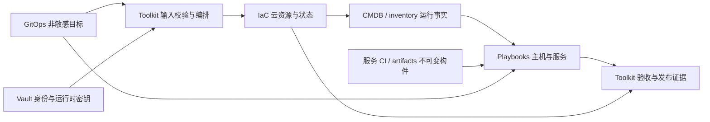
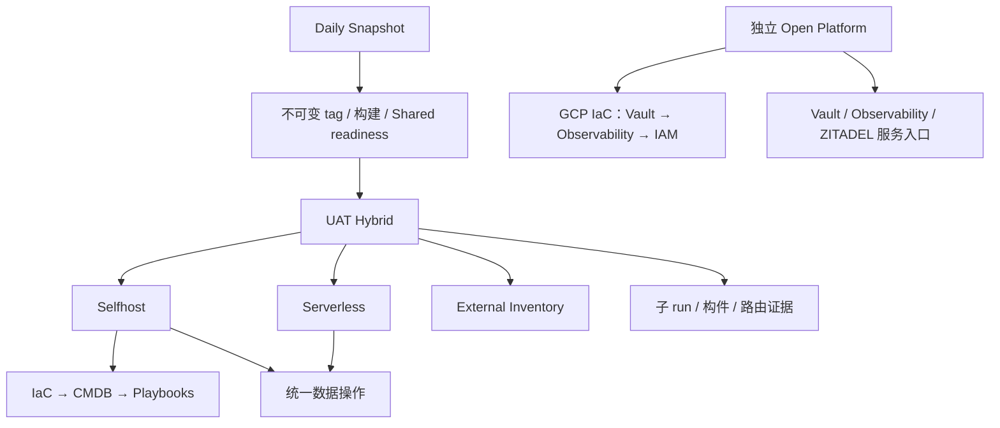
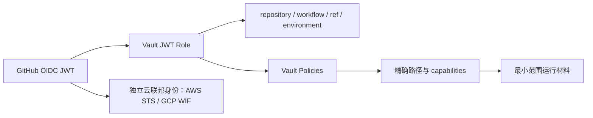

# 多云平台工程技术白皮书

**版本：1.1 · 源码盘点基线：2026-10-05 · 状态：架构与契约评审稿**

[English version](multi-cloud-platform-engineering-whitepaper.en.md) · [参考资料总览](overview.zh.md)

## 摘要

多云平台工程需要把目标配置、执行逻辑、身份授权、资源事实与发布证据连成可审计的交付系统。本白皮书以 `platform-ops-toolkit`、`playbooks`、`iac_modules`、`gitops` 四个仓库及 Vault 为基础，完整整理已盘点的 40 个 workflow、职责矩阵、运行链路、状态层级、密钥路径和后续迁移门槛。

系统的基本分工是：**GitOps 声明目标，Toolkit 编排流程，IaC Modules 管云资源，Playbooks 管主机和服务，Vault 提供运行时身份与密钥。** 应用构建继续由服务 CI 或 artifacts 体系承担。

当前架构已具备多云和多运行时入口，但执行职责尚未全部收敛。Toolkit 仍登记 15 项 legacy execution；共享平台路径与旧文档有冲突；XConnect 存在跨环境读取例外和新 caller 的 role 信任不匹配；真实升级 adapter 尚为空登记。因此，本白皮书分别描述当前源码、目标规范和未完成事项，不把文档、PR 合并或 CI 通过写成运行验收。

1.1 版新增第 8.5 节的统一 Vault 路径提案，将 CICD 明确标注为陈旧命名空间，并给出按 scope/project/用途拆分的映射与迁移门槛。提案尚未改变真实 Vault、policy 或 caller。

## 阅读导航

- 第 1～3 章：证据范围、架构与仓库职责。
- 第 4～6 章：环境身份、GitOps、Terraform state 与资源交接。
- 第 7～9 章：workflow 调用链、Vault 路径与授权边界。
- 第 10～12 章：发布、数据升级、验收与迁移路线。
- 附录 A：全部 40 个 workflow；附录 B：术语；附录 C：来源。

## 1. 范围、基线与证据等级

### 1.1 适用范围

本文面向平台工程师、SRE、应用交付负责人、安全与身份管理员及架构评审者。涵盖 Shared、SIT、UAT、PROD 的边界模型，以及 Selfhost、Serverless、Hybrid、Terraform 和 external inventory 的交付方式。本文不是部署授权、凭据迁移指令或已通过 UAT 的认证报告。

### 1.2 固定源码基线

| 仓库 | 已核对 SHA | 主要依据 |
| --- | --- | --- |
| Toolkit | `2e7b1d9387de615f882ec6cf8084781d0d006415` | workflows、caller、JWT role/policy、冻结登记 |
| Playbooks | `94b9ca010efb1eeb62469f791a910dd361f1abae` | Roles、playbooks、可复用 workflows |
| IaC Modules | `a0185e61fc2b41ac4dbd40c8037016aaef1b3973` | renderer、Provider 入口、backend/state 合同 |
| GitOps | `d6a734b12e91241557803895ad454c538ea5d6ae` | resources、topology、账号和 Vault 引用 |

盘点后形成的三份本地契约提交为 Toolkit `f0669ae8`，属于尚未推送的评审稿；不能引用为远端已合并标准。本白皮书把其内容独立整合到 knowledge，不依赖临时文件路径。workflow 固定消费的 owner SHA 可能早于上述 main 基线；真实运行必须记录实际消费 SHA。

### 1.3 六个独立证据等级

| 等级 | 能证明什么 | 尚不能证明什么 |
| --- | --- | --- |
| 源码/契约存在 | 参数、声明和调用关系可检查 | 实际身份、凭据或目标可用 |
| 本地静态/离线检查 | 格式、引用、部分行为与负例正确 | 云和主机行为正确 |
| CI 通过 | 指定 ref 的 CI 检查完成 | 真实 UAT 或业务验收 |
| owner / caller 合并 | 代码进入各自 main | Vault 已应用、caller 可运行 |
| 精确环境运行完成 | 指定 run 的部署/操作结果 | 业务权益、数据一致性或完整晋级资格 |
| 业务验收/晋级资格 | 固定构件、环境、目标和回执满足门槛 | 可复用于另一版本、环境或目标 |

本次写作使用源码和现有合同；没有读取真实 Vault 值，没有执行云、主机、DNS、数据库变更或 workflow dispatch。[S1], [S2]

## 2. 平台架构与工程原则

平台以四条相互交接的链组织工作：声明链给出目标；资源与配置执行链实现目标；身份链限定执行能力；证据链证明实际结果。



架构要求以下原则贯穿变更：

1. **声明和执行分离**：GitOps 保存数据，renderer、Provider、Ansible 和部署器分别归执行 owner。
2. **按行为判断归属**：不能用 workflow 文件名、目录位置或 scanner 标签替代行为审查。
3. **环境、账号、状态和版本显式绑定**：不得从域名、默认云项目或凭据响应猜目标。
4. **共享平台有独立生命周期**：普通业务发布消费就绪服务，不 bootstrap Shared。
5. **构件不可变、证据可关联**：tag、digest、源码和 run 形成同一版本的证明链。
6. **缺依赖即停止**：缺 manifest、owner、身份、目标或匹配回执时失败，不静默转用另一环境。
7. **先合同后迁移**：owner → caller → UAT → cleanup，历史文档归并保留适用日期。[S1], [S2]

## 3. 职责矩阵与保存位置

### 3.1 仓库级分工

| 层 | 职责 | 输入 | 输出 |
| --- | --- | --- | --- |
| Toolkit | workflow 入口、输入/版本选择、审批、GitOps 校验、Vault 登录、调用顺序和验收 | 操作请求、GitOps ref、release tag | 子 run、执行合同、脱敏发布证据 |
| IaC Modules | Terraform、renderer、Provider、Cloudflare DNS、state/lease、资源事实适配 | 资源声明、Provider 身份、backend 凭据 | 云资源、state 标识、CMDB/inventory |
| Playbooks | OS 初始化、主机配置、服务安装、应用部署、数据生命周期、主机健康 | CMDB、服务变量、构件、Vault 材料 | 服务状态、数据/checkpoint、失败与幂等回执 |
| GitOps | 环境、拓扑、资源、路由、版本和非敏感身份/Vault 引用 | 经评审的声明 | 固定 ref 的 desired state |
| Vault | JWT 授权、凭据、密钥和证书 | 经约束身份及受控写入 | 最小范围的运行时材料 |
| 服务 CI / artifacts | 应用编译、镜像/安装包构建与来源证明 | 固定源码和构建合同 | 不可变 tag/digest/release manifest |

### 3.2 按执行行为划分 owner

| 行为 | 权威 owner | 关键合同 |
| --- | --- | --- |
| desired state、生命周期、非敏感账号绑定 | GitOps | manifest 字段与 ref 可校验 |
| 输入、审批、阶段顺序、子 run 等待 | Toolkit | 环境/目标/构件、精确 run ID、结果传播 |
| GitOps reader / validator | Toolkit | 缺声明或冲突立即失败 |
| render、plan/apply/import/destroy、Provider/DNS、state/lease | IaC Modules | 账号核验、独立 backend、精确资源范围 |
| 包、文件、systemd、Caddy、服务和 XConnect 主机加入/探针 | Playbooks | CMDB target、构件、失败/幂等与清理 |
| 备份、隔离恢复、schema/数据迁移与验证 | Playbooks / 服务 owner | 同环境数据合同、版本/checksum、checkpoint |
| 服务构建及构件发布 | 服务 CI / artifacts | digest 与来源证明 |
| Vault role/policy 声明及 bootstrap 编排 | Toolkit | workflow/ref/environment 与路径能力一致 |
| 凭据轮换、吊销、旧记录清理 | Vault 管理员 / 受保护专项流程 | 精确批准范围、版本、消费者与回退 |
| 晋级、跨层验收、证据汇总 | Toolkit | 同构件、同环境、同目标、同 run |

通用主机配置沉淀到 Playbooks，服务仓库保留应用自身运行和部署逻辑。Provider describe / OCI inspect 可用于 Toolkit 发布门禁；通用云资源事实适配仍归 IaC。HTTP POST 的 owner 要根据请求语义判断，Vault/Accounts 控制请求、主机加入和云资源写入不能混为一类。

当前 Toolkit 中仍有 inline Terraform、主机操作和 wrapper 调用旧 executor。位置表示现状，以上矩阵表示目标归属；两者的差距需登记后逐行为收敛。[S2], [S3], [S4]

### 3.3 五类事实

| 事实 | 权威位置 | 使用方式 |
| --- | --- | --- |
| 希望存在什么 | GitOps | 执行输入，不能替代运行状态 |
| Terraform 管理了什么 | 独立 backend 的 state | IaC 使用；Ansible 不直接读取 tfstate |
| 本次资源事实 | CMDB / inventory artifact | Playbooks 与验收消费，不能变成手维护拓扑 |
| 可发布构件是什么 | tag/digest/release manifest | 保留来源，不以重新构建 main 替代已验收构件 |
| 身份和密钥是什么 | Vault / 动态身份 | 最小范围读取，不进入普通声明或公开证据 |

## 4. 环境、账号与 Provider 边界

### 4.1 环境模型

| 范围 | 生命周期 | 交付边界 |
| --- | --- | --- |
| Shared | 持久 Vault、Observability、IAM 等共享平台 | 独立 Open Platform；业务发布只读就绪门禁 |
| SIT | 集成验证 | 仅声明支持的入口、账号、路径及 state；不能从 UAT 模板推导支持 |
| UAT | 预生产业务验证与受控演练 | 当前 Daily → UAT Hybrid → 子流程 |
| PROD | 生产交付 | 独立身份/状态/审批；消费验收构件，不能复用 UAT 运行回执 |

`open-platform-shared` 是现有 GCP 账号配置标识；实际 Shared 项目为 `open-platform-shared-510113`。GitHub Environment 当前部分 Shared 流程使用 `prod`，它不等于业务 PROD 的资源范围。逻辑 project、namespace、state_project、provider account、实际 cloud project ID 和 Vault scope 分别记录。

当前 Hybrid 的 `vault_env_path` 仅允许 `uat`。规划中的 PROD Hybrid 不能写成现有可执行入口。[S5], [S6]

### 4.2 多账号成熟度

| Provider | 身份合同 | 基线状态与未完成条件 |
| --- | --- | --- |
| AWS | 12 位 account ID、GitHub OIDC → IAM role | runtime 检查声明账号；当前每环境单账号 profile；bootstrap/声明选择需进一步 account-scoped |
| GCP | 稳定 account 标识、实际 project ID、Vault JWT 配置 + WIF | account-specific bootstrap/runtime 路径与 role 已有；写入前仍须核验实际身份/项目 |
| Azure | tenant、subscription、client/application ID、OIDC | Selfhost 尚有 placeholder ID；需真实 GitOps 身份及 active tenant/subscription 校验 |
| Vultr VPS | 具体账号、Vault API token | 通用 Selfhost 仍读环境级 token，缺 authenticated-account 校验；多账号尚未收敛 |
| Akamai Cloud / Linode | 具体 account、Vault `LINODE_TOKEN` | account-specific KV/role 已有；token 账号级授权，不能使用 default/primary/main 别名 |
| UCloud UHost | 具体 project/account、Vault API 凭据 | standalone workflow 已读 project 路径；Selfhost 旧路径仍需收敛和身份核验 |
| ULightHost existing | 外部 inventory owner/account 与主机连接事实 | inventory-only，不创建、不接管、不销毁 Terraform 资源 |

多云选项、Provider registry 或模块目录存在，只证明代码结构可见；安全多账号能力还要求逐行选择、对应凭据/联邦身份、authenticated identity、独立 state prefix、最小 policy 和错配负例。[S7]

## 5. GitOps、IaC State 与 CMDB 合同

### 5.1 声明目录

| 目录 | 内容 |
| --- | --- |
| `resources/<project>/<env>/<provider>/` | 云资源、账号绑定、规格与生命周期目标 |
| `topology/<env>/<mode>/` | Selfhost / Serverless / Hybrid 的跨服务运行拓扑、域名与路由 |
| `services/` | 服务配置、版本及集群声明 |
| `environments/` | Flux/Kustomize 等集群环境入口 |

mode 是运行拓扑维度，不属于单一 Provider 目录。声明中可以放 SSH 公钥、公开 origin 和 Vault 引用，不放私钥、密码、API key、数据库连接串或生成 inventory。缺预期声明必须使消费者失败。[S3]

### 5.2 资源交接链

```text
GitOps YAML
  → Python / Jinja2 render
  → 显式 Terraform module / resource 块
  → terraform plan / apply
  → Terraform 运行输出 + YAML 静态字段合并
  → cmdb.json / inventory
  → Playbooks 配置主机与服务
  → Toolkit 汇总验收
```

批量环境的循环和组合集中在 renderer，生成 HCL 保持显式资源块。rendered HCL、tfvars、CMDB 和 inventory 是派生产物，不是另一个人工事实来源。每次 IaC 变更后刷新 inventory；existing adapter 则标明其资源事实来源。[S4], [S8]

### 5.3 Backend 与锁

```text
terraform/<scope>/<project>/<provider>/<account>/<workspace>/terraform.tfstate
terraform/<scope>/<project>/<provider>/<account>/<workspace>/terraform.tfstate.tflock
```

这些维度共同定义 state 边界。账号必须是具体稳定标识，不能用 default/primary/main 静默合并。Vault `kv/CICD/<scope>/iac_state` 保存 `TF_STATE_*` backend 连接凭据，tfstate 在 S3-compatible 对象存储；Provider 身份与 backend 身份分开。

启用 S3 `use_lockfile` 的标准要求 Terraform 不低于 1.10。state 迁移先记录旧/新 key，受控执行 migrate-state，随后 validate 和无漂移 plan，并保留原对象版本与旧 backend 直到验收完成。改变 Vault 路径不会自动迁移 state。[S8]

### 5.4 非 Terraform 纳管

ULightHost 的合同为 `management_mode: existing`、`provisioner: ansible`、`lifecycle: external`，不产生 tfstate。非敏感事实与运行记录分别使用：

```text
inventory/<scope>/<project>/<provider>/<account>/<workspace>.json
runs/<scope>/<project>/<provider>/<account>/<workspace>/<run-id>.json
```

UCloud UHost 属于 Terraform 标准资源，不能因为名称相近而采用 ULightHost external 生命周期。[S8]

## 6. 调用与执行的共同合同

每个执行请求和脱敏回执至少关联 scope/environment、逻辑 project/namespace、Provider/account/实际 project ID、workspace/state key、四仓实际 SHA、tag/digest、CMDB target/user/state directory、workflow run/attempt。缺字段作为差距记录，不猜值或改旧 state 身份。

| 调用方式 | 当前例子 | 核验重点 |
| --- | --- | --- |
| 同仓 reusable workflow | master → Provider；Open Platform → GCP | needs/if、with、权限和实际 ref |
| 跨仓 reusable workflow | Selfhost → domain CD；数据入口 → owner workflow | owner SHA、JWT caller claims、environment、输出与失败语义 |
| 独立 dispatch | Daily → Hybrid；Hybrid → 子入口；平台 → 服务 | 精确 run ID、等待、结论和构件关联 |
| checkout 后执行 | renderer、Ansible、服务部署器 | 真正 checkout SHA、工作目录、输入输出与临时材料清理 |
| wrapper 间接调用 | Toolkit helper → 旧 executor | 完整 caller graph；wrapper 无 marker 不能证明职责正确 |

输入校验、云端身份验证、backend readiness、apply attempted 和实际输出、SSH trust、主机状态、业务验证是分别成立的门禁。发生部分 apply 或数据写入失败时保留原始失败证据，核实现状再恢复；cleanup 不能覆盖失败结果。[S2], [S9]

## 7. Workflow 主链与专项入口



图是可达调用关系，不意味着每种 operation 都执行全部分支。

### 7.1 Daily → UAT Hybrid

Daily 创建跨仓不可变 tag、触发构建、验证构件，执行 Shared 只读就绪门禁。`dispatch-uat-combined.sh` 当前把 UAT 组合交付统一发往 Hybrid；Hybrid 读取 GitOps `topology/uat/hybrid/resource-matrix.json`，逐行选 Provider、账号、manifest 和子入口，等待精确子 run。

普通业务 deploy 跳过共享平台资源；Hybrid 显式维护操作仍有共享行处理能力，不能声称任何 operation 都无法触碰 Shared。组合部署拒绝携带数据同步和 XConnect release override；经校验的 Accounts baseline/schema 请求可显式传入子链。该路径跳过 Stripe catalog，不能报告 catalog 同步完成。[S5], [S9]

### 7.2 Selfhost 与 Serverless

Selfhost 编排 IaC/CMDB、主机基线、domain CD、数据与 DNS 阶段；通用执行归 IaC 或 Playbooks。Serverless 编排 Cloud Run、Cloudflare Pages/Workers、服务部署、数据 owner 和构件证明。GitOps 的对应 mode 文件限定域名、origin 和后端策略，不能以一个 mode 的声明替代另一个。

Hybrid 的基础规划采用 Selfhost 优先和 Serverless fallback，但实际路由、数据单写者与复制策略必须消费固定 GitOps 声明。两条部署链存在不证明切换或数据同步已经验收。[S3], [S5]

### 7.3 独立 Open Platform

`open-platform-orchestrator.yml` 的 GCP IaC 依赖为 Vault → Observability → IAM；按 operation 和 target_services 派发对应服务阶段并等待。该入口没有 destroy。基础设施、服务配置、历史数据迁移、DNS 切换和观察窗口分别记录，普通业务发布不重建共享服务。[S6]

### 7.4 通用 Multi-cloud Master

- AWS/Azure/Vultr：Landing Zone → Account → Resources，受开关与依赖结果约束。
- GCP、Akamai、UCloud：分别 delegate 到对应 Provider workflow。
- ULightHost：External Inventory，不运行 Terraform。
- generic 三个子入口也可单独 delegate 到 GCP。
- `gcp-uat-workload-sequence.yml` 是独立手动顺序入口，不是 Daily/Hybrid 必经阶段。[S10]

### 7.5 产品、网络与运维专项

AI Aggregator、Global Mesh、XConnect bootstrap、Vault、ZITADEL、Observability、Runner、resize、DNS/TLS、性能、区域验收与 cleanup 各有入口，完整清单见附录 A。`xconnect-runtime-control.yml` 当前仅暴露 `gateway_verify`、`one_verify`；安装、加入、existing-One、观察、lease 和 cleanup 仍有旧混合链路。运行验证 caller 的 Vault 信任差异见第 9 章。

## 8. Vault KV 层级与字段契约

### 8.1 不同路径表示

| 场景 | 路径 |
| --- | --- |
| CLI / GitOps logical reference | `kv/CICD/uat/iac_state` |
| 数据 API / policy | `kv/data/CICD/uat/iac_state` |
| Metadata API / policy | `kv/metadata/CICD/uat/iac_state` |

`data` 和 `metadata` 是 KV v2 API 层。`kv/CICD` 根记录与 `kv/CICD/uat` 子记录独立，读取根不授权子路径。不能给通用环境角色使用 `kv/data/CICD/*` 快捷授权全部环境。

### 8.2 当前路径族（含历史兼容路径）

下树只反映固定源码的声明/引用，不证明真实记录存在或字段齐全；不是每个路径族都支持 SIT。

**`CICD` 标注为陈旧命名空间（LEGACY，待迁移）**：其问题是混装了交付身份、云初始化、backend 凭据、证书和服务材料。现有 caller 仍在读取；“陈旧”指路径模型，不代表凭据失效或允许删除。目标设计不再向这个混装根新增记录，新需求按第 8.5 节归类；当前消费者在完成迁移前保持兼容。

```text
kv/
├── CICD                          # LEGACY：陈旧命名空间，仍有消费者，待迁移
│   ├── github-app/daily-snapshot
│   ├── domains/<domain>
│   ├── observability
│   ├── <env>/
│   │   ├── iac_state
│   │   ├── aws-bootstrap
│   │   ├── gcp-bootstrap/<account>
│   │   ├── akamai-cloud/<account>
│   │   └── ucloud/<project>
│   └── shared/
│       ├── iac_state
│       ├── gcp-bootstrap/<account>
│       ├── xconnect
│       ├── xconnect-operator-invite
│       └── xconnect-operator-invite/<network>
├── <env>/
│   ├── platform/oidc/<account>
│   ├── platform/{jwt,cloudflare,gcp,observability,gitea}
│   ├── serverless/{gcp,cloudflare,dts,...}
│   ├── services/{xconnect,ai-workspace}
│   ├── databases
│   ├── agent-proxy
│   ├── xconnect-one
│   ├── ulighthost-xconnect/<node>
│   └── ai-aggregator/...
├── shared/
│   ├── platform/oidc/<account>
│   ├── iam
│   └── databases
├── iam/<env>/<integration>/<account>/<purpose>
├── action-runner
├── openclaw
└── WEB_SAAS
```

`<env>` 表示业务环境；`<scope>` 还可包含明确声明的 Shared。`shared/iam` 是 ZITADEL 服务材料，`iam/<env>/...` 是 workforce/workload/application 集成记录；Provider API 凭据继续放 CICD。invite 根记录与 per-network 子记录有不同 caller，不能自动合并。其他产品的 `github-actions/`、`xworkmate/` 等命名空间不因未列入本树而进入清理范围。

### 8.3 当前主要路径和字段

| CLI 路径 | 字段/用途 | 消费与变更边界 |
| --- | --- | --- |
| `kv/CICD` | 共享 CI 字段及历史 SSH/DNS 基础字段 | 精确根读取；迁移前核对全部消费者 |
| `kv/CICD/github-app/daily-snapshot` | `app_private_key` | Snapshot、release 下载及跨仓调用；App installation 权限另验 |
| `kv/CICD/domains/<domain>` | `tls_fullchain_pem_b64`、`tls_key_pem_b64`，trust/CA/有效期按 caller | 部署读取；rotation 和其他写能力独立核对 |
| `kv/CICD/observability` | `user`、`password` | 共享监控接入 |
| `kv/CICD/<scope>/iac_state` | `TF_STATE_ENDPOINT`、`TF_STATE_BUCKET`、`TF_STATE_ACCESS_KEY`、`TF_STATE_SECRET_KEY`、`TF_STATE_REGION` | backend-only；不保存 tfstate |
| `kv/CICD/<env>/aws-bootstrap` | `AWS_ACCESS_KEY_ID`、`AWS_SECRET_ACCESS_KEY`，session 材料按合同 | 当前按环境；多账号需独立迁移 |
| `kv/CICD/<scope>/gcp-bootstrap/<account>` | `GCP_PROJECT_ID`、`GCP_AUTH_JSON` 或 `GCP_ACCESS_TOKEN` | 一次性 bootstrap 专用 role |
| `kv/<scope>/platform/oidc/<account>` | `gcp_workload_identity_provider`、`deploy_service_account`、`gcp_oidc_audience`、`project_id` | bootstrap 后的 account-specific runtime 身份 |
| `kv/CICD/<env>/akamai-cloud/<account>` | `LINODE_TOKEN` | 具体账号绑定，不接受别名 |
| `kv/CICD/<env>/ucloud/<project>` | `UCLOUD_PUBLIC_KEY`、`UCLOUD_PRIVATE_KEY`、`UCLOUD_PROJECT_ID`、`UCLOUD_REGION`；SG/key-pair ID | standalone 入口消费；Selfhost 旧基准路径另验 |
| `kv/<env>/serverless/gcp` | `GCP_WORKLOAD_IDENTITY_PROVIDER`、`GCP_SERVICE_ACCOUNT_EMAIL` | Serverless WIF 兼容合同，不重复 GitOps 项目/区域配置 |
| `kv/<env>/serverless/cloudflare` | `CLOUDFLARE_ACCOUNT_ID`、`CLOUDFLARE_API_TOKEN` | 对应环境 edge 交付 |
| `kv/<env>/platform/jwt` | `issuer`、`audience`、`signing_key` | JWT 材料；应用只消费实际需要的签名/验证材料 |
| `kv/<env>/platform/cloudflare` | `api_token`、`account_id`、`zone_id` | 对应平台 DNS 作用域 |
| `kv/<env>/platform/gcp` | `project_id`、`region`、`artifact_registry` | 现有文档字段；消费时避免第二份目标配置 |
| `kv/<env>/platform/observability` | `grafana_admin_password`、`remote_write_token` | 对应环境监控身份 |
| `kv/<env>/platform/gitea` | `url`、`runner_token`、`webhook_secret` | Gitea 集成 |
| `kv/<env>/services/xconnect` | `supabase_url`、`supabase_service_role`、`jwt_audience` | XConnect 服务合同 |
| `kv/<env>/services/ai-workspace` | `api_base_url`、`oauth_client_secret`、`jwt_audience` | AI Workspace 服务合同 |
| `kv/<env>/databases`、`kv/<env>/agent-proxy` | 环境数据库口令、代理身份 | 常规环境 policy；可进一步按服务收敛 |
| `kv/<env>/xconnect-one`、`kv/<env>/ulighthost-xconnect/<node>` | 网络运行身份、精确外部主机连接材料 | target、SSH trust 和环境必须明确 |
| `kv/CICD/shared/xconnect` | `ZERO_SERVICE_TOKEN`、`VLESS_ID` | Shared enrollment/网络专用只读 role |
| `kv/CICD/shared/xconnect-operator-invite[/<network>]` | 一次性短期 invitation | 当前 CI create/update，不回读；操作者独立身份读取 |
| `kv/shared/iam`、`kv/shared/databases` | ZITADEL masterkey/admin/session、数据库口令 | shared-zitadel role；不并入业务 IAM 集成路径 |
| `kv/iam/<env>/<integration>/<account>/<purpose>` | 身份集成字段/secret | purpose 为 workforce、workload、application |
| `kv/action-runner`、`kv/openclaw`、`kv/WEB_SAAS` | 公共服务/历史兼容材料 | 按具体消费者校验；WEB_SAAS 仍被读取 |

字段新增需同时更新字段合同、consumer、policy、bootstrap/check、rotation/rollback 和验收。非敏感身份元数据可以作为完整身份记录的一部分保留；域名、region 和路由等目标配置仍以 GitOps 为权威来源。表中保留历史文档定义的完整字段，不能据字段重复就自动迁移消费者。[S11], [S12], [S13]

### 8.4 AI Aggregator 最小命名空间与文档差异

Toolkit 基线的 minimal KV 文档列出以下记录；LLM Provider 仅为 openai、anthropic、xai：

```text
kv/<env>/ai-aggregator/database/new-api
kv/<env>/ai-aggregator/database/litellm
kv/<env>/ai-aggregator/gateway/caddy
kv/<env>/ai-aggregator/gateway/apisix
kv/<env>/ai-aggregator/gateway/new-api
kv/<env>/ai-aggregator/gateway/litellm
kv/<env>/ai-aggregator/litellm/providers/openai
kv/<env>/ai-aggregator/litellm/providers/anthropic
kv/<env>/ai-aggregator/litellm/providers/xai
```

database 的已列字段为 `dsn`；Caddy 为 `admin_basic_auth_hash`；New API 为 `session_secret`、`crypto_secret`、`jwt_private_key`、`jwt_issuer`、`jwt_audience`；LiteLLM 为 `master_key`、`proxy_secret`；LLM Provider 为 `endpoint`、`api_key`。该文档没有完整列出 APISIX 字段，不能补猜。

GitOps 同期 KV 文档仍列 `database/kong`，与 Toolkit 的 Caddy/APISIX 路径不同。这是本次整合额外确认的文档差异，需核对真实消费者后归并，不能把两份路径并集视为已批准合同。CPA OAuth 保留在节点加密 auth 目录；client/account/instance 元数据、token hash、jti/revocation 状态归 PostgreSQL。新自动化不重建废弃 accounts/instances/clients 等命名空间，既有记录清理另行评审。[S12], [S13]

### 8.5 目标路径规划（设计提案，尚未迁移）

推荐采用 **范围 → 项目 → 用途 → 对象 → 记录** 的统一顺序：

```text
kv/<scope>/<project>/<category>/.../<record>
```

`scope` 为 shared、sit、uat、prod；`project` 复用经评审的 GitOps 逻辑项目，例如 svc.plus、onwalk.net、xworktech.com，不是 GCP project ID 或 UCloud project ID。`category` 固定为下表七类。后续层级按对象类型定义，最后一层才存字段，中间层仅作分组，不保存大而全的父记录。本规划保留现有 kv mount，项目路径不是 Vault Enterprise Namespace。

#### 8.5.1 七类用途与树形结构

| category | 保存什么 | 主要消费者 / 写入边界 |
| --- | --- | --- |
| delivery | GitHub App 等交付控制身份 | Toolkit；受保护初始化与轮换 |
| cloud | 云 bootstrap 材料、联邦绑定、API 凭据 | bootstrap / IaC / Serverless，按 profile 分开 |
| state | Terraform backend 连接凭据 | IaC；与 Provider 凭据分别授权 |
| services | 服务运行密钥、数据库连接、服务集成与网络邀请 | Playbooks / 对应服务；按实际读写者拆分 |
| identity | workforce、workload、application 身份集成 | 身份 bootstrap 与具体客户端 |
| hosts | 精确节点及用户的 SSH、主机 Agent 身份 | Playbooks / Agent，限定节点与用途 |
| certificates | 指定域名的证书与私钥 | 部署只读，rotation 专用写入 |

下树是单个 scope/project 的模板；四个 scope 使用相同分类，但只创建确有声明和消费者的记录：

```text
kv/
├── shared/
│   └── <project>/
│       ├── delivery/github/apps/<app>/credentials
│       ├── cloud/<provider>/<account>/
│       │   ├── bootstrap/<profile>
│       │   ├── federation/<profile>
│       │   └── api/<profile>
│       ├── state/backends/<backend-id>/credentials
│       ├── services/<service>/
│       │   ├── runtime/<component>
│       │   ├── database/<database>/<principal>
│       │   ├── integrations/<integration>/<binding>
│       │   ├── providers/<provider>/<profile>
│       │   └── networks/<network>/
│       │       ├── service-token
│       │       ├── transport-auth
│       │       └── operator-invites/<invite-id>
│       ├── identity/<purpose>/<integration>/<account>/client
│       ├── hosts/<node>/
│       │   ├── ssh/<user>
│       │   ├── agent-proxy/auth
│       │   └── xconnect-one/auth
│       └── certificates/<domain>/tls
├── sit/<project>/...             # 同样七类，按实际支持范围创建
├── uat/<project>/...             # 同样七类，凭据与 policy 独立
└── prod/<project>/...            # 同样七类，凭据与 policy 独立
```

`services/<service>/...` 是分类模板，例如 XConnect 的网络材料属于 `services/xconnect/networks/<network>/...`。ZITADEL、Observability、Gitea、Action Runner、OpenClaw、AI Aggregator 都按服务名落到 services；IAM 身份集成落到 identity。Selfhost/Serverless 是交付方式，不再成为秘密分类，两者按精确 GitOps 引用消费 cloud 或 services 记录。一个跨项目共用凭据只在其 owner project 下保留一条权威记录，其他项目通过显式引用消费，不复制或开放整棵 Shared。

#### 8.5.2 命名与凭据边界

1. **scope 按材料归属确定。** Shared 凭据保持 shared；调用它的 UAT workflow 不改变其归属。某个生产节点不会因为供 UAT 验证使用就被改标 shared。
2. **project 与 account 分开。** provider/account 使用账号注册表的具体标识；cloud_project_id、UCloud 项目和 state key 另行记录。profile 标识用途，例如 iac-deploy、serverless-deploy、dns-reconcile，不接受 default/primary/main。
3. **一条记录对应一种权限与轮换边界。** 管理口令、业务运行口令、JWT 签名、数据库连接不能因属于同一服务就混装。读取 KV 记录会返回其数据字段；按不同消费者拆记录，不能依靠 caller 只取其中一个字段实现隔离。[S17], [S18]
4. **bootstrap、federation、api 分开。** federation 记录绑定配置，动态云 token 不持久化为通用 KV；API-token Provider 使用具体 account/profile。
5. **state 记录以 backend-id 标识连接身份。** GitOps 合同显式绑定允许的 state prefix、Provider/account/workspace；记录路径本身不会限制对象存储权限。tfstate key 继续遵循第 5 章，不随 KV 规划改变。
6. **新标识使用小写与连字符，保持稳定。** 既有项目域名可保留点；公开节点/域名可作标识。路径不含 token、邮件地址等敏感内容，也不以目录名暗示实际云身份。
7. **公共目标配置仍归 GitOps。** 域名、region、路由、公开 issuer、节点连接事实不单独复制为一份 Vault 配置；完整身份绑定所需的非敏感字段可随对应凭据记录保留。
8. **邀请必须有业务过期与一次性消费机制。** KV 不签发动态 secret lease；路径或 Vault 登录 token 的 TTL 不能替代邀请失效。delete_version_after 也不等于撤销外部凭据，需由 invitation owner 校验、吊销和清理。[S18], [S19]

角色声明仍归 auth 配置与 Toolkit 的 role/policy 源码；Vault root、unseal/recovery 材料继续遵循独立恢复合同，不进入普通交付 KV。这里是静态 KV 的整理方案，不表示要把现有动态身份改成静态密钥。

#### 8.5.3 陈旧路径到目标路径的映射

表中目标均为提案。`<project>` 由消费者合同确认，`<scope>` 按材料实际归属确认；不能从旧路径中的笼统 env 或当前 workflow Environment 自动填入。`<account>`、`<backend-id>`、`<node>`、`<network>` 等分别登记，不复用含义不清的简写。

| 当前路径 / 状态 | 目标路径或归属 | 映射条件 |
| --- | --- | --- |
| `kv/CICD` / `kv/CICD/<env>` — LEGACY | 按字段拆到 delivery、cloud、hosts、certificates、services | 先查全部读写者；没有统一新根记录 |
| `kv/CICD/github-app/daily-snapshot` — LEGACY | `kv/shared/<project>/delivery/github/apps/daily-snapshot/credentials` | 仅跨环境共用 App 身份；限定 installation 权限 |
| `kv/CICD/<scope>/iac_state` — LEGACY | `kv/<scope>/<project>/state/backends/<backend-id>/credentials` | backend-id 明确；绑定对象存储 prefix，不改 state key |
| `kv/CICD/<env>/aws-bootstrap` — LEGACY | `kv/<scope>/<project>/cloud/aws/<account>/bootstrap/oidc-setup` | 先解析真实 AWS account，不能一份环境记录复制给所有账号 |
| `kv/CICD/<scope>/gcp-bootstrap/<account>` — LEGACY | `kv/<scope>/<project>/cloud/gcp/<account>/bootstrap/wif-setup` | account 与实际 cloud project 分开核验 |
| `kv/<scope>/platform/oidc/<account>` | `kv/<scope>/<project>/cloud/gcp/<account>/federation/iac-deploy` | 保留完整 WIF 绑定与受控 writer |
| `kv/<env>/serverless/gcp` | `kv/<scope>/<project>/cloud/gcp/<account>/federation/serverless-deploy` | 与 IaC identity 相同才可显式引用同一记录；不自动合并 |
| `kv/CICD/<env>/akamai-cloud/<account>` — LEGACY | `kv/<scope>/<project>/cloud/akamai/<account>/api/iac-deploy` | LINODE_TOKEN 的真实账号和用途匹配 |
| `kv/CICD/<env>/ucloud/<project>` — LEGACY | `kv/<scope>/<project>/cloud/ucloud/<account>/api/iac-deploy` | 旧 project 为 UCloud 项目；先绑定真实账号与 GitOps 逻辑项目 |
| `kv/<env>/platform/cloudflare` / `kv/<env>/serverless/cloudflare` | `kv/<scope>/<project>/cloud/cloudflare/<account>/api/<profile>` | dns-reconcile 与 edge-deploy 分授权、分轮换 |
| `kv/CICD/domains/<domain>` — LEGACY | `kv/<scope>/<project>/certificates/<domain>/tls` | 按证书实际归属定 scope；不把所有证书默认改为 shared |
| `kv/CICD/observability` — LEGACY / `kv/<env>/platform/observability` | `kv/<scope>/<project>/services/observability/<purpose>/<binding>` | admin、ingestion、API 身份按实际字段与消费者拆分 |
| `kv/shared/iam` / `kv/shared/databases` | `kv/shared/<project>/services/zitadel/runtime/<component>` / `kv/shared/<project>/services/zitadel/database/<database>/<principal>` | 拆服务运行与数据库权限；核对数据库是否还有其他消费者 |
| `kv/<env>/platform/jwt` / `kv/<env>/platform/gitea` / `kv/<env>/services/<service>` | `kv/<scope>/<project>/services/<service>/runtime/<component>` / `kv/<scope>/<project>/services/<service>/integrations/<integration>/<binding>` | 先确认 JWT issuer owner 和集成 consumer，字段逐项迁移 |
| `kv/<env>/databases` / `kv/<env>/agent-proxy` | `kv/<scope>/<project>/services/<service>/database/<database>/<principal>` / `kv/<scope>/<project>/hosts/<node>/agent-proxy/auth` | 共用数据库与节点代理身份分别拆分，保留精确目标 |
| `kv/<env>/xconnect-one` / `kv/<env>/ulighthost-xconnect/<node>` | `kv/<scope>/<project>/hosts/<node>/xconnect-one/auth` / `kv/<scope>/<project>/hosts/<node>/ssh/<user>` | 以 CMDB 中实际节点与用户绑定；既有 PROD 例外仍标 PROD |
| `kv/CICD/shared/xconnect` — LEGACY | `kv/shared/<project>/services/xconnect/networks/<network>/service-token` / `kv/shared/<project>/services/xconnect/networks/<network>/transport-auth` | network 显式绑定；ZERO_SERVICE_TOKEN 与 VLESS_ID 按消费者拆分 |
| `kv/CICD/shared/xconnect-operator-invite[/<network>]` — LEGACY | `kv/shared/<project>/services/xconnect/networks/<network>/operator-invites/<invite-id>` | 根记录与网络记录分别核验 network；每次邀请使用唯一 invite-id |
| `kv/iam/<env>/<integration>/<account>/<purpose>` | `kv/<scope>/<project>/identity/<purpose>/<integration>/<account>/client` | 保留 workforce/workload/application 与集成账号含义 |
| `kv/<env>/ai-aggregator/...` | `kv/<scope>/<project>/services/ai-aggregator/...` | 保持组件语义，按 consumer/principal 拆分；先解决 APISIX/Caddy/Kong 文档差异 |
| `kv/action-runner` / `kv/openclaw` | `kv/<scope>/<project>/services/action-runner/...` / `kv/<scope>/<project>/services/openclaw/...` | scope/project 必须查现有 consumer，不能直接默认 shared |
| `kv/WEB_SAAS` — LEGACY | 按字段映射 cloud、services、hosts、certificates | 兼容期保留原记录；不建立新的大杂烩名称 |
| `kv/<env>/platform/gcp` 中仅含公开配置的字段 | GitOps 资源/构件声明 | 不为非敏感配置单独创建新 KV 记录 |

例如 Shared GCP 绑定可规划为 `kv/shared/svc.plus/cloud/gcp/open-platform-shared/federation/iac-deploy`；其实际项目仍为 `open-platform-shared-510113`。两者不能据路径名称互相替换。

#### 8.5.4 权限合同与迁移门槛

每条目标记录登记 logical_path、scope、gitops_project、用途/字段、全部 reader、writer、rotation owner、云/backend/节点绑定、所需 capabilities、旧路径、状态及回退条件。登记文件仅保存非敏感合同与引用，记录值运行时由 Vault 提供。

部署 role 精确读取所需 data 记录；bootstrap、证书轮换和邀请写入使用独立 role。需要 list 时仅给必要 metadata 目录；KV v2 的 list 不按各叶子 policy 过滤名称，不能授予全项目 list 来代替精确引用。delete、destroy、undelete、metadata 管理按专门操作分别评审，不能因属于一个目录就打包开放。[S17], [S18]

实施顺序为：**登记消费者 → 审定映射与权限 → owner 支持显式新引用 → 受控写入/轮换 → caller 切换 → UAT 与业务验证 → 冻结兼容窗口 → 吊销/清理旧记录。** 同一 consumer 一次只读一个明确路径，不自动 fallback 到旧根或另一环境；回退通过显式版本化引用恢复。验证覆盖字段完整性、错账号、跨环境拒绝、幂等、rotation/rollback、失败清理及未引用检查。

跨环境 XConnect 例外先登记目的、节点、reader 和截止条件，再选择取消或精确保留；不得用移动到 shared 掩盖真实 PROD 归属。CICD 每个子记录分别经历 LEGACY → MIGRATING → RETIRED；只有消费者已切换、旧权限已收敛且回退/备份条件齐备才标 RETIRED。路径整理不修复第 9 章的 JWT workflow claim 差异，也不直接调整云账号、state 或真实凭据。

## 9. 身份、授权及历史例外



登录 Vault、读取某个 KV、取得云身份、通过 backend 初始化、访问主机是不同能力，分别校验。

### 9.1 授权声明与角色类别

Toolkit 的 `scripts/vault/roles/` 和 `scripts/vault/policies/` 保存声明，`scripts/create_vault_service_repo_roles.sh` 验证/应用；真实 Vault 状态是否同步需另验。

| 类别 | 当前合同 | 需要保留的区别 |
| --- | --- | --- |
| 常规 SIT/UAT/PROD | 自己的 CICD base/state 和业务根；常规 PROD data/metadata 无 delete | 不推广到所有专用 role |
| 公共 CI / TLS | CICD 精确根通常 read；通用环境 policy 仍有 domains/* 写能力；rotation 有专用 role | 共享材料不等于全部只读 |
| Shared | GCP runtime、Vault 分阶段、ZITADEL、network 专用角色 | GitHub Environment prod 与业务 prod scope 不同 |
| Bootstrap | GCP environment/account 独立；AWS 当前 environment 独立 | 临时初始化与 runtime 权限、吊销分开 |
| PROD release | 窄用途允许 Daily 从 protected main 创建来源明确的新 v* tag | 不放宽普通 PROD 部署 role 到 main |

### 9.2 五项已记录的 Vault 差异

| 编号 | 当前源码/文档事实 | 处置原则 |
| --- | --- | --- |
| V01 | 旧 GitOps 文档说不存在 kv/shared，但当前 shared/platform/oidc、shared/iam、shared/databases 已被声明使用 | 文档对齐代码引用，不据旧文档迁走平台 |
| V02 | UAT cloud-lab policy 可读 PROD 的 `kv/data/prod/ulighthost-xconnect/tw-xconnect.svc.plus` 精确记录 | 登记跨环境用途，不等于普通 UAT 获得 PROD 操作权 |
| V03 | existing-One policy 还可读 `kv/data/prod/ulighthost-xconnect/*` | 明确 wildcard 范围；收窄前查全部 caller 与回退 |
| V04 | 新 runtime-control 使用 cloud-lab role，其 job_workflow_ref 只绑定旧 zero-cloud workflow | 静态信任合同不匹配；单独修复和应用，不宣称已实际 403 或已修好 |
| V05 | 旧路径存量盘点为 2026-07-22；CICD 根和 WEB_SAAS 仍有当前消费者 | 不用历史“缺失/未引用”判断删除或权限变更 |

V03 的 existing-One policy 还显式列出 `kv/data/prod/ulighthost-xconnect/observability.svc.plus` 的 read；精确记录与 wildcard 应同时登记。V04 的完整 role 为 `github-actions-platform-ops-toolkit-uat-xconnect-cloud-lab`，其 `job_workflow_ref` 为 `ai-workspace-infra/platform-ops-toolkit/.github/workflows/xconnect-zero-cloud.yaml@refs/heads/main`，没有包含新的 `xconnect-runtime-control.yml`。

新增 workflow 不自动取得 Vault 权限。V04 需明确选择专用 runtime role 或受限扩充旧 role，逐项校验 target、SSH 字段、workflow/ref/environment 和必要路径。路径复制只代表结构复制，不证明底层凭据已独立。[S11], [S14]

### 9.3 密钥迁移合同

先登记 owner/scope/用途/字段/全部读写消费者，再核对 role claims 和 policy capability；先补 check/bootstrap/rotation/rollback，后切 caller。真实迁移另明确范围、备份、覆盖与回退；UAT 验证越界拒绝、缺字段、错身份、幂等及清理。全部消费者切换后再评审吊销/删除；不扩大 wildcard 作为兼容方案。[S11]

## 10. 发布、数据升级与晋级资格

### 10.1 不可变发布证明

发布证明应关联 `PR → merge main → immutable tag/digest → UAT 部署 → 业务验收 → 生产审批/晋级`。它是目标验收合同，不表示当前所有入口都完整实现。`auto-release.yaml` 创建 GitHub Release，`release-status-console.yml` 发布脱敏状态，都不单独构成部署或晋级授权。

tag、镜像 digest 和 release manifest 必须绑定来源。生产应消费已验收的同一构件，不把重新构建的 main 当作原构件。生产 tag 的创建与生产部署是独立阶段；部署成功还需业务验收。[S1], [S15]

### 10.2 统一数据控制

Selfhost、Serverless、Hybrid 的相关数据阶段经 adapter 进入 `environment-data-operations.yml`，按 mode delegate 到固定 SHA 的 Playbooks 数据 workflow，或 IaC Akamai state preflight。常规 preflight、backup、probe、baseline、migrate、legacy_import 与升级演练的能力不能相互代替。

升级控制的八个阶段为：

```text
preflight → backup → migration → promotion → verification
          → rollback → repromotion → final_verification
```

UAT 完整演练要求准备、升级验收、回滚验收、同构件再次升级重验，然后产生晋级资格。PROD 消费资格并重新按实时生产条件预检，不在 PROD 运行 rehearsal 或故障注入。

checkpoint 与隔离恢复绑定同环境、release、run；migration 绑定精确起止 schema、checksum、dirty 状态、锁/超时及向前兼容；rollback 回退应用并保留兼容扩展 schema，不执行破坏性 down migration；repromotion 证明同 digest、无重建、无共享服务 bootstrap、无 PROD→UAT 数据同步。任一阶段失败停止后续动作，核实现状并修复后新开 run，从准备重新走完整演练，不跳过或复用不匹配回执。[S15]

### 10.3 当前执行条件

`adapters.json` 为 `{"schema":2,"uat":{},"prod":{}}`。控制面、离线测试和 disposable PostgreSQL 加密备份/隔离恢复证据不能替代真实 UAT 备份恢复、升级、回滚和业务验证；当前不能宣称完整真实升级演练或 PROD Hybrid 已可用。[S15]

## 11. 验收与可观测性

### 11.1 分层验证矩阵

| 层 | 必需验证 | 证据 |
| --- | --- | --- |
| 声明 | 环境、Provider、账号、manifest、mode、ref 和 secret reference 一致 | 固定 SHA 的解析/校验结果 |
| 身份 | JWT claims、policy 范围、实际云身份和 backend 身份匹配 | 脱敏身份/权限回执 |
| IaC | render、validate、plan、scope、锁、部分失败与清理 | plan/操作结果、state identity、CMDB |
| 主机/服务 | SSH trust、精确 target、安装、健康、错误输入和幂等 | 服务 owner 回执及目标状态 |
| 数据 | 备份 checksum、隔离恢复、schema/data fingerprint、wrong-key/占用库负例 | 同环境 checkpoint 和恢复回执 |
| 业务 | 原凭据登录、权限、订阅权益、额度、财务及用量账本 | 与运行 digest 绑定的脱敏验收 |
| 发布 | 来源、同 digest、子 run、完整晋级资格 | 构件 manifest、精确 run、资格文件 |

HTTP 200、systemd active、workflow success、合并和 CI green 各自有作用，但不能互相替代。Observability 接入还需证明实际指标/日志到达、历史数据和面板保留；DNS 切换需验证公开入口及后端链路，不能只看 Provider 写入回执。

### 11.2 故障定位顺序

按 `请求/输入 → 声明解析 → 身份/权限 → backend/state → 云资源事实 → CMDB → 主机/服务 → 公开路由 → 业务数据 → 证据关联` 追查。403 先核对 role claims 和路径，不扩大 wildcard；错误账号先止步于 Terraform；dispatch 成功先查精确子 run；apply 失败保留诊断并核实际资源；服务健康但业务失败继续查 schema、权益和 ledger。

日志和 artifact 只保留脱敏的身份、摘要、校验和、状态及关联标识，不保存 Vault response、token、私钥、邀请或完整数据库凭据。[S2], [S9], [S15]

## 12. 差异登记与实施路线

### 12.1 原盘点的七项差异

| 编号 | 差异 | 后续 owner / 门槛 |
| --- | --- | --- |
| D01 | 15 项 legacy execution；scanner 不等于完整行为归属 | Toolkit 建 caller graph；IaC/Playbooks 分行为承接 |
| D02 | Shared 路径与旧 KV 文档冲突 | Toolkit 路径/授权合同，GitOps 文档归并 |
| D03 | XConnect UAT 读取 PROD host，existing-One 含 wildcard | 权限/迁移用途评审与精确消费者核验 |
| D04 | runtime-control role 只信任旧 zero-cloud workflow | caller 与 role 合同修复、受控应用和 UAT |
| D05 | CICD/WEB_SAAS 历史混装，2026-07-22 旧盘点 | 完整消费者、独立凭据、备份与迁移证据 |
| D06 | generic 入口仍有 default account / 旧仓默认值，多账号成熟度不一 | Toolkit 输入、IaC 身份/state、GitOps 账号合同 |
| D07 | 升级 adapter 空登记，Hybrid 当前 UAT-only | 数据 owner 与真实演练前提；不预宣称 PROD 能力 |

第 8.4 节的 AI Aggregator 文档差异是白皮书整合时另行补记，未把它伪装成原七项盘点已覆盖的结论。

### 12.2 C0～C5 推进顺序

| 阶段 | 交付 | 完成门槛 |
| --- | --- | --- |
| C0 契约评审 | 职责、调用链、路径、40 个入口和差异登记 | 来源、owner、输入输出可追溯；无运行结论 |
| C1 owner 落地 | 参数化 IaC 入口或 Playbooks Role/Workflow | 失败、幂等、敏感清理检查；owner merge SHA |
| C2 caller 切换 | Toolkit 固定消费 owner ref | claims/目标/CMDB/顺序匹配；缺依赖即失败 |
| C3 UAT | 成功、失败、幂等和业务证据 | 精确仓 SHA、环境、目标、tag/digest、run/回执 |
| C4 cleanup | 删除已经覆盖的旧文件 | C1～C3 齐备，删除后引用检查与 CI |
| C5 文档归并 | owner 回链、修订旧运行说明 | 消除当前指引冲突，保留历史日期/基线 |

每批提交行为/caller 清单、参数与失败语义、依赖顺序、验收和回退。混合 XConnect 脚本的 Terraform/lease/Provider 与主机 enrollment/观察分别交接；Accounts invite 成功不能标为主机已加入。删除副本前必须有 owner/caller 合并 SHA、真实 UAT、失败/幂等/清理和删除后的 CI。

建议后续按批处理 existing-One 主机行为、Terraform/lease/state、DNS reconcile、主机健康/Caddy、SMTP Secret Manager Provider 写入；具体先后由合同依赖和可验证目标决定。15 项冻结登记只是静态检测覆盖，不是全部债务，也不是迁移完成指标。[S2]

## 附录 A：40 个 Workflow 全量清单

所有入口均位于 Toolkit `.github/workflows/`。触发缩写：P=push，R=pull_request，D=workflow_dispatch，C=workflow_call，S=schedule，W=workflow_run。具体 paths/ref/if 限制以固定源码为准；触发存在不证明某个 job 会执行。

| Workflow | 分类 | 触发 | 当前主要交接 / 状态 |
| --- | --- | --- | --- |
| `ai-aggregator-v1.yml` | 产品专项 | P/R/D | GitOps manifest → IaC 多 Provider 分支 → Playbooks；保留 inline Terraform |
| `akamai-cloud-iac.yml` | Provider | D/C | IaC Akamai renderer / state / inventory |
| `auto-release.yaml` | 发布 | P | v* tag → 本仓 GitHub Release；不是部署 |
| `aws-oidc-bootstrap.yml` | 身份初始化 | D | GitOps AWS trust → IaC bootstrap；临时 Vault 凭据 |
| `configure-email-dns.yaml` | DNS 专项 | D | 当前调用 Playbooks configure_email_dns；Provider 归属待收敛 |
| `cron-rotate-domain-tls-certs.yaml` | TLS 专项 | S/D | 证书轮换脚本 → Vault domain 记录；独立 rotation role |
| `daily-main-snapshot.yaml` | 发布总入口 | S/D | tag / 构建 / Shared 就绪 → UAT Hybrid；其他模式单独核对 |
| `deploy-action-runner-iac.yaml` | 基础设施专项 | D | IaC Runner VM → Playbooks Runner 安装 |
| `environment-data-operations.yml` | 数据控制 | D/C | 固定 SHA Playbooks 数据 workflows / IaC state preflight；真实升级 adapter 空登记 |
| `environment-upgrade-ci.yml` | 合同 CI | R/P | 离线控制阶段测试，不执行真实升级 |
| `external-inventory-state.yml` | 外部纳管 | D/C | 既有 Provider inventory / run 记录；无 Terraform 生命周期 |
| `gcp-iac-pipeline.yml` | Provider | D/C | GCP renderer / Terraform / inventory |
| `gcp-oidc-bootstrap.yml` | 身份初始化 | D | 固定 GitOps/IaC ref；bootstrap → WIF runtime 记录 |
| `gcp-uat-workload-sequence.yml` | 顺序入口 | D | open-platform → web-saas → ai-workspace → JP → US → SG，调用 GCP pipeline |
| `global-mesh.yaml` | 网络专项 | R/D | GitOps / global-mesh 数据同步 → Playbooks Mesh 部署 |
| `hybrid-orchestrator.yml` | 业务总编排 | D | 当前 UAT matrix → Selfhost / Serverless / external 子 run |
| `iac-pipeline-multi-cloud-account-matrix.yaml` | 账号层 | P/R/D/C | IaC component / AWS OIDC；GCP delegate |
| `iac-pipeline-multi-cloud-landingzone-baseline.yaml` | 基线层 | P/R/D/C | IaC Landing Zone；GCP delegate |
| `iac-pipeline-multi-cloud-master.yaml` | 资源总编排 | P/D | generic 三层 / GCP / Akamai / UCloud / external |
| `iac-pipeline-multi-cloud-resources-matrix.yaml` | 资源层 | P/R/D/C | IaC component；GCP delegate |
| `iac-self-check-matrix.yml` | 合同检查 | D/R/P | 检查 IaC / GitOps 矩阵，不替代运行验收 |
| `iam-tests.yml` | 身份 CI | R/P | bootstrap 行为与合同测试 |
| `k6-performance-test.yaml` | 性能验证 | D | k6 测试及 Playbooks 相关材料 |
| `observability-server.yml` | 平台服务 | D | Selfhost dispatch 或 shared IaC/Playbooks；迁移、存储、MCP、DNS 分阶段 |
| `open-platform-orchestrator.yml` | 平台总编排 | D | shared GCP IaC → 平台服务入口；独立生命周期 |
| `prod-agent-proxy-diagnostics.yml` | 诊断 | D | GitOps 目标解析与 PROD Agent Proxy 诊断 |
| `release-status-console.yml` | 发布记录 | W/S/D | 采集并发布脱敏证据；不是发布授权或业务验收 |
| `repository-conventions.yml` | 仓库 CI | R/P | 四仓布局/owner scanner 合同检查 |
| `resize-instance.yaml` | 规格专项 | C/D | IaC resize / snapshot；间接主机行为需按 owner 核对 |
| `selfhost-orchestrator.yml` | 主机编排 | R/P/D | IaC / CMDB → Playbooks domain CD、数据与 DNS 阶段 |
| `serverless-orchestrator.yml` | Serverless 编排 | D | Cloud Run / Cloudflare / 服务部署；统一数据操作及构件证据 |
| `uat-daily-cleanup.yml` | 资源清理 | D/S | UAT 临时计算清理；按实际资源/state 范围验收 |
| `uat-regional-entry-acceptance.yml` | 区域验收 | D | 公共入口监听与链路验证 |
| `ucloud-iac.yml` | Provider | D/C | account-scoped UCloud 凭据 → IaC renderer / Terraform / inventory |
| `validate-release-pr.yml` | 发布 PR CI | R | workflow、引用、跨仓合同和负例门禁 |
| `vault-server.yml` | 平台服务 | D | GitOps VaultServerDeployment → GCP IaC / Playbooks node stages |
| `weekly-reference-cleanup.yaml` | Git 维护 | S/D | 引用候选审计/清理；定时与手动 dry_run 语义不同 |
| `xconnect-runtime-control.yml` | 运行验证 | D | 固定 Playbooks owner；仅 gateway_verify / one_verify；role 绑定差异见 Vault 契约 |
| `xconnect-zero-cloud.yaml` | 网络初始化 | D | declared network、lab、existing One、enroll、cleanup；仍有混合旧 executor |
| `zitadel-server.yml` | 平台服务 | D | GCP IaC / 临时访问 → Playbooks IAM 服务；shared 专用 role |

清单覆盖业务/平台总编排、通用 IaC、Provider/external、bootstrap、Runner/resize、产品/网络、数据、DNS/TLS、发布、CI/验收、诊断及临时资源清理。每个入口的通用执行仍按第 3 章 owner 判断。[S16]

## 附录 B：术语

| 术语 | 定义 |
| --- | --- |
| owner | 维护某类行为实现及其输入输出合同的权威仓库/组件 |
| caller | 选择范围、传参并调用 owner 的入口 |
| desired state | 希望存在的非敏感配置 |
| CMDB / inventory | 已执行链路产出的资源事实与主机清单 |
| state / backend | Terraform 管理状态及其存储/锁机制 |
| scope / environment | 生命周期范围与业务环境；Shared 单独记录 |
| account / project ID | 配置身份标识与实际云端身份，不可混用 |
| immutable artifact | 来源和 digest 不变的交付构件 |
| receipt | 与版本、目标、环境和 run 关联的脱敏执行回执 |
| qualification | 满足完整验收阶段的晋级资格，不等于一次部署成功 |

## 附录 C：来源与维护

本文的事实来源按固定 SHA 链接。来源互相冲突时保留差异，不据文档直接执行迁移。后续版本同时更新两种语言、盘点基线、清单、差异状态与验收引用；不要把源码变化自动升级为 live acceptance。

- [S1 · Toolkit 仓库与交付入口](https://github.com/ai-workspace-infra/platform-ops-toolkit/blob/2e7b1d9387de615f882ec6cf8084781d0d006415/README.md)
- [S2 · 执行职责迁移交接](https://github.com/ai-workspace-infra/platform-ops-toolkit/blob/2e7b1d9387de615f882ec6cf8084781d0d006415/docs/agent/2026-10-05-ownership-migration-handoff.md)
- [S3 · GitOps 范围与目录](https://github.com/ai-workspace-infra/gitops/blob/d6a734b12e91241557803895ad454c538ea5d6ae/README.md)
- [S4 · IaC 执行入口与合同](https://github.com/ai-workspace-infra/iac_modules/blob/a0185e61fc2b41ac4dbd40c8037016aaef1b3973/scripts/pipeline/README.md)
- [S5 · Hybrid 当前输入与编排](https://github.com/ai-workspace-infra/platform-ops-toolkit/blob/2e7b1d9387de615f882ec6cf8084781d0d006415/.github/workflows/hybrid-orchestrator.yml)
- [S6 · 独立 Open Platform](https://github.com/ai-workspace-infra/platform-ops-toolkit/blob/2e7b1d9387de615f882ec6cf8084781d0d006415/.github/workflows/open-platform-orchestrator.yml)
- [S7 · 多云账号合同](https://github.com/ai-workspace-infra/platform-ops-toolkit/blob/2e7b1d9387de615f882ec6cf8084781d0d006415/docs/iac/multi-cloud-account-contract.md)
- [S8 · 统一 IaC state 合同](https://github.com/ai-workspace-infra/iac_modules/blob/a0185e61fc2b41ac4dbd40c8037016aaef1b3973/docs/howto/unified-iac-state-contract.md)
- [S9 · Daily UAT 分发](https://github.com/ai-workspace-infra/platform-ops-toolkit/blob/2e7b1d9387de615f882ec6cf8084781d0d006415/.github/scripts/snapshots/dispatch-uat-combined.sh)
- [S10 · Multi-cloud Master](https://github.com/ai-workspace-infra/platform-ops-toolkit/blob/2e7b1d9387de615f882ec6cf8084781d0d006415/.github/workflows/iac-pipeline-multi-cloud-master.yaml)
- [S11 · Vault 授权声明](https://github.com/ai-workspace-infra/platform-ops-toolkit/blob/2e7b1d9387de615f882ec6cf8084781d0d006415/scripts/vault/README.md)
- [S12 · Toolkit AI Aggregator minimal KV](https://github.com/ai-workspace-infra/platform-ops-toolkit/blob/2e7b1d9387de615f882ec6cf8084781d0d006415/docs/vault/ai-aggregator-v1-minimal-kv.md)
- [S13 · GitOps KV 文档及历史路径差异](https://github.com/ai-workspace-infra/gitops/blob/d6a734b12e91241557803895ad454c538ea5d6ae/docs/vault-kv-paths.md)
- [S14 · XConnect cloud-lab role 信任声明](https://github.com/ai-workspace-infra/platform-ops-toolkit/blob/2e7b1d9387de615f882ec6cf8084781d0d006415/scripts/vault/roles/github-actions-platform-ops-toolkit-uat-xconnect-cloud-lab.json)
- [S15 · UAT / PROD 升级门禁](https://github.com/ai-workspace-infra/platform-ops-toolkit/blob/2e7b1d9387de615f882ec6cf8084781d0d006415/docs/data_migration/environment-upgrade.md)
- [S16 · 40 个 workflow 源码目录](https://github.com/ai-workspace-infra/platform-ops-toolkit/tree/2e7b1d9387de615f882ec6cf8084781d0d006415/.github/workflows)

目标规划的 Vault 操作语义参考以下官方资料；它们与固定 SHA 的仓库事实分开使用：

- [S17 · KV v2 ACL 与操作能力](https://developer.hashicorp.com/vault/docs/secrets/kv/kv-v2/setup)
- [S18 · KV v2 数据、metadata 与版本 API](https://developer.hashicorp.com/vault/api-docs/secret/kv/kv-v2)
- [S19 · 动态 lease 与 KV 的区别](https://developer.hashicorp.com/vault/docs/concepts/lease)

补充源码证据：

- [Cloud-lab policy](https://github.com/ai-workspace-infra/platform-ops-toolkit/blob/2e7b1d9387de615f882ec6cf8084781d0d006415/scripts/vault/policies/github-actions-platform-ops-toolkit-uat-xconnect-cloud-lab.hcl)
- [Existing-One policy](https://github.com/ai-workspace-infra/platform-ops-toolkit/blob/2e7b1d9387de615f882ec6cf8084781d0d006415/scripts/vault/policies/github-actions-platform-ops-toolkit-uat-xconnect-existing-one.hcl)
- [XConnect runtime caller](https://github.com/ai-workspace-infra/platform-ops-toolkit/blob/2e7b1d9387de615f882ec6cf8084781d0d006415/.github/workflows/xconnect-runtime-control.yml)
- [Upgrade adapter registry](https://github.com/ai-workspace-infra/platform-ops-toolkit/blob/2e7b1d9387de615f882ec6cf8084781d0d006415/.github/scripts/environment-upgrade/adapters.json)
- [Shared Vault declaration](https://github.com/ai-workspace-infra/gitops/blob/d6a734b12e91241557803895ad454c538ea5d6ae/resources/svc.plus/shared/vault/server.yaml)
- [Playbooks execution entries](https://github.com/ai-workspace-infra/playbooks/blob/94b9ca010efb1eeb62469f791a910dd361f1abae/scripts/pipeline/README.md)
- [Terraform rendering constraints](https://github.com/ai-workspace-infra/iac_modules/blob/a0185e61fc2b41ac4dbd40c8037016aaef1b3973/terraform-hcl-standard/AGENTS.md)

[S1]: https://github.com/ai-workspace-infra/platform-ops-toolkit/blob/2e7b1d9387de615f882ec6cf8084781d0d006415/README.md
[S2]: https://github.com/ai-workspace-infra/platform-ops-toolkit/blob/2e7b1d9387de615f882ec6cf8084781d0d006415/docs/agent/2026-10-05-ownership-migration-handoff.md
[S3]: https://github.com/ai-workspace-infra/gitops/blob/d6a734b12e91241557803895ad454c538ea5d6ae/README.md
[S4]: https://github.com/ai-workspace-infra/iac_modules/blob/a0185e61fc2b41ac4dbd40c8037016aaef1b3973/scripts/pipeline/README.md
[S5]: https://github.com/ai-workspace-infra/platform-ops-toolkit/blob/2e7b1d9387de615f882ec6cf8084781d0d006415/.github/workflows/hybrid-orchestrator.yml
[S6]: https://github.com/ai-workspace-infra/platform-ops-toolkit/blob/2e7b1d9387de615f882ec6cf8084781d0d006415/.github/workflows/open-platform-orchestrator.yml
[S7]: https://github.com/ai-workspace-infra/platform-ops-toolkit/blob/2e7b1d9387de615f882ec6cf8084781d0d006415/docs/iac/multi-cloud-account-contract.md
[S8]: https://github.com/ai-workspace-infra/iac_modules/blob/a0185e61fc2b41ac4dbd40c8037016aaef1b3973/docs/howto/unified-iac-state-contract.md
[S9]: https://github.com/ai-workspace-infra/platform-ops-toolkit/blob/2e7b1d9387de615f882ec6cf8084781d0d006415/.github/scripts/snapshots/dispatch-uat-combined.sh
[S10]: https://github.com/ai-workspace-infra/platform-ops-toolkit/blob/2e7b1d9387de615f882ec6cf8084781d0d006415/.github/workflows/iac-pipeline-multi-cloud-master.yaml
[S11]: https://github.com/ai-workspace-infra/platform-ops-toolkit/blob/2e7b1d9387de615f882ec6cf8084781d0d006415/scripts/vault/README.md
[S12]: https://github.com/ai-workspace-infra/platform-ops-toolkit/blob/2e7b1d9387de615f882ec6cf8084781d0d006415/docs/vault/ai-aggregator-v1-minimal-kv.md
[S13]: https://github.com/ai-workspace-infra/gitops/blob/d6a734b12e91241557803895ad454c538ea5d6ae/docs/vault-kv-paths.md
[S14]: https://github.com/ai-workspace-infra/platform-ops-toolkit/blob/2e7b1d9387de615f882ec6cf8084781d0d006415/scripts/vault/roles/github-actions-platform-ops-toolkit-uat-xconnect-cloud-lab.json
[S15]: https://github.com/ai-workspace-infra/platform-ops-toolkit/blob/2e7b1d9387de615f882ec6cf8084781d0d006415/docs/data_migration/environment-upgrade.md
[S16]: https://github.com/ai-workspace-infra/platform-ops-toolkit/tree/2e7b1d9387de615f882ec6cf8084781d0d006415/.github/workflows
[S17]: https://developer.hashicorp.com/vault/docs/secrets/kv/kv-v2/setup
[S18]: https://developer.hashicorp.com/vault/api-docs/secret/kv/kv-v2
[S19]: https://developer.hashicorp.com/vault/docs/concepts/lease
