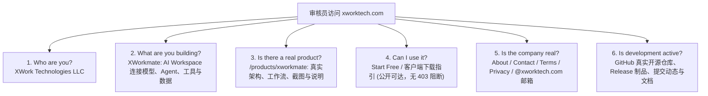

# XWork Technologies LLC 公司主页、产品矩阵与合规审核规范

## 1. 品牌迁移背景与主体统一定义

| 发展阶段 | 域名与标识 | 历史定位与当前状态 | 治理动作 |
| :--- | :--- | :--- | :--- |
| **阶段一：早期开发** | `onwalk.net` | 早期测试与原型开发域名。 | **全面退役**：清理所有公开页面中的文字与代码残留，统一 301 重定向至 `xworktech.com`。 |
| **阶段二：云服务基座** | `svc.plus` | 基础设施与微服务后端运行域（如 `accounts.svc.plus`, `gateway.svc.plus`, `dl.svc.plus`）。 | **保留后端网络**：严禁在公开营销导航与产品介绍页中直接跳入该域名，避免触发第三方审核“域名不一致”。 |
| **阶段三：法人主体确立** | `xworktech.com` | **XWork Technologies LLC** 唯一对外品牌门户与法人网站。 | **统一定义**：所有公开主页、产品页、条款与验证均收拢于此。版权统一为 `© 2026 XWork Technologies LLC`。 |

---

## 2. 审核员 30 秒核验准则（Auditor 30-Second Rule）

第三方审核（如 Google Workspace 域名验证、OAuth 开发者验证、App Store 审核等）通常由程序抓取与真人快速浏览组合完成。系统必须保证在 **30 秒内** 明确回答以下 6 大核心关切：



1. **Who are you?**
   - 首页 Header、Badge 与 Footer 显著显示 `Built by XWork Technologies LLC`。
   - 页脚版权固定为 `© 2026 XWork Technologies LLC`。
2. **What are you building?**
   - 主打产品：**XWorkmate** —— 统一 AI 工作空间，连接模型、智能助手、工具与本地/远程数据，执行真实工作。
3. **Is there a real product?**
   - 访问 `/products/xworkmate`，直接呈现服务端渲染的产品界面、功能演示与技术链路，严禁展示空白加载或报错页面。
4. **Can I use it?**
   - 具备“开始免费体验”（Start Free）或“客户端下载”入口，游客与审核员均可直观了解产品交付形态。
5. **Is the company real?**
   - 提供完备的 `/about`（公司简介）、`/contact`（联系方式）、`/privacy`（隐私政策）、`/terms`（服务条款）。
   - 公开服务邮箱统一为 `support@xworktech.com` 与 `contact@xworktech.com`，严禁在公开验证面出现个人 Gmail。
6. **Is development active?**
   - 各产品页包含 “Source code & downloads” 区块，直连公开 GitHub 仓库与最新 GitHub Releases 制品。

---

## 3. 产品落地页 6 大核心模块标准

每一个产品介绍落地页（以 `/products/xworkmate` 为基准模板），必须具备以下 6 个结构化信息模块：

```text
┌────────────────────────────────────────────────────────┐
│ 1. Hero & Tagline                                      │
│    - 产品名称、定位一句话、Primary CTA、Secondary CTA  │
├────────────────────────────────────────────────────────┤
│ 2. What it is                                          │
│    - 产品清晰定义，消除概念模糊                        │
├────────────────────────────────────────────────────────┤
│ 3. Problem                                             │
│    - 解决的核心痛点：模型碎片化、工具割裂、无状态对话  │
├────────────────────────────────────────────────────────┤
│ 4. How it works                                        │
│    - 架构协同图与 4 步执行流（App → Bridge → Session） │
├────────────────────────────────────────────────────────┤
│ 5. Product screenshots                                 │
│    - 真实桌面客户端与控制台高清截图展示                │
├────────────────────────────────────────────────────────┤
│ 6. Current availability & Get started                  │
│    - 多端支持矩阵（macOS / Win / Linux / Web）         │
│    - GitHub 仓库入口与 Release 下载链接                │
└────────────────────────────────────────────────────────┘
```

---

## 4. 前端架构：无硬编码规范（No Hardcoding）

借鉴现代化 SaaS 样板工程（如 `startfast-pro`）的模块化解耦实践，前端工程必须遵循以下代码契约：

1. **单一配置源（Single Source of Truth）**：
   - 所有品牌名称、公司法定名称、官方邮箱、社交链接、GitHub 仓库地址均从 `src/lib/company.ts` 读取。
   - 禁止在页面组件（`page.tsx`）或数据文件（`homepage.json`）中直接硬编码 `https://xworktech.com` 或 `© 2026 ...`。
2. **站内链接采用根相对路径（Root-relative Path）**：
   - 站内路由一律写作 `href="/products/xworkmate"`、`href="/prices"`、`href="/about"`，绝不拼写完整域名，避免环境切换（Local / Preview / Prod）时产生跨域或证书错误。
3. **死链治理规则**：
   - 定价页路由为 `/prices`，禁止使用 `/pricing`。
   - 注册路由为 `/register`，禁止使用 `/signup`。
   - 文档统一入口为 `/docs` 或具体 GitHub README，禁止生成不存在的内部死链。

---

## 5. 公开产品源码与 Release 制品映射矩阵

| 产品标识 (Slug) | 中文名称 | 定位 | 公开 GitHub 仓库 | 最新 Release 下载入口 |
| :--- | :--- | :--- | :--- | :--- |
| `xworkmate` | XWorkmate | 统一 AI 工作台与多智能体协同 | `ai-workspace-lab/xworkmate-app`<br/>`ai-workspace-lab/xworkmate-bridge`<br/>`ai-workspace-lab/xworkspace-core-skills`<br/>`ai-workspace-lab/openclaw-multi-session-plugins` | `xworkmate-app` Release (macOS/Win/Linux)<br/>`xworkmate-bridge` Release |
| `xconnect` | XConnect | AI 工作空间零信任连接器 | `ai-workspace-xstream/xconnect-app`<br/>`ai-workspace-xstream/xconnect-one`<br/>`ai-workspace-xstream/xconnect-gateway`<br/>`ai-workspace-xstream/xconnect-edge-agent` | `xconnect-app` Release<br/>`xconnect-one` Release |
| `ai-workspace` | AI Workspace | 统一企业级智能体运行平台 | `ai-workspace-services/portal`<br/>`ai-workspace-services/accounts`<br/>`ai-workspace-services/gateway` | `portal` 最新发布制品 |
| `open-platform`| Open Platform | 开源、云中立基础设施底座 | `ai-workspace-services/portal`<br/>`ai-workspace-infra/platform-ops-toolkit`<br/>`ai-workspace-infra/iac_modules` | `platform-ops-toolkit` Release |
| `global-mesh`  | Global Mesh | 全球非业务带外零信任管理网络 | `ai-workspace-infra/global-mesh` | GitHub Releases |
