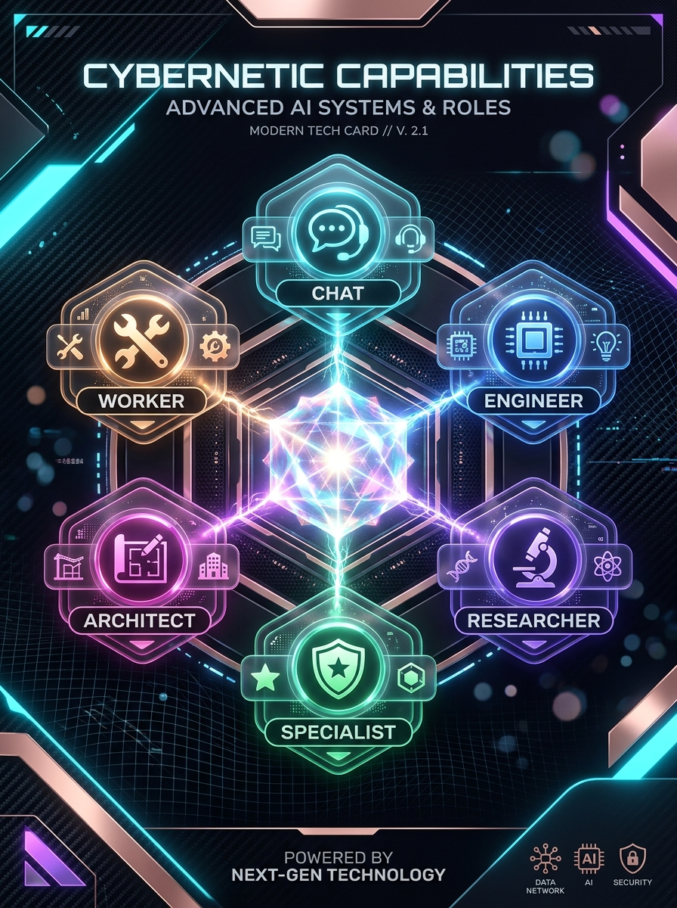

# 与 AI 协作参考指南：从 Chat 到 Worker、Engineer、Architect、Researcher、Specialist
## 全平台发布矩阵分发包（微信公众号 / 小红书 / X Twitter / 架构落地）

> **核心哲学**：不要再寻找“一个最强模型解决所有问题”，而是让不同模型承担不同职责。从 **Model Selection（模型选秀）** 走向 **Model Routing（模型路由与团队建制）**。

---

## 视觉资产资产总览

| 平台 | 规格 | 视觉形态 | 本地存储路径 |
| :--- | :--- | :--- | :--- |
| **微信公众号 / X** | 16:9 横版 | 六大角色协作中枢全景图（Apple Keynote 科技质感，深空色调） | `assets/images/ai-team-collaboration-wechat-x-cover.jpg` |
| **小红书** | 3:4 竖版 | 六边形全能战队 3D 科技卡片徽章（高美感玻璃拟态、霓虹光感） | `assets/images/ai-team-collaboration-xhs-cover.jpg` |


---

# 第一部分：微信公众号·深度长文版

> **建议标题**：
> 1. 《别再纠结 GPT、Claude 谁第一了！2026 顶级开发者的 AI 团队协作范式：从 Chat 到 Specialist》
> 2. 《从“模型选秀”到“模型路由”：重构你的六人虚拟 AI 团队》
> 
> **封面摘要**：进入 Agent、Coding Agent 与 Deep Research 时代，Prompt 技巧已经退居二线。真正拉开人与人差距的，是如何组织一个由 Chat、Worker、Engineer、Architect、Researcher、Specialist 构成的虚拟工程团队。

### 导言：为什么死磕 Prompt 和模型跑分已经过时了？

过去我们使用 AI，最典型的范式非常直白：
$$\text{人提出问题} \longrightarrow \text{AI 给出回答}$$

在这种单点问答模式下，大家热衷于两件事：一是学习五花八门的“提示词咒语（Prompt Engineering）”，二是每天盯着各家模型跑分榜争论不休——“GPT、Claude、Gemini 到底谁第一？”

但随着 Agent、Coding Agent、Computer Use 与 Deep Research 的全面普及，这套逻辑已经彻底不够用了。

真实复杂的工程与研究，从来不是一个全知全能的超级天才独自搞定一切，而是需要合理的团队分工。今天真正需要进阶的，不再是“选择哪个最好的模型”，而是**如何设计一支虚拟 AI 团队**：

$$\text{Chat} \longrightarrow \text{Worker} \longrightarrow \text{Engineer} \longrightarrow \text{Architect} \longleftrightarrow \text{Researcher} \longrightarrow \text{Specialist}$$

这不是简单的六个实力等级排列，而是一整套生产级 **AI 协作角色体系**。我们需要思考的命题变成了：
- 这个任务应该分配给哪个角色？
- 它需要工具调用还是纯推理？
- 什么时候应该让另一个模型做交叉 Review？
- 最终由谁负责决策？

---

### 一、认知升级：从“模型选秀”转向“设计 AI 团队”

目前主流的三大 AI 阵营，已经形成了非常清晰的能力梯队：

* **OpenAI (GPT-6 家族)**：拥有轻量快速的 **GPT-6 Luna**、主力高端 **GPT-6.1 Sol**（以 Astra 五分之一的 Token 成本提供近 Astra 级的工程推理能力），以及顶峰的 **GPT-6 Astra**。
* **Anthropic (Claude 家族)**：形成了 **Haiku**、主力 **Sonnet 5.5**、高端 **Opus 5.5**，以及前沿的 **Fable 5.1 / Mythos 5.1** 路线（Mythos 面向经过审核的网安与生命科学等专业前沿）。
* **Google (Gemini 家族)**：形成了以 **Gemini 3.8 Flash**（面向 Coding 和 Agent 的主力 Workhorse，具备 1M 上下文）与 **Gemini 4 Argon**（新一代 Frontier 旗舰，强化多步骤 Agent、企业知识工作与防御性 Cyber）。

不再有“永远无脑用最顶配模型”的说法，成熟开发者的工作台上应该是一支分工明确的虚拟战队：

| AI 角色 | 核心职责 | 优先考量维度 | 对应主力心智 |
| :--- | :--- | :--- | :--- |
| **Chat** | 理解、讨论、拆解、协调 | 交互理解与上下文掌控 | **控制面（Orchestrator）** |
| **Worker** | 海量执行确定性/低难度任务 | 吞吐速度、极低成本、无并发负担 | **执行单元（Worker）** |
| **Engineer** | 读代码、写代码、调工具、跑测试 | Coding 能力、Agent 可靠性、Harness | **中流砥柱（Builder）** |
| **Architect** | 系统设计、技术选型、终审裁决 | 深层推理、全局视野、假设检验 | **决策与裁判（Judge）** |
| **Researcher** | 获取并严谨验证外部事实知识 | 实时搜索、溯源佐证、置信度分析 | **事实证据库（Evidence）** |
| **Specialist** | 攻坚特殊高门槛领域（网安、数学、科学） | 专业特化模型、高安全边界与合规 | **垂直专家（Specialist）** |

> **核心原则**：不要寻找“一个最强模型解决所有问题”，而是让不同模型承担不同职责。

---

### 二、六大角色的深度解构

#### 1. Chat：整个团队的控制面（不是打字机）
在团队建制中，Chat 是控制面（Control Plane）。它的核心职责不是直接写代码，而是完成：
$$\text{Context} \to \text{Problem} \to \text{Goal} \to \text{Constraint} \to \text{Task decomposition}$$

- **错误用法**：“日本节点延迟变高了，帮我查查。”
- **Chat 治理后的输出**：
  - **目标**：定位 JP 节点延迟随运行时间单调递增、重启 Caddy 后立即恢复的根本原因。
  - **证据**：抓取 Caddy 指标、Go 内存/GC、fd 句柄数、TCP 连接状态与 Xray exporter 时序。
  - **分派**：让 Engineer 登录节点执行探针并抓取配置，让 Researcher 查验已知 Runtime Issue，由 Architect 最终做 Root Cause Tree 分析。

**Chat 的价值在于：把问题想清楚，并决定下一步让谁下场。**

#### 2. Worker：快、便宜、高并发的执行单元
Worker 的关键词不是“聪明”，而是 **Cheap + Fast + Scalable**。

* 典型任务：日志归类、SQL 生成、Regex 调试、YAML/JSON 转换校验、批量文件重命名、简单代码注释。
* 核心判断准则：**“这个任务我愿不愿意重复跑 1000 次？”**
* 代表模型：`GPT-6 Luna`、`Claude Haiku`、`Gemini 3.8 Flash`。

让最昂贵的顶峰模型去批量扫 5000 条日志或者写简单正则，就像让主任医师给体检表盖戳。Worker 的存在，就是把执行成本压到极致。

#### 3. Engineer：真正动手做工程的中流砥柱
Worker 是执行者，Engineer 才是 AI 时代真正的**主力生产力**。

Engineer 不再是聊天机器人，它必须掌握完整闭环：
$$\text{Understand} \to \text{Plan} \to \text{Modify} \to \text{Execute} \to \text{Test} \to \text{Verify}$$

这里存在一个深刻认知：**模型 $\neq$ Agent**。
* `GPT-6.1 Sol`、`Claude Sonnet 5.5`、`Gemini 3.8 Flash` 是**模型层**；
* `Codex`、`Claude Code`、`Gemini CLI / Workspace Harness` 才是**执行环境**。

真正的工程能力是：
$$\text{Engineering Power} = \text{Model} \times \text{Context} \times \text{Tools} \times \text{Harness} \times \text{Verification}$$

#### 4. 为什么“第二强”的 GPT-6.1 Sol 与 Sonnet 5.5 反而是最重要的？
在 2026 年的 AI 工程实践中，出现了一个决定性的转变：**“第二强”的模型统治了日常工程。**

- **GPT-6.1 Sol**：提供逼近 Astra 的顶级智能，但标准 Token 成本仅约 Astra 的 $\frac{1}{5}$，针对 Agentic Coding、长程软件工程与工具调用进行了专门增强。
- **Claude Sonnet 5.5**：作为日常工程的标配，在代码生成、故障排查与结构化文档方面做到了极致的性价比平衡。

你不会让 CTO 每天坐在工位上改 YAML，同样，也不应该把昂贵且耗时的 Frontier 模型耗费在日常的 CRUD 和单元测试编写上。

#### 5. Architect：核心不在于写代码，而在于当“裁判（Judge）”
Architect 的价值不是“写得快”，而在于：
* 判明什么该写、什么绝不能写；
* 评估系统故障域（Failure Domain）与安全边界；
* 权衡方案 A 与方案 B 的长期技术债务。

**最强模型最好的用途之一，不是当苦力，而是当 Judge：**

让两个不同的 Engineer 模型各自提交方案，由超大上下文的 Flash 模型扫描依赖，最终由 Astra / Opus 5.5 作为 Architect 找破绽、裁决最佳路线——这才是生产级 Design Review。

#### 6. Researcher 与 Specialist：事实检索与垂直高墙
很多开发者会把“模型的自回归推理”与“客观世界的事实”混淆。
* **Researcher 负责减少未知**：查官方文档 RFC、GitHub Issues、API 变更、真实 Benchmark，输出 `Evidence → Source → Comparison → Confidence`。
* **Specialist 负责垂直高精尖**：例如网安攻防领域的 `Claude Mythos 5.1` 和 `Gemini 4 Argon Cyber`，以及算法与科学极限推理领域的 `Gemini Deep Think`。

不要问“它是不是世界第一”，要问“它在当前垂直维度上是不是无可替代”。

---

### 三、全景地图：2026 主流模型战队矩阵

| 角色层级 | OpenAI 阵营 | Anthropic 阵营 | Google 阵营 | 核心定位与应用场景 |
| :--- | :--- | :--- | :--- | :--- |
| ⚡ **Worker / Fast** | GPT-6 Luna | Claude Haiku | Gemini 3.8 Flash | 快速问答、日志处理、正则、简单格式转换、高并发批量 |
| ⚙️ **Engineer / Mainstream**| GPT-6.1 Sol / Sol | Claude Sonnet 5.5 | Gemini 3.8 Flash / Pro | 日常主力 Coding、跨文件修改、工具调用、执行测试 |
| 🧠 **Senior Engineer** | GPT-6.1 Sol (High/Max) | Claude Opus 5.5 / Sonnet Thinking | Gemini 4 Argon / Pro Thinking | 复杂 Bug 根因分析、深度重构、自主 Coding Agent |
| 🏆 **Architect / Judge** | GPT-6 Astra / Pro | Claude Opus 5.5 / Fable 5.1 | Gemini 4 Argon | 系统架构设计、多方案裁决、全局安全审查、终审 Merge |
| 🔬 **Researcher** | ChatGPT Deep Research / Astra | Claude Research / Fable | Gemini Deep Research | 外部事实溯源、RFC/文档核对、多源报告产出 |
| 🧪 **Specialist** | Astra (Specialized Mode) | Claude Mythos 5.1 | Argon Cyber / Deep Think | 渗透测试、自动化补丁、极限数学算法、生命科学 |

---

### 四、实践心法：团队升级法则与人类的真实位置

#### 1. 动态升级阶梯 (Level 0 ~ Level 5)
1. **Level 0 (Chat)**：先理清问题、边界与标准。
2. **Level 1 (Worker)**：能否快速自动化搞定？能则直接执行。
3. **Level 2 (Engineer)**：需要看代码、改文件、跑测试？交给 Engineer Agent。
4. **Level 3 (Architect)**：方案出现冲突、涉及跨系统架构或高危故障域？升级至 Architect 做判断。
5. **Level 4 (Researcher)**：涉及外部未知事实或第三方框架机制？必须检索先行（Research First）。
6. **Level 5 (Specialist)**：触及网安安全、极端算法等专业领域？调动特化专家。

#### 2. 人类应该留在哪里？
**人类的角色正从 Operator（操作员）全面上移到 Owner（系统负责人）。**
* 过去你写 Terraform，未来 AI 写代码，**你定义基础设施策略与权限边界**；
* 过去你人肉翻日志，未来 AI 分析日志，**你决定系统的 SLO 和业务红线**；
* 过去你实现功能，未来 AI 交付代码，**你决定产品的长期方向与什么值得进入生产**。

> **终极公式**：  
> **Chat 梳理问题 · Worker 清理重复 · Engineer 实现落地 · Architect 裁决方向 · Researcher 查验事实 · Specialist 攻坚壁垒**  
> **人类负责：Goal（目标）· Constraint（约束）· Judgment（判断）· Accountability（担责）**

---

# 第二部分：小红书·高赞爆款卡片笔记（含 3:4 视觉图）



### 📱 7 页幻灯片（Slide 1 ~ Slide 7）视觉图文内容排版

* **Slide 1 [封面]**：主标题《与 AI 协作的终极解法》；副标题《从“个人打字”到“6人虚拟战队”》。
* **Slide 2 [痛点]**：别把顶配当大管家！让顶配天天改 YAML，就像让三甲院长天天盖体检戳一样浪费！
* **Slide 3 [全景]**：6大角色分工（Chat 控制面、Worker 批量工、Engineer 施工队、Architect 裁判、Researcher 事实库、Specialist 特种兵）。
* **Slide 4 [主力]**：反直觉真相——“次旗舰”统治日常！GPT-6.1 Sol / Sonnet 5.5 才是性价比之王。
* **Slide 5 [裁决]**：最强模型的神仙用法——当 Judge（方案裁判）。A/B 方案自动评审。
* **Slide 6 [升级]**：协作升级 6 级阶梯（Level 0 到 Level 5 按需调度）。
* **Slide 7 [人类]**：人类护城河——从 Operator 升级为 Owner（目标 · 约束 · 裁决 · 责任）。

---

# 第三部分：X (Twitter)·硬核长推特 (High-Signal Mega-Thread)

```text
🧵 [1/10] 2026 年，真正需要升级的不是 Prompt 技巧，而是你如何组织 AI 工作。
过去：人提问 ➔ AI 回答（单点问答）
现在：Chat ➔ Worker ➔ Engineer ➔ Architect ➔ Researcher ➔ Specialist（团队建制）
别再寻找“一个模型搞定一切”，从 Model Selection 转向 Model Routing 🧵👇

🧵 [2/10] 六大角色定位速查表：
• Chat：控制面，负责 Context / Constraint 与任务拆解
• Worker：Cheap + Fast + Scalable，解决 1000 次级重复任务
• Engineer：Understand ➔ Modify ➔ Test 闭环主力
• Architect：Root Cause Analysis、系统设计与 A/B Judge
• Researcher：检索真实证据与官方 RFC，拒绝闭门造车
• Specialist：网安 (Mythos / Argon Cyber)、科学算法 (Deep Think) 垂直专家

🧵 [3/10] 第一层：Chat 是控制面，而不是打字机。
不要一上来就发“帮我写代码”。Chat 必须先输出：Context ➔ Problem ➔ Goal ➔ Constraint ➔ Task Decomposition。Chat 决定下一步由谁下场。

🧵 [4/10] 第二层：Worker 的“1000次法则”。
Worker（Luna / Haiku / Flash 3.8）的准则是：这个任务我愿不愿意重复执行 1,000 次？日志清洗、转格式、写正则，坚决不上高成本顶配。

🧵 [5/10] 第三层：Engineer 与“模型 ≠ Agent”。
工程能力 = Model × Context × Tools × Harness × Verification。Sol 与 Sonnet 是模型，Codex 与 Claude Code 是 Harness。闭环验证是核心。

🧵 [6/10] 为什么“第二强”的模型才是主力军？
GPT-6.1 Sol 和 Sonnet 5.5 拥有接近顶峰的智能，成本却低几个量级。你不会让 CTO 天天改 YAML，次旗舰才是日常生产力的中流砥柱。

🧵 [7/10] 第四层：最强模型最好的用途是当“Judge”。
让 Sonnet 5.5 写方案 A，GPT-6.1 Sol 写方案 B，Flash 扫全库依赖，由 Astra / Opus 担任 Judge 找出隐蔽 Bug，人类做最终批准。自动化的 Design Review 完成。

🧵 [8/10] 第五与第六层：证据与垂直壁垒。
Researcher 检索事实，Architect 权衡取舍，两者决不能混。Specialist 攻坚垂直高墙：Mythos 5.1 用于网安合规审核，Deep Think 用于极限算法。

🧵 [9/10] 动态调度升级路径 (Level 0 ~ 5)：
L0 Chat ➔ L1 Worker ➔ L2 Engineer ➔ L3 Architect ➔ L4 Researcher ➔ L5 Specialist ➔ Human Approval。按需升级，成本可控。

🧵 [10/10] 人类最终留在什么位置？
人类从 Operator 升维到 Owner。AI 负责执行，人负责：Goal · Constraint · Judgment · Accountability。
```

---

# 第四部分：XWorkmate / AI Workspace 系统工程化落地设计

在落地为实际软件系统（如 XWorkmate / AI Workspace）时，核心是基于以下策略实现的 **Model Routing Engine**：

```json
{
  "routing_policy_version": "2026.10",
  "default_orchestrator": {
    "role": "chat",
    "model": "claude-sonnet-5.5",
    "fallback": "gpt-6.1-sol"
  },
  "roles": {
    "worker": {
      "selection_criteria": { "max_latency_ms": 2000, "max_cost_per_m_tokens": 0.5 },
      "candidate_models": ["gemini-3.8-flash", "gpt-6-luna", "claude-haiku"]
    },
    "engineer": {
      "selection_criteria": { "requires_tools": true, "harness": ["workspace_edit", "shell_execution", "test_runner"] },
      "candidate_models": ["claude-sonnet-5.5", "gpt-6.1-sol", "gemini-3.8-flash"]
    },
    "architect": {
      "selection_criteria": { "judgment_mode": "design_review_and_adjudication" },
      "candidate_models": ["gpt-6-astra", "claude-opus-5.5", "gemini-4-argon"]
    },
    "researcher": {
      "selection_criteria": { "requires_grounding": true, "citation_required": true },
      "candidate_models": ["openai-deep-research", "gemini-deep-research", "claude-research-mode"]
    },
    "specialist": {
      "domains": {
        "cybersecurity": ["claude-mythos-5.1", "gemini-4-argon-cyber"],
        "mathematics_and_science": ["gemini-deep-think", "gpt-6-astra-math"]
      }
    }
  }
}
```
