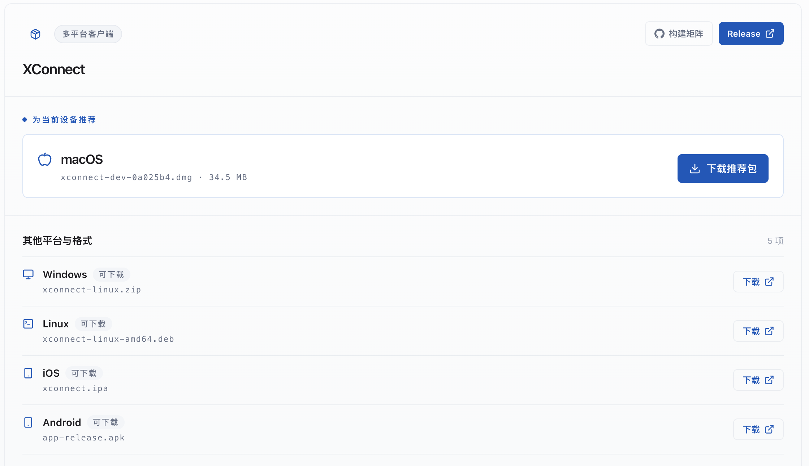
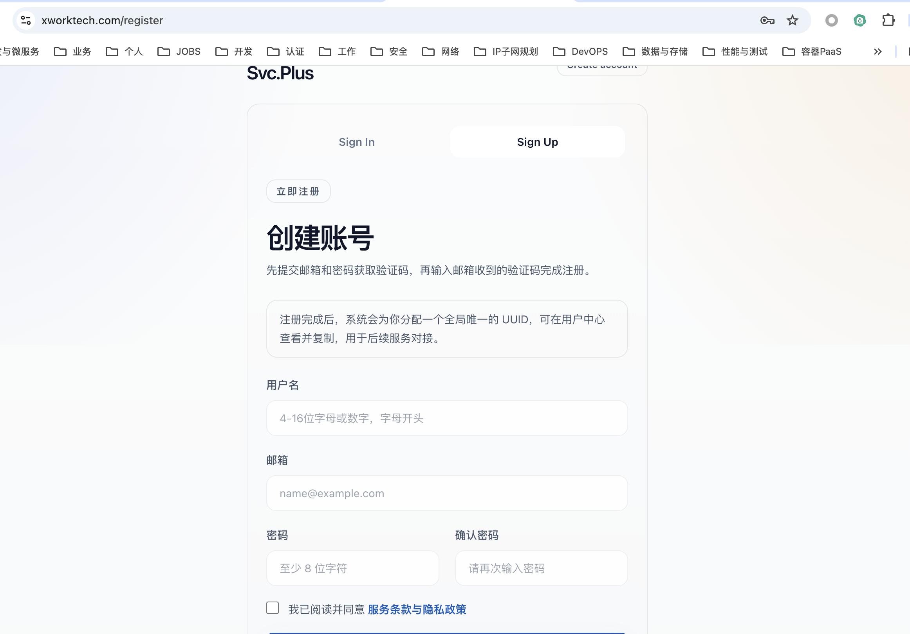
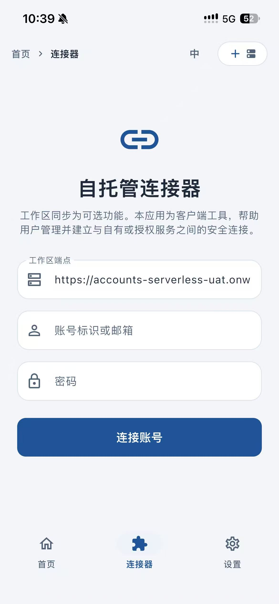
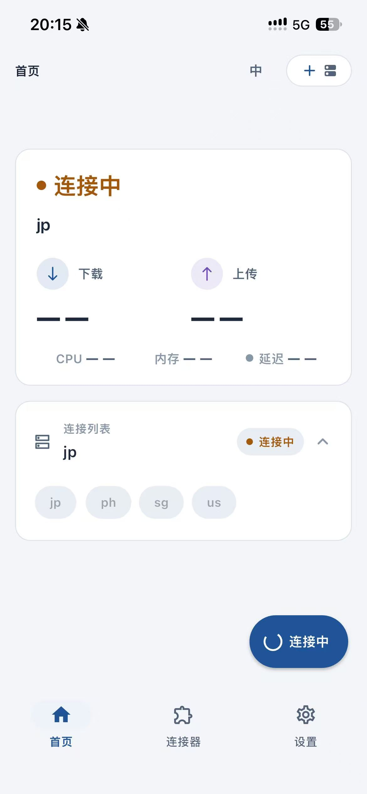
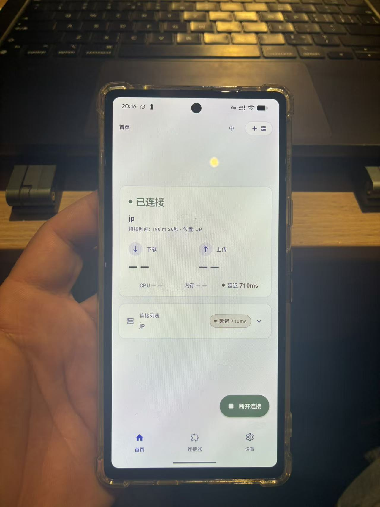
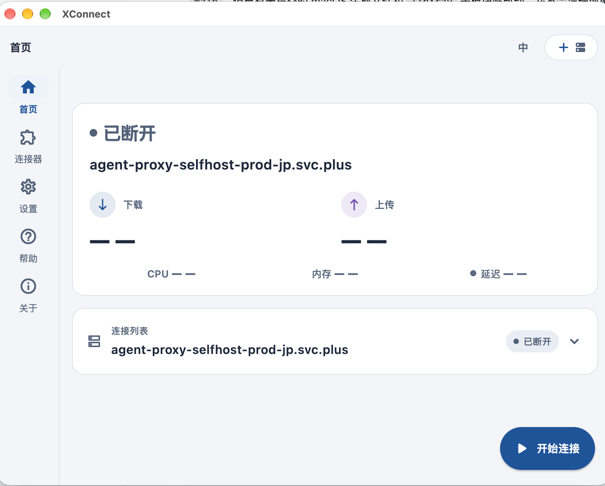
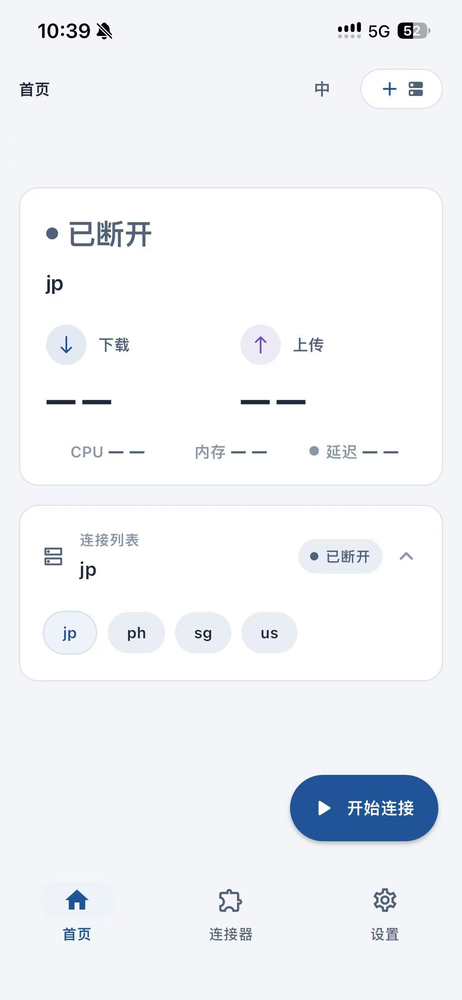

# 海外 AI 服务注册与订阅实践攻略

本文整理一条可长期维护的注册、登录和订阅路径，目标是让 Gmail、ChatGPT、Claude、Grok、Gemini、Antigravity、Apple App Store 和 Google Play 之间的账号关系清楚、可恢复、可管理。

本文的前提是使用真实资料，并由本人长期控制手机号、恢复邮箱、Apple ID、Google 账号和支付卡。地区、手机号和支付方式必须符合对应平台当时的规则。X 上的个人经验只作为线索，最终以服务商、App Store 和 Google Play 的当前页面为准。

资料核对时间：**2026-10-10**。

## 第一步：准备可访问海外服务的网络环境

中国大陆网络环境对部分境外网站和服务存在访问限制。注册 Gmail、ChatGPT、Claude、Grok 或配置海外商店账号前，先准备一个稳定、本人可控、符合所在地适用法律和服务条款的网络访问路径。

本攻略使用 XConnect 作为网络访问入口。这里的第一步是完成 XConnect 的下载、注册和登录，再开始后续账号注册。网络可达只是注册前提，不能替代服务商的地区要求、手机号验证、实名验证或支付审核。

### 1. 下载 XConnect



下载页面会根据当前设备展示推荐客户端，并列出 macOS、Windows、Linux、iOS 和 Android 等平台的下载入口。请按自己的设备选择对应版本；截图中的文件名和版本号会随发布版本变化，以页面当前显示为准。

1. 打开 [XWorkTech 下载页](https://xworktech.com/download)。
2. 根据设备系统下载对应版本的 XConnect APP。
3. 安装完成后打开应用，阅读应用权限和服务条款。
4. 使用本人邮箱进行登录；没有账号时进入控制台注册。

### 2. 注册 XConnect 控制台账号



注册页面包含用户名、邮箱、密码和确认密码字段，并通过邮箱验证码完成注册。页面还会提示注册完成后生成全局唯一 UUID；截图中的界面文字和布局可能随版本更新而变化。

注册入口：[console.svc.plus/register](https://console.svc.plus/register)。

页面当前要求填写用户名、邮箱、密码和确认密码，然后提交邮箱验证码完成注册。用户名要求为 4–16 位字母或数字并以字母开头，密码至少 8 位。注册完成后，控制台会为账号分配一个全局唯一 UUID，可在用户中心查看和复制，用于后续服务对接。

建议使用前面准备好的 Gmail 主邮箱，并立即绑定恢复邮箱、开启可用的安全验证。不要把密码、邮箱验证码或 UUID 发布到公开文档、截图或聊天群。

### 3. 登录并验证网络可达性

1. 在 XConnect APP 中登录刚注册的控制台账号。
2. 按控制台提示选择需要的功能和 Pay as you go 方案。
3. 连接后先打开 Google、Gmail、X、ChatGPT 和 Claude 的官方页面。
4. 确认页面可以加载、登录入口可见，且不会在注册过程中频繁切换网络出口。
5. 先完成网络测试，再开始 Gmail 和其他服务的账号注册。

#### 3.1 配置连接器

如果应用还没有连接配置，进入底部或侧边栏的“连接器”，选择自托管连接器或新增连接。按照控制台提供的资料填写：

- 工作区端点：使用你自己的控制台或服务端点；
- 账号标识或邮箱：使用本人注册的 XConnect 控制台账号；
- 密码：使用控制台账号密码；
- 连接名称：可以使用 `jp`、`ph`、`sg`、`us` 等便于识别的名称。



填写完成后点击“连接账号”。截图中的端点、账号和密码字段是界面示意，不能照抄其中的地址或把真实密码写入文档、截图和聊天记录。

#### 3.2 iOS 连接向导

1. 打开 XConnect iOS 客户端，进入“首页”。
2. 确认连接列表中已经出现可用节点，例如 `jp`、`ph`、`sg` 或 `us`。
3. 选择要使用的节点，点击“开始连接”。
4. 等待状态从“连接中”变为“已连接”。
5. 连接成功后，检查首页显示的节点、连接时长和延迟。



如果需要切换节点，先停止当前连接，再选择新的节点并重新连接。注册 Gmail、ChatGPT、Claude 或 Grok 的过程中，建议保持同一个节点和稳定的网络出口。

#### 3.3 Android 连接向导

1. 打开 XConnect Android 客户端并登录控制台账号。
2. 在首页选择已经配置好的节点。
3. 点击“开始连接”，等待状态变为“已连接”。
4. 确认页面出现连接时长、位置和延迟等运行信息。
5. 保持应用在后台运行，再打开浏览器或目标服务应用。



Android 客户端显示“已连接”后，再打开 Google、Gmail、ChatGPT 或 Claude 测试访问。若应用显示“连接中”时间过长，先检查账号配置、节点状态和系统网络权限。

#### 3.4 Desktop 连接向导

Desktop 包括 macOS、Windows 和 Linux 客户端，操作逻辑相同：

1. 打开 XConnect Desktop 客户端。
2. 在左侧进入“连接器”，或从首页选择已有连接。
3. 确认目标端点、账号和连接配置正确。
4. 点击“开始连接”。
5. 等待首页状态从“已断开”变为“已连接”。



桌面端未连接时，首页会显示“开始连接”；连接成功后应显示活动连接、节点信息和运行数据。浏览器、邮件客户端和桌面应用都会使用系统当前的网络连接，因此应先确认 XConnect 已连接，再打开需要访问的海外服务。

#### 3.5 连接成功后的使用流程

连接成功后按下面顺序验证：

1. 打开一个普通网页，确认网络访问正常；
2. 打开 Google 或 Gmail，确认页面和登录入口正常；
3. 打开 ChatGPT、Claude、X 或 Grok，确认服务页面可访问；
4. 在注册或订阅过程中保持当前连接，不要频繁切换 `jp`、`ph`、`sg`、`us` 节点；
5. 完成操作后回到 XConnect 首页，确认连接状态和使用时长；
6. 不再使用时点击“断开连接”，避免其他应用继续使用该网络路径。



“已连接”代表客户端网络连接已经建立，不代表 Gmail、ChatGPT、Claude、Grok 或支付平台一定会通过地区、手机号、身份和付款审核。账号注册仍应使用真实资料和本人长期控制的恢复方式。

如果下载页、控制台或服务页面无法打开，先排查网络连接、DNS、应用版本和账号状态。不要通过伪造地区、虚假资料或重复注册来强行通过平台验证。

## 二、整体关系

```text
XConnect APP
    ↓
海外网络访问
    ↓
海外手机号 + Gmail + 恢复邮箱
    ↓
ChatGPT / Claude / Grok / Gemini 注册或登录
    ↓
Antigravity 桌面端 / CLI / IDE 登录
    ↓
Apple ID 或 Google 账号
    ↓
Visa / Maya / App Store / Google Play
    ↓
订阅、续费、取消和账号恢复
```

推荐按以下顺序准备：

1. 先确认 XConnect APP 能稳定访问 Google、Gmail、Gemini、ChatGPT、Claude、Grok 和 X。
2. 再准备长期可控的海外手机号和恢复邮箱。
3. 先注册 Gmail，再注册 ChatGPT、Claude 和 Grok。
4. 最后配置 Apple ID、Google Play 和支付方式。
5. 每完成一项，立即测试登录、收信、收短信和恢复路径。

不要一开始同时创建多个账号或重复请求验证码。连续失败会触发风控，也会让后续排查无法确定问题来自网络、手机号、设备还是支付资料。

## 三、前置条件

### 3.1 XConnect APP

XConnect APP 是访问海外服务的网络入口。开始注册前，至少确认：

- Google 搜索、Gmail、Google Account 和 Gemini 页面可以正常打开；
- ChatGPT、Claude、Grok、Antigravity 登录页面或客户端可以正常使用；
- 页面加载不会频繁出现地区、网络或安全验证错误；
- 手机和电脑使用的出口区域保持稳定，不要在注册过程中频繁切换；
- 能够正常接收邮件和短信。

XConnect 只解决网络访问问题，不会替代平台要求的真实地区、手机号、付款资料或身份验证。

### 3.2 账号和恢复资料

建议为每个重要账号准备以下资料：

| 资料 | 用途 | 要求 |
| --- | --- | --- |
| Gmail 主邮箱 | 注册 ChatGPT、Claude 等服务 | 本人控制，能够长期收信 |
| 恢复邮箱 | 找回 Gmail、AI 服务和支付账号 | 不与主账号使用同一恢复链路 |
| 海外手机号 | 注册、短信验证、账号恢复 | 本人长期持有，可续费保号 |
| 密码管理器 | 保存密码、恢复码和订阅信息 | 不把密码写入公开文档 |
| Visa 卡 | App Store、Google Play 或网页支付 | 本人持有，支持境外线上交易和 3-D Secure |

恢复邮箱和手机号不是一次性注册材料。只要账号还在使用，就应保持可访问、可续费和可验证。

## 四、手机号选择顺序

### 3.1 首选：实体海外手机卡

优先选择支持短信和 Pay as you go 充值的海外实体卡。重点检查：

- 能接收国际服务的验证码短信；
- 支持在线充值或低额保号；
- 长时间不使用不会立即回收号码；
- 能查看余额、有效期和套餐状态；
- SIM 卡或账户由本人长期持有；
- 更换手机后仍能恢复使用。

实体卡适合绑定 Gmail、ChatGPT、Claude、Grok、Apple ID、Google 账号和 Maya 等长期账号。

### 3.2 次选：支持短信的海外 eSIM

例如菲律宾 DITO eSIM。购买前要确认具体套餐支持 **SMS 短信**，因为有些 eSIM 只有数据流量，不能接收验证码。

需要确认：

1. 是否真的提供手机号，而不是纯流量 eSIM；
2. 是否支持入站短信；
3. 是否能用 Pay as you go 或其他方式续费；
4. 号码停机后是否可以恢复；
5. 是否需要实名或提交身份证明；
6. 是否支持在目标国家或漫游状态下接收短信。

eSIM 适合长期使用，但仍要定期登录运营商账户检查余额和号码有效期。手机号一旦被回收，绑定在上面的账号可能无法恢复。

### 3.3 最后备用：虚拟短信平台

例如 [5SIM](https://5sim.net/) 这类海外短信虚拟号码平台。

它只能作为临时注册或测试备用方案，不适合绑定重要账号。主要原因是：

- 号码可能被回收或重新分配；
- 可能无法再次收到恢复短信；
- 同一号码可能被多人或多个服务使用过；
- 平台可能拒绝虚拟号码或高风险号段；
- 不能稳定支持支付验证、账号找回和二次验证。

如果必须使用虚拟号码，完成注册后应尽快在账号安全设置中替换为本人长期控制的手机号，并补充恢复邮箱、双因素认证和恢复码。涉及 Gmail、Apple ID、Google 账号、Maya 或付费 AI 账号时，优先重新准备实体卡或支持短信的 eSIM。

## 五、注册 Gmail

### 4.1 注册步骤

1. 通过 XConnect APP 打开 Google Account 注册页面。
2. 选择个人用途，填写真实姓名、出生日期等资料。
3. 选择 Gmail 地址并设置独立密码。
4. 如果页面要求手机号验证，使用本人长期控制的海外手机号。
5. 绑定恢复邮箱。
6. 登录 Gmail，确认可以收发邮件。
7. 在 Google Account 的安全设置中开启双因素认证。
8. 保存恢复码，并在另一台可信设备上测试登录。

Google 官方说明，注册或登录时有时会要求手机验证，并且会限制一个手机号可以创建的账号数量。[Google：验证账号](https://support.google.com/accounts/answer/114129)

### 4.2 注册后的检查

- 主邮箱能正常收信；
- 恢复邮箱能收到安全通知；
- 手机号显示为已验证；
- 双因素认证已开启；
- 恢复码已保存；
- 没有把验证码、密码或恢复码发给任何人。

Gmail 是后续 ChatGPT、Claude、Google Play 和支付通知的核心恢复入口，建议不要使用临时邮箱或一次性邮箱。

## 六、注册 ChatGPT

### 5.1 注册方式

1. 打开 ChatGPT 官方网站或应用。
2. 选择使用 Gmail 登录，或选择使用 Google 账号继续。
3. 使用刚刚准备好的 Gmail 完成登录。
4. 如果页面触发手机号验证，使用本人长期控制的海外手机号。
5. 登录后进入账号设置，补充恢复邮箱或开启多因素认证（若页面提供）。
6. 先使用免费功能确认账号稳定，再决定是否订阅。

菲律宾目前在 OpenAI 公布的 ChatGPT 支持地区列表中。[OpenAI：ChatGPT 支持地区](https://help.openai.com/en/articles/7947663-chatgpt-supported-countries)

ChatGPT 账号订阅、API 账单和应用内订阅属于不同账单路径。不要把 ChatGPT Plus/Pro 订阅和 API 余额混为一项。

### 5.2 订阅路径

- 网页订阅：由 ChatGPT 网页账单管理；
- iPhone/iPad 订阅：由 Apple App Store 管理；
- Android 订阅：由 Google Play 管理。

OpenAI 明确说明，Apple App Store 或 Google Play 订阅必须在对应商店账号中管理；卸载应用不会自动取消订阅。[OpenAI：取消 ChatGPT 订阅](https://help.openai.com/en/articles/7232927-canceling-your-chatgpt-subscription)

## 七、注册 Claude

### 6.1 注册步骤

1. 打开 Claude 官方网站或应用。
2. 使用 Gmail 注册，或使用 Google 登录。
3. 按页面要求完成邮箱验证。
4. 如果页面要求手机号，使用本人长期控制的支持地区手机号。
5. 登录后先使用免费额度测试账号稳定性。
6. 进入 Settings，确认邮箱、手机号和账单入口可见。

Anthropic 的说明要求用户实际位于支持地区，并使用支持地区的手机号创建账号；仅准备一个海外号码不能替代实际地区要求。[Anthropic：注册 Claude Pro](https://support.anthropic.com/en/articles/8325609-how-do-i-sign-up-for-claude-pro)

### 6.2 订阅路径

- 网页或桌面端订阅：在 Claude 的 Billing 页面管理；
- iOS 订阅：由 Apple App Store 管理；
- Android 订阅：由 Google Play 管理。

Claude 的取消方式取决于最初购买的平台，通常应至少在下一次扣款前 24 小时取消。[Anthropic：取消 Claude 订阅](https://support.anthropic.com/en/articles/8325617-how-do-i-cancel-my-paid-claude-subscription)

## 八、使用 Grok AI

Grok 通常通过 X 账号进入，准备重点是 X 账号和 X 的验证能力：

1. 使用真实资料注册或登录 X；
2. 绑定本人长期控制的邮箱和手机号；
3. 完成 X 要求的邮箱或短信验证；
4. 通过 X 应用或官方入口进入 Grok；
5. 如果需要付费功能，先确认订阅是在 X 网页、Apple App Store 还是 Google Play 完成的；
6. 订阅后记录实际扣款平台，避免重复购买。

Grok 的可用功能、订阅层级和地区限制可能随 X 的产品策略变化，登录后应以账号内实际显示为准。

## 九、注册 Gemini 与使用 Antigravity

### 9.1 使用 Gemini

Gemini Apps 使用 Google 账号登录，不需要另建一套独立的 Gemini 账号。Google 官方说明，部分功能可以不登录使用；要保存活动记录、使用更多功能或管理付费计划，需要登录个人 Google 账号，工作或学校账号则取决于管理员和 Workspace 版本。[Google：使用 Gemini Apps](https://support.google.com/gemini/answer/13275745)

建议按下面的顺序操作：

1. 使用本人长期控制的 Gmail/Google 账号打开 [Gemini](https://gemini.google.com/)；
2. 确认页面能正常加载，并检查当前账号实际显示的功能和地区可用性；
3. 在账号设置中确认恢复邮箱、长期手机号和双因素认证仍然可用；
4. 先用免费功能测试对话、文件和图片等实际需要的能力；
5. 如果页面提供 Google AI 计划，再查看计划名称、适用地区、账单周期和付款账号；
6. 订阅后在 Google 账号或 Google Play 的“付款和订阅”中核对订单与续费日期。

Gemini 网页版、移动应用和 Google AI 付费计划的支持国家/地区与功能可能不同。Google 的官方列表当前包含菲律宾，但“能打开 Gemini”不等于每个模型、移动端功能或付费计划都可用，应以登录后页面实际显示为准。[Google：Gemini Apps 计划与升级](https://support.google.com/gemini/answer/16275805)

不要为了显示某个国家/地区而伪造地址、付款资料或账号信息。Google Play 国家/地区变更有实际所在地、付款方式和变更频率要求，相关规则应单独核对，不能把节点位置当成资格证明。

### 9.2 注册并使用 Antigravity

Antigravity 是 Google 的 agent-first 开发平台，包含桌面应用、IDE/编辑器集成、CLI 和 SDK。它不是与 Gmail 并列的独立邮箱账号体系；官方入门文档显示，启动后可以使用个人 Google Account 登录，也可以选择连接 Gemini Enterprise 的 Business account。[Google Antigravity：入门](https://antigravity.google/docs/getting-started)

#### Desktop/IDE 使用流程

1. 打开 [Antigravity 官方下载页](https://antigravity.google/download)，按 macOS、Windows 或 Linux 下载对应版本；
2. 安装后启动 Antigravity，使用本人 Google Account 登录；企业用户按组织要求选择 Gemini Enterprise；
3. 登录后创建 Project，使用“添加文件夹”关联本地工作区或 Git 仓库；
4. 首次运行任务前，检查项目范围、读写权限、终端命令和浏览器访问权限；
5. 让 Agent 先生成计划或 Artifact，再确认是否执行写文件、测试、提交等动作；
6. 检查变更、测试结果和 Artifact 后，再决定是否保留或提交代码。

Antigravity 的 Agent 可能访问项目文件、执行终端命令或使用浏览器。不要把密码、恢复码、API Token、私钥、`.env` 文件或支付资料放入可访问的工作区；对外部仓库先使用最小权限，并在执行前确认差异和命令。官方文档将项目作为 Agent 的文件和仓库访问边界，创建项目时应明确添加的目录范围。[Google Antigravity：创建项目](https://antigravity.google/docs/getting-started)

#### CLI/编辑器扩展

需要在终端或现有编辑器中使用时，以官方下载页列出的 CLI 和 VS Code、JetBrains、Visual Studio、Zed、Xcode 集成为准。安装扩展或 CLI 后仍需使用本人 Google Account/组织账号登录；不要使用来源不明的安装脚本、破解版本或共享账号。

#### Antigravity 计划和费用

Antigravity 的个人、Google AI Pro/Ultra 和组织方案可能有不同的模型、速率、额度与账单归属。官方价格页当前列出个人免费方案、Google AI 计划和 Google Cloud/组织方案，但实际可购买方案会按账号、地区和组织资格显示。[Google Antigravity：价格](https://antigravity.google/pricing)

付款前确认：

- 使用的是正确的 Google 账号；
- 计划是 Antigravity 使用额度还是 Gemini/Google AI 计划；
- 购买入口是 Google One、Google Play、Google Cloud 还是组织管理员；
- 是否存在自动续费、额度上限和取消入口；
- 订单收据归属于哪个账号。

Gemini 的聊天使用、Antigravity 的 Agent 额度、Google Cloud API 用量和第三方模型订阅可能属于不同计费路径，不要仅凭产品名称判断它们共享额度。

## 十、Apple ID 和 App Store 订阅

### 10.1 Apple ID 准备

1. 使用真实资料创建或使用本人已有的 Apple ID。
2. 选择与实际使用地区一致的国家或地区。
3. 完成 Apple 账号双因素认证。
4. 添加本人 Visa，确保支持境外线上交易和 3-D Secure 验证。
5. 在 App Store 搜索 ChatGPT 或 Claude，确认应用和订阅价格。
6. 订阅后到“设置 → Apple 账号 → 订阅”确认订阅状态。

“海外 ID + 任意 Visa”不是绝对保证。Visa 发卡行、账单地址、Apple 账号地区、卡片风控和 3-D Secure 都可能影响付款。Apple 官方列出的菲律宾 Apple Account 支付方式包括 GCash、Smart 手机账单、银行卡和 ShopeePay；页面没有把 Apple Pay 列为菲律宾 Apple Account 的通用付款方式。[Apple：菲律宾 Apple Account 支付方式](https://support.apple.com/en-ph/111741)

### 10.2 Maya 与 Apple Pay

X 上有帖子声称某些卡可以绑定 Apple Pay，并用于 ChatGPT、Claude 等订阅：

- [挖矿小企鹅：Bybit 卡、Apple Pay、GPT/Claude 订阅返现](https://x.com/Goupenguin/status/2051650931301687413)
- [大方 BigFang：Bybit 卡、Apple Pay、ChatGPT 订阅经验](https://x.com/dafangbigfang/status/2056323108416446858)

这些帖子含推广链接、邀请码或返现宣传，属于个人经验或营销线索，不能证明 Maya 可以稳定作为 Apple App Store 的支付方式。Apple 官方列出的菲律宾 Apple Pay 发卡机构也没有显示 Maya。[Apple：菲律宾 Apple Pay 参与银行和发卡机构](https://support.apple.com/en-us/102897)

因此，Apple 订阅应先以 Apple Account 付款页面实际显示的方式为准。不要为了绑定 Apple Pay 修改虚假的地区、地址或账单资料。

## 十一、Google 账号和 Google Play 订阅

### 11.1 Google Play 准备

1. 使用本人 Gmail 登录 Google Play。
2. 确认 Google Play 国家/地区和实际所在地、支付资料一致。
3. 添加本人 Visa，或在菲律宾 Play 区尝试使用已注册且有余额的 PayMaya/Maya。
4. 在 ChatGPT 或 Claude Android 应用中选择订阅。
5. 付款前确认使用的是正确的 Google 账号。
6. 付款成功后，打开 Google Play 的“付款和订阅 → 订阅”确认续费日期。

Google Play 菲律宾区官方支持 PayMaya 购买应用和数字内容，要求 PayMaya 账户已注册且余额充足。[Google Play：菲律宾可用付款方式](https://support.google.com/googleplay/answer/2651410/google-play-%E6%8E%A5%E5%8F%97%E7%9A%84%E4%BB%98%E6%AC%BE%E6%96%B9%E5%BC%8F-%E7%BE%8E%E5%9B%BD?co=GENIE.CountryCode%3DPH)

Google 规定，设置新的 Play 国家/地区时，用户应位于该地区并拥有该地区的付款方式；国家/地区变更通常至少 90 天后才能再次变更，新的支付资料也可能需要等待生效。[Google Play：更改国家或地区](https://support.google.com/googleplay/answer/7431675)

### 11.2 Maya 作为 Google Play 付款方式

如果使用菲律宾 Play 区和 Maya：

1. 先完成 Maya 本人注册和身份验证；
2. 确认菲律宾手机号可接收 Maya 验证短信；
3. 确认 Maya 账户有足够余额；
4. 在 Google Play 添加 PayMaya/Maya 付款方式；
5. 购买低价应用或数字内容做小额测试；
6. 再购买 ChatGPT 或 Claude 订阅；
7. 保存 Google Play 订单号和 Maya 扣款记录。

Google Play 不支持虚拟信用卡作为通用付款方式。Maya 账户、手机号、Google 账号和支付资料应由同一使用者长期控制。

## 十二、Maya 与菲律宾手机号

### 12.1 准备 DITO eSIM

如果选择菲律宾 DITO eSIM，购买前确认：

- 套餐提供短信功能；
- 号码可以接收国际验证码；
- 支持充值和续费保号；
- 手机支持该 eSIM 频段和配置；
- 开户和实名要求可以由本人完成；
- 账号可以在后续更换设备时恢复。

激活后建议立即完成一次完整测试：接收普通短信、接收 Google 验证码、接收 Gmail 安全通知，并记录号码有效期和下一次充值日期。

### 12.2 Maya 开户与维护

建议顺序如下：

1. 使用本人菲律宾手机号注册 Maya；
2. 使用真实身份资料完成验证；
3. 设置独立密码和应用安全验证；
4. 绑定本人银行卡或 Visa；
5. 小额充值；
6. 测试余额、付款和退款记录；
7. 在 Google Play 中进行小额支付测试；
8. 记录 Maya、Google Play 和 Visa 的账单归属。

不要使用他人的 Maya 账户、银行卡、身份证明或短信验证码。支付争议、账号恢复和身份复核最终都会回到开户人本人。

## 十三、常见问题排查

### 收不到验证码

按以下顺序检查：

1. 手机号国家区号是否正确；
2. SIM/eSIM 是否真的支持短信；
3. 运营商是否允许国际短信漫游；
4. 号码是否已经被使用过多次；
5. 短信是否延迟；
6. 是否在短时间内重复请求过多验证码；
7. 是否可以改用邮箱验证或官方恢复流程。

重要账号遇到验证码失败时，应更换为本人长期控制的实体卡或短信 eSIM，避免继续依赖虚拟号码。

### Google Play 付款失败

检查：

- Play 国家/地区是否和支付资料一致；
- Google 账号是否登录正确；
- Maya 是否已完成注册和验证；
- 余额是否充足；
- Visa 是否允许境外线上交易；
- 发卡行是否要求 3-D Secure；
- 订阅是否已经存在于另一个 Google 账号或 Apple ID。

### Apple 付款失败

检查：

- Apple ID 地区与付款方式是否匹配；
- Visa 账单地址是否准确；
- 银行是否允许境外数字内容交易；
- 是否需要发卡行验证；
- App Store 是否已经存在重复订阅；
- Apple 账户是否有未完成的付款问题。

### 出现重复扣款

ChatGPT、Claude 等服务可能分别在网页、Apple App Store 和 Google Play 上产生独立订阅。先查看扣款收据，确认实际付款平台，再到对应平台取消。仅卸载应用或删除服务账号，不一定会停止商店订阅。

## 十四、建议的验收清单

### 网络和手机号

- [ ] XConnect APP 能稳定访问 Google、Gmail、Gemini、X、ChatGPT、Claude 和 Grok
- [ ] 海外手机号可以接收普通短信
- [ ] 海外手机号可以 Pay as you go 充值
- [ ] 已记录运营商账号、余额和有效期
- [ ] 已确认号码不会因短期不使用立即回收

### 账号

- [ ] Gmail 可以登录和收发邮件
- [ ] Gmail 已绑定恢复邮箱
- [ ] Gmail 已绑定长期手机号
- [ ] Gmail 已开启双因素认证
- [ ] ChatGPT 可以登录
- [ ] Claude 可以登录
- [ ] Grok 可以通过 X 账号进入
- [ ] Gemini 可以使用本人 Google 账号登录
- [ ] Antigravity 可以使用本人 Google 账号或组织账号登录
- [ ] Antigravity 项目范围和 Agent 权限已检查
- [ ] 各账号没有使用共享密码

### 订阅和支付

- [ ] Apple ID 地区和支付资料一致
- [ ] Google Play 国家/地区和支付资料一致
- [ ] Visa 支持境外线上支付
- [ ] Maya 已完成本人验证
- [ ] Maya 账户余额充足
- [ ] 已记录每个订阅对应的付款平台
- [ ] 已记录下一次续费日期
- [ ] 已知道 Apple 和 Google Play 的取消入口

## 十五、X 资料与官方资料

### X 上的经验线索

- [Bybit U 卡支持 Apple Pay，并声称支持 GPT/Claude 订阅](https://x.com/Goupenguin/status/2051650931301687413)
- [Bybit 格鲁吉亚卡、Apple Pay 与 ChatGPT 订阅经验](https://x.com/dafangbigfang/status/2056323108416446858)
- [Claude 相关营销帖](https://x.com/mayaislam_ai/status/2070170058073268644)：内容偏向 AI 服务推广，没有提供可靠的注册和支付证据。

X 资料的共同问题是：很多帖子包含推广链接、邀请码或返现承诺；帖子能证明“有人这样说过”，不能单独证明长期可用、适用于所有地区或符合平台条款。

### 官方资料

- [Google：验证账号](https://support.google.com/accounts/answer/114129)
- [OpenAI：ChatGPT 支持地区](https://help.openai.com/en/articles/7947663-chatgpt-supported-countries)
- [OpenAI：取消 ChatGPT 订阅](https://help.openai.com/en/articles/7232927-canceling-your-chatgpt-subscription)
- [Anthropic：注册 Claude Pro](https://support.anthropic.com/en/articles/8325609-how-do-i-sign-up-for-claude-pro)
- [Anthropic：取消 Claude 订阅](https://support.anthropic.com/en/articles/8325617-how-do-i-cancel-my-paid-claude-subscription)
- [Google：使用 Gemini Apps](https://support.google.com/gemini/answer/13275745)
- [Google：Gemini Apps 计划与升级](https://support.google.com/gemini/answer/16275805)
- [Google Antigravity：入门](https://antigravity.google/docs/getting-started)
- [Google Antigravity：下载](https://antigravity.google/download)
- [Google Antigravity：价格](https://antigravity.google/pricing)
- [Google Play：菲律宾支付方式](https://support.google.com/googleplay/answer/2651410/google-play-%E6%8E%A5%E5%8F%97%E7%9A%84%E4%BB%98%E6%AC%BE%E6%96%B9%E5%BC%8F-%E7%BE%8E%E5%9B%BD?co=GENIE.CountryCode%3DPH)
- [Google Play：更改国家或地区](https://support.google.com/googleplay/answer/7431675)
- [Apple：菲律宾 Apple Account 支付方式](https://support.apple.com/en-ph/111741)
- [Apple：菲律宾 Apple Pay 参与银行和发卡机构](https://support.apple.com/en-us/102897)
- [Maya：Apple Pay 商户支付文档](https://developers.maya.ph/docs/apple-pay)

## 十六、结论

最稳定的链路是：XConnect APP → 本人长期控制的海外实体卡或短信 eSIM → Gmail 和恢复邮箱 → ChatGPT/Claude/Grok/Gemini → Antigravity 桌面端或开发工具 → 本人 Apple ID 或 Google 账号 → 本人 Visa；如果使用菲律宾 Google Play 区，Maya/PayMaya 有官方支持依据。虚拟短信平台只能作为最后备用方案，不能作为重要账号的长期恢复基础。
