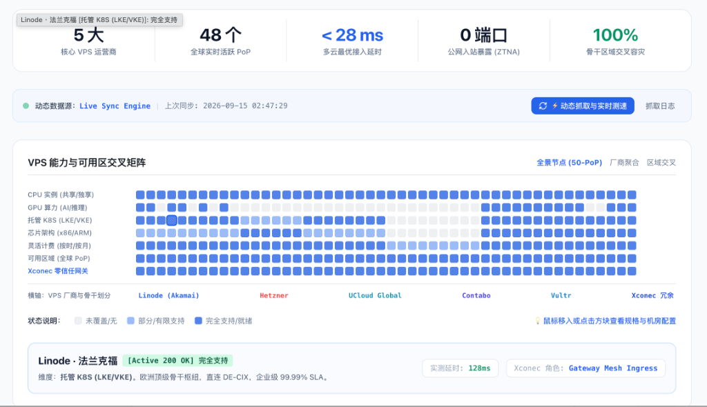
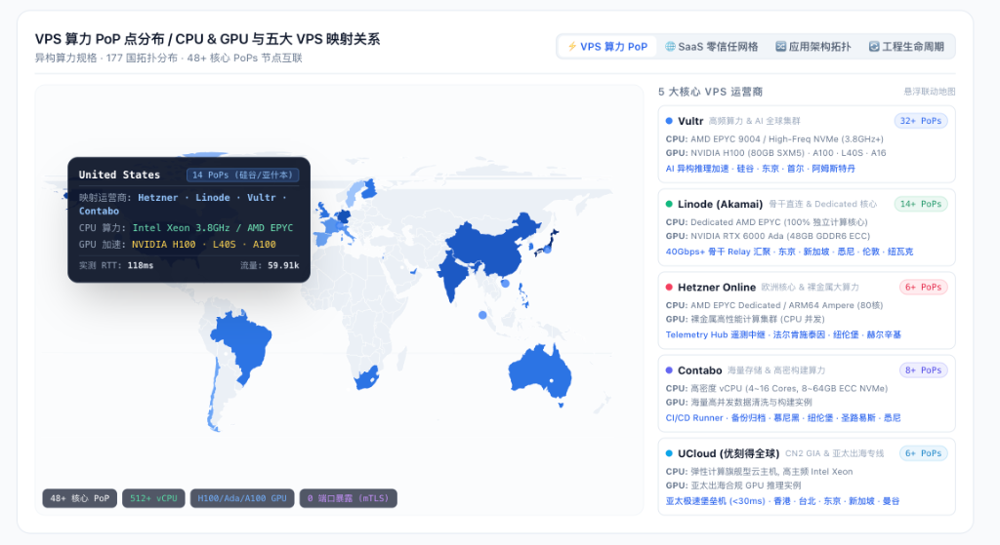
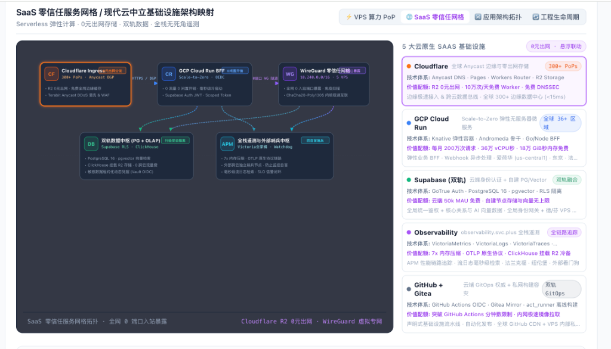
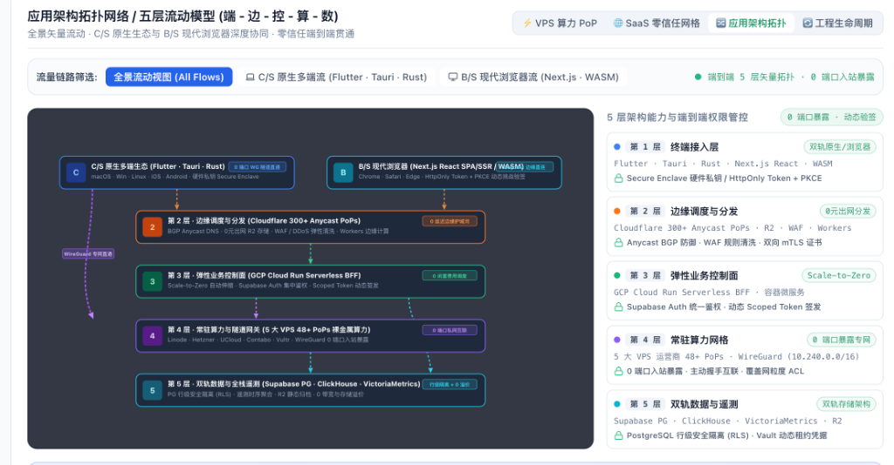
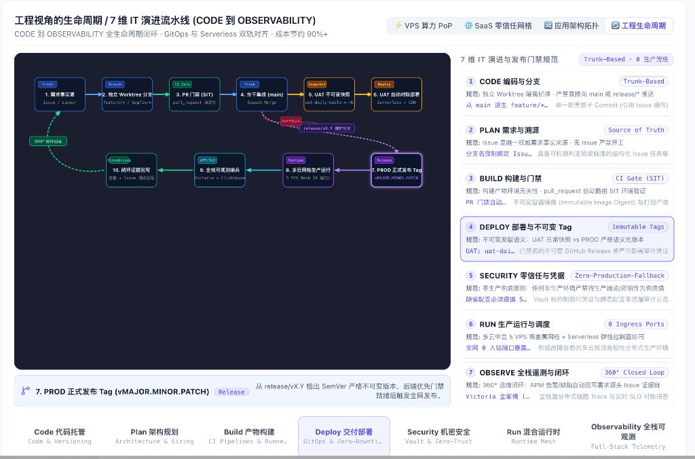

# Global Mesh 产品介绍与云中立现代架构深度白皮书

> **作者**：沈蓝（IT 基础设施架构师 / 独立开发者）  
> **产品模块**：`products/global-mesh`  
> **分类**：产品手册 / 云原生架构 / 零信任网络 / FinOps 实践  
> **关键词**：Global Mesh, 云中立, 零信任网络, WireGuard, Cloudflare R2, GCP Cloud Run, Supabase RLS, VictoriaMetrics, GitOps, 360° 闭环  

---

## 摘要与产品定位

在公有云寡头（AWS、GCP、Azure）垄断计算与网络生态的今天，中小微科技企业和独立开发团队正面临着两大日益尖锐的工程与财务困境：
1. **网络出网税与私网锁定**：公有云巨头收取高昂的公网流出带宽费用（通常每 GB 0.08 ~ 0.12 USD），并通过专有 VPC 机制将用户绑死在其生态内，跨云多活成本极其高昂；
2. **安全与运维复杂度失控**：传统公网暴露的节点面临永无止境的暴力破解、端口扫描和 DDoS 攻击，而依赖多套异构云控制台又导致开发流、测试流和生产发布严重脱节。

**Global Mesh（全球云中立服务网格）** 正是在此背景下诞生的企业级现代云中立基础设施中枢。它基于“**Serverless 弹性计算 · 零出网费用存储 · 双轨数据架构 · 全栈无死角遥测**”的设计哲学，将异构算力（5 大核心低成本 VPS 运营商的 48+ PoPs）、现代边缘云（Cloudflare 300+ Anycast PoPs）、Serverless 控制面（GCP Cloud Run）与开源轻量化数据/监控系统融为一体，构建起一套**全网 0 入站端口暴露（ZTNA）、跨云 100% 交叉容灾、成本节约 90%+** 的弹性架构。

本文作为 `products/global-mesh` 的深度产品介绍与技术笔记，结合控制台最新的核心可视化看板，全方位拆解其背后的五大核心架构设计。

---

## 核心业务指标 (KPIs)

根据控制台顶层实时遥测看板，Global Mesh 基础设施达成以下 SLA 准则：



- **5 大核心 VPS 运营商生态集成**：Linode (Akamai)、Hetzner Online、UCloud Global、Contabo、Vultr；
- **48 个全球实时活跃 PoP 点**：覆盖美洲、欧洲、亚太、大洋洲主流核心数据中心；
- **< 28 ms 多云最优接入延迟**：依托 Cloudflare Anycast BGP 与智能选路算法，全球就近边缘卸载；
- **0 端口公网入站暴露 (Zero-Trust ZTNA)**：所有计算节点彻底关闭公网入站监听，仅通过主动握手的 WireGuard 覆盖网（10.240.0.0/16）进行端到端双向加密互联；
- **100% 骨干区域交叉容灾**：节点横跨独立自治系统（AS），无单点云厂商依赖，单节点宕机秒级无感漂移。

---

## 第一章：VPS 算力能力与 50-PoP 可用区交叉矩阵

为解决传统云主机规格不透明、跨运营商调度困难的痛点，Global Mesh 内置了由 `Live Sync Engine` 驱动的**全景节点可用区交叉矩阵**。系统支持动态节点健康状态抓取、毫秒级测速与探测日志溯源。

```
┌────────────────────────────────────────────────────────────────────────────────────────┐
│                        VPS 能力与可用区交叉矩阵 (50-PoP 全景)                            │
├──────────────────────┬─────────────────────────────────────────────────────────────────┤
│ 维度 1: CPU 实例     │ 共享突发型 (Shared) / 100% 独立 Dedicated 核心全量就绪           │
│ 维度 2: GPU 算力     │ NVIDIA H100 (80GB SXM5)、RTX 6000 Ada、L40S、A100 推理加速      │
│ 维度 3: 托管 K8s     │ Linode LKE、Vultr VKE 具备就绪支持，支持轻量级 K3s 自动化组网   │
│ 维度 4: 芯片架构     │ 主流 x86_64 与 Hetzner ARM64 Ampere (80核) 高密裸金属混合互补   │
│ 维度 5: 灵活计费     │ 支持按小时/按月弹性伸缩，杜绝公有云资源闲置浪费                │
│ 维度 6: 可用区域     │ 深度覆盖美洲（硅谷/亚什本）、欧洲（法兰克福/纽伦堡）、亚太与澳洲 │
│ 维度 7: 零信任网关   │ 100% 全量挂载 Xconec Gateway，自动注入 WireGuard Mesh 私网     │
└──────────────────────┴─────────────────────────────────────────────────────────────────┘
```

### 实时节点检视样例
以矩阵中选中的 **Linode · 法兰克福节点** 为例：
- **运行状态**：`Active 200 OK`，实测延迟 `128ms`；
- **Xconec 角色**：`Gateway Mesh Ingress`（欧洲顶级骨干枢纽，直连 DE-CIX 交换中心）；
- **托管能力**：完全就绪支持托管 Kubernetes（LKE/VKE），保障企业级 99.99% SLA。

---

## 第二章：177 国高精内联矢量世界地图与异构算力规格

在 **VPS 算力 PoP** 视图中，Global Mesh 提供了 177 国高精内联矢量世界地图与五大 VPS 运营商规格栏的左右 8:4 联动体系：



### 2.1 177 国高精地图交互体验
- **左侧 8 列**：内联轻量化 SVG 地图渲染，鼠标移动即时激活对应国家或地区的算力画像。例如悬浮于 **United States (14 PoPs 硅谷/亚什本)**：
  - **映射运营商**：Hetzner · Linode · Vultr · Contabo
  - **CPU 算力**：Intel Xeon 3.8GHz / AMD EPYC 独占算力
  - **GPU 加速**：NVIDIA H100 · L40S · A100
  - **实测网络指标**：RTT 118ms，实时流量 59.91k 请求
- **底部状态浮动药丸**：清晰标注全网资源池现状——`48+ 核心 PoP`、`512+ vCPU`、`H100/Ada/A100 GPU`、`0 端口暴露 (mTLS)`。

### 2.2 五大核心 VPS 运营商生态定位

| 运营商名称 | 覆盖 PoP | 硬件规格优势 | 业务角色定位与数据中心分布 |
| :--- | :--- | :--- | :--- |
| **Vultr** | 32+ PoPs | AMD EPYC 9004 / High-Freq NVMe (3.8GHz+)，NVIDIA H100 (80GB SXM5) / A100 / L40S / A16 | **AI 异构推理与全球高频接入**：硅谷、东京、首尔、阿姆斯特丹等 |
| **Linode (Akamai)** | 14+ PoPs | Dedicated AMD EPYC（100% 独立物理核心），NVIDIA RTX 6000 Ada (48GB GDDR6 ECC) | **40Gbps+ 骨干 Relay 汇聚**：东京、新加坡、悉尼、伦敦、纽瓦克 |
| **Hetzner Online** | 6+ PoPs | AMD EPYC Dedicated / ARM64 Ampere (80核裸金属计算集群) | **欧洲高密计算与遥测中继 (Telemetry Hub)**：法尔肯施泰因、纽伦堡、赫尔辛基 |
| **Contabo** | 8+ PoPs | 高密度 vCPU (4~16 Cores, 8~64GB ECC NVMe) | **CI/CD 构建 Runner 与海量数据清洗/备份**：慕尼黑、纽伦堡、圣路易斯、悉尼 |
| **UCloud Global** | 6+ PoPs | 弹性计算旗舰型云主机，高主频 Intel Xeon，亚太合规 GPU 推理实例 | **亚太出海合规加速与极速堡垒机 (<30ms)**：香港、台北、东京、新加坡、曼谷 |

---

## 第三章：SaaS 零信任服务网格架构映射

传统架构往往在“全上大厂（成本飞涨）”与“全自建（维护成本极高）”之间进退两难。Global Mesh 的 **SaaS 零信任网格** 创造性地通过五层云中立组件拓扑，打造出低成本高韧性的解法：



### 3.1 五大云原生核心拓扑节点
1. **Cloudflare Anycast Ingress (边缘接入与分发)**
   - 全球 300+ Edge PoPs，BGP Anycast 边缘清洗；
   - **R2 零出网费存储**：静态资源、前端构建产物与冷数据备份 0 出网费用分发；
   - Terabit 级 DDoS 弹性清洗与 WAF 规则防护，拦截 99.9% 恶意流量。
2. **GCP Cloud Run Serverless BFF (业务控制面)**
   - Knative 弹性容器架构，**Scale-to-Zero（缩容至 0）** 彻底消除闲置费用；
   - 每月包含 200 万次免费请求配额，毫秒级冷启动；
   - 承担 Supabase Auth JWT 验签与短周期 Scoped Token 动态派发。
3. **WireGuard 零信任网格 (算力互联专网)**
   - 虚拟私有覆盖网段（`10.240.0.0/16`），连通 5 大 VPS 算力池；
   - **全网 0 入站端口暴露**：不开放任何公网入站端口，主动发起加密握手，免疫全网 Shodan/Censys 端口扫描；
   - 内核级 ChaCha20-Poly1305 加密算法，兼顾极高吞吐与超低 CPU 开销。
4. **双轨数据中枢 (PG + OLAP)**
   - **业务强一致交易数据**：Supabase 云端认证网关配合自建 PostgreSQL 16 独占节点，开启行级安全隔离策略（RLS），支持 pgvector 语义检索；
   - **海量事件与日志分析**：ClickHouse 挂载 Cloudflare R2 存储桶，实现毫秒级 OLAP 聚合查询，跨云传输 0 额外带宽费；
   - 机密管理：敏感密钥通过 HashiCorp Vault OIDC 签发租约制临时凭证。
5. **全栈遥测与外部独立哨兵 (Observability & Watchdog)**
   - 基于 VictoriaMetrics、VictoriaLogs 与 VictoriaTraces 构成全套可观测中枢，享有原生 7x 内存压缩优势；
   - **防止监控自盲**：在跨云异构节点上部署独立 Watchdog 哨兵，实时从公网和私网双向探测主系统存活率；
   - 指标与日志秒级聚合并触发 SLO 告警闭环。

### 3.2 FinOps 混合多云成本对账实战

| 基础设施层级与能力 | AWS / GCP 传统公有云单月 | Global Mesh 云中立混合方案单月 | 架构弹性与成本对比 |
| :--- | :--- | :--- | :--- |
| **边缘分发与出网带宽 (5TB/月)** | 400 ~ 600 USD (高昂出网费) | **0 USD** (Cloudflare R2 0元出网) | **节约 100%**，打破大厂网络税 |
| **弹性业务接入 (BFF)** | 80 ~ 150 USD (ALB/API Gateway) | **0 ~ 5 USD** (Cloud Run 免费额度) | **节约 95%**，Scale-to-Zero |
| **核心算力 (32 核 64GB 独占)** | 350 ~ 500 USD (EC2/GCE 实例) | **25 ~ 45 USD** (Hetzner/Contabo 独占) | **节约 88%**，独占物理性能 |
| **可观测性与日志 APM** | 150 ~ 300 USD (Datadog/CloudWatch) | **0 ~ 10 USD** (Victoria + R2 冷备) | **节约 92%**，7x 压缩且保留期长 |
| **单月综合预算评估** | **980 ~ 1,550+ USD /月** | **25 ~ 60 USD /月 全包** | **综合节约 95%+ 成本，彻底避免单云锁定** |

---

## 第四章：应用架构五层流动模型 (端 - 边 - 控 - 算 - 数)

Global Mesh 在应用架构层抽象出高度对称、逻辑分明的**端-边-控-算-数**五层流动模型：



```
[ L1: 终端接入层 ] ──► Flutter/Tauri/Rust (C/S: 硬件私钥 Secure Enclave) + Next.js (B/S: HttpOnly PKCE)
       │
       ▼ (Anycast HTTPS / mTLS)
[ L2: 边缘调度层 ] ──► Cloudflare 300+ PoPs · WAF 规则清洗 · R2 静态资源 0 元出网分发
       │
       ▼ (内网安全路由)
[ L3: 业务控制面 ] ──► GCP Cloud Run Serverless BFF · Scale-to-Zero · Supabase Auth Scoped Token
       │
       ▼ (WireGuard 覆盖专网 10.240.0.0/16 · 0 端口入站暴露)
[ L4: 常驻算力网 ] ──► 5 大 VPS 裸金属算力集群 · 覆盖网粒度 ACL 访问控制
       │
       ▼ (内部双轨数据总线)
[ L5: 双轨数据层 ] ──► Supabase PostgreSQL (RLS 行级隔离) + ClickHouse OLAP + VictoriaMetrics 全栈遥测
```

### 4.1 C/S 原生生态与 B/S 现代浏览器深度协同
- **C/S 原生多端流 (Flutter · Tauri · Rust)**：面向桌面（macOS、Windows、Linux）与移动端（iOS、Android）。客户端利用芯片底层 **Secure Enclave / KeyStore** 存储设备私钥，与 Xconec Gateway 建立 0 端口 WireGuard 直连隧道，享有毫秒级点对点低延迟。
- **B/S 现代浏览器流 (Next.js React SPA/SSR / WASM)**：通过现代浏览器发起安全访问，采用严格的 `HttpOnly Cookie` 与 `PKCE 动态挑战验签`，直通 Cloudflare 边缘节点，并自动适配就近计算。

### 4.2 端到端安全权限中枢
右侧 4 列边栏为每一层提供了精密的权限防御标准：
- **L1 终端**：硬件私钥动态签名，阻断伪造客户端注入；
- **L2 边缘**：Anycast BGP 防御、DDoS 智能过滤与双向 mTLS 证书校验；
- **L3 控制**：集中身份校验，严禁透传长效密钥，仅签发时效为分钟级的最小权限 Scoped Token；
- **L4 算力**：关闭所有非 WireGuard 虚拟网卡监听，即便宿主机遭遇外部暴力探测，端口表现也为完全静默（Filtered）；
- **L5 数据**：PostgreSQL 强制开启 RLS，租户数据行级天然物理/逻辑隔离；机密接入必须经过 Vault 动态凭据对账。

---

## 第五章：工程视角的 7 维生命周期与 360° 闭环发布状态图

在真实的研发生命周期中，若仅有静态架构图而缺乏严谨的研发流水线，架构规范必然会随时间腐化。Global Mesh 完整落地了 `engineering-standards` 与 `operations-management` 规范，设计了有状态的分支、发布 Tag 与 360° 闭环状态图：



### 5.1 十大核心状态演进节点

```
[ 1. 需求事实源 ] (Issue/Linear 作为唯一权威源头)
       │
       ▼ (独立 Worktree 物理目录隔离)
[ 2. 独立 Worktree 分支 ] (feature/* 或 bugfix/* 强绑定 Issue 编号)
       │
       ▼ (pull_request 自动化触发)
[ 3. PR 门禁 (SIT) ] (代码静态分析、单元测试、敏感词检测、退出码 0 防假绿拦截)
       │
       ▼ (Code Review 通过后 Squash Merge)
[ 4. 主干集成 (main) ] (Trunk-Based，保证主干每一时刻均可独立交付构建)
       │
       ├──────────────────────────────────────────┬──────────────────────────────────────────┐
       ▼                                          ▼                                          ▼
[ 5. UAT 不可变快照 ]                     [ 维护分支: release/vX.Y ]                 [ 紧急回路: hotfix/* ]
(uat-daily-build-YYYY.MM.DD-rN)                    │                                         │
       │                                          ▼                                  合入 release/vX.Y 
       ▼                                [ 7. PROD 正式发布 Tag ]                       并 cherry-pick 
[ 6. UAT 自动对账部署 ]                  (vMAJOR.MINOR.PATCH SemVer 规范)                   回写 main
(跨仓库不可变快照对账)                             │                                         │
       │                                          ▼                                         │
       └──────────────────────────────────►[ 8. 多云网格生产运行 ]◄──────────────────────────┘
                                           (5 VPS Mesh + Serverless BFF)
                                                  │
                                                  ▼
                                           [ 9. 全栈可观测哨兵 ]
                                           (VictoriaMetrics + ClickHouse)
                                                  │
                                                  ▼ (SLO 异常 / 故障告警)
                                           [ 10. 闭环证据回写 ]
                                           (自动生成结构化 Issue 关联审计追踪)
                                                  │
                                                  └──────────────► [ 360° 闭环流转回 Node 1 起点 ]
```

### 5.2 七维 IT 演进硬性准则与发布门禁

1. **CODE 编码与分支**：严格实施 Git Worktree 隔离开发，严禁直接在本地主干修改或向 `main` / `release/*` 直接推送；
2. **PLAN 需求与溯源**：Issue 是唯一法定事实来源，无明确验收指标的 Issue 严禁开工；
3. **BUILD 构建与门禁**：构建产物必须具备环境无关性，使用不可变 Image Digest；
4. **DEPLOY 部署与不可变 Tag**：严禁覆盖或移动已有 Tag，日常验收使用 `uat-daily-build-YYYY.MM.DD-rN`，生产严守语义化 `vMAJOR.MINOR.PATCH`；
5. **SECURITY 零信任与凭据**：**零生产兜底原则 (Zero-Production-Fallback)**，任何测试环境缺省配置严禁指向生产端点或生产机密；
6. **RUN 生产运行与调度**：全网 0 入站端口暴露，依靠覆盖网粒度 ACL 与双活自治节点提供高韧性生产保障；
7. **OBSERVE 全栈遥测与闭环**：外部哨兵防止自盲，生产告警自动携带上下文并回写原始 Issue 证据链，形成真正有始有终的 360° 研发运维生命闭环。

---

## 结语：云中立工程哲学的胜利

Global Mesh 不是单一技术的简单罗列，而是一套经过生产实战检验的现代化云中立工程范式。

它向行业证明：**无需向公有云巨头缴纳昂贵的出网税与私网锁定金，仅凭现代开源协议框架（WireGuard、VictoriaMetrics、ClickHouse、Supabase）与精准的边缘计算架构（Cloudflare、Cloud Run、低成本 VPS），科技团队就能以传统方案 5%~10% 的极低综合成本，构建起支撑全球五端访问、0 端口公网暴露、高韧性自治与 360° 闭环发布的顶级企业级基础设施中枢。**
